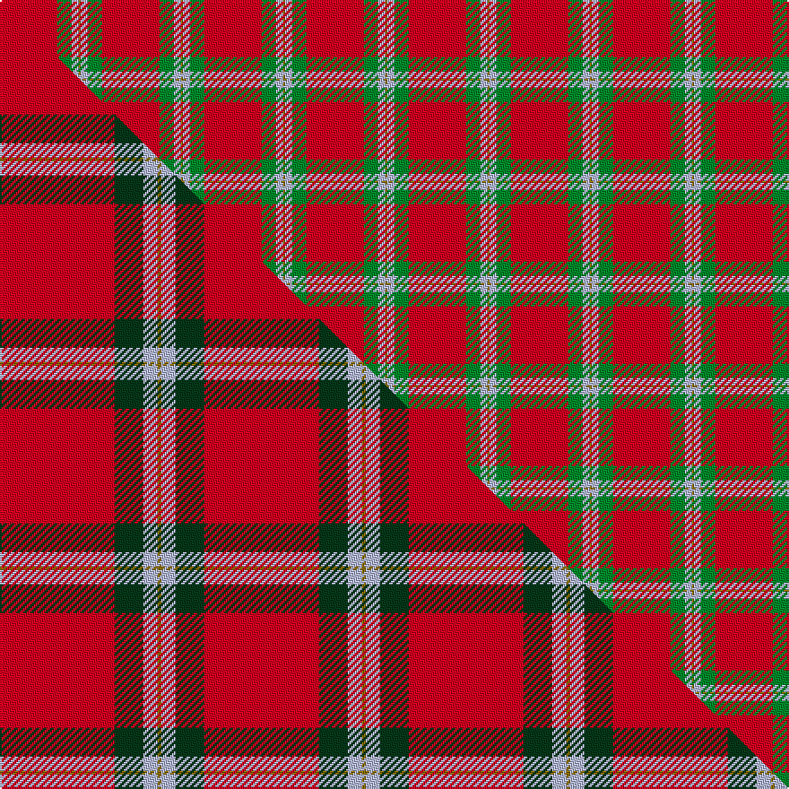

This page is one **sett** — a single exact thread-count. It belongs to the [tartan](/setts/r32g8lb4y1/)
(the same proportion at any scale), whose colour order is pattern [GWGR](/stripes/gwgr/).

Part of the [MacLaine of Lochbuie](/tartans/maclaine-of-lochbuie/) tartan — the named design grouping this sett with its other cloths.

Sourced from weddslist.  It is a [4 stripe tartan](/stripes/stripes4/).

Original link http://www.weddslist.com/cgi-bin/tartans/pg.pl?source=x

## Thread count
R/32 G8 LB4 Y/1

One full sett is **57 threads**.

## Palette
<table><thead><tr><th>Colour</th><th>Shade</th><th>OKLCh</th></tr></thead><tbody><tr><td>LB</td><td><code style="background-color:#B5BBDE;">#B5BBDE</code> <small style="color:#888">#B5BBDE</small></td><td><small style="color:#888">oklch(79.9% 0.050 277.6)</small></td></tr><tr><td>G</td><td><code style="background-color:#008B2A;">#008B2A</code> <small style="color:#888">#008B2A</small></td><td><small style="color:#888">oklch(55.4% 0.170 145.9)</small></td></tr><tr><td>R</td><td><code style="background-color:#D60020;">#D60020</code> <small style="color:#888">#D60020</small></td><td><small style="color:#888">oklch(55.2% 0.224 25.5)</small></td></tr><tr><td>Y</td><td><code style="background-color:#8B6E00;">#8B6E00</code> <small style="color:#888">#8B6E00</small></td><td><small style="color:#888">oklch(55.1% 0.113 90.4)</small></td></tr></tbody></table>

# Sample pattern

## Compared to the master

This cloth is one sett of its design; the master sett (the exemplar the design is anchored on) is below for comparison.

Its **ΔTartan distance** from the master is **0.70** — the same measure the nearest-tartans table ranks by (0 is identical; a re-scale of the same cloth is near 0, a recolour or a different proportion further).

<figure class="master-compare" style="margin:0">

this sett
master sett ★

<figcaption style="color:#888;font-size:smaller">One weave of this sett against the <a href="/setts/r32dg8lb4y1/">master sett ★</a>, split on the diagonal: a shared proportion runs seamlessly across it with only the shades shifting; a different proportion breaks on it.</figcaption>
</figure>

## Nearest variants

The nearest existing variants by ΔTartan distance, with this cloth at the top so the swatches line up against it.

ΔTartan

Threads

Variant

Sett

—

57

<a href="/variants/s4/r32g8lb4y1/">MacLaine of Lochbuie</a>

<a href="/ttd/edit/#slug=r32g8lb4y1~x2&amp;base=r32g8lb4y1" title="compare in the TTD">0.00</a>

114

<a href="/variants/s4/r32g8lb4y1~x2/">MacLaine of Lochbuie</a>

<a href="/ttd/edit/#slug=r32dg8lb4y1~x2&amp;base=r32g8lb4y1" title="compare in the TTD">0.00</a>

114

<a href="/variants/s4/r32dg8lb4y1~x2/">MacLaine of Lochbuie (Coburn)</a>

<a href="/ttd/edit/#slug=r32g8w4y1&amp;base=r32g8lb4y1" title="compare in the TTD">0.30</a>

57

<a href="/variants/s4/r32g8w4y1/">MacLaine of Lochbuie</a>

<a href="/ttd/edit/#slug=r104g39y4&amp;base=r32g8lb4y1" title="compare in the TTD">0.74</a>

186

<a href="/variants/s3/r104g39y4/">Scottish Watch</a>

<a href="/ttd/edit/#slug=db4r50g25w2~x2&amp;base=r32g8lb4y1" title="compare in the TTD">1.25</a>

312

<a href="/variants/s4/db4r50g25w2~x2/">Unidentified Locket</a>

<a href="/ttd/edit/#slug=r60w28y2lb3~x2&amp;base=r32g8lb4y1" title="compare in the TTD">2.09</a>

246

<a href="/variants/s4/r60w28y2lb3~x2/">Willis, H Graham</a>

<a href="/ttd/edit/#slug=r60w28ly2lb3~x2&amp;base=r32g8lb4y1" title="compare in the TTD">2.09</a>

246

<a href="/variants/s4/r60w28ly2lb3~x2/">Willis, H Graham</a>

<a href="/ttd/edit/#slug=r32w4db7y2lb2~x5&amp;base=r32g8lb4y1" title="compare in the TTD">2.17</a>

300

<a href="/variants/s5/r32w4db7y2lb2~x5/">Sildesalaten</a>

<a href="/ttd/edit/#slug=r35w3r8y2g11~x2&amp;base=r32g8lb4y1" title="compare in the TTD">2.20</a>

144

<a href="/variants/s5/r35w3r8y2g11~x2/">Highlands at Wyomissing, The</a>

<a href="/ttd/edit/#slug=r52y2db16y2db3w5~x2&amp;base=r32g8lb4y1" title="compare in the TTD">2.28</a>

206

<a href="/variants/s6/r52y2db16y2db3w5~x2/">Brock University Alumni Association</a>

## Neighbour map

Every grey dot is one of 13620 variants placed by the first two principal components of the ΔTartan feature space (42% of its variance). Red is this tartan; blue dots are its nearest — click one to open its page.

<svg viewBox="0 0 640 380" role="img" style="max-width:100%;height:auto;border:1px solid #e0e0e0;border-radius:4px;display:block" xmlns="http://www.w3.org/2000/svg"><image href="/nn/cloud.v1.png" width="640" height="380"/><a href="/variants/s4/r32g8lb4y1~x2/"><circle cx="511.8" cy="167.1" r="4" fill="#3465a4"><title>MacLaine of Lochbuie</title></circle></a><a href="/variants/s4/r32dg8lb4y1~x2/"><circle cx="495.4" cy="159.6" r="4" fill="#3465a4"><title>MacLaine of Lochbuie (Coburn)</title></circle></a><a href="/variants/s4/r32g8w4y1/"><circle cx="485.5" cy="158.7" r="4" fill="#3465a4"><title>MacLaine of Lochbuie</title></circle></a><a href="/variants/s3/r104g39y4/"><circle cx="526.0" cy="219.5" r="4" fill="#3465a4"><title>Scottish Watch</title></circle></a><a href="/variants/s4/db4r50g25w2~x2/"><circle cx="415.0" cy="182.0" r="4" fill="#3465a4"><title>Unidentified Locket</title></circle></a><a href="/variants/s4/r60w28y2lb3~x2/"><circle cx="430.5" cy="165.0" r="4" fill="#3465a4"><title>Willis, H Graham</title></circle></a><a href="/variants/s4/r60w28ly2lb3~x2/"><circle cx="431.5" cy="165.7" r="4" fill="#3465a4"><title>Willis, H Graham</title></circle></a><a href="/variants/s5/r32w4db7y2lb2~x5/"><circle cx="414.4" cy="152.6" r="4" fill="#3465a4"><title>Sildesalaten</title></circle></a><a href="/variants/s5/r35w3r8y2g11~x2/"><circle cx="485.7" cy="179.8" r="4" fill="#3465a4"><title>Highlands at Wyomissing, The</title></circle></a><a href="/variants/s6/r52y2db16y2db3w5~x2/"><circle cx="422.1" cy="128.2" r="4" fill="#3465a4"><title>Brock University Alumni Association</title></circle></a><circle cx="511.8" cy="167.1" r="5" fill="#c00000"/><text x="320" y="376" text-anchor="middle" font-size="11" fill="#999">ground</text><text x="11" y="190" text-anchor="middle" font-size="11" fill="#999" transform="rotate(-90 11 190)">complexity</text></svg>

ID: /variants/s4/r32g8lb4y1/
