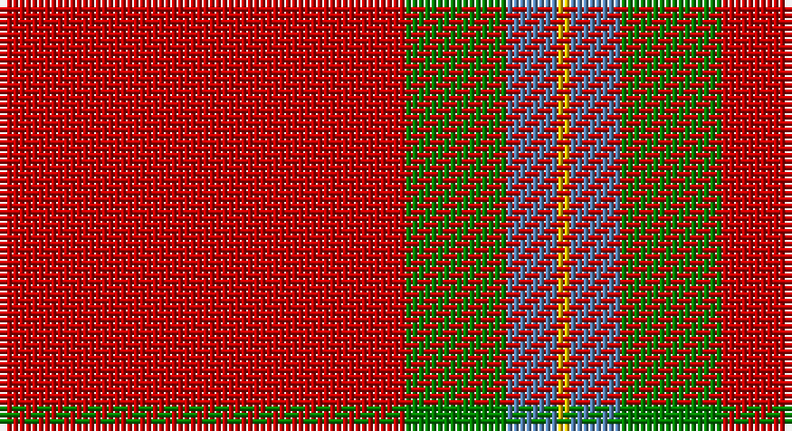

This page is one **sett** — a single exact thread-count. It belongs to the [tartan](/setts/r32g8t4ly1/)
(the same proportion at any scale), whose colour order is pattern [RGBY](/stripes/rgby/).

Sourced from weddslist.  It is a [4 stripe tartan](/stripes/stripes4/).

Original link http://www.weddslist.com/cgi-bin/tartans/pg.pl?source=sts

## Provenance

Earliest known date: 1810-15 A sample of this distinctive and ancient tartan exists in the Cockburn Collection in the Mitchell Library in Glasgow dating before 1810 when the collection was made. It was first published by Grant in 1886. The MacLaines of Lochbuie challenged the right of chiefship for the Clan MacLean. The matter was settled by 'tanistry' and Duart was recognised as chief, even though Eachin Reganach was in fact the elder brother of Lachlan, the first chief of the MacLeans of Duart. The MacLaines of Lochbuie were followers of the Lords of the Isles, and were granted lands on the Isle of Mull. Castle Moy at Loch Buie, now ruined, was the seat of the MacLaines for over 500 years.

2 attestations — the source records this cloth was collapsed from (oldest owns this page)

<ul>
<li>undated — MacLaine of Lochbuie (weddslist, <a href="http://www.weddslist.com/cgi-bin/tartans/pg.pl?source=sts">record</a>)</li>
<li>undated — MacLaine of Lochbuie Clan Tartan (house-of-tartan, <a href="http://www.house-of-tartan.scotland.net/house/TartanViewjs.asp?colr=Def&tnam=1462">record</a>)</li>
</ul>

## Thread count
R/64 G16 B8 Y/2

One full sett is **114 threads**.

## Palette

Palette: <strong>custom</strong>
<table><thead><tr><th>Colour</th><th>Threads</th><th>Shade</th><th>Base</th><th>OKLCh</th></tr></thead><tbody><tr><td>R/</td><td style="text-align:right;font-variant-numeric:tabular-nums">64</td><td><code style="background-color:#C00000;">#C00000</code> <small style="color:#888">#C00000</small></td><td>R <code style="background-color:#CC0000;">#CC0000</code></td><td><small style="color:#888">oklch(50.7% 0.208 29.2)</small></td></tr><tr><td>G</td><td style="text-align:right;font-variant-numeric:tabular-nums">16</td><td><code style="background-color:#008000;">#008000</code> <small style="color:#888">#008000</small></td><td>G <code style="background-color:#006100;">#006100</code></td><td><small style="color:#888">oklch(52.0% 0.177 142.5)</small></td></tr><tr><td>B</td><td style="text-align:right;font-variant-numeric:tabular-nums">8</td><td><code style="background-color:#5480B0;">#5480B0</code> <small style="color:#888">#5480B0</small></td><td>B <code style="background-color:#2A418A;">#2A418A</code></td><td><small style="color:#888">oklch(58.8% 0.089 251.5)</small></td></tr><tr><td>Y/</td><td style="text-align:right;font-variant-numeric:tabular-nums">2</td><td><code style="background-color:#F0C000;">#F0C000</code> <small style="color:#888">#F0C000</small></td><td>Y <code style="background-color:#F2BF00;">#F2BF00</code></td><td><small style="color:#888">oklch(82.7% 0.169 90.5)</small></td></tr></tbody></table>

# Sample pattern

## Nearest tartans

The nearest existing variants by ΔTartan distance, with this tartan at the top so the swatches line up against it.

ΔTartan

Tartan

Sett

—

<a href="/ttd/edit/#slug=r32g8t4ly1~x2">MacLaine of Lochbuie</a> <a class="nn-out" href="/variants/s4/r32g8t4ly1~x2/" title="open its dictionary page">↗</a>

0.34

<a href="/ttd/edit/#slug=r32dg8t4ly1~x2&amp;base=r32g8t4ly1~x2">MacLaine of Lochbuie (Coburn)</a> <a class="nn-out" href="/variants/s4/r32dg8t4ly1~x2/" title="open its dictionary page">↗</a>

0.85

<a href="/ttd/edit/#slug=r32dg8lb4ly1&amp;base=r32g8t4ly1~x2">MacLaine of Lochbuie</a> <a class="nn-out" href="/variants/s4/r32dg8lb4ly1/" title="open its dictionary page">↗</a>

0.88

<a href="/ttd/edit/#slug=r32dg8b4ly1~x2&amp;base=r32g8t4ly1~x2">MacLaine of Lochbuie</a> <a class="nn-out" href="/variants/s4/r32dg8b4ly1~x2/" title="open its dictionary page">↗</a>

0.88

<a href="/ttd/edit/#slug=r32dg8b4ly1&amp;base=r32g8t4ly1~x2">MacLaine of Lochbuie</a> <a class="nn-out" href="/variants/s4/r32dg8b4ly1/" title="open its dictionary page">↗</a>

1.36

<a href="/ttd/edit/#slug=r24g5r3g9r3db1~x4&amp;base=r32g8t4ly1~x2">MacKintosh, Red</a> <a class="nn-out" href="/variants/s6/r24g5r3g9r3db1~x4/" title="open its dictionary page">↗</a>

1.39

<a href="/ttd/edit/#slug=db4r50dg25w2~x2&amp;base=r32g8t4ly1~x2">Unidentified Locket</a> <a class="nn-out" href="/variants/s4/db4r50dg25w2~x2/" title="open its dictionary page">↗</a>

1.39

<a href="/ttd/edit/#slug=r104g39ly4&amp;base=r32g8t4ly1~x2">Scottish Watch</a> <a class="nn-out" href="/variants/s3/r104g39ly4/" title="open its dictionary page">↗</a>

1.40

<a href="/ttd/edit/#slug=r72k8r4g16r7o2~x2&amp;base=r32g8t4ly1~x2">MacAndrew Dress (Name)</a> <a class="nn-out" href="/variants/s6/r72k8r4g16r7o2~x2/" title="open its dictionary page">↗</a>

1.40

<a href="/ttd/edit/#slug=db4r50g25w2~x2&amp;base=r32g8t4ly1~x2">Unidentified, Locket</a> <a class="nn-out" href="/variants/s4/db4r50g25w2~x2/" title="open its dictionary page">↗</a>

1.45

<a href="/ttd/edit/#slug=r5db10r5dg5r25ly1~x4&amp;base=r32g8t4ly1~x2">AON</a> <a class="nn-out" href="/variants/s6/r5db10r5dg5r25ly1~x4/" title="open its dictionary page">↗</a>

## Neighbour map

Every grey dot is one of 14360 variants placed by the first two principal components of the ΔTartan feature space (44% of its variance). Red is this tartan; blue dots are its nearest — click one to open its page.

<svg viewBox="0 0 640 380" role="img" style="max-width:100%;height:auto;border:1px solid #e0e0e0;border-radius:4px;display:block" xmlns="http://www.w3.org/2000/svg"><image href="/nn/cloud.v1.png" width="640" height="380"/><a href="/variants/s4/r32dg8t4ly1~x2/"><circle cx="518.4" cy="171.6" r="4" fill="#3465a4"><title>MacLaine of Lochbuie (Coburn)</title></circle></a><a href="/variants/s4/r32dg8lb4ly1/"><circle cx="488.9" cy="155.6" r="4" fill="#3465a4"><title>MacLaine of Lochbuie</title></circle></a><a href="/variants/s4/r32dg8b4ly1~x2/"><circle cx="528.0" cy="182.7" r="4" fill="#3465a4"><title>MacLaine of Lochbuie</title></circle></a><a href="/variants/s4/r32dg8b4ly1/"><circle cx="528.0" cy="182.7" r="4" fill="#3465a4"><title>MacLaine of Lochbuie</title></circle></a><a href="/variants/s6/r24g5r3g9r3db1~x4/"><circle cx="488.5" cy="184.0" r="4" fill="#3465a4"><title>MacKintosh, Red</title></circle></a><a href="/variants/s4/db4r50dg25w2~x2/"><circle cx="413.4" cy="175.4" r="4" fill="#3465a4"><title>Unidentified Locket</title></circle></a><a href="/variants/s3/r104g39ly4/"><circle cx="512.5" cy="221.7" r="4" fill="#3465a4"><title>Scottish Watch</title></circle></a><a href="/variants/s6/r72k8r4g16r7o2~x2/"><circle cx="561.8" cy="132.8" r="4" fill="#3465a4"><title>MacAndrew Dress (Name)</title></circle></a><a href="/variants/s4/db4r50g25w2~x2/"><circle cx="418.6" cy="182.1" r="4" fill="#3465a4"><title>Unidentified, Locket</title></circle></a><a href="/variants/s6/r5db10r5dg5r25ly1~x4/"><circle cx="452.5" cy="166.3" r="4" fill="#3465a4"><title>AON</title></circle></a><circle cx="510.4" cy="169.6" r="5" fill="#c00000"/></svg>

ID: /variants/s4/r32g8t4ly1~x2/
