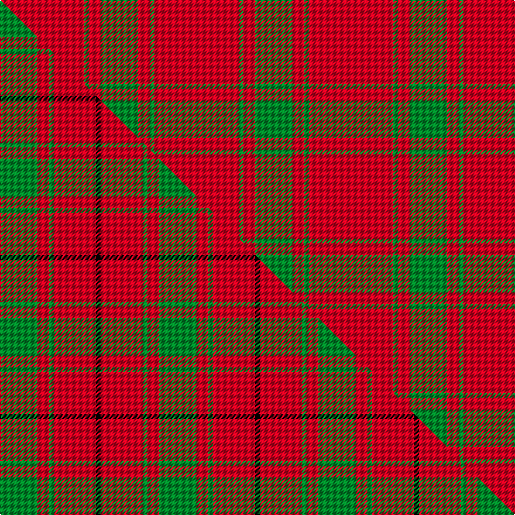

This page is one **sett** — a single exact thread-count. It belongs to the [tartan](/setts/r36g2r5g16/)
(the same proportion at any scale), whose colour order is pattern [GRGR](/stripes/grgr/).

Part of the [MacDonald of Sleat](/tartans/macdonald-of-sleat/) tartan — the named design grouping this sett with its other cloths.

Sourced from register-of-tartans.  It is a [4 stripe tartan](/stripes/stripes4/).

Original link https://www.tartanregister.gov.uk/tartanDetails.aspx?ref=2367

## Provenance

Earliest known date: 1908 The MacDonald of Sleat tartan was manufactured in the 18th century and called MacDonald of Sleat, Lord of the Isles. The pattern was devised from an old MacDonald tartan that is shown in a painting at Armadale Castle, but it appears that the reconstruction differs somewhat from the original. Whether this was intended or simply a mistake is entirely open to conjecture but it would not be the first new design to have arisen from an error in the threadcount. The first recorded publication of the sett can be found in Adam's work of 1908.

3 attestations — the source records this cloth was collapsed from (oldest owns this page)

<ul>
<li>undated — MacDonald of Sleat (register-of-tartans, <a href="https://www.tartanregister.gov.uk/tartanDetails.aspx?ref=2367">record</a>)  <em>Scottish Tartan Society notes: The MacDonald of Sleat tartan was manufactured in the 18th century and called MacDonald of Sleat, Lord of the Isles. The pattern was devised from an old MacDonald tartan that is shown in a painting at Armadale Castle, but it appears that the reconstruction differs somewhat from the original. Whether this was intended or simply a mistake is entirely open to conjecture but it would not be the first new design to have arisen from an error in the threadcount. Sample in Scottish Tartans Authority Dalgety Collection. This is the same as Middleton - see #903 (original Scottish Tartans Authority reference).</em></li>
<li>undated — MacDonald of Sleat (weddslist, <a href="http://www.weddslist.com/cgi-bin/tartans/pg.pl?source=sts">record</a>) </li>
<li>undated — MacDonald of Sleat Clan Tartan (house-of-tartan, <a href="http://www.house-of-tartan.scotland.net/house/TartanViewjs.asp?colr=Def&tnam=904">record</a>) </li>
</ul>

## Register references

External register numbers recorded for this tartan.

- Scottish Register of Tartans: [2367](https://www.tartanregister.gov.uk/tartanDetails.aspx?ref=2367)
- Scottish Tartans Authority (ITI): 904
- Scottish Tartans World Register: 904

## Thread count
R/72 G4 R10 G/32

One full sett is **132 threads**.

## Palette
<table><thead><tr><th>Colour</th><th>Shade</th><th>OKLCh</th></tr></thead><tbody><tr><td>G</td><td><code style="background-color:#008B2A;">#008B2A</code> <small style="color:#888">#008B2A</small></td><td><small style="color:#888">oklch(55.4% 0.170 145.9)</small></td></tr><tr><td>R</td><td><code style="background-color:#D60020;">#D60020</code> <small style="color:#888">#D60020</small></td><td><small style="color:#888">oklch(55.2% 0.224 25.5)</small></td></tr></tbody></table>

# Sample pattern

## Compared to the master

This cloth is one sett of its design; the master sett (the exemplar the design is anchored on) is below for comparison.

Its **ΔTartan distance** from the master is **2.95** — the same measure the nearest-tartans table ranks by (0 is identical; a re-scale of the same cloth is near 0, a recolour or a different proportion further).

<figure class="master-compare" style="margin:0">

this sett
master sett ★

<figcaption style="color:#888;font-size:smaller">One weave of this sett against the <a href="/setts/g16r5g2r18k2/">master sett ★</a>, split on the diagonal: a shared proportion runs seamlessly across it with only the shades shifting; a different proportion breaks on it.</figcaption>
</figure>

## Nearest variants

The nearest existing variants by ΔTartan distance, with this cloth at the top so the swatches line up against it.

ΔTartan

Threads

Variant

Sett

—

132

<a href="/variants/s4/r36g2r5g16~x2/">MacDonald of Sleat</a>

<a href="/ttd/edit/#slug=r36dg2r5dg16~x2&amp;base=r36g2r5g16~x2" title="compare in the TTD">0.00</a>

132

<a href="/variants/s4/r36dg2r5dg16~x2/">MacDonald of Sleat - 1810 (Clan)</a>

<a href="/ttd/edit/#slug=r38g2r5g16&amp;base=r36g2r5g16~x2" title="compare in the TTD">0.07</a>

68

<a href="/variants/s4/r38g2r5g16/">MacDonald Lord of the Isles</a>

<a href="/ttd/edit/#slug=r38g2r5g16~x2&amp;base=r36g2r5g16~x2" title="compare in the TTD">0.07</a>

136

<a href="/variants/s4/r38g2r5g16~x2/">MacDonald Lord of the Isles</a>

<a href="/ttd/edit/#slug=g16r1g2r11~x8&amp;base=r36g2r5g16~x2" title="compare in the TTD">1.00</a>

264

<a href="/variants/s4/g16r1g2r11~x8/">Middleton</a>

<a href="/ttd/edit/#slug=r24g5r3g9r3db1~x4&amp;base=r36g2r5g16~x2" title="compare in the TTD">1.63</a>

260

<a href="/variants/s6/r24g5r3g9r3db1~x4/">MacKintosh, Red</a>

<a href="/ttd/edit/#slug=r35w3r8y2g11~x2&amp;base=r36g2r5g16~x2" title="compare in the TTD">1.77</a>

144

<a href="/variants/s5/r35w3r8y2g11~x2/">Highlands at Wyomissing, The</a>

<a href="/ttd/edit/#slug=r1g7r9y1~x4&amp;base=r36g2r5g16~x2" title="compare in the TTD">1.83</a>

136

<a href="/variants/s4/r1g7r9y1~x4/">Bryce</a>

<a href="/ttd/edit/#slug=g8r2g9r16g1~x2&amp;base=r36g2r5g16~x2" title="compare in the TTD">2.00</a>

126

<a href="/variants/s5/g8r2g9r16g1~x2/">MacGregor of Glenstrae</a>

<a href="/ttd/edit/#slug=r1g10r1db4r18g1~x4&amp;base=r36g2r5g16~x2" title="compare in the TTD">2.01</a>

272

<a href="/variants/s6/r1g10r1db4r18g1~x4/">Robertson 6</a>

<a href="/ttd/edit/#slug=r2g6r2g6r16y1~x2&amp;base=r36g2r5g16~x2" title="compare in the TTD">2.04</a>

126

<a href="/variants/s6/r2g6r2g6r16y1~x2/">Cameron</a>

## Neighbour map

Every grey dot is one of 13620 variants placed by the first two principal components of the ΔTartan feature space (42% of its variance). Red is this tartan; blue dots are its nearest — click one to open its page.

<svg viewBox="0 0 640 380" role="img" style="max-width:100%;height:auto;border:1px solid #e0e0e0;border-radius:4px;display:block" xmlns="http://www.w3.org/2000/svg"><image href="/nn/cloud.v1.png" width="640" height="380"/><a href="/variants/s4/r36dg2r5dg16~x2/"><circle cx="503.2" cy="220.5" r="4" fill="#3465a4"><title>MacDonald of Sleat - 1810 (Clan)</title></circle></a><a href="/variants/s4/r38g2r5g16/"><circle cx="526.4" cy="224.2" r="4" fill="#3465a4"><title>MacDonald Lord of the Isles</title></circle></a><a href="/variants/s4/r38g2r5g16~x2/"><circle cx="526.4" cy="224.2" r="4" fill="#3465a4"><title>MacDonald Lord of the Isles</title></circle></a><a href="/variants/s4/g16r1g2r11~x8/"><circle cx="442.8" cy="247.3" r="4" fill="#3465a4"><title>Middleton</title></circle></a><a href="/variants/s6/r24g5r3g9r3db1~x4/"><circle cx="477.5" cy="177.3" r="4" fill="#3465a4"><title>MacKintosh, Red</title></circle></a><a href="/variants/s5/r35w3r8y2g11~x2/"><circle cx="485.7" cy="179.8" r="4" fill="#3465a4"><title>Highlands at Wyomissing, The</title></circle></a><a href="/variants/s4/r1g7r9y1~x4/"><circle cx="386.9" cy="257.4" r="4" fill="#3465a4"><title>Bryce</title></circle></a><a href="/variants/s5/g8r2g9r16g1~x2/"><circle cx="395.8" cy="244.8" r="4" fill="#3465a4"><title>MacGregor of Glenstrae</title></circle></a><a href="/variants/s6/r1g10r1db4r18g1~x4/"><circle cx="385.0" cy="182.5" r="4" fill="#3465a4"><title>Robertson 6</title></circle></a><a href="/variants/s6/r2g6r2g6r16y1~x2/"><circle cx="430.9" cy="206.1" r="4" fill="#3465a4"><title>Cameron</title></circle></a><circle cx="515.9" cy="228.2" r="5" fill="#c00000"/><text x="320" y="376" text-anchor="middle" font-size="11" fill="#999">ground</text><text x="11" y="190" text-anchor="middle" font-size="11" fill="#999" transform="rotate(-90 11 190)">complexity</text></svg>

ID: /variants/s4/r36g2r5g16~x2/
