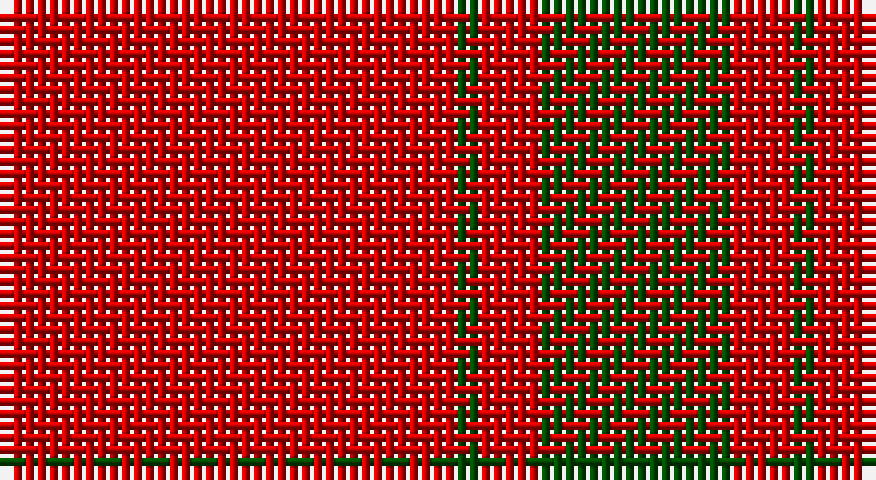

This page is one **sett** — a single exact thread-count. It belongs to the [tartan](/setts/r38dg2r5dg16/)
(the same proportion at any scale), whose colour order is pattern [GRGR](/stripes/grgr/).

Part of the [MacDonald Lord of the Isles](/tartans/macdonald-lord-of-the-isles/) tartan — the named design grouping this sett with its other cloths.

Sourced from weddslist.  It is a [4 stripe tartan](/stripes/stripes4/).

Original link http://www.weddslist.com/cgi-bin/tartans/pg.pl?source=rb

## Also known as

This cloth is also recorded under:

- MacDonald, Lord of the Isles

2 attestations — the source records this cloth was collapsed from (oldest owns this page)

<ul>
<li>undated — MacDonald Lord of the Isles (weddslist, <a href="http://www.weddslist.com/cgi-bin/tartans/pg.pl?source=rb">record</a>)</li>
<li>undated — MacDonald Lord of the Isles (weddslist, <a href="http://www.weddslist.com/cgi-bin/tartans/pg.pl?source=x">record</a>)</li>
</ul>

## Thread count
R/38 G2 R5 G/16

One full sett is **68 threads**.

## Palette

Palette: <strong>Tartan Register</strong>
<table><thead><tr><th>Colour</th><th>Threads</th><th>Shade</th><th>Base</th><th>OKLCh</th></tr></thead><tbody><tr><td>R/</td><td style="text-align:right;font-variant-numeric:tabular-nums">38</td><td><code style="background-color:#C80000;">#C80000</code> <small style="color:#888">#C80000</small></td><td>R <code style="background-color:#CC0000;">#CC0000</code></td><td><small style="color:#888">oklch(52.3% 0.215 29.2)</small></td></tr><tr><td>G</td><td style="text-align:right;font-variant-numeric:tabular-nums">2</td><td><code style="background-color:#004C00;">#004C00</code> <small style="color:#888">#004C00</small></td><td>G <code style="background-color:#006100;">#006100</code></td><td><small style="color:#888">oklch(36.1% 0.123 142.5)</small></td></tr><tr><td>R</td><td style="text-align:right;font-variant-numeric:tabular-nums">5</td><td><code style="background-color:#C80000;">#C80000</code> <small style="color:#888">#C80000</small></td><td>R <code style="background-color:#CC0000;">#CC0000</code></td><td><small style="color:#888">oklch(52.3% 0.215 29.2)</small></td></tr><tr><td>G/</td><td style="text-align:right;font-variant-numeric:tabular-nums">16</td><td><code style="background-color:#004C00;">#004C00</code> <small style="color:#888">#004C00</small></td><td>G <code style="background-color:#006100;">#006100</code></td><td><small style="color:#888">oklch(36.1% 0.123 142.5)</small></td></tr></tbody></table>

# Sample pattern

## Compared to the master

This cloth is one sett of its design; the master sett (the exemplar the design is anchored on) is below for comparison.

<figure style="margin:0"><figcaption style="color:#888;font-size:smaller">this sett</figcaption></figure>
<figure style="margin:0"><figcaption style="color:#888;font-size:smaller"><a href="/setts/dg24w1dg2w2db2w1db1w1db2w2db2w1db12/">master sett →</a></figcaption></figure>

## Nearest tartans

The nearest existing variants by ΔTartan distance, with this tartan at the top so the swatches line up against it.

ΔTartan

Tartan

Sett

—

<a href="/ttd/edit/#slug=r38dg2r5dg16">MacDonald Lord of the Isles</a> <a class="nn-out" href="/variants/s4/r38dg2r5dg16/" title="open its dictionary page">↗</a>

0.39

<a href="/ttd/edit/#slug=r36g2r5g16~x2&amp;base=r38dg2r5dg16">MacDonald of Sleat</a> <a class="nn-out" href="/variants/s4/r36g2r5g16~x2/" title="open its dictionary page">↗</a>

0.53

<a href="/ttd/edit/#slug=r36dg2r5dg16~x2&amp;base=r38dg2r5dg16">MacDonald of Sleat - 1810 (Clan)</a> <a class="nn-out" href="/variants/s4/r36dg2r5dg16~x2/" title="open its dictionary page">↗</a>

1.10

<a href="/ttd/edit/#slug=r38dg2r5dg16~x2&amp;base=r38dg2r5dg16">MacDonald Lord of the Isles</a> <a class="nn-out" href="/variants/s4/r38dg2r5dg16~x2/" title="open its dictionary page">↗</a>

1.26

<a href="/ttd/edit/#slug=r104g39ly4&amp;base=r38dg2r5dg16">Scottish Watch</a> <a class="nn-out" href="/variants/s3/r104g39ly4/" title="open its dictionary page">↗</a>

1.41

<a href="/variants/s4/r25k5r1~x4/">Masai Shuka 12 (Artefact)</a>

1.42

<a href="/ttd/edit/#slug=r24g5r3g9r3db1~x4&amp;base=r38dg2r5dg16">MacKintosh, Red</a> <a class="nn-out" href="/variants/s6/r24g5r3g9r3db1~x4/" title="open its dictionary page">↗</a>

1.45

<a href="/ttd/edit/#slug=r40db2r6db15~x2&amp;base=r38dg2r5dg16">Masai Shuka 21 (Artefact)</a> <a class="nn-out" href="/variants/s4/r40db2r6db15~x2/" title="open its dictionary page">↗</a>

1.54

<a href="/ttd/edit/#slug=r16dg1r1dg1r4dg12&amp;base=r38dg2r5dg16">MacQuarrie</a> <a class="nn-out" href="/variants/s6/r16dg1r1dg1r4dg12/" title="open its dictionary page">↗</a>

1.55

<a href="/ttd/edit/#slug=r75k15r4k15r4~x2&amp;base=r38dg2r5dg16">Masai Shuka 07 (Artefact)</a> <a class="nn-out" href="/variants/s5/r75k15r4k15r4~x2/" title="open its dictionary page">↗</a>

1.56

<a href="/ttd/edit/#slug=r58ly3r6g16r12g16r6&amp;base=r38dg2r5dg16">Cameron, Ancient</a> <a class="nn-out" href="/variants/s7/r58ly3r6g16r12g16r6/" title="open its dictionary page">↗</a>

## Neighbour map

Every grey dot is one of 14360 variants placed by the first two principal components of the ΔTartan feature space (44% of its variance). Red is this tartan; blue dots are its nearest — click one to open its page.

<svg viewBox="0 0 640 380" role="img" style="max-width:100%;height:auto;border:1px solid #e0e0e0;border-radius:4px;display:block" xmlns="http://www.w3.org/2000/svg"><image href="/nn/cloud.v1.png" width="640" height="380"/><a href="/variants/s4/r36g2r5g16~x2/"><circle cx="520.9" cy="238.1" r="4" fill="#3465a4"><title>MacDonald of Sleat</title></circle></a><a href="/variants/s4/r36dg2r5dg16~x2/"><circle cx="530.3" cy="241.8" r="4" fill="#3465a4"><title>MacDonald of Sleat - 1810 (Clan)</title></circle></a><a href="/variants/s4/r38dg2r5dg16~x2/"><circle cx="555.1" cy="251.3" r="4" fill="#3465a4"><title>MacDonald Lord of the Isles</title></circle></a><a href="/variants/s3/r104g39ly4/"><circle cx="512.5" cy="221.7" r="4" fill="#3465a4"><title>Scottish Watch</title></circle></a><a href="/variants/s4/r25k5r1~x4/"><circle cx="535.1" cy="201.5" r="4" fill="#3465a4"><title>Masai Shuka 12 (Artefact)</title></circle></a><a href="/variants/s6/r24g5r3g9r3db1~x4/"><circle cx="488.5" cy="184.0" r="4" fill="#3465a4"><title>MacKintosh, Red</title></circle></a><a href="/variants/s4/r40db2r6db15~x2/"><circle cx="546.2" cy="226.0" r="4" fill="#3465a4"><title>Masai Shuka 21 (Artefact)</title></circle></a><a href="/variants/s6/r16dg1r1dg1r4dg12/"><circle cx="450.8" cy="213.4" r="4" fill="#3465a4"><title>MacQuarrie</title></circle></a><a href="/variants/s5/r75k15r4k15r4~x2/"><circle cx="538.1" cy="193.9" r="4" fill="#3465a4"><title>Masai Shuka 07 (Artefact)</title></circle></a><a href="/variants/s7/r58ly3r6g16r12g16r6/"><circle cx="494.4" cy="181.5" r="4" fill="#3465a4"><title>Cameron, Ancient</title></circle></a><circle cx="526.6" cy="232.1" r="5" fill="#c00000"/></svg>

ID: /variants/s4/r38dg2r5dg16/
