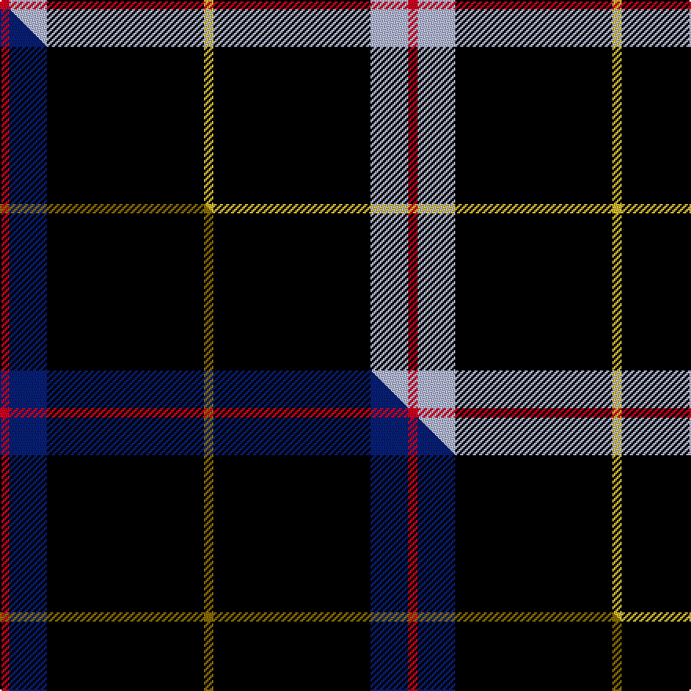

This page is one **sett** — a single exact thread-count. It belongs to the [tartan](/setts/r3lb12k50ly3/)
(the same proportion at any scale), whose colour order is pattern [RWKY](/stripes/rwky/).

Part of the [Rogues , The](/tartans/rogues-the/) tartan — the named design grouping this sett with its other cloths.

Sourced from tartans-authority.  It is a [4 stripe tartan](/stripes/stripes4/).

Original link http://www.tartansauthority.com/tartan-ferret/display/10749/

## Register references

External register numbers recorded for this tartan.

- Scottish Register of Tartans: [10749](https://www.tartanregister.gov.uk/tartanDetails?ref=10749)
- Scottish Tartans Authority (ITI): 10749

## Thread count
R/6 LB24 K100 LY/6

One full sett is **260 threads**.

## Palette
<table><thead><tr><th>Colour</th><th>Shade</th><th>OKLCh</th></tr></thead><tbody><tr><td>LB</td><td><code style="background-color:#B5BBDE;">#B5BBDE</code> <small style="color:#888">#B5BBDE</small></td><td><small style="color:#888">oklch(79.9% 0.050 277.6)</small></td></tr><tr><td>K</td><td><code style="background-color:#000000;">#000000</code> <small style="color:#888">#000000</small></td><td><small style="color:#888">oklch(0.0% 0.000 0.0)</small></td></tr><tr><td>R</td><td><code style="background-color:#D60020;">#D60020</code> <small style="color:#888">#D60020</small></td><td><small style="color:#888">oklch(55.2% 0.224 25.5)</small></td></tr><tr><td>LY</td><td><code style="background-color:#DCBC32;">#DCBC32</code> <small style="color:#888">#DCBC32</small></td><td><small style="color:#888">oklch(80.0% 0.150 95.2)</small></td></tr></tbody></table>

# Sample pattern

## Compared to the master

This cloth is one sett of its design; the master sett (the exemplar the design is anchored on) is below for comparison.

Its **ΔTartan distance** from the master is **1.78** — the same measure the nearest-tartans table ranks by (0 is identical; a re-scale of the same cloth is near 0, a recolour or a different proportion further).

<figure class="master-compare" style="margin:0">

this sett
master sett ★

<figcaption style="color:#888;font-size:smaller">One weave of this sett against the <a href="/setts/r3db12k50y3/">master sett ★</a>, split on the diagonal: a shared proportion runs seamlessly across it with only the shades shifting; a different proportion breaks on it.</figcaption>
</figure>

## Nearest variants

The nearest existing variants by ΔTartan distance, with this cloth at the top so the swatches line up against it.

ΔTartan

Threads

Variant

Sett

—

260

<a href="/variants/s4/r3lb12k50ly3~x2/">Rogues, The (Corporate)</a>

<a href="/ttd/edit/#slug=r3db12k50y3~x2&amp;base=r3lb12k50ly3~x2" title="compare in the TTD">0.00</a>

260

<a href="/variants/s4/r3db12k50y3~x2/">Rogues (United States), The</a>

<a href="/ttd/edit/#slug=k62db15w6y4~x2&amp;base=r3lb12k50ly3~x2" title="compare in the TTD">0.40</a>

216

<a href="/variants/s4/k62db15w6y4~x2/">C-Tec N.I. Ltd</a>

<a href="/ttd/edit/#slug=dr1k20lb5dr1~x4&amp;base=r3lb12k50ly3~x2" title="compare in the TTD">0.54</a>

208

<a href="/variants/s4/dr1k20lb5dr1~x4/">Dobelman (Personal)</a>

<a href="/ttd/edit/#slug=k50db6r6n6w3~x2&amp;base=r3lb12k50ly3~x2" title="compare in the TTD">1.14</a>

178

<a href="/variants/s5/k50db6r6n6w3~x2/">Friends of Nordegg (Corporate)</a>

<a href="/ttd/edit/#slug=r2g2k20w1db1~x6&amp;base=r3lb12k50ly3~x2" title="compare in the TTD">1.39</a>

294

<a href="/variants/s5/r2g2k20w1db1~x6/">Fily, Sylvain Roger</a>

<a href="/ttd/edit/#slug=db1r1k12g1~x4&amp;base=r3lb12k50ly3~x2" title="compare in the TTD">1.43</a>

112

<a href="/variants/s4/db1r1k12g1~x4/">MacNathair Sgianach</a>

<a href="/ttd/edit/#slug=k69r14y5~x2&amp;base=r3lb12k50ly3~x2" title="compare in the TTD">1.66</a>

204

<a href="/variants/s3/k69r14y5~x2/">Batson (Personal)</a>

<a href="/ttd/edit/#slug=k60dr3k5dr3lb18n3~x2&amp;base=r3lb12k50ly3~x2" title="compare in the TTD">1.92</a>

242

<a href="/variants/s6/k60dr3k5dr3lb18n3~x2/">Ailsa, Navy (Fashion)</a>

<a href="/ttd/edit/#slug=k30r10y1k8w3~x4&amp;base=r3lb12k50ly3~x2" title="compare in the TTD">2.21</a>

284

<a href="/variants/s5/k30r10y1k8w3~x4/">Union Fire Club Pipes and Drums</a>

<a href="/ttd/edit/#slug=k62n24y5w3~x2&amp;base=r3lb12k50ly3~x2" title="compare in the TTD">2.25</a>

246

<a href="/variants/s4/k62n24y5w3~x2/">Perry (Calgary), Alex (Personal)</a>

## Neighbour map

Every grey dot is one of 13620 variants placed by the first two principal components of the ΔTartan feature space (42% of its variance). Red is this tartan; blue dots are its nearest — click one to open its page.

<svg viewBox="0 0 640 380" role="img" style="max-width:100%;height:auto;border:1px solid #e0e0e0;border-radius:4px;display:block" xmlns="http://www.w3.org/2000/svg"><image href="/nn/cloud.v1.png" width="640" height="380"/><a href="/variants/s4/r3db12k50y3~x2/"><circle cx="444.1" cy="166.2" r="4" fill="#3465a4"><title>Rogues (United States), The</title></circle></a><a href="/variants/s4/k62db15w6y4~x2/"><circle cx="384.9" cy="164.1" r="4" fill="#3465a4"><title>C-Tec N.I. Ltd</title></circle></a><a href="/variants/s4/dr1k20lb5dr1~x4/"><circle cx="431.5" cy="161.1" r="4" fill="#3465a4"><title>Dobelman (Personal)</title></circle></a><a href="/variants/s5/k50db6r6n6w3~x2/"><circle cx="366.3" cy="127.9" r="4" fill="#3465a4"><title>Friends of Nordegg (Corporate)</title></circle></a><a href="/variants/s5/r2g2k20w1db1~x6/"><circle cx="423.3" cy="109.5" r="4" fill="#3465a4"><title>Fily, Sylvain Roger</title></circle></a><a href="/variants/s4/db1r1k12g1~x4/"><circle cx="471.7" cy="163.6" r="4" fill="#3465a4"><title>MacNathair Sgianach</title></circle></a><a href="/variants/s3/k69r14y5~x2/"><circle cx="462.0" cy="195.8" r="4" fill="#3465a4"><title>Batson (Personal)</title></circle></a><a href="/variants/s6/k60dr3k5dr3lb18n3~x2/"><circle cx="384.3" cy="120.5" r="4" fill="#3465a4"><title>Ailsa, Navy (Fashion)</title></circle></a><a href="/variants/s5/k30r10y1k8w3~x4/"><circle cx="400.4" cy="127.5" r="4" fill="#3465a4"><title>Union Fire Club Pipes and Drums</title></circle></a><a href="/variants/s4/k62n24y5w3~x2/"><circle cx="362.6" cy="161.6" r="4" fill="#3465a4"><title>Perry (Calgary), Alex (Personal)</title></circle></a><circle cx="399.5" cy="155.6" r="5" fill="#c00000"/><text x="320" y="376" text-anchor="middle" font-size="11" fill="#999">ground</text><text x="11" y="190" text-anchor="middle" font-size="11" fill="#999" transform="rotate(-90 11 190)">complexity</text></svg>

ID: /variants/s4/r3lb12k50ly3~x2/
