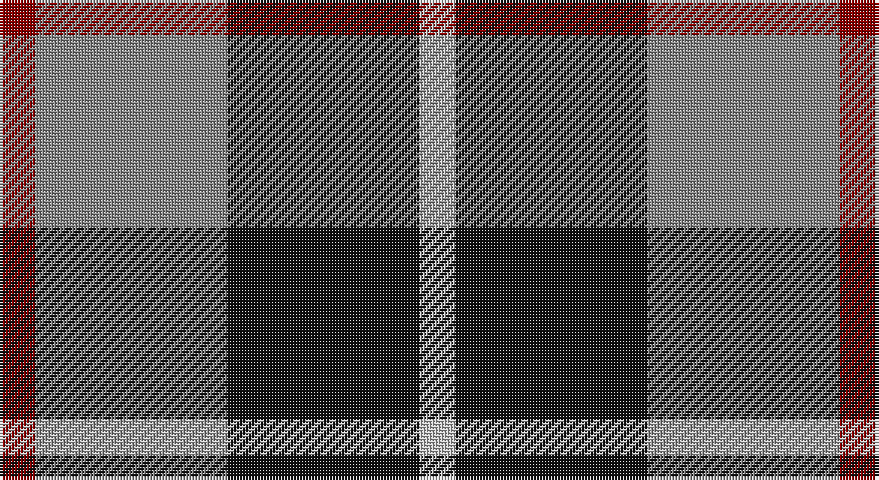

This page is one **sett** — a single exact thread-count. It belongs to the [tartan](/setts/r3o16k16lb3/)
(the same proportion at any scale), whose colour order is pattern [RRKW](/stripes/rrkw/).

Sourced from tartans-authority.  It is a [4 stripe tartan](/stripes/stripes4/).

Original link http://www.tartansauthority.com/tartan-ferret/display/3597/

## Also known as

This cloth is also recorded under:

- Thompson, Grey

2 attestations — the source records this cloth was collapsed from (oldest owns this page)

<ul>
<li>pre 2002 — Thompson, Dress (Clan) (tartans-authority, <a href="http://www.tartansauthority.com/tartan-ferret/display/3597/">record</a>)</li>
<li>undated — Thompson, Grey (register-of-tartans, <a href="https://www.tartanregister.gov.uk/tartanDetails.aspx?ref=5157">record</a>)</li>
</ul>

## Register references

External register numbers recorded for this tartan.

- Scottish Register of Tartans: [5157](https://www.tartanregister.gov.uk/tartanDetails.aspx?ref=5157)
- Scottish Tartans Authority (ITI): 3597

## Thread count
DR/12 Na64 K64 N/12

One full sett is **280 threads**.

## Palette

Palette: <strong>Tartan Register</strong>
<table><thead><tr><th>Colour</th><th>Threads</th><th>Shade</th><th>Base</th><th>OKLCh</th></tr></thead><tbody><tr><td>DR/</td><td style="text-align:right;font-variant-numeric:tabular-nums">12</td><td><code style="background-color:#880000;">#880000</code> <small style="color:#888">#880000</small></td><td>R <code style="background-color:#CC0000;">#CC0000</code></td><td><small style="color:#888">oklch(39.4% 0.162 29.2)</small></td></tr><tr><td>Na</td><td style="text-align:right;font-variant-numeric:tabular-nums">64</td><td><code style="background-color:#888888;">#888888</code> <small style="color:#888">#888888</small></td><td>R <code style="background-color:#CC0000;">#CC0000</code></td><td><small style="color:#888">oklch(62.7% 0.000 89.9)</small></td></tr><tr><td>K</td><td style="text-align:right;font-variant-numeric:tabular-nums">64</td><td><code style="background-color:#101010;">#101010</code> <small style="color:#888">#101010</small></td><td>K <code style="background-color:#000000;">#000000</code></td><td><small style="color:#888">oklch(17.3% 0.000 89.9)</small></td></tr><tr><td>N/</td><td style="text-align:right;font-variant-numeric:tabular-nums">12</td><td><code style="background-color:#C0C0C0;">#C0C0C0</code> <small style="color:#888">#C0C0C0</small></td><td>W <code style="background-color:#F7F7F7;">#F7F7F7</code></td><td><small style="color:#888">oklch(80.8% 0.000 89.9)</small></td></tr></tbody></table>

# Sample pattern

## Nearest tartans

The nearest existing variants by ΔTartan distance, with this tartan at the top so the swatches line up against it.

ΔTartan

Tartan

Sett

—

<a href="/ttd/edit/#slug=r3o16k16lb3~x4">Thompson, Dress (Clan)</a> <a class="nn-out" href="/variants/s4/r3o16k16lb3~x4/" title="open its dictionary page">↗</a>

0.40

<a href="/ttd/edit/#slug=r5o32k31w5~x2&amp;base=r3o16k16lb3~x4">Loganair</a> <a class="nn-out" href="/variants/s4/r5o32k31w5~x2/" title="open its dictionary page">↗</a>

0.43

<a href="/ttd/edit/#slug=r5o32k31w5&amp;base=r3o16k16lb3~x4">Loganair Uniform Skirt Corporate Tartan</a> <a class="nn-out" href="/variants/s4/r5o32k31w5/" title="open its dictionary page">↗</a>

0.80

<a href="/ttd/edit/#slug=g21db34r14w6~x2&amp;base=r3o16k16lb3~x4">Harbison (2015)</a> <a class="nn-out" href="/variants/s4/g21db34r14w6~x2/" title="open its dictionary page">↗</a>

0.96

<a href="/ttd/edit/#slug=o5dp3o18k16ly3~x4&amp;base=r3o16k16lb3~x4">New York State Police Pipe Band</a> <a class="nn-out" href="/variants/s5/o5dp3o18k16ly3~x4/" title="open its dictionary page">↗</a>

1.00

<a href="/ttd/edit/#slug=r5y32k31w5~x2&amp;base=r3o16k16lb3~x4">Loganair, Uniform Skirt</a> <a class="nn-out" href="/variants/s4/r5y32k31w5~x2/" title="open its dictionary page">↗</a>

1.03

<a href="/ttd/edit/#slug=db3dg6ly1r3~x10&amp;base=r3o16k16lb3~x4">Delroeux, John Michael (Personal)</a> <a class="nn-out" href="/variants/s4/db3dg6ly1r3~x10/" title="open its dictionary page">↗</a>

1.07

<a href="/ttd/edit/#slug=k4w3k4y9r1~x4&amp;base=r3o16k16lb3~x4">Oban Grey</a> <a class="nn-out" href="/variants/s5/k4w3k4y9r1~x4/" title="open its dictionary page">↗</a>

1.09

<a href="/ttd/edit/#slug=db21g34r14w6~x2&amp;base=r3o16k16lb3~x4">Harbison (2015)</a> <a class="nn-out" href="/variants/s4/db21g34r14w6~x2/" title="open its dictionary page">↗</a>

1.11

<a href="/ttd/edit/#slug=r1dg6db6w1~x4&amp;base=r3o16k16lb3~x4">Salt Spring Island</a> <a class="nn-out" href="/variants/s4/r1dg6db6w1~x4/" title="open its dictionary page">↗</a>

1.12

<a href="/ttd/edit/#slug=k4w3k4o9r1~x4&amp;base=r3o16k16lb3~x4">Oban Grey District Tartan</a> <a class="nn-out" href="/variants/s5/k4w3k4o9r1~x4/" title="open its dictionary page">↗</a>

## Neighbour map

Every grey dot is one of 14360 variants placed by the first two principal components of the ΔTartan feature space (44% of its variance). Red is this tartan; blue dots are its nearest — click one to open its page.

<svg viewBox="0 0 640 380" role="img" style="max-width:100%;height:auto;border:1px solid #e0e0e0;border-radius:4px;display:block" xmlns="http://www.w3.org/2000/svg"><image href="/nn/cloud.v1.png" width="640" height="380"/><a href="/variants/s4/r5o32k31w5~x2/"><circle cx="209.7" cy="242.3" r="4" fill="#3465a4"><title>Loganair</title></circle></a><a href="/variants/s4/r5o32k31w5/"><circle cx="208.7" cy="240.7" r="4" fill="#3465a4"><title>Loganair Uniform Skirt Corporate Tartan</title></circle></a><a href="/variants/s4/g21db34r14w6~x2/"><circle cx="175.6" cy="267.1" r="4" fill="#3465a4"><title>Harbison (2015)</title></circle></a><a href="/variants/s5/o5dp3o18k16ly3~x4/"><circle cx="234.9" cy="235.1" r="4" fill="#3465a4"><title>New York State Police Pipe Band</title></circle></a><a href="/variants/s4/r5y32k31w5~x2/"><circle cx="196.8" cy="239.0" r="4" fill="#3465a4"><title>Loganair, Uniform Skirt</title></circle></a><a href="/variants/s4/db3dg6ly1r3~x10/"><circle cx="170.4" cy="258.1" r="4" fill="#3465a4"><title>Delroeux, John Michael (Personal)</title></circle></a><a href="/variants/s5/k4w3k4y9r1~x4/"><circle cx="186.9" cy="224.9" r="4" fill="#3465a4"><title>Oban Grey</title></circle></a><a href="/variants/s4/db21g34r14w6~x2/"><circle cx="178.1" cy="269.4" r="4" fill="#3465a4"><title>Harbison (2015)</title></circle></a><a href="/variants/s4/r1dg6db6w1~x4/"><circle cx="199.5" cy="255.8" r="4" fill="#3465a4"><title>Salt Spring Island</title></circle></a><a href="/variants/s5/k4w3k4o9r1~x4/"><circle cx="185.2" cy="223.7" r="4" fill="#3465a4"><title>Oban Grey District Tartan</title></circle></a><circle cx="192.2" cy="254.4" r="5" fill="#c00000"/></svg>

ID: /variants/s4/r3o16k16lb3~x4/
