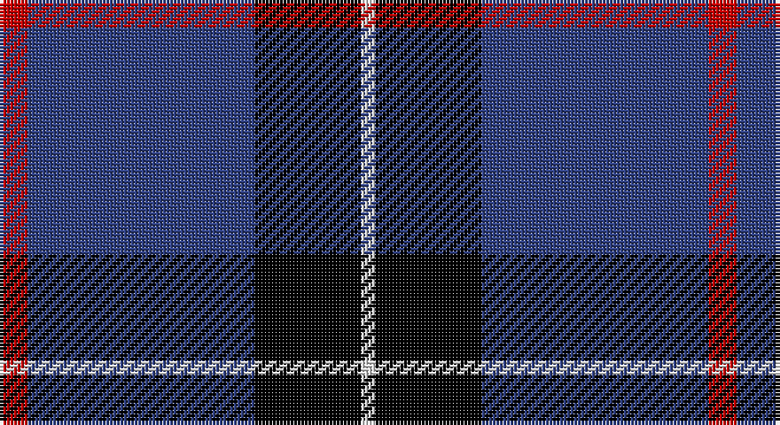

This page is one **sett** — a single exact thread-count. It belongs to the [tartan](/setts/r4db32k15w2/)
(the same proportion at any scale), whose colour order is pattern [RBKW](/stripes/rbkw/).

Part of the [Scottish Nuclear](/tartans/scottish-nuclear/) tartan — the named design grouping this sett with its other cloths.

Sourced from weddslist.  It is a [4 stripe tartan](/stripes/stripes4/).

Original link http://www.weddslist.com/cgi-bin/tartans/pg.pl?source=sts

## Thread count
R/8 B64 K30 LN/4

One full sett is **200 threads**.

## Palette

Palette: <strong>Tartan Register</strong> <small style="color:#888">(2 of 4 colours)</small>
<table><thead><tr><th>Colour</th><th>Threads</th><th>Shade</th><th>Base</th><th>OKLCh</th></tr></thead><tbody><tr><td>R/</td><td style="text-align:right;font-variant-numeric:tabular-nums">8</td><td><code style="background-color:#C00000;">#C00000</code> <small style="color:#888">#C00000</small></td><td>R <code style="background-color:#CC0000;">#CC0000</code></td><td><small style="color:#888">oklch(50.7% 0.208 29.2)</small></td></tr><tr><td>B</td><td style="text-align:right;font-variant-numeric:tabular-nums">64</td><td><code style="background-color:#304080;">#304080</code> <small style="color:#888">#304080</small></td><td>B <code style="background-color:#2A418A;">#2A418A</code></td><td><small style="color:#888">oklch(39.4% 0.109 270.2)</small></td></tr><tr><td>K</td><td style="text-align:right;font-variant-numeric:tabular-nums">30</td><td><code style="background-color:#000000;">#000000</code> <small style="color:#888">#000000</small></td><td>K <code style="background-color:#000000;">#000000</code></td><td><small style="color:#888">oklch(0.0% 0.000 0.0)</small></td></tr><tr><td>LN/</td><td style="text-align:right;font-variant-numeric:tabular-nums">4</td><td><code style="background-color:#E0E0E0;">#E0E0E0</code> <small style="color:#888">#E0E0E0</small></td><td>W <code style="background-color:#F7F7F7;">#F7F7F7</code></td><td><small style="color:#888">oklch(90.7% 0.000 89.9)</small></td></tr></tbody></table>

# Sample pattern

## Compared to the master

This cloth is one sett of its design; the master sett (the exemplar the design is anchored on) is below for comparison.

<figure style="margin:0"><figcaption style="color:#888;font-size:smaller">this sett</figcaption></figure>
<figure style="margin:0"><figcaption style="color:#888;font-size:smaller"><a href="/setts/db9k4lb1k4db9r1/">master sett →</a></figcaption></figure>

## Nearest tartans

The nearest existing variants by ΔTartan distance, with this tartan at the top so the swatches line up against it.

ΔTartan

Tartan

Sett

—

<a href="/ttd/edit/#slug=r4db32k15w2~x2">Scottish Nuclear</a> <a class="nn-out" href="/variants/s4/r4db32k15w2~x2/" title="open its dictionary page">↗</a>

0.91

<a href="/ttd/edit/#slug=g20r7db40w2~x2&amp;base=r4db32k15w2~x2">McNiff, Kevin (Personal)</a> <a class="nn-out" href="/variants/s4/g20r7db40w2~x2/" title="open its dictionary page">↗</a>

1.00

<a href="/ttd/edit/#slug=r5db26k12w2~x4&amp;base=r4db32k15w2~x2">Mirror (Corporate)</a> <a class="nn-out" href="/variants/s4/r5db26k12w2~x4/" title="open its dictionary page">↗</a>

1.12

<a href="/ttd/edit/#slug=r3lo2k10w1~x6&amp;base=r4db32k15w2~x2">St. Eloi (Corporate)</a> <a class="nn-out" href="/variants/s4/r3lo2k10w1~x6/" title="open its dictionary page">↗</a>

1.24

<a href="/ttd/edit/#slug=k1ly2k3n12k18w1~x2&amp;base=r4db32k15w2~x2">Jon's Theme</a> <a class="nn-out" href="/variants/s6/k1ly2k3n12k18w1~x2/" title="open its dictionary page">↗</a>

1.35

<a href="/ttd/edit/#slug=w2db35k9w3k9ly2~x2&amp;base=r4db32k15w2~x2">Hannah (Personal)</a> <a class="nn-out" href="/variants/s6/w2db35k9w3k9ly2~x2/" title="open its dictionary page">↗</a>

1.39

<a href="/ttd/edit/#slug=r1db12k5o3db5w1~x4&amp;base=r4db32k15w2~x2">Massachusetts</a> <a class="nn-out" href="/variants/s6/r1db12k5o3db5w1~x4/" title="open its dictionary page">↗</a>

1.41

<a href="/ttd/edit/#slug=db60dg16w8lo3~x2&amp;base=r4db32k15w2~x2">MaleHsuHK (Hong Kong) (Personal)</a> <a class="nn-out" href="/variants/s4/db60dg16w8lo3~x2/" title="open its dictionary page">↗</a>

1.43

<a href="/ttd/edit/#slug=k3db30k8w8k2r3~x2&amp;base=r4db32k15w2~x2">Hydro-Electric</a> <a class="nn-out" href="/variants/s6/k3db30k8w8k2r3~x2/" title="open its dictionary page">↗</a>

1.45

<a href="/ttd/edit/#slug=r1db9k4lb1~x4&amp;base=r4db32k15w2~x2">Scottish Nuclear (Corporate)</a> <a class="nn-out" href="/variants/s4/r1db9k4lb1~x4/" title="open its dictionary page">↗</a>

1.47

<a href="/ttd/edit/#slug=k62n24lo5w8~x2&amp;base=r4db32k15w2~x2">Perry, Alex (Personal)</a> <a class="nn-out" href="/variants/s4/k62n24lo5w8~x2/" title="open its dictionary page">↗</a>

## Neighbour map

Every grey dot is one of 14360 variants placed by the first two principal components of the ΔTartan feature space (44% of its variance). Red is this tartan; blue dots are its nearest — click one to open its page.

<svg viewBox="0 0 640 380" role="img" style="max-width:100%;height:auto;border:1px solid #e0e0e0;border-radius:4px;display:block" xmlns="http://www.w3.org/2000/svg"><image href="/nn/cloud.v1.png" width="640" height="380"/><a href="/variants/s4/g20r7db40w2~x2/"><circle cx="345.8" cy="212.4" r="4" fill="#3465a4"><title>McNiff, Kevin (Personal)</title></circle></a><a href="/variants/s4/r5db26k12w2~x4/"><circle cx="329.8" cy="227.5" r="4" fill="#3465a4"><title>Mirror (Corporate)</title></circle></a><a href="/variants/s4/r3lo2k10w1~x6/"><circle cx="321.9" cy="219.5" r="4" fill="#3465a4"><title>St. Eloi (Corporate)</title></circle></a><a href="/variants/s6/k1ly2k3n12k18w1~x2/"><circle cx="366.0" cy="187.5" r="4" fill="#3465a4"><title>Jon's Theme</title></circle></a><a href="/variants/s6/w2db35k9w3k9ly2~x2/"><circle cx="349.3" cy="172.4" r="4" fill="#3465a4"><title>Hannah (Personal)</title></circle></a><a href="/variants/s6/r1db12k5o3db5w1~x4/"><circle cx="316.5" cy="194.5" r="4" fill="#3465a4"><title>Massachusetts</title></circle></a><a href="/variants/s4/db60dg16w8lo3~x2/"><circle cx="420.9" cy="199.1" r="4" fill="#3465a4"><title>MaleHsuHK (Hong Kong) (Personal)</title></circle></a><a href="/variants/s6/k3db30k8w8k2r3~x2/"><circle cx="291.1" cy="168.8" r="4" fill="#3465a4"><title>Hydro-Electric</title></circle></a><a href="/variants/s4/r1db9k4lb1~x4/"><circle cx="346.3" cy="244.6" r="4" fill="#3465a4"><title>Scottish Nuclear (Corporate)</title></circle></a><a href="/variants/s4/k62n24lo5w8~x2/"><circle cx="342.0" cy="212.9" r="4" fill="#3465a4"><title>Perry, Alex (Personal)</title></circle></a><circle cx="345.8" cy="209.9" r="5" fill="#c00000"/></svg>

ID: /variants/s4/r4db32k15w2~x2/
