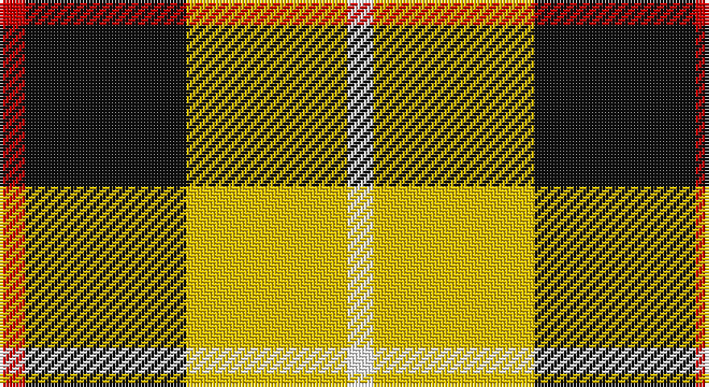

This page is one **sett** — a single exact thread-count. It belongs to the [tartan](/setts/r4k25ly25w4/)
(the same proportion at any scale), whose colour order is pattern [RKYW](/stripes/rkyw/).

Part of the [Bonhill Primary School](/tartans/bonhill-primary-school/) tartan — the named design grouping this sett with its other cloths.

Sourced from tartans-authority.  It is a [4 stripe tartan](/stripes/stripes4/).

Original link http://www.tartansauthority.com/tartan-ferret/display/11218/

## Register references

External register numbers recorded for this tartan.

- Scottish Register of Tartans: [11218](https://www.tartanregister.gov.uk/tartanDetails?ref=11218)
- Scottish Tartans Authority (ITI): 11218

## Thread count
R/8 K50 Y50 W/8

One full sett is **216 threads**.

## Palette

Palette: <strong>Tartan Register</strong>
<table><thead><tr><th>Colour</th><th>Threads</th><th>Shade</th><th>Base</th><th>OKLCh</th></tr></thead><tbody><tr><td>R/</td><td style="text-align:right;font-variant-numeric:tabular-nums">8</td><td><code style="background-color:#C80000;">#C80000</code> <small style="color:#888">#C80000</small></td><td>R <code style="background-color:#CC0000;">#CC0000</code></td><td><small style="color:#888">oklch(52.3% 0.215 29.2)</small></td></tr><tr><td>K</td><td style="text-align:right;font-variant-numeric:tabular-nums">50</td><td><code style="background-color:#101010;">#101010</code> <small style="color:#888">#101010</small></td><td>K <code style="background-color:#000000;">#000000</code></td><td><small style="color:#888">oklch(17.3% 0.000 89.9)</small></td></tr><tr><td>Y</td><td style="text-align:right;font-variant-numeric:tabular-nums">50</td><td><code style="background-color:#E8C000;">#E8C000</code> <small style="color:#888">#E8C000</small></td><td>Y <code style="background-color:#F2BF00;">#F2BF00</code></td><td><small style="color:#888">oklch(81.9% 0.168 93.7)</small></td></tr><tr><td>W/</td><td style="text-align:right;font-variant-numeric:tabular-nums">8</td><td><code style="background-color:#FCFCFC;">#FCFCFC</code> <small style="color:#888">#FCFCFC</small></td><td>W <code style="background-color:#F7F7F7;">#F7F7F7</code></td><td><small style="color:#888">oklch(99.1% 0.000 89.9)</small></td></tr></tbody></table>

# Sample pattern

## Compared to the master

This cloth is one sett of its design; the master sett (the exemplar the design is anchored on) is below for comparison.

<figure style="margin:0"><figcaption style="color:#888;font-size:smaller">this sett</figcaption></figure>
<figure style="margin:0"><figcaption style="color:#888;font-size:smaller"><a href="/setts/r4k25o25w4/">master sett →</a></figcaption></figure>

## Nearest tartans

The nearest existing variants by ΔTartan distance, with this tartan at the top so the swatches line up against it.

ΔTartan

Tartan

Sett

—

<a href="/ttd/edit/#slug=r4k25ly25w4~x2">Bonhill Primary School</a> <a class="nn-out" href="/variants/s4/r4k25ly25w4~x2/" title="open its dictionary page">↗</a>

1.19

<a href="/ttd/edit/#slug=w1ly6k6ly1~x8&amp;base=r4k25ly25w4~x2">Barclay Dress Clan Tartan</a> <a class="nn-out" href="/variants/s4/w1ly6k6ly1~x8/" title="open its dictionary page">↗</a>

1.24

<a href="/ttd/edit/#slug=w5ly32dt32ly5~x2&amp;base=r4k25ly25w4~x2">Barclay Dress</a> <a class="nn-out" href="/variants/s4/w5ly32dt32ly5~x2/" title="open its dictionary page">↗</a>

1.24

<a href="/ttd/edit/#slug=w2dg13o13w2~x6&amp;base=r4k25ly25w4~x2">Dunoon Irish</a> <a class="nn-out" href="/variants/s4/w2dg13o13w2~x6/" title="open its dictionary page">↗</a>

1.24

<a href="/ttd/edit/#slug=o22ly10w3k8~x2&amp;base=r4k25ly25w4~x2">Louisburg Canadian District Tartan</a> <a class="nn-out" href="/variants/s4/o22ly10w3k8~x2/" title="open its dictionary page">↗</a>

1.39

<a href="/ttd/edit/#slug=k3w3k3ly10r1~x6&amp;base=r4k25ly25w4~x2">Burberry (Genuine)</a> <a class="nn-out" href="/variants/s5/k3w3k3ly10r1~x6/" title="open its dictionary page">↗</a>

1.40

<a href="/ttd/edit/#slug=y26k10r10ly10y3~x2&amp;base=r4k25ly25w4~x2">Ikelman No 2</a> <a class="nn-out" href="/variants/s5/y26k10r10ly10y3~x2/" title="open its dictionary page">↗</a>

1.40

<a href="/ttd/edit/#slug=ly40b8k20g11~x2&amp;base=r4k25ly25w4~x2">Brun, Pierre Emmanuel (Personal)</a> <a class="nn-out" href="/variants/s4/ly40b8k20g11~x2/" title="open its dictionary page">↗</a>

1.42

<a href="/ttd/edit/#slug=k4ly1k4ly6r1~x4&amp;base=r4k25ly25w4~x2">MacLeod Dress Clan Tartan</a> <a class="nn-out" href="/variants/s5/k4ly1k4ly6r1~x4/" title="open its dictionary page">↗</a>

1.48

<a href="/ttd/edit/#slug=ly32k21r16lr6dt4~x2&amp;base=r4k25ly25w4~x2">Scottish American Athletic Assoc</a> <a class="nn-out" href="/variants/s5/ly32k21r16lr6dt4~x2/" title="open its dictionary page">↗</a>

1.49

<a href="/ttd/edit/#slug=k6w6k6lo21r2~x4&amp;base=r4k25ly25w4~x2">Burberry Check Corporate Tartan</a> <a class="nn-out" href="/variants/s5/k6w6k6lo21r2~x4/" title="open its dictionary page">↗</a>

## Neighbour map

Every grey dot is one of 14360 variants placed by the first two principal components of the ΔTartan feature space (44% of its variance). Red is this tartan; blue dots are its nearest — click one to open its page.

<svg viewBox="0 0 640 380" role="img" style="max-width:100%;height:auto;border:1px solid #e0e0e0;border-radius:4px;display:block" xmlns="http://www.w3.org/2000/svg"><image href="/nn/cloud.v1.png" width="640" height="380"/><a href="/variants/s4/w1ly6k6ly1~x8/"><circle cx="240.6" cy="245.8" r="4" fill="#3465a4"><title>Barclay Dress Clan Tartan</title></circle></a><a href="/variants/s4/w5ly32dt32ly5~x2/"><circle cx="248.2" cy="242.4" r="4" fill="#3465a4"><title>Barclay Dress</title></circle></a><a href="/variants/s4/w2dg13o13w2~x6/"><circle cx="232.6" cy="250.5" r="4" fill="#3465a4"><title>Dunoon Irish</title></circle></a><a href="/variants/s4/o22ly10w3k8~x2/"><circle cx="200.1" cy="228.9" r="4" fill="#3465a4"><title>Louisburg Canadian District Tartan</title></circle></a><a href="/variants/s5/k3w3k3ly10r1~x6/"><circle cx="222.6" cy="195.8" r="4" fill="#3465a4"><title>Burberry (Genuine)</title></circle></a><a href="/variants/s5/y26k10r10ly10y3~x2/"><circle cx="199.2" cy="216.5" r="4" fill="#3465a4"><title>Ikelman No 2</title></circle></a><a href="/variants/s4/ly40b8k20g11~x2/"><circle cx="167.1" cy="240.9" r="4" fill="#3465a4"><title>Brun, Pierre Emmanuel (Personal)</title></circle></a><a href="/variants/s5/k4ly1k4ly6r1~x4/"><circle cx="233.8" cy="251.7" r="4" fill="#3465a4"><title>MacLeod Dress Clan Tartan</title></circle></a><a href="/variants/s5/ly32k21r16lr6dt4~x2/"><circle cx="129.9" cy="197.9" r="4" fill="#3465a4"><title>Scottish American Athletic Assoc</title></circle></a><a href="/variants/s5/k6w6k6lo21r2~x4/"><circle cx="243.9" cy="198.7" r="4" fill="#3465a4"><title>Burberry Check Corporate Tartan</title></circle></a><circle cx="184.8" cy="225.6" r="5" fill="#c00000"/></svg>

ID: /variants/s4/r4k25ly25w4~x2/
