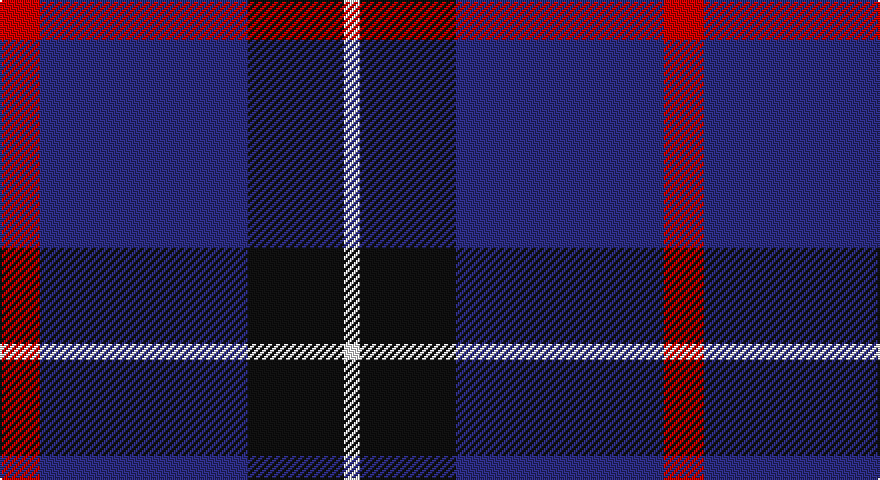

This page is one **sett** — a single exact thread-count. It belongs to the [tartan](/setts/r5db26k12w2/)
(the same proportion at any scale), whose colour order is pattern [RBKW](/stripes/rbkw/).

Sourced from tartans-authority.  It is a [4 stripe tartan](/stripes/stripes4/).

Original link http://www.tartansauthority.com/tartan-ferret/display/6218/

2 attestations — the source records this cloth was collapsed from (oldest owns this page)

<ul>
<li>pre 1999 — Mirror (Corporate) (tartans-authority, <a href="http://www.tartansauthority.com/tartan-ferret/display/6218/">record</a>)</li>
<li>01/05/2002 — Mirror (register-of-tartans, <a href="https://www.tartanregister.gov.uk/tartanDetails.aspx?ref=2963">record</a>)</li>
</ul>

## Register references

External register numbers recorded for this tartan.

- Scottish Register of Tartans: [2963](https://www.tartanregister.gov.uk/tartanDetails.aspx?ref=2963)
- Scottish Tartans Authority (ITI): 6218
- Scottish Tartans World Register: 2893

## Thread count
R/20 DB104 K48 W/8

One full sett is **332 threads**.

## Palette

Palette: <strong>Tartan Register</strong>
<table><thead><tr><th>Colour</th><th>Threads</th><th>Shade</th><th>Base</th><th>OKLCh</th></tr></thead><tbody><tr><td>R/</td><td style="text-align:right;font-variant-numeric:tabular-nums">20</td><td><code style="background-color:#C80000;">#C80000</code> <small style="color:#888">#C80000</small></td><td>R <code style="background-color:#CC0000;">#CC0000</code></td><td><small style="color:#888">oklch(52.3% 0.215 29.2)</small></td></tr><tr><td>DB</td><td style="text-align:right;font-variant-numeric:tabular-nums">104</td><td><code style="background-color:#2C2C80;">#2C2C80</code> <small style="color:#888">#2C2C80</small></td><td>B <code style="background-color:#2A418A;">#2A418A</code></td><td><small style="color:#888">oklch(35.0% 0.138 276.6)</small></td></tr><tr><td>K</td><td style="text-align:right;font-variant-numeric:tabular-nums">48</td><td><code style="background-color:#101010;">#101010</code> <small style="color:#888">#101010</small></td><td>K <code style="background-color:#000000;">#000000</code></td><td><small style="color:#888">oklch(17.3% 0.000 89.9)</small></td></tr><tr><td>W/</td><td style="text-align:right;font-variant-numeric:tabular-nums">8</td><td><code style="background-color:#FCFCFC;">#FCFCFC</code> <small style="color:#888">#FCFCFC</small></td><td>W <code style="background-color:#F7F7F7;">#F7F7F7</code></td><td><small style="color:#888">oklch(99.1% 0.000 89.9)</small></td></tr></tbody></table>

# Sample pattern

## Nearest tartans

The nearest existing variants by ΔTartan distance, with this tartan at the top so the swatches line up against it.

ΔTartan

Tartan

Sett

—

<a href="/ttd/edit/#slug=r5db26k12w2~x4">Mirror (Corporate)</a> <a class="nn-out" href="/variants/s4/r5db26k12w2~x4/" title="open its dictionary page">↗</a>

0.79

<a href="/ttd/edit/#slug=r1db9k4lb1~x4&amp;base=r5db26k12w2~x4">Scottish Nuclear (Corporate)</a> <a class="nn-out" href="/variants/s4/r1db9k4lb1~x4/" title="open its dictionary page">↗</a>

1.00

<a href="/ttd/edit/#slug=r4db32k15w2~x2&amp;base=r5db26k12w2~x4">Scottish Nuclear</a> <a class="nn-out" href="/variants/s4/r4db32k15w2~x2/" title="open its dictionary page">↗</a>

1.05

<a href="/ttd/edit/#slug=g20r7db40w2~x2&amp;base=r5db26k12w2~x4">McNiff, Kevin (Personal)</a> <a class="nn-out" href="/variants/s4/g20r7db40w2~x2/" title="open its dictionary page">↗</a>

1.15

<a href="/ttd/edit/#slug=r21db43dt86lb10&amp;base=r5db26k12w2~x4">Fong (Personal)</a> <a class="nn-out" href="/variants/s4/r21db43dt86lb10/" title="open its dictionary page">↗</a>

1.16

<a href="/ttd/edit/#slug=dg20r7db40w2~x2&amp;base=r5db26k12w2~x4">McNiff, Kevin (Personal)</a> <a class="nn-out" href="/variants/s4/dg20r7db40w2~x2/" title="open its dictionary page">↗</a>

1.25

<a href="/ttd/edit/#slug=r21dbi43db86w10&amp;base=r5db26k12w2~x4">Fong Wedding (Personal)</a> <a class="nn-out" href="/variants/s4/r21dbi43db86w10/" title="open its dictionary page">↗</a>

1.35

<a href="/ttd/edit/#slug=k15ly2k10db18w3~x2&amp;base=r5db26k12w2~x4">College of Radiographers Corporate Tartan</a> <a class="nn-out" href="/variants/s5/k15ly2k10db18w3~x2/" title="open its dictionary page">↗</a>

1.35

<a href="/ttd/edit/#slug=db14k3r3w1~x2&amp;base=r5db26k12w2~x4">Bacon, Blue</a> <a class="nn-out" href="/variants/s4/db14k3r3w1~x2/" title="open its dictionary page">↗</a>

1.36

<a href="/ttd/edit/#slug=o11dbi1o3db1dbi9r1~x4&amp;base=r5db26k12w2~x4">Dege, of Saville Row</a> <a class="nn-out" href="/variants/s6/o11dbi1o3db1dbi9r1~x4/" title="open its dictionary page">↗</a>

1.36

<a href="/ttd/edit/#slug=r1db12k5lo3db5lb1~x4&amp;base=r5db26k12w2~x4">Massachusetts (Unofficial)</a> <a class="nn-out" href="/variants/s6/r1db12k5lo3db5lb1~x4/" title="open its dictionary page">↗</a>

## Neighbour map

Every grey dot is one of 14360 variants placed by the first two principal components of the ΔTartan feature space (44% of its variance). Red is this tartan; blue dots are its nearest — click one to open its page.

<svg viewBox="0 0 640 380" role="img" style="max-width:100%;height:auto;border:1px solid #e0e0e0;border-radius:4px;display:block" xmlns="http://www.w3.org/2000/svg"><image href="/nn/cloud.v1.png" width="640" height="380"/><a href="/variants/s4/r1db9k4lb1~x4/"><circle cx="346.3" cy="244.6" r="4" fill="#3465a4"><title>Scottish Nuclear (Corporate)</title></circle></a><a href="/variants/s4/r4db32k15w2~x2/"><circle cx="345.8" cy="209.9" r="4" fill="#3465a4"><title>Scottish Nuclear</title></circle></a><a href="/variants/s4/g20r7db40w2~x2/"><circle cx="345.8" cy="212.4" r="4" fill="#3465a4"><title>McNiff, Kevin (Personal)</title></circle></a><a href="/variants/s4/r21db43dt86lb10/"><circle cx="291.7" cy="258.7" r="4" fill="#3465a4"><title>Fong (Personal)</title></circle></a><a href="/variants/s4/dg20r7db40w2~x2/"><circle cx="370.3" cy="222.1" r="4" fill="#3465a4"><title>McNiff, Kevin (Personal)</title></circle></a><a href="/variants/s4/r21dbi43db86w10/"><circle cx="259.0" cy="238.0" r="4" fill="#3465a4"><title>Fong Wedding (Personal)</title></circle></a><a href="/variants/s5/k15ly2k10db18w3~x2/"><circle cx="267.1" cy="245.9" r="4" fill="#3465a4"><title>College of Radiographers Corporate Tartan</title></circle></a><a href="/variants/s4/db14k3r3w1~x2/"><circle cx="412.0" cy="225.2" r="4" fill="#3465a4"><title>Bacon, Blue</title></circle></a><a href="/variants/s6/o11dbi1o3db1dbi9r1~x4/"><circle cx="328.7" cy="209.2" r="4" fill="#3465a4"><title>Dege, of Saville Row</title></circle></a><a href="/variants/s6/r1db12k5lo3db5lb1~x4/"><circle cx="324.0" cy="199.6" r="4" fill="#3465a4"><title>Massachusetts (Unofficial)</title></circle></a><circle cx="329.8" cy="227.5" r="5" fill="#c00000"/></svg>

ID: /variants/s4/r5db26k12w2~x4/
