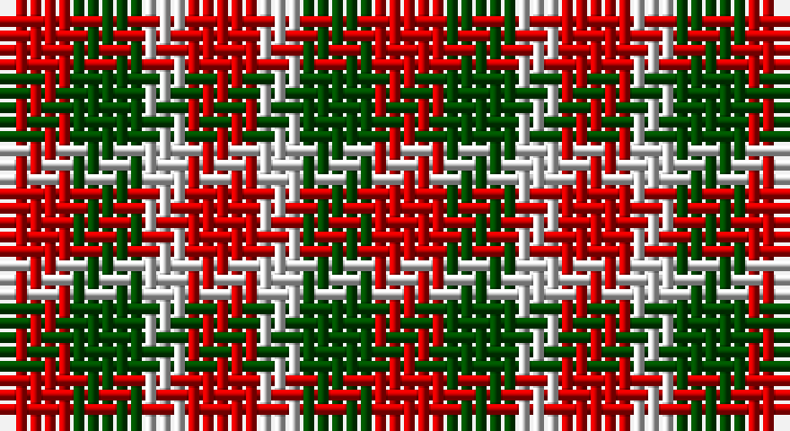

This page is one **sett** — a single exact thread-count. It belongs to the [tartan](/setts/r5dg5lb3r5/)
(the same proportion at any scale), whose colour order is pattern [RGWR](/stripes/rgwr/).

Part of the [Menzies](/tartans/menzies/) tartan — the named design grouping this sett with its other cloths.

Sourced from weddslist.  It is a [4 stripe tartan](/stripes/stripes4/).

Original link http://www.weddslist.com/cgi-bin/tartans/pg.pl?source=rb

## Also known as

This cloth is also recorded under:

- Menzies #3
- Menzies 1938
- Menzies B/W
- Menzies Green
- Menzies, Green

## Thread count
R/5 G5 N3 R/5

One full sett is **26 threads**.

## Palette

Palette: <strong>Tartan Register</strong> <small style="color:#888">(2 of 3 colours)</small>
<table><thead><tr><th>Colour</th><th>Threads</th><th>Shade</th><th>Base</th><th>OKLCh</th></tr></thead><tbody><tr><td>R/</td><td style="text-align:right;font-variant-numeric:tabular-nums">5</td><td><code style="background-color:#C80000;">#C80000</code> <small style="color:#888">#C80000</small></td><td>R <code style="background-color:#CC0000;">#CC0000</code></td><td><small style="color:#888">oklch(52.3% 0.215 29.2)</small></td></tr><tr><td>G</td><td style="text-align:right;font-variant-numeric:tabular-nums">5</td><td><code style="background-color:#004C00;">#004C00</code> <small style="color:#888">#004C00</small></td><td>G <code style="background-color:#006100;">#006100</code></td><td><small style="color:#888">oklch(36.1% 0.123 142.5)</small></td></tr><tr><td>N</td><td style="text-align:right;font-variant-numeric:tabular-nums">3</td><td><code style="background-color:#D0D0D0;">#D0D0D0</code> <small style="color:#888">#D0D0D0</small></td><td>W <code style="background-color:#F7F7F7;">#F7F7F7</code></td><td><small style="color:#888">oklch(85.8% 0.000 89.9)</small></td></tr><tr><td>R/</td><td style="text-align:right;font-variant-numeric:tabular-nums">5</td><td><code style="background-color:#C80000;">#C80000</code> <small style="color:#888">#C80000</small></td><td>R <code style="background-color:#CC0000;">#CC0000</code></td><td><small style="color:#888">oklch(52.3% 0.215 29.2)</small></td></tr></tbody></table>

# Sample pattern

## Compared to the master

This cloth is one sett of its design; the master sett (the exemplar the design is anchored on) is below for comparison.

<figure style="margin:0"><figcaption style="color:#888;font-size:smaller">this sett</figcaption></figure>
<figure style="margin:0"><figcaption style="color:#888;font-size:smaller"><a href="/setts/k19dg10k6dg10k12dg6k4dg14/">master sett →</a></figcaption></figure>

## Nearest tartans

The nearest existing variants by ΔTartan distance, with this tartan at the top so the swatches line up against it.

ΔTartan

Tartan

Sett

—

<a href="/ttd/edit/#slug=r5dg5lb3r5">Menzies</a> <a class="nn-out" href="/variants/s4/r5dg5lb3r5/" title="open its dictionary page">↗</a>

2.10

<a href="/ttd/edit/#slug=r3dg3r1db3r3~x12&amp;base=r5dg5lb3r5">Gow (Portrait)</a> <a class="nn-out" href="/variants/s5/r3dg3r1db3r3~x12/" title="open its dictionary page">↗</a>

2.18

<a href="/ttd/edit/#slug=r4db4r1g4r4~x6&amp;base=r5dg5lb3r5">MacGowan</a> <a class="nn-out" href="/variants/s5/r4db4r1g4r4~x6/" title="open its dictionary page">↗</a>

2.25

<a href="/ttd/edit/#slug=r4dg4r1db4r4~x2&amp;base=r5dg5lb3r5">Gow</a> <a class="nn-out" href="/variants/s5/r4dg4r1db4r4~x2/" title="open its dictionary page">↗</a>

2.36

<a href="/ttd/edit/#slug=r4dg4r1db4r4~x4&amp;base=r5dg5lb3r5">Gow</a> <a class="nn-out" href="/variants/s5/r4dg4r1db4r4~x4/" title="open its dictionary page">↗</a>

2.40

<a href="/ttd/edit/#slug=r4dg7t4~x2&amp;base=r5dg5lb3r5">Wilson's No.061</a> <a class="nn-out" href="/variants/s3/r4dg7t4~x2/" title="open its dictionary page">↗</a>

2.41

<a href="/ttd/edit/#slug=r2g2t1~x4&amp;base=r5dg5lb3r5">Wilson's, No 207</a> <a class="nn-out" href="/variants/s3/r2g2t1~x4/" title="open its dictionary page">↗</a>

2.49

<a href="/ttd/edit/#slug=r4k7g4~x2&amp;base=r5dg5lb3r5">Wilson's No.200</a> <a class="nn-out" href="/variants/s3/r4k7g4~x2/" title="open its dictionary page">↗</a>

2.50

<a href="/ttd/edit/#slug=g7k4r4~x2&amp;base=r5dg5lb3r5">Wilson's No.202</a> <a class="nn-out" href="/variants/s3/g7k4r4~x2/" title="open its dictionary page">↗</a>

2.52

<a href="/ttd/edit/#slug=g23r23w9r23g23w9~x2&amp;base=r5dg5lb3r5">Omani Regiment 2nd Pipe Sqn.</a> <a class="nn-out" href="/variants/s6/g23r23w9r23g23w9~x2/" title="open its dictionary page">↗</a>

2.52

<a href="/ttd/edit/#slug=g2r2g2t1~x4&amp;base=r5dg5lb3r5">Wilson's No.207</a> <a class="nn-out" href="/variants/s4/g2r2g2t1~x4/" title="open its dictionary page">↗</a>

## Neighbour map

Every grey dot is one of 14360 variants placed by the first two principal components of the ΔTartan feature space (44% of its variance). Red is this tartan; blue dots are its nearest — click one to open its page.

<svg viewBox="0 0 640 380" role="img" style="max-width:100%;height:auto;border:1px solid #e0e0e0;border-radius:4px;display:block" xmlns="http://www.w3.org/2000/svg"><image href="/nn/cloud.v1.png" width="640" height="380"/><a href="/variants/s5/r3dg3r1db3r3~x12/"><circle cx="240.4" cy="344.0" r="4" fill="#3465a4"><title>Gow (Portrait)</title></circle></a><a href="/variants/s5/r4db4r1g4r4~x6/"><circle cx="238.5" cy="317.3" r="4" fill="#3465a4"><title>MacGowan</title></circle></a><a href="/variants/s5/r4dg4r1db4r4~x2/"><circle cx="220.1" cy="311.1" r="4" fill="#3465a4"><title>Gow</title></circle></a><a href="/variants/s5/r4dg4r1db4r4~x4/"><circle cx="244.9" cy="321.8" r="4" fill="#3465a4"><title>Gow</title></circle></a><a href="/variants/s3/r4dg7t4~x2/"><circle cx="161.6" cy="366.0" r="4" fill="#3465a4"><title>Wilson's No.061</title></circle></a><a href="/variants/s3/r2g2t1~x4/"><circle cx="158.1" cy="366.0" r="4" fill="#3465a4"><title>Wilson's, No 207</title></circle></a><a href="/variants/s3/r4k7g4~x2/"><circle cx="158.9" cy="366.0" r="4" fill="#3465a4"><title>Wilson's No.200</title></circle></a><a href="/variants/s3/g7k4r4~x2/"><circle cx="159.8" cy="366.0" r="4" fill="#3465a4"><title>Wilson's No.202</title></circle></a><a href="/variants/s6/g23r23w9r23g23w9~x2/"><circle cx="136.7" cy="304.3" r="4" fill="#3465a4"><title>Omani Regiment 2nd Pipe Sqn.</title></circle></a><a href="/variants/s4/g2r2g2t1~x4/"><circle cx="226.6" cy="366.0" r="4" fill="#3465a4"><title>Wilson's No.207</title></circle></a><circle cx="177.4" cy="366.0" r="5" fill="#c00000"/></svg>

ID: /variants/s4/r5dg5lb3r5/
