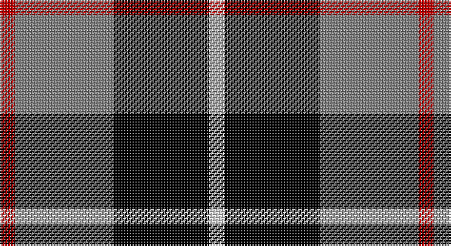

This page is one **sett** — a single exact thread-count. It belongs to the [tartan](/setts/r5y32k31w5/)
(the same proportion at any scale), whose colour order is pattern [RGKW](/stripes/rgkw/).

Part of the [Loganair Uniform Skirt](/tartans/loganair-uniform-skirt/) tartan — the named design grouping this sett with its other cloths.

Sourced from weddslist.  It is a [4 stripe tartan](/stripes/stripes4/).

Original link http://www.weddslist.com/cgi-bin/tartans/pg.pl?source=sts

## Also known as

This cloth is also recorded under:

- Loganair
- Loganair, Uniform Skirt

## Thread count
R/10 N64 K62 LN/10

One full sett is **272 threads**.

## Palette

Palette: <strong>Tartan Register</strong> <small style="color:#888">(3 of 4 colours)</small>
<table><thead><tr><th>Colour</th><th>Threads</th><th>Shade</th><th>Base</th><th>OKLCh</th></tr></thead><tbody><tr><td>R/</td><td style="text-align:right;font-variant-numeric:tabular-nums">10</td><td><code style="background-color:#C00000;">#C00000</code> <small style="color:#888">#C00000</small></td><td>R <code style="background-color:#CC0000;">#CC0000</code></td><td><small style="color:#888">oklch(50.7% 0.208 29.2)</small></td></tr><tr><td>N</td><td style="text-align:right;font-variant-numeric:tabular-nums">64</td><td><code style="background-color:#808080;">#808080</code> <small style="color:#888">#808080</small></td><td>G <code style="background-color:#006100;">#006100</code></td><td><small style="color:#888">oklch(60.0% 0.000 89.9)</small></td></tr><tr><td>K</td><td style="text-align:right;font-variant-numeric:tabular-nums">62</td><td><code style="background-color:#000000;">#000000</code> <small style="color:#888">#000000</small></td><td>K <code style="background-color:#000000;">#000000</code></td><td><small style="color:#888">oklch(0.0% 0.000 0.0)</small></td></tr><tr><td>LN/</td><td style="text-align:right;font-variant-numeric:tabular-nums">10</td><td><code style="background-color:#E0E0E0;">#E0E0E0</code> <small style="color:#888">#E0E0E0</small></td><td>W <code style="background-color:#F7F7F7;">#F7F7F7</code></td><td><small style="color:#888">oklch(90.7% 0.000 89.9)</small></td></tr></tbody></table>

# Sample pattern

## Compared to the master

This cloth is one sett of its design; the master sett (the exemplar the design is anchored on) is below for comparison.

<figure style="margin:0"><figcaption style="color:#888;font-size:smaller">this sett</figcaption></figure>
<figure style="margin:0"><figcaption style="color:#888;font-size:smaller"><a href="/setts/r5o32k31w5/">master sett →</a></figcaption></figure>

## Nearest tartans

The nearest existing variants by ΔTartan distance, with this tartan at the top so the swatches line up against it.

ΔTartan

Tartan

Sett

—

<a href="/ttd/edit/#slug=r5y32k31w5~x2">Loganair, Uniform Skirt</a> <a class="nn-out" href="/variants/s4/r5y32k31w5~x2/" title="open its dictionary page">↗</a>

0.49

<a href="/ttd/edit/#slug=r1k6y6b1~x10&amp;base=r5y32k31w5~x2">Mayer, Chris (Personal)</a> <a class="nn-out" href="/variants/s4/r1k6y6b1~x10/" title="open its dictionary page">↗</a>

0.87

<a href="/ttd/edit/#slug=r5o32k31w5~x2&amp;base=r5y32k31w5~x2">Loganair</a> <a class="nn-out" href="/variants/s4/r5o32k31w5~x2/" title="open its dictionary page">↗</a>

0.91

<a href="/ttd/edit/#slug=r5o32k31w5&amp;base=r5y32k31w5~x2">Loganair Uniform Skirt Corporate Tartan</a> <a class="nn-out" href="/variants/s4/r5o32k31w5/" title="open its dictionary page">↗</a>

1.00

<a href="/ttd/edit/#slug=r3o16k16lb3~x4&amp;base=r5y32k31w5~x2">Thompson, Dress (Clan)</a> <a class="nn-out" href="/variants/s4/r3o16k16lb3~x4/" title="open its dictionary page">↗</a>

1.05

<a href="/ttd/edit/#slug=k3lb3k3n10r1~x6&amp;base=r5y32k31w5~x2">Greystone (Burberry Grey)</a> <a class="nn-out" href="/variants/s5/k3lb3k3n10r1~x6/" title="open its dictionary page">↗</a>

1.12

<a href="/ttd/edit/#slug=r1dg6db6w1~x4&amp;base=r5y32k31w5~x2">Salt Spring Island</a> <a class="nn-out" href="/variants/s4/r1dg6db6w1~x4/" title="open its dictionary page">↗</a>

1.29

<a href="/ttd/edit/#slug=w23db6w6r5k35r10~x2&amp;base=r5y32k31w5~x2">Meg, Merrilees</a> <a class="nn-out" href="/variants/s6/w23db6w6r5k35r10~x2/" title="open its dictionary page">↗</a>

1.33

<a href="/ttd/edit/#slug=g14db2g2k8p9k2~x2&amp;base=r5y32k31w5~x2">MacArthur of Milton, hunting</a> <a class="nn-out" href="/variants/s6/g14db2g2k8p9k2~x2/" title="open its dictionary page">↗</a>

1.34

<a href="/ttd/edit/#slug=r12db3g5db16ly2g2~x2&amp;base=r5y32k31w5~x2">Dunbog Primary (School)</a> <a class="nn-out" href="/variants/s6/r12db3g5db16ly2g2~x2/" title="open its dictionary page">↗</a>

1.35

<a href="/ttd/edit/#slug=o5dp3o18k16ly3~x4&amp;base=r5y32k31w5~x2">New York State Police Pipe Band</a> <a class="nn-out" href="/variants/s5/o5dp3o18k16ly3~x4/" title="open its dictionary page">↗</a>

## Neighbour map

Every grey dot is one of 14360 variants placed by the first two principal components of the ΔTartan feature space (44% of its variance). Red is this tartan; blue dots are its nearest — click one to open its page.

<svg viewBox="0 0 640 380" role="img" style="max-width:100%;height:auto;border:1px solid #e0e0e0;border-radius:4px;display:block" xmlns="http://www.w3.org/2000/svg"><image href="/nn/cloud.v1.png" width="640" height="380"/><a href="/variants/s4/r1k6y6b1~x10/"><circle cx="191.3" cy="245.4" r="4" fill="#3465a4"><title>Mayer, Chris (Personal)</title></circle></a><a href="/variants/s4/r5o32k31w5~x2/"><circle cx="209.7" cy="242.3" r="4" fill="#3465a4"><title>Loganair</title></circle></a><a href="/variants/s4/r5o32k31w5/"><circle cx="208.7" cy="240.7" r="4" fill="#3465a4"><title>Loganair Uniform Skirt Corporate Tartan</title></circle></a><a href="/variants/s4/r3o16k16lb3~x4/"><circle cx="192.2" cy="254.4" r="4" fill="#3465a4"><title>Thompson, Dress (Clan)</title></circle></a><a href="/variants/s5/k3lb3k3n10r1~x6/"><circle cx="230.4" cy="210.3" r="4" fill="#3465a4"><title>Greystone (Burberry Grey)</title></circle></a><a href="/variants/s4/r1dg6db6w1~x4/"><circle cx="199.5" cy="255.8" r="4" fill="#3465a4"><title>Salt Spring Island</title></circle></a><a href="/variants/s6/w23db6w6r5k35r10~x2/"><circle cx="158.2" cy="200.5" r="4" fill="#3465a4"><title>Meg, Merrilees</title></circle></a><a href="/variants/s6/g14db2g2k8p9k2~x2/"><circle cx="177.6" cy="225.8" r="4" fill="#3465a4"><title>MacArthur of Milton, hunting</title></circle></a><a href="/variants/s6/r12db3g5db16ly2g2~x2/"><circle cx="223.3" cy="210.7" r="4" fill="#3465a4"><title>Dunbog Primary (School)</title></circle></a><a href="/variants/s5/o5dp3o18k16ly3~x4/"><circle cx="234.9" cy="235.1" r="4" fill="#3465a4"><title>New York State Police Pipe Band</title></circle></a><circle cx="196.8" cy="239.0" r="5" fill="#c00000"/></svg>

ID: /variants/s4/r5y32k31w5~x2/
