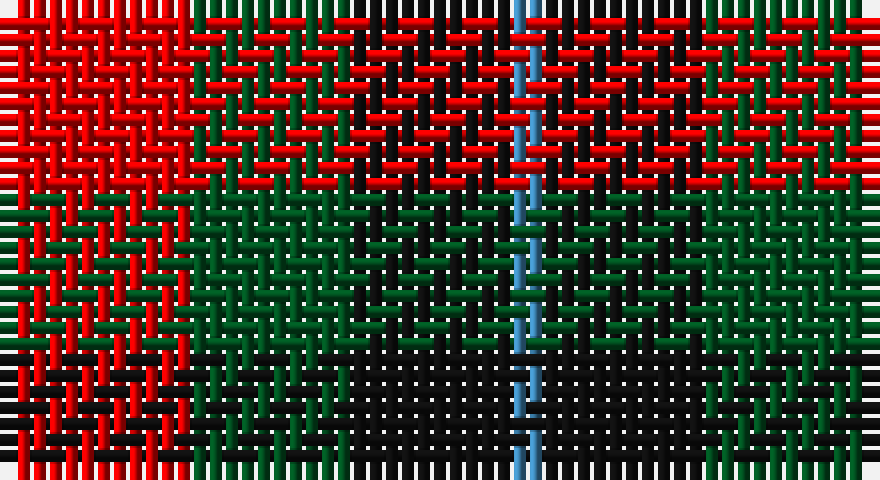

This page is one **sett** — a single exact thread-count. It belongs to the [tartan](/setts/r6dg5k5t1/)
(the same proportion at any scale), whose colour order is pattern [BKGR](/stripes/bkgr/).

Sourced from register-of-tartans.  It is a [4 stripe tartan](/stripes/stripes4/).

Original link https://www.tartanregister.gov.uk/tartanDetails.aspx?ref=4319

## Register references

External register numbers recorded for this tartan.

- Scottish Register of Tartans: [4319](https://www.tartanregister.gov.uk/tartanDetails.aspx?ref=4319)
- Scottish Tartans World Register: 1982

## Thread count
R/12 G10 K10 B/2

One full sett is **54 threads**.

## Palette

Palette: <strong>Tartan Register</strong>
<table><thead><tr><th>Colour</th><th>Threads</th><th>Shade</th><th>Base</th><th>OKLCh</th></tr></thead><tbody><tr><td>R/</td><td style="text-align:right;font-variant-numeric:tabular-nums">12</td><td><code style="background-color:#DC0000;">#DC0000</code> <small style="color:#888">#DC0000</small></td><td>R <code style="background-color:#CC0000;">#CC0000</code></td><td><small style="color:#888">oklch(56.2% 0.230 29.2)</small></td></tr><tr><td>G</td><td style="text-align:right;font-variant-numeric:tabular-nums">10</td><td><code style="background-color:#005020;">#005020</code> <small style="color:#888">#005020</small></td><td>G <code style="background-color:#006100;">#006100</code></td><td><small style="color:#888">oklch(37.7% 0.105 149.6)</small></td></tr><tr><td>K</td><td style="text-align:right;font-variant-numeric:tabular-nums">10</td><td><code style="background-color:#101010;">#101010</code> <small style="color:#888">#101010</small></td><td>K <code style="background-color:#000000;">#000000</code></td><td><small style="color:#888">oklch(17.3% 0.000 89.9)</small></td></tr><tr><td>B/</td><td style="text-align:right;font-variant-numeric:tabular-nums">2</td><td><code style="background-color:#3C82AF;">#3C82AF</code> <small style="color:#888">#3C82AF</small></td><td>B <code style="background-color:#2A418A;">#2A418A</code></td><td><small style="color:#888">oklch(58.1% 0.099 239.8)</small></td></tr></tbody></table>

# Sample pattern

## Nearest tartans

The nearest existing variants by ΔTartan distance, with this tartan at the top so the swatches line up against it.

ΔTartan

Tartan

Sett

—

<a href="/ttd/edit/#slug=r6dg5k5t1~x2">Unidentified No 28</a> <a class="nn-out" href="/variants/s4/r6dg5k5t1~x2/" title="open its dictionary page">↗</a>

0.63

<a href="/ttd/edit/#slug=r9g9k10t2~x2&amp;base=r6dg5k5t1~x2">Wilson's No.196</a> <a class="nn-out" href="/variants/s4/r9g9k10t2~x2/" title="open its dictionary page">↗</a>

0.96

<a href="/ttd/edit/#slug=dt6k6dt6r14ly3~x2&amp;base=r6dg5k5t1~x2">Chivas Regal</a> <a class="nn-out" href="/variants/s5/dt6k6dt6r14ly3~x2/" title="open its dictionary page">↗</a>

1.01

<a href="/ttd/edit/#slug=r6g5k5t1~x2&amp;base=r6dg5k5t1~x2">Unnamed, No 28</a> <a class="nn-out" href="/variants/s4/r6g5k5t1~x2/" title="open its dictionary page">↗</a>

1.07

<a href="/ttd/edit/#slug=dt2k2dt2r5ly1~x12&amp;base=r6dg5k5t1~x2">Chivas Regal (Corporate)</a> <a class="nn-out" href="/variants/s5/dt2k2dt2r5ly1~x12/" title="open its dictionary page">↗</a>

1.22

<a href="/ttd/edit/#slug=db9r12dg9db5w2~x4&amp;base=r6dg5k5t1~x2">Battle of Prestonpans (1745) Herit</a> <a class="nn-out" href="/variants/s5/db9r12dg9db5w2~x4/" title="open its dictionary page">↗</a>

1.25

<a href="/ttd/edit/#slug=dp8k11g9r2~x2&amp;base=r6dg5k5t1~x2">Norwich Collection No. 60</a> <a class="nn-out" href="/variants/s4/dp8k11g9r2~x2/" title="open its dictionary page">↗</a>

1.34

<a href="/ttd/edit/#slug=r13dt13o5lo2dt13lo13~x2&amp;base=r6dg5k5t1~x2">Torana</a> <a class="nn-out" href="/variants/s6/r13dt13o5lo2dt13lo13~x2/" title="open its dictionary page">↗</a>

1.38

<a href="/ttd/edit/#slug=r6g5k5g5r6t1~x4&amp;base=r6dg5k5t1~x2">Norwich No.028</a> <a class="nn-out" href="/variants/s6/r6g5k5g5r6t1~x4/" title="open its dictionary page">↗</a>

1.38

<a href="/ttd/edit/#slug=dp5k5g5w1~x4&amp;base=r6dg5k5t1~x2">Wilson's No.220</a> <a class="nn-out" href="/variants/s4/dp5k5g5w1~x4/" title="open its dictionary page">↗</a>

1.40

<a href="/ttd/edit/#slug=p6k5g5r1~x2&amp;base=r6dg5k5t1~x2">Unnamed, No 60</a> <a class="nn-out" href="/variants/s4/p6k5g5r1~x2/" title="open its dictionary page">↗</a>

## Neighbour map

Every grey dot is one of 14360 variants placed by the first two principal components of the ΔTartan feature space (44% of its variance). Red is this tartan; blue dots are its nearest — click one to open its page.

<svg viewBox="0 0 640 380" role="img" style="max-width:100%;height:auto;border:1px solid #e0e0e0;border-radius:4px;display:block" xmlns="http://www.w3.org/2000/svg"><image href="/nn/cloud.v1.png" width="640" height="380"/><a href="/variants/s4/r9g9k10t2~x2/"><circle cx="124.3" cy="292.4" r="4" fill="#3465a4"><title>Wilson's No.196</title></circle></a><a href="/variants/s5/dt6k6dt6r14ly3~x2/"><circle cx="160.5" cy="269.8" r="4" fill="#3465a4"><title>Chivas Regal</title></circle></a><a href="/variants/s4/r6g5k5t1~x2/"><circle cx="118.2" cy="270.2" r="4" fill="#3465a4"><title>Unnamed, No 28</title></circle></a><a href="/variants/s5/dt2k2dt2r5ly1~x12/"><circle cx="175.6" cy="262.7" r="4" fill="#3465a4"><title>Chivas Regal (Corporate)</title></circle></a><a href="/variants/s5/db9r12dg9db5w2~x4/"><circle cx="150.2" cy="264.3" r="4" fill="#3465a4"><title>Battle of Prestonpans (1745) Herit</title></circle></a><a href="/variants/s4/dp8k11g9r2~x2/"><circle cx="157.2" cy="297.7" r="4" fill="#3465a4"><title>Norwich Collection No. 60</title></circle></a><a href="/variants/s6/r13dt13o5lo2dt13lo13~x2/"><circle cx="162.9" cy="246.7" r="4" fill="#3465a4"><title>Torana</title></circle></a><a href="/variants/s6/r6g5k5g5r6t1~x4/"><circle cx="149.7" cy="267.7" r="4" fill="#3465a4"><title>Norwich No.028</title></circle></a><a href="/variants/s4/dp5k5g5w1~x4/"><circle cx="112.4" cy="293.0" r="4" fill="#3465a4"><title>Wilson's No.220</title></circle></a><a href="/variants/s4/p6k5g5r1~x2/"><circle cx="121.5" cy="275.2" r="4" fill="#3465a4"><title>Unnamed, No 60</title></circle></a><circle cx="144.1" cy="278.8" r="5" fill="#c00000"/></svg>

ID: /variants/s4/r6dg5k5t1~x2/
