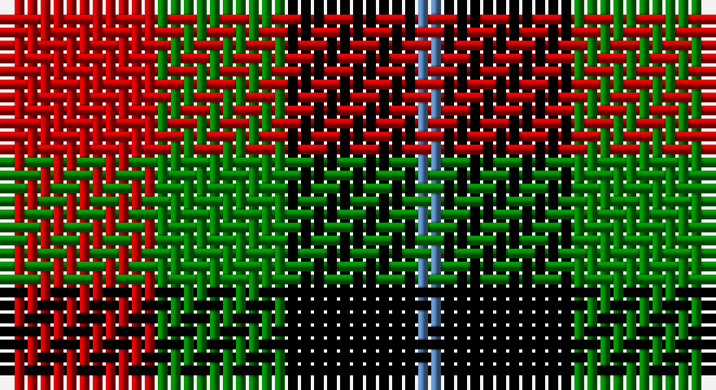

This page is one **sett** — a single exact thread-count. It belongs to the [tartan](/setts/r6g5k5t1/)
(the same proportion at any scale), whose colour order is pattern [BKGR](/stripes/bkgr/).

Sourced from weddslist.  It is a [4 stripe tartan](/stripes/stripes4/).

Original link http://www.weddslist.com/cgi-bin/tartans/pg.pl?source=sts

## Thread count
R/12 G10 K10 B/2

One full sett is **54 threads**.

## Palette

Palette: <strong>Ingles Buchan</strong> <small style="color:#888">(1 of 4 colours)</small>
<table><thead><tr><th>Colour</th><th>Threads</th><th>Shade</th><th>Base</th><th>OKLCh</th></tr></thead><tbody><tr><td>R/</td><td style="text-align:right;font-variant-numeric:tabular-nums">12</td><td><code style="background-color:#C00000;">#C00000</code> <small style="color:#888">#C00000</small></td><td>R <code style="background-color:#CC0000;">#CC0000</code></td><td><small style="color:#888">oklch(50.7% 0.208 29.2)</small></td></tr><tr><td>G</td><td style="text-align:right;font-variant-numeric:tabular-nums">10</td><td><code style="background-color:#008000;">#008000</code> <small style="color:#888">#008000</small></td><td>G <code style="background-color:#006100;">#006100</code></td><td><small style="color:#888">oklch(52.0% 0.177 142.5)</small></td></tr><tr><td>K</td><td style="text-align:right;font-variant-numeric:tabular-nums">10</td><td><code style="background-color:#000000;">#000000</code> <small style="color:#888">#000000</small></td><td>K <code style="background-color:#000000;">#000000</code></td><td><small style="color:#888">oklch(0.0% 0.000 0.0)</small></td></tr><tr><td>B/</td><td style="text-align:right;font-variant-numeric:tabular-nums">2</td><td><code style="background-color:#5480B0;">#5480B0</code> <small style="color:#888">#5480B0</small></td><td>B <code style="background-color:#2A418A;">#2A418A</code></td><td><small style="color:#888">oklch(58.8% 0.089 251.5)</small></td></tr></tbody></table>

# Sample pattern

## Nearest tartans

The nearest existing variants by ΔTartan distance, with this tartan at the top so the swatches line up against it.

ΔTartan

Tartan

Sett

—

<a href="/ttd/edit/#slug=r6g5k5t1~x2">Unnamed, No 28</a> <a class="nn-out" href="/variants/s4/r6g5k5t1~x2/" title="open its dictionary page">↗</a>

0.99

<a href="/ttd/edit/#slug=lo9g9k10t2~x2&amp;base=r6g5k5t1~x2">Wilson's, No 196</a> <a class="nn-out" href="/variants/s4/lo9g9k10t2~x2/" title="open its dictionary page">↗</a>

1.01

<a href="/ttd/edit/#slug=r6dg5k5t1~x2&amp;base=r6g5k5t1~x2">Unidentified No 28</a> <a class="nn-out" href="/variants/s4/r6dg5k5t1~x2/" title="open its dictionary page">↗</a>

1.03

<a href="/ttd/edit/#slug=r9g9k10t2~x2&amp;base=r6g5k5t1~x2">Wilson's No.196</a> <a class="nn-out" href="/variants/s4/r9g9k10t2~x2/" title="open its dictionary page">↗</a>

1.16

<a href="/ttd/edit/#slug=k18g18dr21r4~x2&amp;base=r6g5k5t1~x2">Tennant</a> <a class="nn-out" href="/variants/s4/k18g18dr21r4~x2/" title="open its dictionary page">↗</a>

1.20

<a href="/ttd/edit/#slug=p8k11g9r2~x2&amp;base=r6g5k5t1~x2">Wilson's, No 159</a> <a class="nn-out" href="/variants/s4/p8k11g9r2~x2/" title="open its dictionary page">↗</a>

1.30

<a href="/ttd/edit/#slug=p6k5g5r1~x2&amp;base=r6g5k5t1~x2">Unnamed, No 60</a> <a class="nn-out" href="/variants/s4/p6k5g5r1~x2/" title="open its dictionary page">↗</a>

1.32

<a href="/ttd/edit/#slug=p8k11g9w2~x2&amp;base=r6g5k5t1~x2">Wilson's, No 220</a> <a class="nn-out" href="/variants/s4/p8k11g9w2~x2/" title="open its dictionary page">↗</a>

1.36

<a href="/ttd/edit/#slug=r6g5k5g5r6t1~x4&amp;base=r6g5k5t1~x2">Norwich No.028</a> <a class="nn-out" href="/variants/s6/r6g5k5g5r6t1~x4/" title="open its dictionary page">↗</a>

1.46

<a href="/ttd/edit/#slug=dg7dr7w7r1~x6&amp;base=r6g5k5t1~x2">MacKinnon Dress Hunting (Fashion)</a> <a class="nn-out" href="/variants/s4/dg7dr7w7r1~x6/" title="open its dictionary page">↗</a>

1.48

<a href="/ttd/edit/#slug=y6r1k6r1g6~x6&amp;base=r6g5k5t1~x2">Timespan, (MacKay)</a> <a class="nn-out" href="/variants/s5/y6r1k6r1g6~x6/" title="open its dictionary page">↗</a>

## Neighbour map

Every grey dot is one of 14360 variants placed by the first two principal components of the ΔTartan feature space (44% of its variance). Red is this tartan; blue dots are its nearest — click one to open its page.

<svg viewBox="0 0 640 380" role="img" style="max-width:100%;height:auto;border:1px solid #e0e0e0;border-radius:4px;display:block" xmlns="http://www.w3.org/2000/svg"><image href="/nn/cloud.v1.png" width="640" height="380"/><a href="/variants/s4/lo9g9k10t2~x2/"><circle cx="83.5" cy="275.6" r="4" fill="#3465a4"><title>Wilson's, No 196</title></circle></a><a href="/variants/s4/r6dg5k5t1~x2/"><circle cx="144.1" cy="278.8" r="4" fill="#3465a4"><title>Unidentified No 28</title></circle></a><a href="/variants/s4/r9g9k10t2~x2/"><circle cx="124.3" cy="292.4" r="4" fill="#3465a4"><title>Wilson's No.196</title></circle></a><a href="/variants/s4/k18g18dr21r4~x2/"><circle cx="121.2" cy="294.6" r="4" fill="#3465a4"><title>Tennant</title></circle></a><a href="/variants/s4/p8k11g9r2~x2/"><circle cx="119.1" cy="280.8" r="4" fill="#3465a4"><title>Wilson's, No 159</title></circle></a><a href="/variants/s4/p6k5g5r1~x2/"><circle cx="121.5" cy="275.2" r="4" fill="#3465a4"><title>Unnamed, No 60</title></circle></a><a href="/variants/s4/p8k11g9w2~x2/"><circle cx="109.5" cy="277.7" r="4" fill="#3465a4"><title>Wilson's, No 220</title></circle></a><a href="/variants/s6/r6g5k5g5r6t1~x4/"><circle cx="149.7" cy="267.7" r="4" fill="#3465a4"><title>Norwich No.028</title></circle></a><a href="/variants/s4/dg7dr7w7r1~x6/"><circle cx="107.0" cy="253.9" r="4" fill="#3465a4"><title>MacKinnon Dress Hunting (Fashion)</title></circle></a><a href="/variants/s5/y6r1k6r1g6~x6/"><circle cx="101.5" cy="246.4" r="4" fill="#3465a4"><title>Timespan, (MacKay)</title></circle></a><circle cx="118.2" cy="270.2" r="5" fill="#c00000"/></svg>

ID: /variants/s4/r6g5k5t1~x2/
