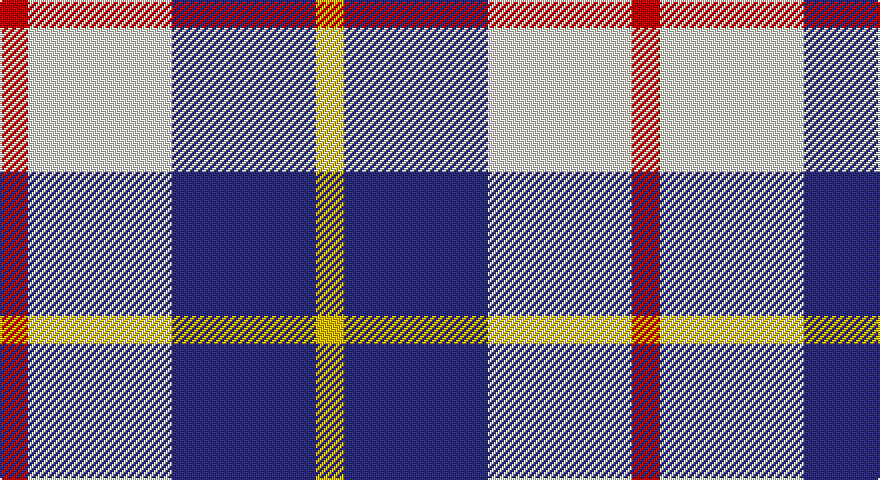

This page is one **sett** — a single exact thread-count. It belongs to the [tartan](/setts/r7w36db36ly7/)
(the same proportion at any scale), whose colour order is pattern [RWBY](/stripes/rwby/).

Part of the [MacRae of Conchra](/tartans/macrae-of-conchra/) tartan — the named design grouping this sett with its other cloths.

Sourced from register-of-tartans.  It is a [4 stripe tartan](/stripes/stripes4/).

Original link https://www.tartanregister.gov.uk/tartanDetails.aspx?ref=2750

## Also known as

This cloth is also recorded under:

- MacRae of Conchra #2
- MacRae of Conchra #3

2 attestations — the source records this cloth was collapsed from (oldest owns this page)

<ul>
<li>01/01/1893 — MacRae of Conchra #3 (register-of-tartans, <a href="https://www.tartanregister.gov.uk/tartanDetails.aspx?ref=2750">record</a>)</li>
<li>1893 — MacRae of Conchra - 1893 (Clan) (tartans-authority, <a href="http://www.tartansauthority.com/tartan-ferret/display/1683/">record</a>)</li>
</ul>

## Register references

External register numbers recorded for this tartan.

- Scottish Register of Tartans: [2750](https://www.tartanregister.gov.uk/tartanDetails.aspx?ref=2750)
- Scottish Tartans Authority (ITI): 1683
- Scottish Tartans World Register: 1683

## Thread count
R/14 LY72 DB72 Y/14

One full sett is **316 threads**.

## Palette

Palette: <strong>Tartan Register</strong> <small style="color:#888">(3 of 4 colours)</small>
<table><thead><tr><th>Colour</th><th>Threads</th><th>Shade</th><th>Base</th><th>OKLCh</th></tr></thead><tbody><tr><td>R/</td><td style="text-align:right;font-variant-numeric:tabular-nums">14</td><td><code style="background-color:#C80000;">#C80000</code> <small style="color:#888">#C80000</small></td><td>R <code style="background-color:#CC0000;">#CC0000</code></td><td><small style="color:#888">oklch(52.3% 0.215 29.2)</small></td></tr><tr><td>LY</td><td style="text-align:right;font-variant-numeric:tabular-nums">72</td><td><code style="background-color:#F0F0D8;">#F0F0D8</code> <small style="color:#888">#F0F0D8</small></td><td>W <code style="background-color:#F7F7F7;">#F7F7F7</code></td><td><small style="color:#888">oklch(94.9% 0.032 107.0)</small></td></tr><tr><td>DB</td><td style="text-align:right;font-variant-numeric:tabular-nums">72</td><td><code style="background-color:#2C2C80;">#2C2C80</code> <small style="color:#888">#2C2C80</small></td><td>B <code style="background-color:#2A418A;">#2A418A</code></td><td><small style="color:#888">oklch(35.0% 0.138 276.6)</small></td></tr><tr><td>Y/</td><td style="text-align:right;font-variant-numeric:tabular-nums">14</td><td><code style="background-color:#E8C000;">#E8C000</code> <small style="color:#888">#E8C000</small></td><td>Y <code style="background-color:#F2BF00;">#F2BF00</code></td><td><small style="color:#888">oklch(81.9% 0.168 93.7)</small></td></tr></tbody></table>

# Sample pattern

## Compared to the master

This cloth is one sett of its design; the master sett (the exemplar the design is anchored on) is below for comparison.

<figure style="margin:0"><figcaption style="color:#888;font-size:smaller">this sett</figcaption></figure>
<figure style="margin:0"><figcaption style="color:#888;font-size:smaller"><a href="/setts/k5w37r37w5/">master sett →</a></figcaption></figure>

## Nearest tartans

The nearest existing variants by ΔTartan distance, with this tartan at the top so the swatches line up against it.

ΔTartan

Tartan

Sett

—

<a href="/ttd/edit/#slug=r7w36db36ly7~x2">MacRae of Conchra #3</a> <a class="nn-out" href="/variants/s4/r7w36db36ly7~x2/" title="open its dictionary page">↗</a>

0.65

<a href="/variants/s4/k5w24n24ki5~x2/">City of London</a>

0.68

<a href="/ttd/edit/#slug=k5n24w24r5~x2&amp;base=r7w36db36ly7~x2">City of London (Corporate)</a> <a class="nn-out" href="/variants/s4/k5n24w24r5~x2/" title="open its dictionary page">↗</a>

0.95

<a href="/ttd/edit/#slug=b8w13r3w2k5~x2&amp;base=r7w36db36ly7~x2">Boswell Dress (Personal)</a> <a class="nn-out" href="/variants/s5/b8w13r3w2k5~x2/" title="open its dictionary page">↗</a>

1.08

<a href="/ttd/edit/#slug=r1w8dt8ly1~x4&amp;base=r7w36db36ly7~x2">MacRae of Conchra</a> <a class="nn-out" href="/variants/s4/r1w8dt8ly1~x4/" title="open its dictionary page">↗</a>

1.40

<a href="/ttd/edit/#slug=o22ly10w3db8~x2&amp;base=r7w36db36ly7~x2">Louisburg</a> <a class="nn-out" href="/variants/s4/o22ly10w3db8~x2/" title="open its dictionary page">↗</a>

1.44

<a href="/ttd/edit/#slug=k23b6k6r5w35r10~x2&amp;base=r7w36db36ly7~x2">Merrilees Dress (Dance)</a> <a class="nn-out" href="/variants/s6/k23b6k6r5w35r10~x2/" title="open its dictionary page">↗</a>

1.49

<a href="/ttd/edit/#slug=db3w25k25r3~x2&amp;base=r7w36db36ly7~x2">Gleneckley</a> <a class="nn-out" href="/variants/s4/db3w25k25r3~x2/" title="open its dictionary page">↗</a>

1.51

<a href="/ttd/edit/#slug=db10w3db12ly14r4~x2&amp;base=r7w36db36ly7~x2">MacLeod, of Argentina</a> <a class="nn-out" href="/variants/s5/db10w3db12ly14r4~x2/" title="open its dictionary page">↗</a>

1.57

<a href="/ttd/edit/#slug=r2w6db2w9db9w2db6ly2~x2&amp;base=r7w36db36ly7~x2">North Vancouver, Island</a> <a class="nn-out" href="/variants/s8/r2w6db2w9db9w2db6ly2~x2/" title="open its dictionary page">↗</a>

1.57

<a href="/ttd/edit/#slug=k1w8db8r1~x8&amp;base=r7w36db36ly7~x2">MacRae Dress Purple</a> <a class="nn-out" href="/variants/s4/k1w8db8r1~x8/" title="open its dictionary page">↗</a>

## Neighbour map

Every grey dot is one of 14360 variants placed by the first two principal components of the ΔTartan feature space (44% of its variance). Red is this tartan; blue dots are its nearest — click one to open its page.

<svg viewBox="0 0 640 380" role="img" style="max-width:100%;height:auto;border:1px solid #e0e0e0;border-radius:4px;display:block" xmlns="http://www.w3.org/2000/svg"><image href="/nn/cloud.v1.png" width="640" height="380"/><a href="/variants/s4/k5w24n24ki5~x2/"><circle cx="146.1" cy="237.9" r="4" fill="#3465a4"><title>City of London</title></circle></a><a href="/variants/s4/k5n24w24r5~x2/"><circle cx="154.9" cy="237.3" r="4" fill="#3465a4"><title>City of London (Corporate)</title></circle></a><a href="/variants/s5/b8w13r3w2k5~x2/"><circle cx="164.3" cy="214.5" r="4" fill="#3465a4"><title>Boswell Dress (Personal)</title></circle></a><a href="/variants/s4/r1w8dt8ly1~x4/"><circle cx="207.3" cy="213.6" r="4" fill="#3465a4"><title>MacRae of Conchra</title></circle></a><a href="/variants/s4/o22ly10w3db8~x2/"><circle cx="218.7" cy="236.7" r="4" fill="#3465a4"><title>Louisburg</title></circle></a><a href="/variants/s6/k23b6k6r5w35r10~x2/"><circle cx="153.6" cy="191.5" r="4" fill="#3465a4"><title>Merrilees Dress (Dance)</title></circle></a><a href="/variants/s4/db3w25k25r3~x2/"><circle cx="211.2" cy="212.6" r="4" fill="#3465a4"><title>Gleneckley</title></circle></a><a href="/variants/s5/db10w3db12ly14r4~x2/"><circle cx="186.2" cy="256.5" r="4" fill="#3465a4"><title>MacLeod, of Argentina</title></circle></a><a href="/variants/s8/r2w6db2w9db9w2db6ly2~x2/"><circle cx="169.0" cy="222.5" r="4" fill="#3465a4"><title>North Vancouver, Island</title></circle></a><a href="/variants/s4/k1w8db8r1~x8/"><circle cx="212.0" cy="213.0" r="4" fill="#3465a4"><title>MacRae Dress Purple</title></circle></a><circle cx="160.8" cy="234.0" r="5" fill="#c00000"/></svg>

ID: /variants/s4/r7w36db36ly7~x2/
