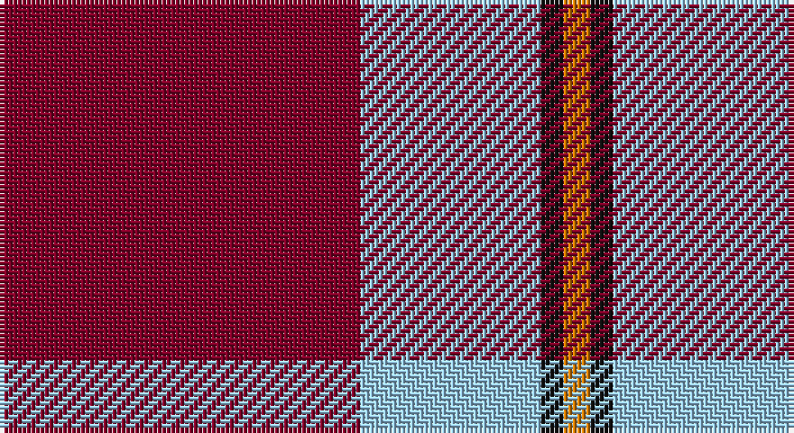

This page is one **sett** — a single exact thread-count. It belongs to the [tartan](/setts/r80lb40k5lo6/)
(the same proportion at any scale), whose colour order is pattern [RWKY](/stripes/rwky/).

Sourced from register-of-tartans.  It is a [4 stripe tartan](/stripes/stripes4/).

Original link https://www.tartanregister.gov.uk/tartanDetails.aspx?ref=10979

## Register references

External register numbers recorded for this tartan.

- Scottish Register of Tartans: [10979](https://www.tartanregister.gov.uk/tartanDetails.aspx?ref=10979)

## Thread count
DR/80 LB40 K5 O/6

One full sett is **176 threads**.

## Palette

Palette: <strong>Tartan Register</strong>
<table><thead><tr><th>Colour</th><th>Threads</th><th>Shade</th><th>Base</th><th>OKLCh</th></tr></thead><tbody><tr><td>DR/</td><td style="text-align:right;font-variant-numeric:tabular-nums">80</td><td><code style="background-color:#800028;">#800028</code> <small style="color:#888">#800028</small></td><td>R <code style="background-color:#CC0000;">#CC0000</code></td><td><small style="color:#888">oklch(38.2% 0.152 14.5)</small></td></tr><tr><td>LB</td><td style="text-align:right;font-variant-numeric:tabular-nums">40</td><td><code style="background-color:#98C8E8;">#98C8E8</code> <small style="color:#888">#98C8E8</small></td><td>W <code style="background-color:#F7F7F7;">#F7F7F7</code></td><td><small style="color:#888">oklch(81.0% 0.068 237.9)</small></td></tr><tr><td>K</td><td style="text-align:right;font-variant-numeric:tabular-nums">5</td><td><code style="background-color:#101010;">#101010</code> <small style="color:#888">#101010</small></td><td>K <code style="background-color:#000000;">#000000</code></td><td><small style="color:#888">oklch(17.3% 0.000 89.9)</small></td></tr><tr><td>O/</td><td style="text-align:right;font-variant-numeric:tabular-nums">6</td><td><code style="background-color:#D87C00;">#D87C00</code> <small style="color:#888">#D87C00</small></td><td>Y <code style="background-color:#F2BF00;">#F2BF00</code></td><td><small style="color:#888">oklch(67.3% 0.155 61.8)</small></td></tr></tbody></table>

# Sample pattern

## Nearest tartans

The nearest existing variants by ΔTartan distance, with this tartan at the top so the swatches line up against it.

ΔTartan

Tartan

Sett

—

<a href="/ttd/edit/#slug=r80lb40k5lo6">Broberg (Scania) (Personal)</a> <a class="nn-out" href="/variants/s4/r80lb40k5lo6/" title="open its dictionary page">↗</a>

1.36

<a href="/ttd/edit/#slug=r28k4w2k13~x2&amp;base=r80lb40k5lo6">Dunbar (District)</a> <a class="nn-out" href="/variants/s4/r28k4w2k13~x2/" title="open its dictionary page">↗</a>

1.36

<a href="/ttd/edit/#slug=m3w1m20k8w8g2~x4&amp;base=r80lb40k5lo6">Nisbet Dress Rose (Dance)</a> <a class="nn-out" href="/variants/s6/m3w1m20k8w8g2~x4/" title="open its dictionary page">↗</a>

1.48

<a href="/ttd/edit/#slug=m8w4m50k12m4k15mi5~x2&amp;base=r80lb40k5lo6">Instakilt, Pink (Fashion)</a> <a class="nn-out" href="/variants/s7/m8w4m50k12m4k15mi5~x2/" title="open its dictionary page">↗</a>

1.54

<a href="/ttd/edit/#slug=r2db10r2g10r25w2~x2&amp;base=r80lb40k5lo6">Grant of Lurg</a> <a class="nn-out" href="/variants/s6/r2db10r2g10r25w2~x2/" title="open its dictionary page">↗</a>

1.54

<a href="/ttd/edit/#slug=w26dri2w3dri15dri26dr2dri3~x2&amp;base=r80lb40k5lo6">Gavin (Personal)</a> <a class="nn-out" href="/variants/s7/w26dri2w3dri15dri26dr2dri3~x2/" title="open its dictionary page">↗</a>

1.56

<a href="/ttd/edit/#slug=r38w9r3k9w3~x2&amp;base=r80lb40k5lo6">Loch Morar</a> <a class="nn-out" href="/variants/s5/r38w9r3k9w3~x2/" title="open its dictionary page">↗</a>

1.59

<a href="/ttd/edit/#slug=r80k52w7o12&amp;base=r80lb40k5lo6">Oklahoma State University (Corporate</a> <a class="nn-out" href="/variants/s4/r80k52w7o12/" title="open its dictionary page">↗</a>

1.60

<a href="/ttd/edit/#slug=db15w2r20db2r4~x2&amp;base=r80lb40k5lo6">Masai Shuka 25 (Artefact)</a> <a class="nn-out" href="/variants/s5/db15w2r20db2r4~x2/" title="open its dictionary page">↗</a>

1.61

<a href="/ttd/edit/#slug=r80t40k5lo6&amp;base=r80lb40k5lo6">Broberg (Scania) (Personal)</a> <a class="nn-out" href="/variants/s4/r80t40k5lo6/" title="open its dictionary page">↗</a>

1.63

<a href="/ttd/edit/#slug=r48k12o7k5w3~x2&amp;base=r80lb40k5lo6">Turner (Personal)</a> <a class="nn-out" href="/variants/s5/r48k12o7k5w3~x2/" title="open its dictionary page">↗</a>

## Neighbour map

Every grey dot is one of 14360 variants placed by the first two principal components of the ΔTartan feature space (44% of its variance). Red is this tartan; blue dots are its nearest — click one to open its page.

<svg viewBox="0 0 640 380" role="img" style="max-width:100%;height:auto;border:1px solid #e0e0e0;border-radius:4px;display:block" xmlns="http://www.w3.org/2000/svg"><image href="/nn/cloud.v1.png" width="640" height="380"/><a href="/variants/s4/r28k4w2k13~x2/"><circle cx="374.0" cy="210.7" r="4" fill="#3465a4"><title>Dunbar (District)</title></circle></a><a href="/variants/s6/m3w1m20k8w8g2~x4/"><circle cx="300.2" cy="152.8" r="4" fill="#3465a4"><title>Nisbet Dress Rose (Dance)</title></circle></a><a href="/variants/s7/m8w4m50k12m4k15mi5~x2/"><circle cx="364.5" cy="154.3" r="4" fill="#3465a4"><title>Instakilt, Pink (Fashion)</title></circle></a><a href="/variants/s6/r2db10r2g10r25w2~x2/"><circle cx="327.2" cy="179.7" r="4" fill="#3465a4"><title>Grant of Lurg</title></circle></a><a href="/variants/s7/w26dri2w3dri15dri26dr2dri3~x2/"><circle cx="303.6" cy="152.3" r="4" fill="#3465a4"><title>Gavin (Personal)</title></circle></a><a href="/variants/s5/r38w9r3k9w3~x2/"><circle cx="389.1" cy="183.5" r="4" fill="#3465a4"><title>Loch Morar</title></circle></a><a href="/variants/s4/r80k52w7o12/"><circle cx="288.5" cy="206.7" r="4" fill="#3465a4"><title>Oklahoma State University (Corporate</title></circle></a><a href="/variants/s5/db15w2r20db2r4~x2/"><circle cx="357.8" cy="219.9" r="4" fill="#3465a4"><title>Masai Shuka 25 (Artefact)</title></circle></a><a href="/variants/s4/r80t40k5lo6/"><circle cx="405.3" cy="204.2" r="4" fill="#3465a4"><title>Broberg (Scania) (Personal)</title></circle></a><a href="/variants/s5/r48k12o7k5w3~x2/"><circle cx="393.7" cy="161.5" r="4" fill="#3465a4"><title>Turner (Personal)</title></circle></a><circle cx="360.4" cy="183.3" r="5" fill="#c00000"/></svg>

ID: /variants/s4/r80lb40k5lo6/
