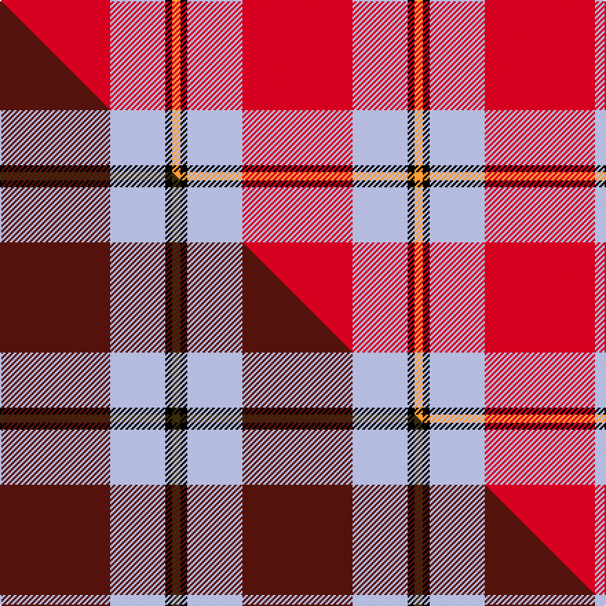

This page is one **sett** — a single exact thread-count. It belongs to the [tartan](/setts/r80lb40k5lo6/)
(the same proportion at any scale), whose colour order is pattern [RWKY](/stripes/rwky/).

Part of the [Broberg](/tartans/broberg/) tartan — the named design grouping this sett with its other cloths.

Sourced from tartans-authority.  It is a [4 stripe tartan](/stripes/stripes4/).

Original link http://www.tartansauthority.com/tartan-ferret/display/10979/

## Register references

External register numbers recorded for this tartan.

- Scottish Register of Tartans: [10979](https://www.tartanregister.gov.uk/tartanDetails?ref=10979)
- Scottish Tartans Authority (ITI): 10979

## Thread count
R/80 LB40 K5 LO/6

One full sett is **176 threads**.

## Palette
<table><thead><tr><th>Colour</th><th>Shade</th><th>OKLCh</th></tr></thead><tbody><tr><td>LB</td><td><code style="background-color:#B5BBDE;">#B5BBDE</code> <small style="color:#888">#B5BBDE</small></td><td><small style="color:#888">oklch(79.9% 0.050 277.6)</small></td></tr><tr><td>R</td><td><code style="background-color:#D60020;">#D60020</code> <small style="color:#888">#D60020</small></td><td><small style="color:#888">oklch(55.2% 0.224 25.5)</small></td></tr><tr><td>LO</td><td><code style="background-color:#FF9C34;">#FF9C34</code> <small style="color:#888">#FF9C34</small></td><td><small style="color:#888">oklch(77.9% 0.161 61.8)</small></td></tr><tr><td>K</td><td><code style="background-color:#000000;">#000000</code> <small style="color:#888">#000000</small></td><td><small style="color:#888">oklch(0.0% 0.000 0.0)</small></td></tr></tbody></table>

# Sample pattern

## Compared to the master

This cloth is one sett of its design; the master sett (the exemplar the design is anchored on) is below for comparison.

Its **ΔTartan distance** from the master is **2.25** — the same measure the nearest-tartans table ranks by (0 is identical; a re-scale of the same cloth is near 0, a recolour or a different proportion further).

<figure class="master-compare" style="margin:0">

this sett
master sett ★

<figcaption style="color:#888;font-size:smaller">One weave of this sett against the <a href="/setts/dr80lb40k5dy6/">master sett ★</a>, split on the diagonal: a shared proportion runs seamlessly across it with only the shades shifting; a different proportion breaks on it.</figcaption>
</figure>

## Nearest tartan variants

The nearest existing variants by ΔTartan distance, with this cloth at the top so the swatches line up against it.

ΔTartan

Threads

Variant

Sett

—

176

<a href="/variants/s4/r80lb40k5lo6/">Broberg (Scania) (Personal)</a>

<a href="/ttd/edit/#slug=w9r20db2~x2&amp;base=r80lb40k5lo6" title="compare in the TTD">1.25</a>

102

<a href="/variants/s3/w9r20db2~x2/">Masai Shuka 28 (Artefact)</a>

<a href="/ttd/edit/#slug=r60w28y2lb3~x2&amp;base=r80lb40k5lo6" title="compare in the TTD">1.56</a>

246

<a href="/variants/s4/r60w28y2lb3~x2/">Willis, H Graham</a>

<a href="/ttd/edit/#slug=r60w28ly2lb3~x2&amp;base=r80lb40k5lo6" title="compare in the TTD">1.56</a>

246

<a href="/variants/s4/r60w28ly2lb3~x2/">Willis, H Graham</a>

<a href="/ttd/edit/#slug=r125k26lb20lo16&amp;base=r80lb40k5lo6" title="compare in the TTD">1.56</a>

233

<a href="/variants/s4/r125k26lb20lo16/">McPeek (Fashion)</a>

<a href="/ttd/edit/#slug=r32w4db7y2lb2~x5&amp;base=r80lb40k5lo6" title="compare in the TTD">1.60</a>

300

<a href="/variants/s5/r32w4db7y2lb2~x5/">Sildesalaten</a>

<a href="/ttd/edit/#slug=db4r50g25w2~x2&amp;base=r80lb40k5lo6" title="compare in the TTD">1.90</a>

312

<a href="/variants/s4/db4r50g25w2~x2/">Unidentified Locket</a>

<a href="/ttd/edit/#slug=r48k12n7k5w3~x2&amp;base=r80lb40k5lo6" title="compare in the TTD">2.04</a>

198

<a href="/variants/s5/r48k12n7k5w3~x2/">Turner (Personal)</a>

<a href="/ttd/edit/#slug=r62db8w20k3g4~x2&amp;base=r80lb40k5lo6" title="compare in the TTD">2.13</a>

256

<a href="/variants/s5/r62db8w20k3g4~x2/">Nicolson Dress (Clan)</a>

<a href="/ttd/edit/#slug=r32g8w4y1&amp;base=r80lb40k5lo6" title="compare in the TTD">2.20</a>

57

<a href="/variants/s4/r32g8w4y1/">MacLaine of Lochbuie</a>

<a href="/ttd/edit/#slug=r30g12k5w2lb6r30&amp;base=r80lb40k5lo6" title="compare in the TTD">2.37</a>

110

<a href="/variants/s6/r30g12k5w2lb6r30/">Sinclair</a>

## Neighbour map

Every grey dot is one of 13620 variants placed by the first two principal components of the ΔTartan feature space (42% of its variance). Red is this tartan; blue dots are its nearest — click one to open its page.

<svg viewBox="0 0 640 380" role="img" style="max-width:100%;height:auto;border:1px solid #e0e0e0;border-radius:4px;display:block" xmlns="http://www.w3.org/2000/svg"><image href="/nn/cloud.v1.png" width="640" height="380"/><a href="/variants/s3/w9r20db2~x2/"><circle cx="382.8" cy="247.6" r="4" fill="#3465a4"><title>Masai Shuka 28 (Artefact)</title></circle></a><a href="/variants/s4/r60w28y2lb3~x2/"><circle cx="430.5" cy="165.0" r="4" fill="#3465a4"><title>Willis, H Graham</title></circle></a><a href="/variants/s4/r60w28ly2lb3~x2/"><circle cx="431.5" cy="165.7" r="4" fill="#3465a4"><title>Willis, H Graham</title></circle></a><a href="/variants/s4/r125k26lb20lo16/"><circle cx="341.6" cy="188.9" r="4" fill="#3465a4"><title>McPeek (Fashion)</title></circle></a><a href="/variants/s5/r32w4db7y2lb2~x5/"><circle cx="414.4" cy="152.6" r="4" fill="#3465a4"><title>Sildesalaten</title></circle></a><a href="/variants/s4/db4r50g25w2~x2/"><circle cx="415.0" cy="182.0" r="4" fill="#3465a4"><title>Unidentified Locket</title></circle></a><a href="/variants/s5/r48k12n7k5w3~x2/"><circle cx="343.9" cy="142.1" r="4" fill="#3465a4"><title>Turner (Personal)</title></circle></a><a href="/variants/s5/r62db8w20k3g4~x2/"><circle cx="338.2" cy="122.7" r="4" fill="#3465a4"><title>Nicolson Dress (Clan)</title></circle></a><a href="/variants/s4/r32g8w4y1/"><circle cx="485.5" cy="158.7" r="4" fill="#3465a4"><title>MacLaine of Lochbuie</title></circle></a><a href="/variants/s6/r30g12k5w2lb6r30/"><circle cx="370.2" cy="156.1" r="4" fill="#3465a4"><title>Sinclair</title></circle></a><circle cx="372.8" cy="183.0" r="5" fill="#c00000"/><text x="320" y="376" text-anchor="middle" font-size="11" fill="#999">ground</text><text x="11" y="190" text-anchor="middle" font-size="11" fill="#999" transform="rotate(-90 11 190)">complexity</text></svg>

ID: /variants/s4/r80lb40k5lo6/
