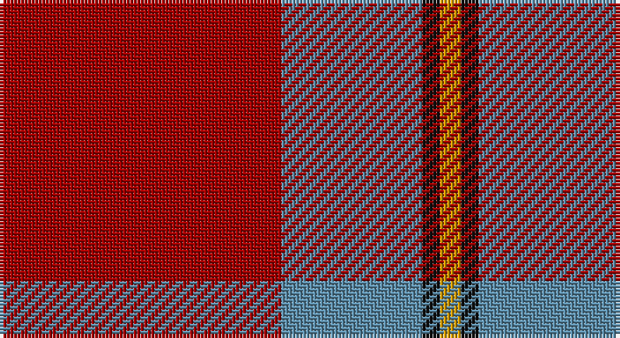

This page is one **sett** — a single exact thread-count. It belongs to the [tartan](/setts/r80t40k5lo6/)
(the same proportion at any scale), whose colour order is pattern [RBKY](/stripes/rbky/).

Sourced from tartans-authority.  It is a [4 stripe tartan](/stripes/stripes4/).

Original link http://www.tartansauthority.com/tartan-ferret/display/10979/

## Register references

External register numbers recorded for this tartan.

- Scottish Register of Tartans: [10979](https://www.tartanregister.gov.uk/tartanDetails?ref=10979)
- Scottish Tartans Authority (ITI): 10979

## Thread count
DR/80 B40 K5 DY/6

One full sett is **176 threads**.

## Palette

Palette: <strong>Tartan Register</strong> <small style="color:#888">(3 of 4 colours)</small>
<table><thead><tr><th>Colour</th><th>Threads</th><th>Shade</th><th>Base</th><th>OKLCh</th></tr></thead><tbody><tr><td>DR/</td><td style="text-align:right;font-variant-numeric:tabular-nums">80</td><td><code style="background-color:#A00000;">#A00000</code> <small style="color:#888">#A00000</small></td><td>R <code style="background-color:#CC0000;">#CC0000</code></td><td><small style="color:#888">oklch(44.3% 0.182 29.2)</small></td></tr><tr><td>B</td><td style="text-align:right;font-variant-numeric:tabular-nums">40</td><td><code style="background-color:#5C8CA8;">#5C8CA8</code> <small style="color:#888">#5C8CA8</small></td><td>B <code style="background-color:#2A418A;">#2A418A</code></td><td><small style="color:#888">oklch(61.7% 0.067 235.0)</small></td></tr><tr><td>K</td><td style="text-align:right;font-variant-numeric:tabular-nums">5</td><td><code style="background-color:#101010;">#101010</code> <small style="color:#888">#101010</small></td><td>K <code style="background-color:#000000;">#000000</code></td><td><small style="color:#888">oklch(17.3% 0.000 89.9)</small></td></tr><tr><td>DY/</td><td style="text-align:right;font-variant-numeric:tabular-nums">6</td><td><code style="background-color:#D09800;">#D09800</code> <small style="color:#888">#D09800</small></td><td>Y <code style="background-color:#F2BF00;">#F2BF00</code></td><td><small style="color:#888">oklch(71.4% 0.147 82.1)</small></td></tr></tbody></table>

# Sample pattern

## Nearest tartans

The nearest existing variants by ΔTartan distance, with this tartan at the top so the swatches line up against it.

ΔTartan

Tartan

Sett

—

<a href="/ttd/edit/#slug=r80t40k5lo6">Broberg (Scania) (Personal)</a> <a class="nn-out" href="/variants/s4/r80t40k5lo6/" title="open its dictionary page">↗</a>

1.16

<a href="/ttd/edit/#slug=m18g9m2g3k1w1~x4&amp;base=r80t40k5lo6">MacGregor of Cardney</a> <a class="nn-out" href="/variants/s6/m18g9m2g3k1w1~x4/" title="open its dictionary page">↗</a>

1.19

<a href="/ttd/edit/#slug=m96g42m16g17k4lb6&amp;base=r80t40k5lo6">MacGregor Hunting Glengyle Clan Tartan</a> <a class="nn-out" href="/variants/s6/m96g42m16g17k4lb6/" title="open its dictionary page">↗</a>

1.19

<a href="/ttd/edit/#slug=db4r50dg25w2~x2&amp;base=r80t40k5lo6">Unidentified Locket</a> <a class="nn-out" href="/variants/s4/db4r50dg25w2~x2/" title="open its dictionary page">↗</a>

1.22

<a href="/ttd/edit/#slug=r14k3dg3w1~x2&amp;base=r80t40k5lo6">Bacon, Red (Fashion)</a> <a class="nn-out" href="/variants/s4/r14k3dg3w1~x2/" title="open its dictionary page">↗</a>

1.24

<a href="/ttd/edit/#slug=r16db6r2g6r2db1~x2&amp;base=r80t40k5lo6">MacKintosh, Plaid</a> <a class="nn-out" href="/variants/s6/r16db6r2g6r2db1~x2/" title="open its dictionary page">↗</a>

1.28

<a href="/ttd/edit/#slug=db4r50g25w2~x2&amp;base=r80t40k5lo6">Unidentified, Locket</a> <a class="nn-out" href="/variants/s4/db4r50g25w2~x2/" title="open its dictionary page">↗</a>

1.29

<a href="/ttd/edit/#slug=r16db6r2dg6r2db1~x2&amp;base=r80t40k5lo6">MacKintosh Plaid</a> <a class="nn-out" href="/variants/s6/r16db6r2dg6r2db1~x2/" title="open its dictionary page">↗</a>

1.38

<a href="/ttd/edit/#slug=r3o10r3o4r20lb1~x4&amp;base=r80t40k5lo6">Monica</a> <a class="nn-out" href="/variants/s6/r3o10r3o4r20lb1~x4/" title="open its dictionary page">↗</a>

1.40

<a href="/ttd/edit/#slug=r10g3k1g3b1~x16&amp;base=r80t40k5lo6">Espy (Fashion?)</a> <a class="nn-out" href="/variants/s5/r10g3k1g3b1~x16/" title="open its dictionary page">↗</a>

1.41

<a href="/ttd/edit/#slug=db2r25g10r2db10r2~x2&amp;base=r80t40k5lo6">Grant of Lurg</a> <a class="nn-out" href="/variants/s6/db2r25g10r2db10r2~x2/" title="open its dictionary page">↗</a>

## Neighbour map

Every grey dot is one of 14360 variants placed by the first two principal components of the ΔTartan feature space (44% of its variance). Red is this tartan; blue dots are its nearest — click one to open its page.

<svg viewBox="0 0 640 380" role="img" style="max-width:100%;height:auto;border:1px solid #e0e0e0;border-radius:4px;display:block" xmlns="http://www.w3.org/2000/svg"><image href="/nn/cloud.v1.png" width="640" height="380"/><a href="/variants/s6/m18g9m2g3k1w1~x4/"><circle cx="395.4" cy="173.6" r="4" fill="#3465a4"><title>MacGregor of Cardney</title></circle></a><a href="/variants/s6/m96g42m16g17k4lb6/"><circle cx="428.6" cy="168.2" r="4" fill="#3465a4"><title>MacGregor Hunting Glengyle Clan Tartan</title></circle></a><a href="/variants/s4/db4r50dg25w2~x2/"><circle cx="413.4" cy="175.4" r="4" fill="#3465a4"><title>Unidentified Locket</title></circle></a><a href="/variants/s4/r14k3dg3w1~x2/"><circle cx="429.2" cy="213.2" r="4" fill="#3465a4"><title>Bacon, Red (Fashion)</title></circle></a><a href="/variants/s6/r16db6r2g6r2db1~x2/"><circle cx="401.6" cy="202.3" r="4" fill="#3465a4"><title>MacKintosh, Plaid</title></circle></a><a href="/variants/s4/db4r50g25w2~x2/"><circle cx="418.6" cy="182.1" r="4" fill="#3465a4"><title>Unidentified, Locket</title></circle></a><a href="/variants/s6/r16db6r2dg6r2db1~x2/"><circle cx="401.8" cy="200.5" r="4" fill="#3465a4"><title>MacKintosh Plaid</title></circle></a><a href="/variants/s6/r3o10r3o4r20lb1~x4/"><circle cx="460.8" cy="199.5" r="4" fill="#3465a4"><title>Monica</title></circle></a><a href="/variants/s5/r10g3k1g3b1~x16/"><circle cx="337.3" cy="209.0" r="4" fill="#3465a4"><title>Espy (Fashion?)</title></circle></a><a href="/variants/s6/db2r25g10r2db10r2~x2/"><circle cx="369.4" cy="207.4" r="4" fill="#3465a4"><title>Grant of Lurg</title></circle></a><circle cx="405.3" cy="204.2" r="5" fill="#c00000"/></svg>

ID: /variants/s4/r80t40k5lo6/
