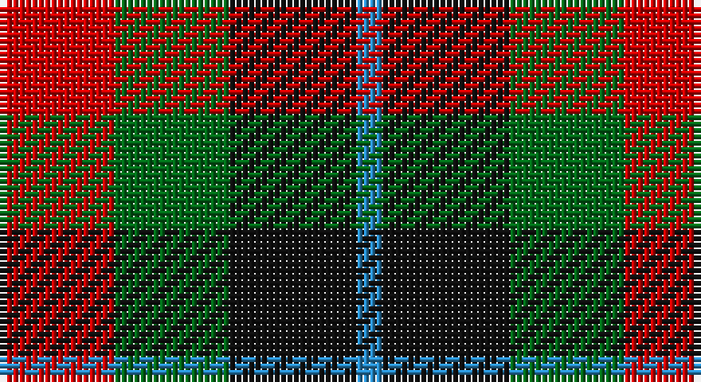

This page is one **sett** — a single exact thread-count. It belongs to the [tartan](/setts/r9g9k10t2/)
(the same proportion at any scale), whose colour order is pattern [BKGR](/stripes/bkgr/).

Sourced from register-of-tartans.  It is a [4 stripe tartan](/stripes/stripes4/).

Original link https://www.tartanregister.gov.uk/tartanDetails.aspx?ref=4728

## Register references

External register numbers recorded for this tartan.

- Scottish Register of Tartans: [4728](https://www.tartanregister.gov.uk/tartanDetails.aspx?ref=4728)
- Scottish Tartans Authority (ITI): 1940
- Scottish Tartans World Register: 1940

## Thread count
R/18 G18 K20 B/4

One full sett is **98 threads**.

## Palette

Palette: <strong>Tartan Register</strong>
<table><thead><tr><th>Colour</th><th>Threads</th><th>Shade</th><th>Base</th><th>OKLCh</th></tr></thead><tbody><tr><td>R/</td><td style="text-align:right;font-variant-numeric:tabular-nums">18</td><td><code style="background-color:#C80000;">#C80000</code> <small style="color:#888">#C80000</small></td><td>R <code style="background-color:#CC0000;">#CC0000</code></td><td><small style="color:#888">oklch(52.3% 0.215 29.2)</small></td></tr><tr><td>G</td><td style="text-align:right;font-variant-numeric:tabular-nums">18</td><td><code style="background-color:#006818;">#006818</code> <small style="color:#888">#006818</small></td><td>G <code style="background-color:#006100;">#006100</code></td><td><small style="color:#888">oklch(45.0% 0.142 145.0)</small></td></tr><tr><td>K</td><td style="text-align:right;font-variant-numeric:tabular-nums">20</td><td><code style="background-color:#101010;">#101010</code> <small style="color:#888">#101010</small></td><td>K <code style="background-color:#000000;">#000000</code></td><td><small style="color:#888">oklch(17.3% 0.000 89.9)</small></td></tr><tr><td>B/</td><td style="text-align:right;font-variant-numeric:tabular-nums">4</td><td><code style="background-color:#2888C4;">#2888C4</code> <small style="color:#888">#2888C4</small></td><td>B <code style="background-color:#2A418A;">#2A418A</code></td><td><small style="color:#888">oklch(60.1% 0.125 241.5)</small></td></tr></tbody></table>

# Sample pattern

## Nearest tartans

The nearest existing variants by ΔTartan distance, with this tartan at the top so the swatches line up against it.

ΔTartan

Tartan

Sett

—

<a href="/ttd/edit/#slug=r9g9k10t2~x2">Wilson's No.196</a> <a class="nn-out" href="/variants/s4/r9g9k10t2~x2/" title="open its dictionary page">↗</a>

0.63

<a href="/ttd/edit/#slug=r6dg5k5t1~x2&amp;base=r9g9k10t2~x2">Unidentified No 28</a> <a class="nn-out" href="/variants/s4/r6dg5k5t1~x2/" title="open its dictionary page">↗</a>

1.03

<a href="/ttd/edit/#slug=r6g5k5t1~x2&amp;base=r9g9k10t2~x2">Unnamed, No 28</a> <a class="nn-out" href="/variants/s4/r6g5k5t1~x2/" title="open its dictionary page">↗</a>

1.12

<a href="/ttd/edit/#slug=dp8k11g9r2~x2&amp;base=r9g9k10t2~x2">Norwich Collection No. 60</a> <a class="nn-out" href="/variants/s4/dp8k11g9r2~x2/" title="open its dictionary page">↗</a>

1.13

<a href="/ttd/edit/#slug=dp5k5g5w1~x4&amp;base=r9g9k10t2~x2">Wilson's No.220</a> <a class="nn-out" href="/variants/s4/dp5k5g5w1~x4/" title="open its dictionary page">↗</a>

1.15

<a href="/ttd/edit/#slug=dt6k6dt6r14ly3~x2&amp;base=r9g9k10t2~x2">Chivas Regal</a> <a class="nn-out" href="/variants/s5/dt6k6dt6r14ly3~x2/" title="open its dictionary page">↗</a>

1.21

<a href="/ttd/edit/#slug=k18g18dr21r4~x2&amp;base=r9g9k10t2~x2">Tennant</a> <a class="nn-out" href="/variants/s4/k18g18dr21r4~x2/" title="open its dictionary page">↗</a>

1.33

<a href="/ttd/edit/#slug=dt2k2dt2r5ly1~x12&amp;base=r9g9k10t2~x2">Chivas Regal (Corporate)</a> <a class="nn-out" href="/variants/s5/dt2k2dt2r5ly1~x12/" title="open its dictionary page">↗</a>

1.33

<a href="/ttd/edit/#slug=g4r3t1k1t3~x4&amp;base=r9g9k10t2~x2">Wilson's, No 214</a> <a class="nn-out" href="/variants/s5/g4r3t1k1t3~x4/" title="open its dictionary page">↗</a>

1.35

<a href="/ttd/edit/#slug=p3k3p3g6r2~x2&amp;base=r9g9k10t2~x2">Austin / Wilson's No 137</a> <a class="nn-out" href="/variants/s5/p3k3p3g6r2~x2/" title="open its dictionary page">↗</a>

1.37

<a href="/ttd/edit/#slug=db2g4ly1db1r2~x12&amp;base=r9g9k10t2~x2">Creek Indian Nation</a> <a class="nn-out" href="/variants/s5/db2g4ly1db1r2~x12/" title="open its dictionary page">↗</a>

## Neighbour map

Every grey dot is one of 14360 variants placed by the first two principal components of the ΔTartan feature space (44% of its variance). Red is this tartan; blue dots are its nearest — click one to open its page.

<svg viewBox="0 0 640 380" role="img" style="max-width:100%;height:auto;border:1px solid #e0e0e0;border-radius:4px;display:block" xmlns="http://www.w3.org/2000/svg"><image href="/nn/cloud.v1.png" width="640" height="380"/><a href="/variants/s4/r6dg5k5t1~x2/"><circle cx="144.1" cy="278.8" r="4" fill="#3465a4"><title>Unidentified No 28</title></circle></a><a href="/variants/s4/r6g5k5t1~x2/"><circle cx="118.2" cy="270.2" r="4" fill="#3465a4"><title>Unnamed, No 28</title></circle></a><a href="/variants/s4/dp8k11g9r2~x2/"><circle cx="157.2" cy="297.7" r="4" fill="#3465a4"><title>Norwich Collection No. 60</title></circle></a><a href="/variants/s4/dp5k5g5w1~x4/"><circle cx="112.4" cy="293.0" r="4" fill="#3465a4"><title>Wilson's No.220</title></circle></a><a href="/variants/s5/dt6k6dt6r14ly3~x2/"><circle cx="160.5" cy="269.8" r="4" fill="#3465a4"><title>Chivas Regal</title></circle></a><a href="/variants/s4/k18g18dr21r4~x2/"><circle cx="121.2" cy="294.6" r="4" fill="#3465a4"><title>Tennant</title></circle></a><a href="/variants/s5/dt2k2dt2r5ly1~x12/"><circle cx="175.6" cy="262.7" r="4" fill="#3465a4"><title>Chivas Regal (Corporate)</title></circle></a><a href="/variants/s5/g4r3t1k1t3~x4/"><circle cx="108.6" cy="277.5" r="4" fill="#3465a4"><title>Wilson's, No 214</title></circle></a><a href="/variants/s5/p3k3p3g6r2~x2/"><circle cx="85.0" cy="295.3" r="4" fill="#3465a4"><title>Austin / Wilson's No 137</title></circle></a><a href="/variants/s5/db2g4ly1db1r2~x12/"><circle cx="144.2" cy="274.7" r="4" fill="#3465a4"><title>Creek Indian Nation</title></circle></a><circle cx="124.3" cy="292.4" r="5" fill="#c00000"/></svg>

ID: /variants/s4/r9g9k10t2~x2/
