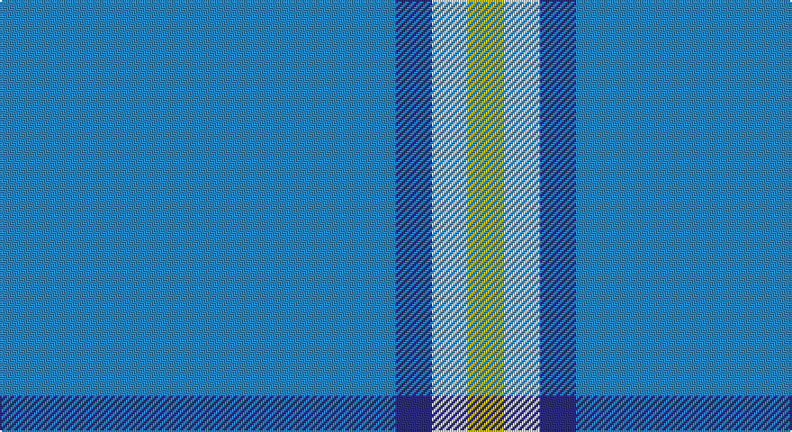

This page is one **sett** — a single exact thread-count. It belongs to the [tartan](/setts/t11db1w1ly1/)
(the same proportion at any scale), whose colour order is pattern [BBWY](/stripes/bbwy/).

Sourced from register-of-tartans.  It is a [4 stripe tartan](/stripes/stripes4/).

Original link https://www.tartanregister.gov.uk/tartanDetails.aspx?ref=10113

## Provenance

Earliest known date: 20th Nov. 2009 Designed in remembrance of the designer's mother, Jean Alexander Varrie, and her Scottish heritage. The light blue represents the rivers crossed by the family, the medium blue represents the oceans crossed, yellow represents the land and mountains where they settled and white represents their peace and tranquility. All Varrie families may use this design.

3 attestations — the source records this cloth was collapsed from (oldest owns this page)

<ul>
<li>20/11/2009 — Varrie (register-of-tartans, <a href="https://www.tartanregister.gov.uk/tartanDetails.aspx?ref=10113">record</a>)</li>
<li>20th Nov. 2009 — Varrie (Name) (tartans-authority, <a href="http://www.tartansauthority.com/tartan-ferret/display/10113/">record</a>)</li>
<li>undated — Varrie Name Tartan (house-of-tartan, <a href="http://www.house-of-tartan.scotland.net/house/TartanViewjs.asp?colr=Def&tnam=10113">record</a>)</li>
</ul>

## Register references

External register numbers recorded for this tartan.

- Scottish Register of Tartans: [10113](https://www.tartanregister.gov.uk/tartanDetails?ref=10113)
- Scottish Tartans Authority (ITI): 10113

## Thread count
B/220 DB20 LN20 Y/20

One full sett is **320 threads**.

## Palette

Palette: <strong>Tartan Register</strong>
<table><thead><tr><th>Colour</th><th>Threads</th><th>Shade</th><th>Base</th><th>OKLCh</th></tr></thead><tbody><tr><td>B/</td><td style="text-align:right;font-variant-numeric:tabular-nums">220</td><td><code style="background-color:#2888C4;">#2888C4</code> <small style="color:#888">#2888C4</small></td><td>B <code style="background-color:#2A418A;">#2A418A</code></td><td><small style="color:#888">oklch(60.1% 0.125 241.5)</small></td></tr><tr><td>DB</td><td style="text-align:right;font-variant-numeric:tabular-nums">20</td><td><code style="background-color:#2C2C80;">#2C2C80</code> <small style="color:#888">#2C2C80</small></td><td>B <code style="background-color:#2A418A;">#2A418A</code></td><td><small style="color:#888">oklch(35.0% 0.138 276.6)</small></td></tr><tr><td>LN</td><td style="text-align:right;font-variant-numeric:tabular-nums">20</td><td><code style="background-color:#E0E0E0;">#E0E0E0</code> <small style="color:#888">#E0E0E0</small></td><td>W <code style="background-color:#F7F7F7;">#F7F7F7</code></td><td><small style="color:#888">oklch(90.7% 0.000 89.9)</small></td></tr><tr><td>Y/</td><td style="text-align:right;font-variant-numeric:tabular-nums">20</td><td><code style="background-color:#E8C000;">#E8C000</code> <small style="color:#888">#E8C000</small></td><td>Y <code style="background-color:#F2BF00;">#F2BF00</code></td><td><small style="color:#888">oklch(81.9% 0.168 93.7)</small></td></tr></tbody></table>

# Sample pattern

## Nearest tartans

The nearest existing variants by ΔTartan distance, with this tartan at the top so the swatches line up against it.

ΔTartan

Tartan

Sett

—

<a href="/ttd/edit/#slug=t11db1w1ly1~x20">Varrie</a> <a class="nn-out" href="/variants/s4/t11db1w1ly1~x20/" title="open its dictionary page">↗</a>

0.72

<a href="/ttd/edit/#slug=t9db1w1ly1~x20&amp;base=t11db1w1ly1~x20">Varrie Commemorative Tartan</a> <a class="nn-out" href="/variants/s4/t9db1w1ly1~x20/" title="open its dictionary page">↗</a>

1.50

<a href="/ttd/edit/#slug=ly6t38k3~x2&amp;base=t11db1w1ly1~x20">Poulain League (Corporate)</a> <a class="nn-out" href="/variants/s3/ly6t38k3~x2/" title="open its dictionary page">↗</a>

1.96

<a href="/ttd/edit/#slug=b35k10b4w2b3r2~x2&amp;base=t11db1w1ly1~x20">Laidlaw's Highland Drovers</a> <a class="nn-out" href="/variants/s6/b35k10b4w2b3r2~x2/" title="open its dictionary page">↗</a>

2.01

<a href="/ttd/edit/#slug=t8dg1r2~x20&amp;base=t11db1w1ly1~x20">Gyle (Corporate)</a> <a class="nn-out" href="/variants/s3/t8dg1r2~x20/" title="open its dictionary page">↗</a>

2.19

<a href="/ttd/edit/#slug=lg6r1lg17db3lg3db8lg1~x2&amp;base=t11db1w1ly1~x20">Dominion (Fashion)</a> <a class="nn-out" href="/variants/s7/lg6r1lg17db3lg3db8lg1~x2/" title="open its dictionary page">↗</a>

2.22

<a href="/ttd/edit/#slug=dt72b6dt12b17w6~x2&amp;base=t11db1w1ly1~x20">GulfMark</a> <a class="nn-out" href="/variants/s5/dt72b6dt12b17w6~x2/" title="open its dictionary page">↗</a>

2.22

<a href="/ttd/edit/#slug=b18r1b1r1b1k7b13w2~x4&amp;base=t11db1w1ly1~x20">Tokyo Bluebells (Corporate)</a> <a class="nn-out" href="/variants/s8/b18r1b1r1b1k7b13w2~x4/" title="open its dictionary page">↗</a>

2.26

<a href="/ttd/edit/#slug=t37b9t3db9w3~x2&amp;base=t11db1w1ly1~x20">Loch Lomond Trade Tartan</a> <a class="nn-out" href="/variants/s5/t37b9t3db9w3~x2/" title="open its dictionary page">↗</a>

2.30

<a href="/ttd/edit/#slug=t48w2t7w2t7w2t20db11r2~x2&amp;base=t11db1w1ly1~x20">RAAF #3</a> <a class="nn-out" href="/variants/s9/t48w2t7w2t7w2t20db11r2~x2/" title="open its dictionary page">↗</a>

2.32

<a href="/variants/s4/t8dg1r2~x20/">Gyle</a>

## Neighbour map

Every grey dot is one of 14360 variants placed by the first two principal components of the ΔTartan feature space (44% of its variance). Red is this tartan; blue dots are its nearest — click one to open its page.

<svg viewBox="0 0 640 380" role="img" style="max-width:100%;height:auto;border:1px solid #e0e0e0;border-radius:4px;display:block" xmlns="http://www.w3.org/2000/svg"><image href="/nn/cloud.v1.png" width="640" height="380"/><a href="/variants/s4/t9db1w1ly1~x20/"><circle cx="461.0" cy="226.0" r="4" fill="#3465a4"><title>Varrie Commemorative Tartan</title></circle></a><a href="/variants/s3/ly6t38k3~x2/"><circle cx="528.7" cy="248.9" r="4" fill="#3465a4"><title>Poulain League (Corporate)</title></circle></a><a href="/variants/s6/b35k10b4w2b3r2~x2/"><circle cx="471.7" cy="175.5" r="4" fill="#3465a4"><title>Laidlaw's Highland Drovers</title></circle></a><a href="/variants/s3/t8dg1r2~x20/"><circle cx="452.4" cy="281.5" r="4" fill="#3465a4"><title>Gyle (Corporate)</title></circle></a><a href="/variants/s7/lg6r1lg17db3lg3db8lg1~x2/"><circle cx="452.9" cy="208.3" r="4" fill="#3465a4"><title>Dominion (Fashion)</title></circle></a><a href="/variants/s5/dt72b6dt12b17w6~x2/"><circle cx="511.4" cy="237.4" r="4" fill="#3465a4"><title>GulfMark</title></circle></a><a href="/variants/s8/b18r1b1r1b1k7b13w2~x4/"><circle cx="460.5" cy="171.2" r="4" fill="#3465a4"><title>Tokyo Bluebells (Corporate)</title></circle></a><a href="/variants/s5/t37b9t3db9w3~x2/"><circle cx="417.2" cy="224.5" r="4" fill="#3465a4"><title>Loch Lomond Trade Tartan</title></circle></a><a href="/variants/s9/t48w2t7w2t7w2t20db11r2~x2/"><circle cx="572.9" cy="166.2" r="4" fill="#3465a4"><title>RAAF #3</title></circle></a><a href="/variants/s4/t8dg1r2~x20/"><circle cx="405.4" cy="256.0" r="4" fill="#3465a4"><title>Gyle</title></circle></a><circle cx="511.0" cy="220.2" r="5" fill="#c00000"/></svg>

ID: /variants/s4/t11db1w1ly1~x20/
