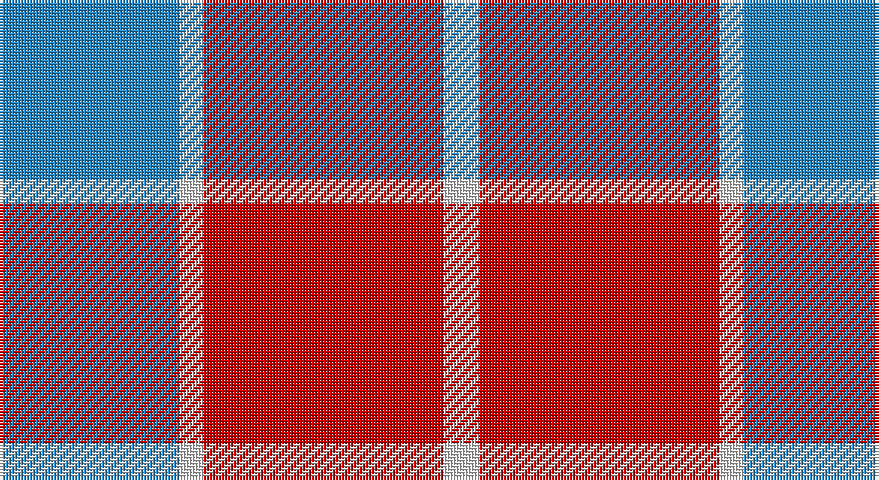

This page is one **sett** — a single exact thread-count. It belongs to the [tartan](/setts/t15w2r20w3/)
(the same proportion at any scale), whose colour order is pattern [BWRW](/stripes/bwrw/).

Sourced from tartans-authority.  It is a [4 stripe tartan](/stripes/stripes4/).

Original link http://www.tartansauthority.com/tartan-ferret/display/7284/

## Register references

External register numbers recorded for this tartan.

- Scottish Tartans Authority (ITI): 7284

## Thread count
B/60 LN8 R80 LN/12

One full sett is **248 threads**.

## Palette

Palette: <strong>Tartan Register</strong>
<table><thead><tr><th>Colour</th><th>Threads</th><th>Shade</th><th>Base</th><th>OKLCh</th></tr></thead><tbody><tr><td>B/</td><td style="text-align:right;font-variant-numeric:tabular-nums">60</td><td><code style="background-color:#2888C4;">#2888C4</code> <small style="color:#888">#2888C4</small></td><td>B <code style="background-color:#2A418A;">#2A418A</code></td><td><small style="color:#888">oklch(60.1% 0.125 241.5)</small></td></tr><tr><td>LN</td><td style="text-align:right;font-variant-numeric:tabular-nums">8</td><td><code style="background-color:#E0E0E0;">#E0E0E0</code> <small style="color:#888">#E0E0E0</small></td><td>W <code style="background-color:#F7F7F7;">#F7F7F7</code></td><td><small style="color:#888">oklch(90.7% 0.000 89.9)</small></td></tr><tr><td>R</td><td style="text-align:right;font-variant-numeric:tabular-nums">80</td><td><code style="background-color:#C80000;">#C80000</code> <small style="color:#888">#C80000</small></td><td>R <code style="background-color:#CC0000;">#CC0000</code></td><td><small style="color:#888">oklch(52.3% 0.215 29.2)</small></td></tr><tr><td>LN/</td><td style="text-align:right;font-variant-numeric:tabular-nums">12</td><td><code style="background-color:#E0E0E0;">#E0E0E0</code> <small style="color:#888">#E0E0E0</small></td><td>W <code style="background-color:#F7F7F7;">#F7F7F7</code></td><td><small style="color:#888">oklch(90.7% 0.000 89.9)</small></td></tr></tbody></table>

# Sample pattern

## Nearest tartans

The nearest existing variants by ΔTartan distance, with this tartan at the top so the swatches line up against it.

ΔTartan

Tartan

Sett

—

<a href="/ttd/edit/#slug=t15w2r20w3~x4">Masai Shuka 24 (Artefact)</a> <a class="nn-out" href="/variants/s4/t15w2r20w3~x4/" title="open its dictionary page">↗</a>

1.36

<a href="/ttd/edit/#slug=r8lg15b12r29w4~x2&amp;base=t15w2r20w3~x4">Snowbird (Corporate)</a> <a class="nn-out" href="/variants/s5/r8lg15b12r29w4~x2/" title="open its dictionary page">↗</a>

1.42

<a href="/ttd/edit/#slug=dy5r5lb11r1dy1~x4&amp;base=t15w2r20w3~x4">O'Connor Dress</a> <a class="nn-out" href="/variants/s5/dy5r5lb11r1dy1~x4/" title="open its dictionary page">↗</a>

1.43

<a href="/ttd/edit/#slug=w4m31w35lg4~x2&amp;base=t15w2r20w3~x4">Lewis, Magenta (Dance)</a> <a class="nn-out" href="/variants/s4/w4m31w35lg4~x2/" title="open its dictionary page">↗</a>

1.54

<a href="/ttd/edit/#slug=r12g8r54db45g6&amp;base=t15w2r20w3~x4">Wotherspoon</a> <a class="nn-out" href="/variants/s5/r12g8r54db45g6/" title="open its dictionary page">↗</a>

1.54

<a href="/ttd/edit/#slug=m30k7o20ly4k4~x2&amp;base=t15w2r20w3~x4">Drumfintley (Fashion)</a> <a class="nn-out" href="/variants/s5/m30k7o20ly4k4~x2/" title="open its dictionary page">↗</a>

1.55

<a href="/ttd/edit/#slug=db1r14g7db7r1~x4&amp;base=t15w2r20w3~x4">Fraser of Boblainy, Hugh (Personal)</a> <a class="nn-out" href="/variants/s5/db1r14g7db7r1~x4/" title="open its dictionary page">↗</a>

1.56

<a href="/ttd/edit/#slug=db6r1db6r9w1~x2&amp;base=t15w2r20w3~x4">Hamilton, (Red)</a> <a class="nn-out" href="/variants/s5/db6r1db6r9w1~x2/" title="open its dictionary page">↗</a>

1.56

<a href="/ttd/edit/#slug=r13k1lb13~x4&amp;base=t15w2r20w3~x4">Hose (Dunmore)</a> <a class="nn-out" href="/variants/s3/r13k1lb13~x4/" title="open its dictionary page">↗</a>

1.58

<a href="/ttd/edit/#slug=o25k4w8r16~x4&amp;base=t15w2r20w3~x4">Buckeye</a> <a class="nn-out" href="/variants/s4/o25k4w8r16~x4/" title="open its dictionary page">↗</a>

1.59

<a href="/ttd/edit/#slug=db8r2db8r15w2~x4&amp;base=t15w2r20w3~x4">Hamilton (Clan)</a> <a class="nn-out" href="/variants/s5/db8r2db8r15w2~x4/" title="open its dictionary page">↗</a>

## Neighbour map

Every grey dot is one of 14360 variants placed by the first two principal components of the ΔTartan feature space (44% of its variance). Red is this tartan; blue dots are its nearest — click one to open its page.

<svg viewBox="0 0 640 380" role="img" style="max-width:100%;height:auto;border:1px solid #e0e0e0;border-radius:4px;display:block" xmlns="http://www.w3.org/2000/svg"><image href="/nn/cloud.v1.png" width="640" height="380"/><a href="/variants/s5/r8lg15b12r29w4~x2/"><circle cx="267.6" cy="236.1" r="4" fill="#3465a4"><title>Snowbird (Corporate)</title></circle></a><a href="/variants/s5/dy5r5lb11r1dy1~x4/"><circle cx="272.2" cy="218.6" r="4" fill="#3465a4"><title>O'Connor Dress</title></circle></a><a href="/variants/s4/w4m31w35lg4~x2/"><circle cx="305.5" cy="218.6" r="4" fill="#3465a4"><title>Lewis, Magenta (Dance)</title></circle></a><a href="/variants/s5/r12g8r54db45g6/"><circle cx="340.6" cy="241.5" r="4" fill="#3465a4"><title>Wotherspoon</title></circle></a><a href="/variants/s5/m30k7o20ly4k4~x2/"><circle cx="233.4" cy="220.5" r="4" fill="#3465a4"><title>Drumfintley (Fashion)</title></circle></a><a href="/variants/s5/db1r14g7db7r1~x4/"><circle cx="318.4" cy="221.2" r="4" fill="#3465a4"><title>Fraser of Boblainy, Hugh (Personal)</title></circle></a><a href="/variants/s5/db6r1db6r9w1~x2/"><circle cx="331.8" cy="251.8" r="4" fill="#3465a4"><title>Hamilton, (Red)</title></circle></a><a href="/variants/s3/r13k1lb13~x4/"><circle cx="304.0" cy="235.5" r="4" fill="#3465a4"><title>Hose (Dunmore)</title></circle></a><a href="/variants/s4/o25k4w8r16~x4/"><circle cx="204.4" cy="242.1" r="4" fill="#3465a4"><title>Buckeye</title></circle></a><a href="/variants/s5/db8r2db8r15w2~x4/"><circle cx="294.6" cy="246.3" r="4" fill="#3465a4"><title>Hamilton (Clan)</title></circle></a><circle cx="299.9" cy="231.3" r="5" fill="#c00000"/></svg>

ID: /variants/s4/t15w2r20w3~x4/
