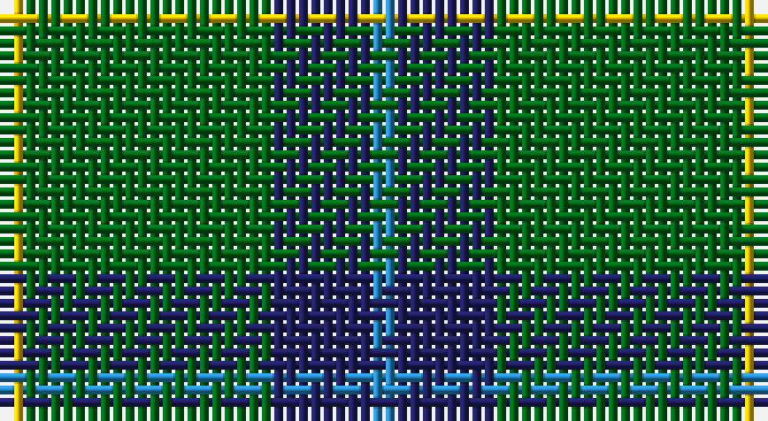

This page is one **sett** — a single exact thread-count. It belongs to the [tartan](/setts/t1db4g10ly1/)
(the same proportion at any scale), whose colour order is pattern [BBGY](/stripes/bbgy/).

Sourced from register-of-tartans.  It is a [4 stripe tartan](/stripes/stripes4/).

Original link https://www.tartanregister.gov.uk/tartanDetails.aspx?ref=4713

## Also known as

This cloth is also recorded under:

- Wilson's, No 174

2 attestations — the source records this cloth was collapsed from (oldest owns this page)

<ul>
<li>01/01/1819 — Wilson's No.174 (register-of-tartans, <a href="https://www.tartanregister.gov.uk/tartanDetails.aspx?ref=4713">record</a>)</li>
<li>undated — Wilson's, No 174 (weddslist, <a href="http://www.weddslist.com/cgi-bin/tartans/pg.pl?source=sts">record</a>)</li>
</ul>

## Register references

External register numbers recorded for this tartan.

- Scottish Register of Tartans: [4713](https://www.tartanregister.gov.uk/tartanDetails.aspx?ref=4713)
- Scottish Tartans Authority (ITI): 1899
- Scottish Tartans World Register: 1899

## Thread count
Y/2 G20 DB8 B/2

One full sett is **60 threads**.

## Palette

Palette: <strong>Tartan Register</strong>
<table><thead><tr><th>Colour</th><th>Threads</th><th>Shade</th><th>Base</th><th>OKLCh</th></tr></thead><tbody><tr><td>Y/</td><td style="text-align:right;font-variant-numeric:tabular-nums">2</td><td><code style="background-color:#E8C000;">#E8C000</code> <small style="color:#888">#E8C000</small></td><td>Y <code style="background-color:#F2BF00;">#F2BF00</code></td><td><small style="color:#888">oklch(81.9% 0.168 93.7)</small></td></tr><tr><td>G</td><td style="text-align:right;font-variant-numeric:tabular-nums">20</td><td><code style="background-color:#006818;">#006818</code> <small style="color:#888">#006818</small></td><td>G <code style="background-color:#006100;">#006100</code></td><td><small style="color:#888">oklch(45.0% 0.142 145.0)</small></td></tr><tr><td>DB</td><td style="text-align:right;font-variant-numeric:tabular-nums">8</td><td><code style="background-color:#202060;">#202060</code> <small style="color:#888">#202060</small></td><td>B <code style="background-color:#2A418A;">#2A418A</code></td><td><small style="color:#888">oklch(28.9% 0.111 276.9)</small></td></tr><tr><td>B/</td><td style="text-align:right;font-variant-numeric:tabular-nums">2</td><td><code style="background-color:#2888C4;">#2888C4</code> <small style="color:#888">#2888C4</small></td><td>B <code style="background-color:#2A418A;">#2A418A</code></td><td><small style="color:#888">oklch(60.1% 0.125 241.5)</small></td></tr></tbody></table>

# Sample pattern

## Nearest tartans

The nearest existing variants by ΔTartan distance, with this tartan at the top so the swatches line up against it.

ΔTartan

Tartan

Sett

—

<a href="/ttd/edit/#slug=t1db4g10ly1~x2">Wilson's No.174</a> <a class="nn-out" href="/variants/s4/t1db4g10ly1~x2/" title="open its dictionary page">↗</a>

0.74

<a href="/ttd/edit/#slug=t1db4g10w1~x2&amp;base=t1db4g10ly1~x2">Wilson's, No 205</a> <a class="nn-out" href="/variants/s4/t1db4g10w1~x2/" title="open its dictionary page">↗</a>

0.75

<a href="/ttd/edit/#slug=k5g40db20ly3~x2&amp;base=t1db4g10ly1~x2">Robert Byers Family - Dooballagh, Ireland</a> <a class="nn-out" href="/variants/s4/k5g40db20ly3~x2/" title="open its dictionary page">↗</a>

0.92

<a href="/ttd/edit/#slug=g27db14k2db2ly2~x4&amp;base=t1db4g10ly1~x2">Irving of Bonshaw</a> <a class="nn-out" href="/variants/s5/g27db14k2db2ly2~x4/" title="open its dictionary page">↗</a>

1.00

<a href="/ttd/edit/#slug=k2ly1g7t1~x2&amp;base=t1db4g10ly1~x2">Wilson's No.140</a> <a class="nn-out" href="/variants/s4/k2ly1g7t1~x2/" title="open its dictionary page">↗</a>

1.02

<a href="/ttd/edit/#slug=g14k3r3lr2~x2&amp;base=t1db4g10ly1~x2">Bacon, Green (Fashion)</a> <a class="nn-out" href="/variants/s4/g14k3r3lr2~x2/" title="open its dictionary page">↗</a>

1.05

<a href="/ttd/edit/#slug=g47r3g6db35ly3~x2&amp;base=t1db4g10ly1~x2">Gracie</a> <a class="nn-out" href="/variants/s5/g47r3g6db35ly3~x2/" title="open its dictionary page">↗</a>

1.06

<a href="/ttd/edit/#slug=dp4g10r1ly1~x2&amp;base=t1db4g10ly1~x2">Wilson's No.192</a> <a class="nn-out" href="/variants/s4/dp4g10r1ly1~x2/" title="open its dictionary page">↗</a>

1.24

<a href="/ttd/edit/#slug=dp4g10r1w1~x2&amp;base=t1db4g10ly1~x2">Wilson's No.189</a> <a class="nn-out" href="/variants/s4/dp4g10r1w1~x2/" title="open its dictionary page">↗</a>

1.26

<a href="/ttd/edit/#slug=g18db9k1db1w1~x4&amp;base=t1db4g10ly1~x2">Irvine</a> <a class="nn-out" href="/variants/s5/g18db9k1db1w1~x4/" title="open its dictionary page">↗</a>

1.32

<a href="/ttd/edit/#slug=r3g22db16g14r2g6lo2~x2&amp;base=t1db4g10ly1~x2">Scottish Scouts (1957) (Corporate)</a> <a class="nn-out" href="/variants/s7/r3g22db16g14r2g6lo2~x2/" title="open its dictionary page">↗</a>

## Neighbour map

Every grey dot is one of 14360 variants placed by the first two principal components of the ΔTartan feature space (44% of its variance). Red is this tartan; blue dots are its nearest — click one to open its page.

<svg viewBox="0 0 640 380" role="img" style="max-width:100%;height:auto;border:1px solid #e0e0e0;border-radius:4px;display:block" xmlns="http://www.w3.org/2000/svg"><image href="/nn/cloud.v1.png" width="640" height="380"/><a href="/variants/s4/t1db4g10w1~x2/"><circle cx="359.7" cy="240.7" r="4" fill="#3465a4"><title>Wilson's, No 205</title></circle></a><a href="/variants/s4/k5g40db20ly3~x2/"><circle cx="353.1" cy="238.0" r="4" fill="#3465a4"><title>Robert Byers Family - Dooballagh, Ireland</title></circle></a><a href="/variants/s5/g27db14k2db2ly2~x4/"><circle cx="353.0" cy="209.7" r="4" fill="#3465a4"><title>Irving of Bonshaw</title></circle></a><a href="/variants/s4/k2ly1g7t1~x2/"><circle cx="336.9" cy="248.5" r="4" fill="#3465a4"><title>Wilson's No.140</title></circle></a><a href="/variants/s4/g14k3r3lr2~x2/"><circle cx="346.9" cy="251.3" r="4" fill="#3465a4"><title>Bacon, Green (Fashion)</title></circle></a><a href="/variants/s5/g47r3g6db35ly3~x2/"><circle cx="363.9" cy="213.0" r="4" fill="#3465a4"><title>Gracie</title></circle></a><a href="/variants/s4/dp4g10r1ly1~x2/"><circle cx="356.7" cy="231.4" r="4" fill="#3465a4"><title>Wilson's No.192</title></circle></a><a href="/variants/s4/dp4g10r1w1~x2/"><circle cx="342.5" cy="224.4" r="4" fill="#3465a4"><title>Wilson's No.189</title></circle></a><a href="/variants/s5/g18db9k1db1w1~x4/"><circle cx="379.2" cy="193.7" r="4" fill="#3465a4"><title>Irvine</title></circle></a><a href="/variants/s7/r3g22db16g14r2g6lo2~x2/"><circle cx="365.3" cy="227.3" r="4" fill="#3465a4"><title>Scottish Scouts (1957) (Corporate)</title></circle></a><circle cx="362.1" cy="242.5" r="5" fill="#c00000"/></svg>

ID: /variants/s4/t1db4g10ly1~x2/
