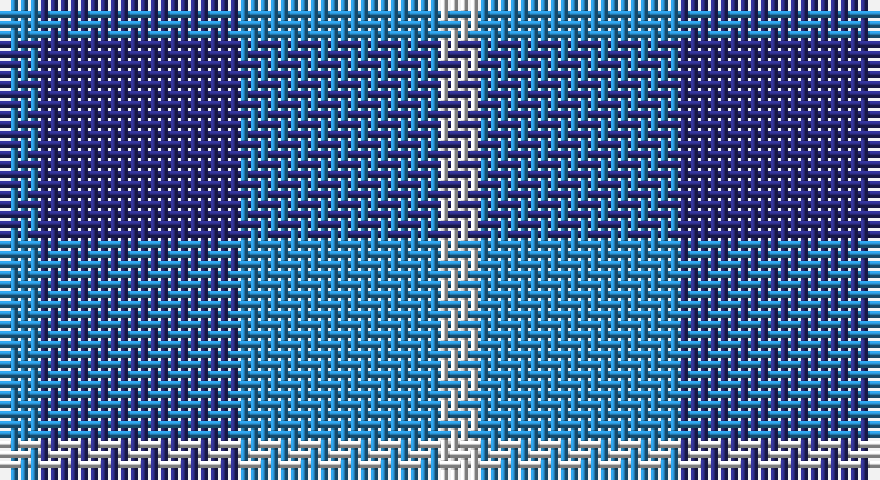

This page is one **sett** — a single exact thread-count. It belongs to the [tartan](/setts/t1db5t5w1/)
(the same proportion at any scale), whose colour order is pattern [BBBW](/stripes/bbbw/).

Part of the [Manx Cornaa](/tartans/manx-cornaa/) tartan — the named design grouping this sett with its other cloths.

Sourced from tartans-authority.  It is a [4 stripe tartan](/stripes/stripes4/).

Original link http://www.tartansauthority.com/tartan-ferret/display/44/

## Also known as

This cloth is also recorded under:

- Manx, Cornaa

## Register references

External register numbers recorded for this tartan.

- Scottish Tartans Authority (ITI): 44

## Thread count
B/4 DB20 B20 LN/4

One full sett is **88 threads**.

## Palette

Palette: <strong>Tartan Register</strong>
<table><thead><tr><th>Colour</th><th>Threads</th><th>Shade</th><th>Base</th><th>OKLCh</th></tr></thead><tbody><tr><td>B/</td><td style="text-align:right;font-variant-numeric:tabular-nums">4</td><td><code style="background-color:#2888C4;">#2888C4</code> <small style="color:#888">#2888C4</small></td><td>B <code style="background-color:#2A418A;">#2A418A</code></td><td><small style="color:#888">oklch(60.1% 0.125 241.5)</small></td></tr><tr><td>DB</td><td style="text-align:right;font-variant-numeric:tabular-nums">20</td><td><code style="background-color:#2C2C80;">#2C2C80</code> <small style="color:#888">#2C2C80</small></td><td>B <code style="background-color:#2A418A;">#2A418A</code></td><td><small style="color:#888">oklch(35.0% 0.138 276.6)</small></td></tr><tr><td>B</td><td style="text-align:right;font-variant-numeric:tabular-nums">20</td><td><code style="background-color:#2888C4;">#2888C4</code> <small style="color:#888">#2888C4</small></td><td>B <code style="background-color:#2A418A;">#2A418A</code></td><td><small style="color:#888">oklch(60.1% 0.125 241.5)</small></td></tr><tr><td>LN/</td><td style="text-align:right;font-variant-numeric:tabular-nums">4</td><td><code style="background-color:#E0E0E0;">#E0E0E0</code> <small style="color:#888">#E0E0E0</small></td><td>W <code style="background-color:#F7F7F7;">#F7F7F7</code></td><td><small style="color:#888">oklch(90.7% 0.000 89.9)</small></td></tr></tbody></table>

# Sample pattern

## Compared to the master

This cloth is one sett of its design; the master sett (the exemplar the design is anchored on) is below for comparison.

<figure style="margin:0"><figcaption style="color:#888;font-size:smaller">this sett</figcaption></figure>
<figure style="margin:0"><figcaption style="color:#888;font-size:smaller"><a href="/setts/db5t5w1t5db5t1/">master sett →</a></figcaption></figure>

## Nearest tartans

The nearest existing variants by ΔTartan distance, with this tartan at the top so the swatches line up against it.

ΔTartan

Tartan

Sett

—

<a href="/ttd/edit/#slug=t1db5t5w1~x4">Manx Cornaa (Personal)</a> <a class="nn-out" href="/variants/s4/t1db5t5w1~x4/" title="open its dictionary page">↗</a>

0.97

<a href="/ttd/edit/#slug=b1db5b5w1~x4&amp;base=t1db5t5w1~x4">Manx, Cornaa</a> <a class="nn-out" href="/variants/s4/b1db5b5w1~x4/" title="open its dictionary page">↗</a>

1.21

<a href="/ttd/edit/#slug=db5t5w1t5db5t1~x4&amp;base=t1db5t5w1~x4">Manx Cornaa (Personal)</a> <a class="nn-out" href="/variants/s6/db5t5w1t5db5t1~x4/" title="open its dictionary page">↗</a>

1.51

<a href="/ttd/edit/#slug=db2t4w1t4db6t2db2~x4&amp;base=t1db5t5w1~x4">Langdons</a> <a class="nn-out" href="/variants/s7/db2t4w1t4db6t2db2~x4/" title="open its dictionary page">↗</a>

1.75

<a href="/ttd/edit/#slug=db3t3db16t16db16w3~x2&amp;base=t1db5t5w1~x4">Murray Taylor</a> <a class="nn-out" href="/variants/s6/db3t3db16t16db16w3~x2/" title="open its dictionary page">↗</a>

1.87

<a href="/ttd/edit/#slug=p9b6w1g4p2~x8&amp;base=t1db5t5w1~x4">Cathro (Name)</a> <a class="nn-out" href="/variants/s5/p9b6w1g4p2~x8/" title="open its dictionary page">↗</a>

2.02

<a href="/ttd/edit/#slug=db7ly1db7t11r2~x6&amp;base=t1db5t5w1~x4">Brazell (Personal)</a> <a class="nn-out" href="/variants/s5/db7ly1db7t11r2~x6/" title="open its dictionary page">↗</a>

2.03

<a href="/ttd/edit/#slug=db2dg7db7w1~x2&amp;base=t1db5t5w1~x4">Unidentified No 78</a> <a class="nn-out" href="/variants/s4/db2dg7db7w1~x2/" title="open its dictionary page">↗</a>

2.04

<a href="/ttd/edit/#slug=k15db40k9o10~x2&amp;base=t1db5t5w1~x4">Omega Delta Sigma, National Veterans</a> <a class="nn-out" href="/variants/s4/k15db40k9o10~x2/" title="open its dictionary page">↗</a>

2.06

<a href="/ttd/edit/#slug=b3k4b4g9k2~x4&amp;base=t1db5t5w1~x4">Falconer</a> <a class="nn-out" href="/variants/s5/b3k4b4g9k2~x4/" title="open its dictionary page">↗</a>

2.06

<a href="/ttd/edit/#slug=t2lb4w1lb4t6lb2t2~x4&amp;base=t1db5t5w1~x4">Langdons (Corporate)</a> <a class="nn-out" href="/variants/s7/t2lb4w1lb4t6lb2t2~x4/" title="open its dictionary page">↗</a>

## Neighbour map

Every grey dot is one of 14360 variants placed by the first two principal components of the ΔTartan feature space (44% of its variance). Red is this tartan; blue dots are its nearest — click one to open its page.

<svg viewBox="0 0 640 380" role="img" style="max-width:100%;height:auto;border:1px solid #e0e0e0;border-radius:4px;display:block" xmlns="http://www.w3.org/2000/svg"><image href="/nn/cloud.v1.png" width="640" height="380"/><a href="/variants/s4/b1db5b5w1~x4/"><circle cx="294.6" cy="296.3" r="4" fill="#3465a4"><title>Manx, Cornaa</title></circle></a><a href="/variants/s6/db5t5w1t5db5t1~x4/"><circle cx="277.5" cy="305.6" r="4" fill="#3465a4"><title>Manx Cornaa (Personal)</title></circle></a><a href="/variants/s7/db2t4w1t4db6t2db2~x4/"><circle cx="271.0" cy="290.9" r="4" fill="#3465a4"><title>Langdons</title></circle></a><a href="/variants/s6/db3t3db16t16db16w3~x2/"><circle cx="323.2" cy="273.0" r="4" fill="#3465a4"><title>Murray Taylor</title></circle></a><a href="/variants/s5/p9b6w1g4p2~x8/"><circle cx="270.3" cy="251.9" r="4" fill="#3465a4"><title>Cathro (Name)</title></circle></a><a href="/variants/s5/db7ly1db7t11r2~x6/"><circle cx="265.1" cy="236.9" r="4" fill="#3465a4"><title>Brazell (Personal)</title></circle></a><a href="/variants/s4/db2dg7db7w1~x2/"><circle cx="332.9" cy="305.1" r="4" fill="#3465a4"><title>Unidentified No 78</title></circle></a><a href="/variants/s4/k15db40k9o10~x2/"><circle cx="311.0" cy="313.4" r="4" fill="#3465a4"><title>Omega Delta Sigma, National Veterans</title></circle></a><a href="/variants/s5/b3k4b4g9k2~x4/"><circle cx="180.5" cy="297.0" r="4" fill="#3465a4"><title>Falconer</title></circle></a><a href="/variants/s7/t2lb4w1lb4t6lb2t2~x4/"><circle cx="259.0" cy="276.0" r="4" fill="#3465a4"><title>Langdons (Corporate)</title></circle></a><circle cx="278.0" cy="296.5" r="5" fill="#c00000"/></svg>

ID: /variants/s4/t1db5t5w1~x4/
