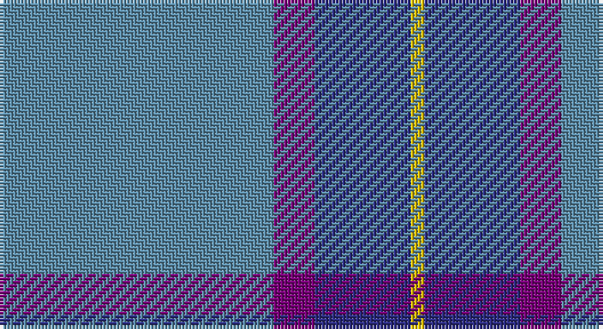

This page is one **sett** — a single exact thread-count. It belongs to the [tartan](/setts/t20dp3db7ly1/)
(the same proportion at any scale), whose colour order is pattern [BBBY](/stripes/bbby/).

Part of the [Peacock](/tartans/peacock/) tartan — the named design grouping this sett with its other cloths.

Sourced from register-of-tartans.  It is a [4 stripe tartan](/stripes/stripes4/).

Original link https://www.tartanregister.gov.uk/tartanDetails.aspx?ref=3309

2 attestations — the source records this cloth was collapsed from (oldest owns this page)

<ul>
<li>14/02/2000 — Peacock (Samantha) (register-of-tartans, <a href="https://www.tartanregister.gov.uk/tartanDetails.aspx?ref=3309">record</a>)</li>
<li>Feb. 2000 — Peacock (Name) (tartans-authority, <a href="http://www.tartansauthority.com/tartan-ferret/display/2655/">record</a>)</li>
</ul>

## Register references

External register numbers recorded for this tartan.

- Scottish Register of Tartans: [3309](https://www.tartanregister.gov.uk/tartanDetails.aspx?ref=3309)
- Scottish Tartans Authority (ITI): 2655
- Scottish Tartans World Register: 2655

## Thread count
B/80 P12 DB28 Y/4

One full sett is **164 threads**.

## Palette

Palette: <strong>Tartan Register</strong>
<table><thead><tr><th>Colour</th><th>Threads</th><th>Shade</th><th>Base</th><th>OKLCh</th></tr></thead><tbody><tr><td>B/</td><td style="text-align:right;font-variant-numeric:tabular-nums">80</td><td><code style="background-color:#5C8CA8;">#5C8CA8</code> <small style="color:#888">#5C8CA8</small></td><td>B <code style="background-color:#2A418A;">#2A418A</code></td><td><small style="color:#888">oklch(61.7% 0.067 235.0)</small></td></tr><tr><td>P</td><td style="text-align:right;font-variant-numeric:tabular-nums">12</td><td><code style="background-color:#780078;">#780078</code> <small style="color:#888">#780078</small></td><td>B <code style="background-color:#2A418A;">#2A418A</code></td><td><small style="color:#888">oklch(40.2% 0.185 328.4)</small></td></tr><tr><td>DB</td><td style="text-align:right;font-variant-numeric:tabular-nums">28</td><td><code style="background-color:#2C2C80;">#2C2C80</code> <small style="color:#888">#2C2C80</small></td><td>B <code style="background-color:#2A418A;">#2A418A</code></td><td><small style="color:#888">oklch(35.0% 0.138 276.6)</small></td></tr><tr><td>Y/</td><td style="text-align:right;font-variant-numeric:tabular-nums">4</td><td><code style="background-color:#E8C000;">#E8C000</code> <small style="color:#888">#E8C000</small></td><td>Y <code style="background-color:#F2BF00;">#F2BF00</code></td><td><small style="color:#888">oklch(81.9% 0.168 93.7)</small></td></tr></tbody></table>

# Sample pattern

## Nearest tartans

The nearest existing variants by ΔTartan distance, with this tartan at the top so the swatches line up against it.

ΔTartan

Tartan

Sett

—

<a href="/ttd/edit/#slug=t20dp3db7ly1~x4">Peacock (Samantha)</a> <a class="nn-out" href="/variants/s4/t20dp3db7ly1~x4/" title="open its dictionary page">↗</a>

0.72

<a href="/ttd/edit/#slug=t20p3db7ly1~x4&amp;base=t20dp3db7ly1~x4">Peacock</a> <a class="nn-out" href="/variants/s4/t20p3db7ly1~x4/" title="open its dictionary page">↗</a>

1.16

<a href="/ttd/edit/#slug=w4t34db60ly3~x2&amp;base=t20dp3db7ly1~x4">MacKerral Family Tartan</a> <a class="nn-out" href="/variants/s4/w4t34db60ly3~x2/" title="open its dictionary page">↗</a>

1.25

<a href="/ttd/edit/#slug=t37b9t3db9w3~x2&amp;base=t20dp3db7ly1~x4">Loch Lomond Trade Tartan</a> <a class="nn-out" href="/variants/s5/t37b9t3db9w3~x2/" title="open its dictionary page">↗</a>

1.30

<a href="/ttd/edit/#slug=r2t21r2db6ly1r1~x4&amp;base=t20dp3db7ly1~x4">Lauder Primary School (Corporate)</a> <a class="nn-out" href="/variants/s6/r2t21r2db6ly1r1~x4/" title="open its dictionary page">↗</a>

1.41

<a href="/ttd/edit/#slug=n62w11k4lg17~x2&amp;base=t20dp3db7ly1~x4">Thunderlord (Corporate)</a> <a class="nn-out" href="/variants/s4/n62w11k4lg17~x2/" title="open its dictionary page">↗</a>

1.45

<a href="/ttd/edit/#slug=t9db2t39dt33lo2dt5~x2&amp;base=t20dp3db7ly1~x4">Port Authority of NY &amp; NJ</a> <a class="nn-out" href="/variants/s6/t9db2t39dt33lo2dt5~x2/" title="open its dictionary page">↗</a>

1.47

<a href="/ttd/edit/#slug=r2db19n6b44lb2~x2&amp;base=t20dp3db7ly1~x4">World Fed. of Bldg Contractors (Corp</a> <a class="nn-out" href="/variants/s5/r2db19n6b44lb2~x2/" title="open its dictionary page">↗</a>

1.52

<a href="/ttd/edit/#slug=n42db2n2db17lo8db4~x2&amp;base=t20dp3db7ly1~x4">Connecticut State Police PB (Cor.)</a> <a class="nn-out" href="/variants/s6/n42db2n2db17lo8db4~x2/" title="open its dictionary page">↗</a>

1.57

<a href="/ttd/edit/#slug=t72r16k5ly2dt16~x2&amp;base=t20dp3db7ly1~x4">Thomas, Jean Marc (Personal)</a> <a class="nn-out" href="/variants/s5/t72r16k5ly2dt16~x2/" title="open its dictionary page">↗</a>

1.58

<a href="/ttd/edit/#slug=t28dt15r2dt2w1dt6~x2&amp;base=t20dp3db7ly1~x4">Corries</a> <a class="nn-out" href="/variants/s6/t28dt15r2dt2w1dt6~x2/" title="open its dictionary page">↗</a>

## Neighbour map

Every grey dot is one of 14360 variants placed by the first two principal components of the ΔTartan feature space (44% of its variance). Red is this tartan; blue dots are its nearest — click one to open its page.

<svg viewBox="0 0 640 380" role="img" style="max-width:100%;height:auto;border:1px solid #e0e0e0;border-radius:4px;display:block" xmlns="http://www.w3.org/2000/svg"><image href="/nn/cloud.v1.png" width="640" height="380"/><a href="/variants/s4/t20p3db7ly1~x4/"><circle cx="429.4" cy="221.8" r="4" fill="#3465a4"><title>Peacock</title></circle></a><a href="/variants/s4/w4t34db60ly3~x2/"><circle cx="380.2" cy="207.9" r="4" fill="#3465a4"><title>MacKerral Family Tartan</title></circle></a><a href="/variants/s5/t37b9t3db9w3~x2/"><circle cx="417.2" cy="224.5" r="4" fill="#3465a4"><title>Loch Lomond Trade Tartan</title></circle></a><a href="/variants/s6/r2t21r2db6ly1r1~x4/"><circle cx="413.5" cy="165.4" r="4" fill="#3465a4"><title>Lauder Primary School (Corporate)</title></circle></a><a href="/variants/s4/n62w11k4lg17~x2/"><circle cx="403.0" cy="211.4" r="4" fill="#3465a4"><title>Thunderlord (Corporate)</title></circle></a><a href="/variants/s6/t9db2t39dt33lo2dt5~x2/"><circle cx="381.2" cy="203.2" r="4" fill="#3465a4"><title>Port Authority of NY &amp; NJ</title></circle></a><a href="/variants/s5/r2db19n6b44lb2~x2/"><circle cx="370.3" cy="170.8" r="4" fill="#3465a4"><title>World Fed. of Bldg Contractors (Corp</title></circle></a><a href="/variants/s6/n42db2n2db17lo8db4~x2/"><circle cx="380.8" cy="179.7" r="4" fill="#3465a4"><title>Connecticut State Police PB (Cor.)</title></circle></a><a href="/variants/s5/t72r16k5ly2dt16~x2/"><circle cx="410.6" cy="146.2" r="4" fill="#3465a4"><title>Thomas, Jean Marc (Personal)</title></circle></a><a href="/variants/s6/t28dt15r2dt2w1dt6~x2/"><circle cx="381.3" cy="178.9" r="4" fill="#3465a4"><title>Corries</title></circle></a><circle cx="420.9" cy="213.1" r="5" fill="#c00000"/></svg>

ID: /variants/s4/t20dp3db7ly1~x4/
