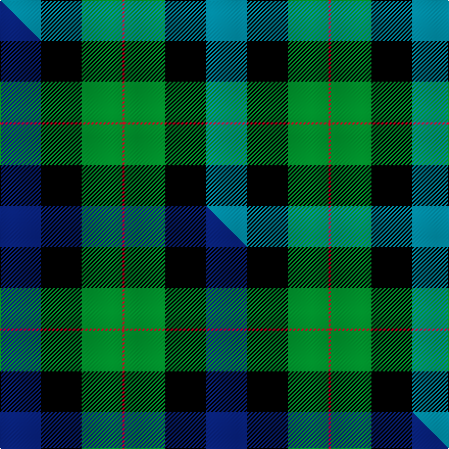

This is one **variant** — a specific cloth: this exact thread count and colourway, with its own
provenance below. It is one weaving of the [sett](/setts/t20k20g20r1/) (the scale-free proportion — the
same cloth at any scale or shade), whose colour order is pattern [BKGR](/stripes/bkgr/).

Part of the [Gunn](/tartans/g/gu/gunn-2/) tartan — the named design grouping this sett with its other cloths.

Sourced from house-of-tartan.  It is a [4 stripe tartan](/stripes/stripes4/).

Original link [http://www.house-of-tartan.scotland.net/house/TartanViewjs.asp?colr=Def&tnam=10459](http://www.house-of-tartan.scotland.net/house/TartanViewjs.asp?colr=Def&tnam=10459)

## Provenance

Earliest known date: 17th July 2011 This is a variation on the original Gunn tartan, created in memory of the designer's grandfather, William Jesse Gunn and intended principally for the designer and his immediate family.

Dataset <small>— provenance for this record, inherited from the source manifest</small>

<dl class="dataset-prov">
<dt>source</dt><dd><a href="/sources/house-of-tartan/">House of Tartan</a></dd>
<dt>data captured from</dt><dd><a href="https://github.com/thetartan/tartan-database/blob/master/data/house-of-tartan/data.csv">https://github.com/thetartan/tartan-database/blob/master/data/house-of-tartan/data.csv</a></dd>
<dt>data date</dt><dd>2017-01-10 <small>(dataset default)</small></dd>
<dt>licence</dt><dd><a href="https://creativecommons.org/licenses/by-nc-nd/4.0/">CC BY-NC-ND 4.0</a></dd>
</dl>

Capture chain <small>— the hands this data passed through, oldest first; each capture carries its own licence</small>

<ol class="capture-chain">
<li><a href="http://www.house-of-tartan.scotland.net/">House of Tartan</a> <small>the weaver/retailer's database — the site is now offline; the URL is kept as the ultimate source's identity</small></li>
<li><a href="https://github.com/thetartan/tartan-database">thetartan/tartan-database</a> <small>2016-2017</small> · <a href="https://creativecommons.org/licenses/by-nc-nd/4.0/">CC BY-NC-ND 4.0</a> <small>Levko Kravets's frozen compilation — the capture we vendored, and where its CC licence text came from</small></li>
<li>this dictionary <small>captured 2026-06-10 · commit 5bf86c7566</small> <small>each re-capture is a git commit to data/sources</small></li>
</ol>

## Thread count
T/40 K40 G40 R/2

One full sett is **202 threads**.

## Palette
<table><thead><tr><th>Colour</th><th>Shade</th><th>OKLCh</th></tr></thead><tbody><tr><td>T</td><td><code style="background-color:#00879F;">#00879F</code> <small style="color:#888">#00879F</small></td><td><small style="color:#888">oklch(57.4% 0.102 216.1)</small></td></tr><tr><td>DR</td><td><code style="background-color:#55120C;">#55120C</code> <small style="color:#888">#55120C</small></td><td><small style="color:#888">oklch(30.0% 0.099 29.3)</small></td></tr><tr><td>G</td><td><code style="background-color:#008B2A;">#008B2A</code> <small style="color:#888">#008B2A</small></td><td><small style="color:#888">oklch(55.4% 0.170 145.9)</small></td></tr><tr><td>K</td><td><code style="background-color:#000000;">#000000</code> <small style="color:#888">#000000</small></td><td><small style="color:#888">oklch(0.0% 0.000 0.0)</small></td></tr><tr><td>R</td><td><code style="background-color:#D60020;">#D60020</code> <small style="color:#888">#D60020</small></td><td><small style="color:#888">oklch(55.2% 0.224 25.5)</small></td></tr></tbody></table>

# Sample pattern

## Compared to the master

This cloth is one sett of its design; the master sett (the exemplar the design is anchored on) is below for comparison.

Its **ΔTartan distance** from the master is **0.16** — the same measure the nearest-tartans table ranks by (0 is identical; a re-scale of the same cloth is near 0, a recolour or a different proportion further).

<figure class="master-compare" style="margin:0">

this sett
master sett ★

<figcaption style="color:#888;font-size:smaller">One weave of this sett against the <a href="/setts/db20k20g20r1/">master sett ★</a>, split on the diagonal: a shared proportion runs seamlessly across it with only the shades shifting; a different proportion breaks on it.</figcaption>
</figure>

## Nearest tartan variants

The nearest existing variants by ΔTartan distance, with this cloth at the top so the swatches line up against it.

ΔTartan

Threads

Variant

Sett

—

202

<a href="/variants/s4/t20k20g20r1~x2/">Gunn (2011) Personal Tartan</a>

<a href="/ttd/edit/#slug=db20k20g20r1~x2&amp;base=t20k20g20r1~x2" title="compare in the TTD">0.16</a>

202

<a href="/variants/s4/db20k20g20r1~x2/">Gunn 2011, Robert (Personal)</a>

<a href="/ttd/edit/#slug=r1g14k14r2db14lb1~x2&amp;base=t20k20g20r1~x2" title="compare in the TTD">0.96</a>

180

<a href="/variants/s6/r1g14k14r2db14lb1~x2/">Wilson's No.221</a>

<a href="/ttd/edit/#slug=r3db22k11g32ly3~x2&amp;base=t20k20g20r1~x2" title="compare in the TTD">1.12</a>

272

<a href="/variants/s5/r3db22k11g32ly3~x2/">Cultoquhey (Corporate)</a>

<a href="/ttd/edit/#slug=r3db22k11g32y3~x2&amp;base=t20k20g20r1~x2" title="compare in the TTD">1.12</a>

272

<a href="/variants/s5/r3db22k11g32y3~x2/">Cultoquhey Hotel</a>

<a href="/ttd/edit/#slug=dy2g12k10r1t16r2~x4&amp;base=t20k20g20r1~x2" title="compare in the TTD">1.20</a>

328

<a href="/variants/s6/dy2g12k10r1t16r2~x4/">MacWilliam (Clan)</a>

<a href="/ttd/edit/#slug=t12k4g6ly1~x8&amp;base=t20k20g20r1~x2" title="compare in the TTD">1.22</a>

264

<a href="/variants/s4/t12k4g6ly1~x8/">Sinclair of Ulbster</a>

<a href="/ttd/edit/#slug=g21db10k26ly10r1~x2&amp;base=t20k20g20r1~x2" title="compare in the TTD">1.47</a>

228

<a href="/variants/s5/g21db10k26ly10r1~x2/">Charles-Carberry (Personal)</a>

<a href="/ttd/edit/#slug=dg21db10k26ly10r1~x2&amp;base=t20k20g20r1~x2" title="compare in the TTD">1.47</a>

228

<a href="/variants/s5/dg21db10k26ly10r1~x2/">Charles-Carberry (Personal)</a>

<a href="/ttd/edit/#slug=db31g2k20y2dg24~x2~g2408144-dg1806142&amp;base=t20k20g20r1~x2" title="compare in the TTD">1.49</a>

206

<a href="/variants/s5/db31g2k20y2dg24~x2~g2408144-dg1806142/">Landels (Personal)</a>

<a href="/ttd/edit/#slug=k4w2g8db8w1&amp;base=t20k20g20r1~x2" title="compare in the TTD">1.63</a>

41

<a href="/variants/s5/k4w2g8db8w1/">Douglas Green</a>

## Neighbour map

Every grey dot is one of 13656 variants placed by the first two principal components of the ΔTartan feature space (42% of its variance). Red is this tartan; blue dots are its nearest — click one to open its page. The map is a flat projection of a many-dimensional space — [how to read it](/posts/neighbourhood-maps/).

<svg viewBox="0 0 640 380" role="img" style="max-width:100%;height:auto;border:1px solid #e0e0e0;border-radius:4px;display:block" xmlns="http://www.w3.org/2000/svg"><image href="/nn/cloud.v1.png" width="640" height="380"/><a href="/variants/s4/db20k20g20r1~x2/"><circle cx="165.1" cy="220.0" r="4" fill="#3465a4"><title>Gunn 2011, Robert (Personal)</title></circle></a><a href="/variants/s6/r1g14k14r2db14lb1~x2/"><circle cx="125.0" cy="170.9" r="4" fill="#3465a4"><title>Wilson's No.221</title></circle></a><a href="/variants/s5/r3db22k11g32ly3~x2/"><circle cx="183.7" cy="194.2" r="4" fill="#3465a4"><title>Cultoquhey (Corporate)</title></circle></a><a href="/variants/s5/r3db22k11g32y3~x2/"><circle cx="188.6" cy="195.3" r="4" fill="#3465a4"><title>Cultoquhey Hotel</title></circle></a><a href="/variants/s6/dy2g12k10r1t16r2~x4/"><circle cx="148.7" cy="170.8" r="4" fill="#3465a4"><title>MacWilliam (Clan)</title></circle></a><a href="/variants/s4/t12k4g6ly1~x8/"><circle cx="155.2" cy="219.6" r="4" fill="#3465a4"><title>Sinclair of Ulbster</title></circle></a><a href="/variants/s5/g21db10k26ly10r1~x2/"><circle cx="149.5" cy="170.4" r="4" fill="#3465a4"><title>Charles-Carberry (Personal)</title></circle></a><a href="/variants/s5/dg21db10k26ly10r1~x2/"><circle cx="164.1" cy="171.8" r="4" fill="#3465a4"><title>Charles-Carberry (Personal)</title></circle></a><a href="/variants/s5/db31g2k20y2dg24~x2~g2408144-dg1806142/"><circle cx="192.9" cy="191.4" r="4" fill="#3465a4"><title>Landels (Personal)</title></circle></a><a href="/variants/s5/k4w2g8db8w1/"><circle cx="128.8" cy="236.7" r="4" fill="#3465a4"><title>Douglas Green</title></circle></a><circle cx="155.7" cy="220.6" r="5" fill="#c00000"/><text x="320" y="376" text-anchor="middle" font-size="11" fill="#999">ground</text><text x="11" y="190" text-anchor="middle" font-size="11" fill="#999" transform="rotate(-90 11 190)">complexity</text></svg>

ID: /variants/s4/t20k20g20r1~x2/
