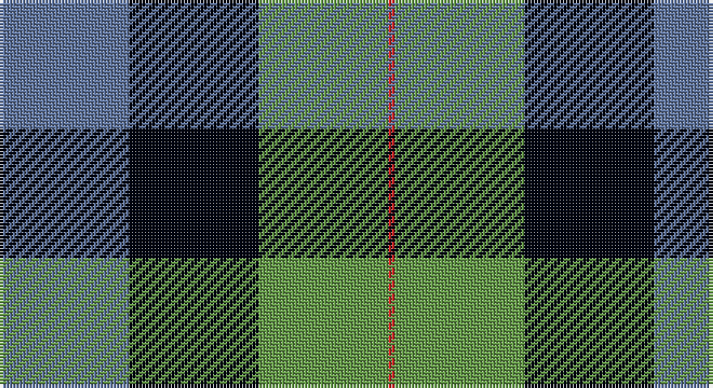

This page is one **sett** — a single exact thread-count. It belongs to the [tartan](/setts/t20k20g20r1/)
(the same proportion at any scale), whose colour order is pattern [BKGR](/stripes/bkgr/).

Sourced from register-of-tartans.  It is a [4 stripe tartan](/stripes/stripes4/).

Original link https://www.tartanregister.gov.uk/tartanDetails.aspx?ref=10460

## Register references

External register numbers recorded for this tartan.

- Scottish Register of Tartans: [10460](https://www.tartanregister.gov.uk/tartanDetails.aspx?ref=10460)

## Thread count
B/40 K40 LG40 R/2

One full sett is **202 threads**.

## Palette

Palette: <strong>Tartan Register</strong> <small style="color:#888">(2 of 4 colours)</small>
<table><thead><tr><th>Colour</th><th>Threads</th><th>Shade</th><th>Base</th><th>OKLCh</th></tr></thead><tbody><tr><td>B/</td><td style="text-align:right;font-variant-numeric:tabular-nums">40</td><td><code style="background-color:#5F749C;">#5F749C</code> <small style="color:#888">#5F749C</small></td><td>B <code style="background-color:#2A418A;">#2A418A</code></td><td><small style="color:#888">oklch(55.8% 0.067 262.9)</small></td></tr><tr><td>K</td><td style="text-align:right;font-variant-numeric:tabular-nums">40</td><td><code style="background-color:#010512;">#010512</code> <small style="color:#888">#010512</small></td><td>K <code style="background-color:#000000;">#000000</code></td><td><small style="color:#888">oklch(11.8% 0.035 259.5)</small></td></tr><tr><td>LG</td><td style="text-align:right;font-variant-numeric:tabular-nums">40</td><td><code style="background-color:#649848;">#649848</code> <small style="color:#888">#649848</small></td><td>G <code style="background-color:#006100;">#006100</code></td><td><small style="color:#888">oklch(62.4% 0.125 135.7)</small></td></tr><tr><td>R/</td><td style="text-align:right;font-variant-numeric:tabular-nums">2</td><td><code style="background-color:#CA2625;">#CA2625</code> <small style="color:#888">#CA2625</small></td><td>R <code style="background-color:#CC0000;">#CC0000</code></td><td><small style="color:#888">oklch(54.4% 0.199 27.2)</small></td></tr></tbody></table>

# Sample pattern

## Nearest tartans

The nearest existing variants by ΔTartan distance, with this tartan at the top so the swatches line up against it.

ΔTartan

Tartan

Sett

—

<a href="/ttd/edit/#slug=t20k20g20r1~x2">Gunn 2011, Robert (Personal)</a> <a class="nn-out" href="/variants/s4/t20k20g20r1~x2/" title="open its dictionary page">↗</a>

1.13

<a href="/ttd/edit/#slug=b20k20g20r1~x2&amp;base=t20k20g20r1~x2">Gunn (2011) Personal Tartan</a> <a class="nn-out" href="/variants/s4/b20k20g20r1~x2/" title="open its dictionary page">↗</a>

1.29

<a href="/ttd/edit/#slug=k2g12k11b12w1~x2&amp;base=t20k20g20r1~x2">MacKirdy</a> <a class="nn-out" href="/variants/s5/k2g12k11b12w1~x2/" title="open its dictionary page">↗</a>

1.40

<a href="/ttd/edit/#slug=dg21t10k26w10r1~x2&amp;base=t20k20g20r1~x2">Charles-Carberry (Personal)</a> <a class="nn-out" href="/variants/s5/dg21t10k26w10r1~x2/" title="open its dictionary page">↗</a>

1.54

<a href="/ttd/edit/#slug=k2g12k11db12w1~x2&amp;base=t20k20g20r1~x2">MacKirdy</a> <a class="nn-out" href="/variants/s5/k2g12k11db12w1~x2/" title="open its dictionary page">↗</a>

1.65

<a href="/ttd/edit/#slug=db2lo21db11dt21db1~x2&amp;base=t20k20g20r1~x2">St. Matthews Check (School)</a> <a class="nn-out" href="/variants/s5/db2lo21db11dt21db1~x2/" title="open its dictionary page">↗</a>

1.67

<a href="/ttd/edit/#slug=dg21db10k26ly10r1~x2&amp;base=t20k20g20r1~x2">Charles-Carberry (Personal)</a> <a class="nn-out" href="/variants/s5/dg21db10k26ly10r1~x2/" title="open its dictionary page">↗</a>

1.69

<a href="/variants/s6/b12k4g6ly1~x8/">Sinclair of Ulbster</a>

1.70

<a href="/ttd/edit/#slug=k4w1g13k11db11lb3~x4&amp;base=t20k20g20r1~x2">New York Fire Department Pipe Band</a> <a class="nn-out" href="/variants/s6/k4w1g13k11db11lb3~x4/" title="open its dictionary page">↗</a>

1.72

<a href="/ttd/edit/#slug=db2g12k13w1db13w2~x2&amp;base=t20k20g20r1~x2">Herd Family Tartan</a> <a class="nn-out" href="/variants/s6/db2g12k13w1db13w2~x2/" title="open its dictionary page">↗</a>

1.74

<a href="/ttd/edit/#slug=db14g21db4r21db14ly2~x2&amp;base=t20k20g20r1~x2">Kilgour</a> <a class="nn-out" href="/variants/s6/db14g21db4r21db14ly2~x2/" title="open its dictionary page">↗</a>

## Neighbour map

Every grey dot is one of 14360 variants placed by the first two principal components of the ΔTartan feature space (44% of its variance). Red is this tartan; blue dots are its nearest — click one to open its page.

<svg viewBox="0 0 640 380" role="img" style="max-width:100%;height:auto;border:1px solid #e0e0e0;border-radius:4px;display:block" xmlns="http://www.w3.org/2000/svg"><image href="/nn/cloud.v1.png" width="640" height="380"/><a href="/variants/s4/b20k20g20r1~x2/"><circle cx="201.7" cy="248.6" r="4" fill="#3465a4"><title>Gunn (2011) Personal Tartan</title></circle></a><a href="/variants/s5/k2g12k11b12w1~x2/"><circle cx="179.1" cy="234.0" r="4" fill="#3465a4"><title>MacKirdy</title></circle></a><a href="/variants/s5/dg21t10k26w10r1~x2/"><circle cx="180.0" cy="180.6" r="4" fill="#3465a4"><title>Charles-Carberry (Personal)</title></circle></a><a href="/variants/s5/k2g12k11db12w1~x2/"><circle cx="161.1" cy="228.5" r="4" fill="#3465a4"><title>MacKirdy</title></circle></a><a href="/variants/s5/db2lo21db11dt21db1~x2/"><circle cx="254.5" cy="213.0" r="4" fill="#3465a4"><title>St. Matthews Check (School)</title></circle></a><a href="/variants/s5/dg21db10k26ly10r1~x2/"><circle cx="198.3" cy="193.7" r="4" fill="#3465a4"><title>Charles-Carberry (Personal)</title></circle></a><a href="/variants/s6/b12k4g6ly1~x8/"><circle cx="191.9" cy="240.6" r="4" fill="#3465a4"><title>Sinclair of Ulbster</title></circle></a><a href="/variants/s6/k4w1g13k11db11lb3~x4/"><circle cx="153.6" cy="210.2" r="4" fill="#3465a4"><title>New York Fire Department Pipe Band</title></circle></a><a href="/variants/s6/db2g12k13w1db13w2~x2/"><circle cx="187.8" cy="214.3" r="4" fill="#3465a4"><title>Herd Family Tartan</title></circle></a><a href="/variants/s6/db14g21db4r21db14ly2~x2/"><circle cx="185.2" cy="225.7" r="4" fill="#3465a4"><title>Kilgour</title></circle></a><circle cx="175.0" cy="228.8" r="5" fill="#c00000"/></svg>

ID: /variants/s4/t20k20g20r1~x2/
