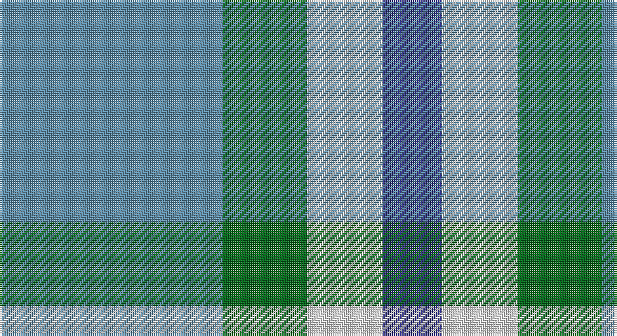

This page is one **sett** — a single exact thread-count. It belongs to the [tartan](/setts/t53g20w18db14/)
(the same proportion at any scale), whose colour order is pattern [BGWB](/stripes/bgwb/).

Sourced from tartans-authority.  It is a [4 stripe tartan](/stripes/stripes4/).

Original link http://www.tartansauthority.com/tartan-ferret/display/6977/

## Register references

External register numbers recorded for this tartan.

- Scottish Tartans Authority (ITI): 6977

## Thread count
B/106 G40 LN36 DB/28

One full sett is **286 threads**.

## Palette

Palette: <strong>Tartan Register</strong>
<table><thead><tr><th>Colour</th><th>Threads</th><th>Shade</th><th>Base</th><th>OKLCh</th></tr></thead><tbody><tr><td>B/</td><td style="text-align:right;font-variant-numeric:tabular-nums">106</td><td><code style="background-color:#5C8CA8;">#5C8CA8</code> <small style="color:#888">#5C8CA8</small></td><td>B <code style="background-color:#2A418A;">#2A418A</code></td><td><small style="color:#888">oklch(61.7% 0.067 235.0)</small></td></tr><tr><td>G</td><td style="text-align:right;font-variant-numeric:tabular-nums">40</td><td><code style="background-color:#006818;">#006818</code> <small style="color:#888">#006818</small></td><td>G <code style="background-color:#006100;">#006100</code></td><td><small style="color:#888">oklch(45.0% 0.142 145.0)</small></td></tr><tr><td>LN</td><td style="text-align:right;font-variant-numeric:tabular-nums">36</td><td><code style="background-color:#E0E0E0;">#E0E0E0</code> <small style="color:#888">#E0E0E0</small></td><td>W <code style="background-color:#F7F7F7;">#F7F7F7</code></td><td><small style="color:#888">oklch(90.7% 0.000 89.9)</small></td></tr><tr><td>DB/</td><td style="text-align:right;font-variant-numeric:tabular-nums">28</td><td><code style="background-color:#2C2C80;">#2C2C80</code> <small style="color:#888">#2C2C80</small></td><td>B <code style="background-color:#2A418A;">#2A418A</code></td><td><small style="color:#888">oklch(35.0% 0.138 276.6)</small></td></tr></tbody></table>

# Sample pattern

## Nearest tartans

The nearest existing variants by ΔTartan distance, with this tartan at the top so the swatches line up against it.

ΔTartan

Tartan

Sett

—

<a href="/ttd/edit/#slug=t53g20w18db14~x2">Leutz (Name?)</a> <a class="nn-out" href="/variants/s4/t53g20w18db14~x2/" title="open its dictionary page">↗</a>

1.34

<a href="/ttd/edit/#slug=b10w3b12ly14r4~x2&amp;base=t53g20w18db14~x2">MacLeod of Argentina</a> <a class="nn-out" href="/variants/s5/b10w3b12ly14r4~x2/" title="open its dictionary page">↗</a>

1.76

<a href="/ttd/edit/#slug=b18w4b3lo12~x2&amp;base=t53g20w18db14~x2">Genesee Community College</a> <a class="nn-out" href="/variants/s4/b18w4b3lo12~x2/" title="open its dictionary page">↗</a>

1.77

<a href="/ttd/edit/#slug=n8y8w4o1~x5&amp;base=t53g20w18db14~x2">Farooq in Livingston (Personal)</a> <a class="nn-out" href="/variants/s4/n8y8w4o1~x5/" title="open its dictionary page">↗</a>

1.81

<a href="/ttd/edit/#slug=o22ly10w3db8~x2&amp;base=t53g20w18db14~x2">Louisburg</a> <a class="nn-out" href="/variants/s4/o22ly10w3db8~x2/" title="open its dictionary page">↗</a>

1.82

<a href="/ttd/edit/#slug=k11t38r11g11k5~x2&amp;base=t53g20w18db14~x2">All as One (Corporate)</a> <a class="nn-out" href="/variants/s5/k11t38r11g11k5~x2/" title="open its dictionary page">↗</a>

1.82

<a href="/ttd/edit/#slug=b3k4b4g9k2~x4&amp;base=t53g20w18db14~x2">Falconer</a> <a class="nn-out" href="/variants/s5/b3k4b4g9k2~x4/" title="open its dictionary page">↗</a>

1.84

<a href="/ttd/edit/#slug=db21g34r14w6~x2&amp;base=t53g20w18db14~x2">Harbison (2015)</a> <a class="nn-out" href="/variants/s4/db21g34r14w6~x2/" title="open its dictionary page">↗</a>

1.86

<a href="/ttd/edit/#slug=db9ly9db9t23r3~x2&amp;base=t53g20w18db14~x2">Tilburg (District)</a> <a class="nn-out" href="/variants/s5/db9ly9db9t23r3~x2/" title="open its dictionary page">↗</a>

1.87

<a href="/ttd/edit/#slug=db3g11t2db11b6g3~x2&amp;base=t53g20w18db14~x2">Unnamed, No 29</a> <a class="nn-out" href="/variants/s6/db3g11t2db11b6g3~x2/" title="open its dictionary page">↗</a>

1.87

<a href="/ttd/edit/#slug=b2g13b11y4w9b2~x2&amp;base=t53g20w18db14~x2">Loch Leven</a> <a class="nn-out" href="/variants/s6/b2g13b11y4w9b2~x2/" title="open its dictionary page">↗</a>

## Neighbour map

Every grey dot is one of 14360 variants placed by the first two principal components of the ΔTartan feature space (44% of its variance). Red is this tartan; blue dots are its nearest — click one to open its page.

<svg viewBox="0 0 640 380" role="img" style="max-width:100%;height:auto;border:1px solid #e0e0e0;border-radius:4px;display:block" xmlns="http://www.w3.org/2000/svg"><image href="/nn/cloud.v1.png" width="640" height="380"/><a href="/variants/s5/b10w3b12ly14r4~x2/"><circle cx="200.6" cy="266.6" r="4" fill="#3465a4"><title>MacLeod of Argentina</title></circle></a><a href="/variants/s4/b18w4b3lo12~x2/"><circle cx="288.0" cy="268.7" r="4" fill="#3465a4"><title>Genesee Community College</title></circle></a><a href="/variants/s4/n8y8w4o1~x5/"><circle cx="179.8" cy="257.0" r="4" fill="#3465a4"><title>Farooq in Livingston (Personal)</title></circle></a><a href="/variants/s4/o22ly10w3db8~x2/"><circle cx="218.7" cy="236.7" r="4" fill="#3465a4"><title>Louisburg</title></circle></a><a href="/variants/s5/k11t38r11g11k5~x2/"><circle cx="228.1" cy="232.4" r="4" fill="#3465a4"><title>All as One (Corporate)</title></circle></a><a href="/variants/s5/b3k4b4g9k2~x4/"><circle cx="180.5" cy="297.0" r="4" fill="#3465a4"><title>Falconer</title></circle></a><a href="/variants/s4/db21g34r14w6~x2/"><circle cx="178.1" cy="269.4" r="4" fill="#3465a4"><title>Harbison (2015)</title></circle></a><a href="/variants/s5/db9ly9db9t23r3~x2/"><circle cx="194.3" cy="246.6" r="4" fill="#3465a4"><title>Tilburg (District)</title></circle></a><a href="/variants/s6/db3g11t2db11b6g3~x2/"><circle cx="198.5" cy="274.3" r="4" fill="#3465a4"><title>Unnamed, No 29</title></circle></a><a href="/variants/s6/b2g13b11y4w9b2~x2/"><circle cx="131.2" cy="234.4" r="4" fill="#3465a4"><title>Loch Leven</title></circle></a><circle cx="199.2" cy="285.9" r="5" fill="#c00000"/></svg>

ID: /variants/s4/t53g20w18db14~x2/
