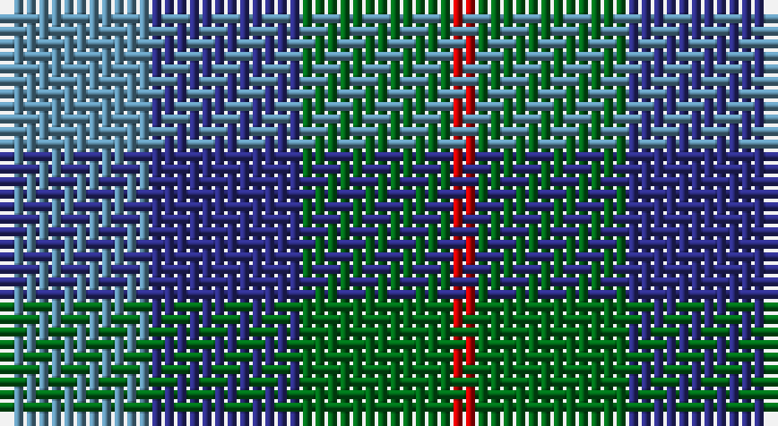

This page is one **sett** — a single exact thread-count. It belongs to the [tartan](/setts/t6db6g6r1/)
(the same proportion at any scale), whose colour order is pattern [BBGR](/stripes/bbgr/).

Sourced from register-of-tartans.  It is a [4 stripe tartan](/stripes/stripes4/).

Original link https://www.tartanregister.gov.uk/tartanDetails.aspx?ref=3184

## Register references

External register numbers recorded for this tartan.

- Scottish Register of Tartans: [3184](https://www.tartanregister.gov.uk/tartanDetails.aspx?ref=3184)
- Scottish Tartans Authority (ITI): 5563

## Thread count
Ba/12 DBa12 G12 Ra/2

One full sett is **62 threads**.

## Palette

Palette: <strong>Tartan Register</strong>
<table><thead><tr><th>Colour</th><th>Threads</th><th>Shade</th><th>Base</th><th>OKLCh</th></tr></thead><tbody><tr><td>Ba/</td><td style="text-align:right;font-variant-numeric:tabular-nums">12</td><td><code style="background-color:#5C8CA8;">#5C8CA8</code> <small style="color:#888">#5C8CA8</small></td><td>B <code style="background-color:#2A418A;">#2A418A</code></td><td><small style="color:#888">oklch(61.7% 0.067 235.0)</small></td></tr><tr><td>DBa</td><td style="text-align:right;font-variant-numeric:tabular-nums">12</td><td><code style="background-color:#2C2C80;">#2C2C80</code> <small style="color:#888">#2C2C80</small></td><td>B <code style="background-color:#2A418A;">#2A418A</code></td><td><small style="color:#888">oklch(35.0% 0.138 276.6)</small></td></tr><tr><td>G</td><td style="text-align:right;font-variant-numeric:tabular-nums">12</td><td><code style="background-color:#006818;">#006818</code> <small style="color:#888">#006818</small></td><td>G <code style="background-color:#006100;">#006100</code></td><td><small style="color:#888">oklch(45.0% 0.142 145.0)</small></td></tr><tr><td>Ra/</td><td style="text-align:right;font-variant-numeric:tabular-nums">2</td><td><code style="background-color:#C80000;">#C80000</code> <small style="color:#888">#C80000</small></td><td>R <code style="background-color:#CC0000;">#CC0000</code></td><td><small style="color:#888">oklch(52.3% 0.215 29.2)</small></td></tr></tbody></table>

# Sample pattern

## Nearest tartans

The nearest existing variants by ΔTartan distance, with this tartan at the top so the swatches line up against it.

ΔTartan

Tartan

Sett

—

<a href="/ttd/edit/#slug=t6db6g6r1~x2">Norwich No.040</a> <a class="nn-out" href="/variants/s4/t6db6g6r1~x2/" title="open its dictionary page">↗</a>

0.44

<a href="/ttd/edit/#slug=b6db6g6r1~x2&amp;base=t6db6g6r1~x2">Unnamed No 40</a> <a class="nn-out" href="/variants/s4/b6db6g6r1~x2/" title="open its dictionary page">↗</a>

0.91

<a href="/ttd/edit/#slug=b6db6dg6r1~x2&amp;base=t6db6g6r1~x2">Unidentified No 40</a> <a class="nn-out" href="/variants/s4/b6db6dg6r1~x2/" title="open its dictionary page">↗</a>

1.40

<a href="/ttd/edit/#slug=db3g11t2db11b6g3~x2&amp;base=t6db6g6r1~x2">Unnamed, No 29</a> <a class="nn-out" href="/variants/s6/db3g11t2db11b6g3~x2/" title="open its dictionary page">↗</a>

1.47

<a href="/ttd/edit/#slug=b25g25k6dt10r6~x2&amp;base=t6db6g6r1~x2">Breon (Personal)</a> <a class="nn-out" href="/variants/s5/b25g25k6dt10r6~x2/" title="open its dictionary page">↗</a>

1.51

<a href="/ttd/edit/#slug=db4k5dg4r1~x4&amp;base=t6db6g6r1~x2">Unidentified pattern #3</a> <a class="nn-out" href="/variants/s4/db4k5dg4r1~x4/" title="open its dictionary page">↗</a>

1.55

<a href="/ttd/edit/#slug=g15dg18dt23w4r8~x2&amp;base=t6db6g6r1~x2">Friebe (2014)</a> <a class="nn-out" href="/variants/s5/g15dg18dt23w4r8~x2/" title="open its dictionary page">↗</a>

1.64

<a href="/ttd/edit/#slug=dg3b6db11t2dg11db3~x2&amp;base=t6db6g6r1~x2">Unidentified No 29</a> <a class="nn-out" href="/variants/s6/dg3b6db11t2dg11db3~x2/" title="open its dictionary page">↗</a>

1.64

<a href="/ttd/edit/#slug=r9b6dt13b21o18w4~x2&amp;base=t6db6g6r1~x2">Fox-Eves Wedding (Personal)</a> <a class="nn-out" href="/variants/s6/r9b6dt13b21o18w4~x2/" title="open its dictionary page">↗</a>

1.68

<a href="/ttd/edit/#slug=g7k6b7k1b2~x2&amp;base=t6db6g6r1~x2">Campbell of Glenlyon</a> <a class="nn-out" href="/variants/s5/g7k6b7k1b2~x2/" title="open its dictionary page">↗</a>

1.68

<a href="/ttd/edit/#slug=g7k6b7k1b2~x4&amp;base=t6db6g6r1~x2">Campbell of Glenlyon Check (Clan)</a> <a class="nn-out" href="/variants/s5/g7k6b7k1b2~x4/" title="open its dictionary page">↗</a>

## Neighbour map

Every grey dot is one of 14360 variants placed by the first two principal components of the ΔTartan feature space (44% of its variance). Red is this tartan; blue dots are its nearest — click one to open its page.

<svg viewBox="0 0 640 380" role="img" style="max-width:100%;height:auto;border:1px solid #e0e0e0;border-radius:4px;display:block" xmlns="http://www.w3.org/2000/svg"><image href="/nn/cloud.v1.png" width="640" height="380"/><a href="/variants/s4/b6db6g6r1~x2/"><circle cx="147.5" cy="297.7" r="4" fill="#3465a4"><title>Unnamed No 40</title></circle></a><a href="/variants/s4/b6db6dg6r1~x2/"><circle cx="139.6" cy="299.6" r="4" fill="#3465a4"><title>Unidentified No 40</title></circle></a><a href="/variants/s6/db3g11t2db11b6g3~x2/"><circle cx="198.5" cy="274.3" r="4" fill="#3465a4"><title>Unnamed, No 29</title></circle></a><a href="/variants/s5/b25g25k6dt10r6~x2/"><circle cx="137.3" cy="276.7" r="4" fill="#3465a4"><title>Breon (Personal)</title></circle></a><a href="/variants/s4/db4k5dg4r1~x4/"><circle cx="169.5" cy="323.7" r="4" fill="#3465a4"><title>Unidentified pattern #3</title></circle></a><a href="/variants/s5/g15dg18dt23w4r8~x2/"><circle cx="104.3" cy="262.5" r="4" fill="#3465a4"><title>Friebe (2014)</title></circle></a><a href="/variants/s6/dg3b6db11t2dg11db3~x2/"><circle cx="212.8" cy="285.9" r="4" fill="#3465a4"><title>Unidentified No 29</title></circle></a><a href="/variants/s6/r9b6dt13b21o18w4~x2/"><circle cx="131.5" cy="258.4" r="4" fill="#3465a4"><title>Fox-Eves Wedding (Personal)</title></circle></a><a href="/variants/s5/g7k6b7k1b2~x2/"><circle cx="204.4" cy="290.4" r="4" fill="#3465a4"><title>Campbell of Glenlyon</title></circle></a><a href="/variants/s5/g7k6b7k1b2~x4/"><circle cx="204.4" cy="290.4" r="4" fill="#3465a4"><title>Campbell of Glenlyon Check (Clan)</title></circle></a><circle cx="154.5" cy="304.5" r="5" fill="#c00000"/></svg>

ID: /variants/s4/t6db6g6r1~x2/
