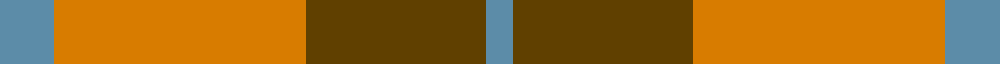
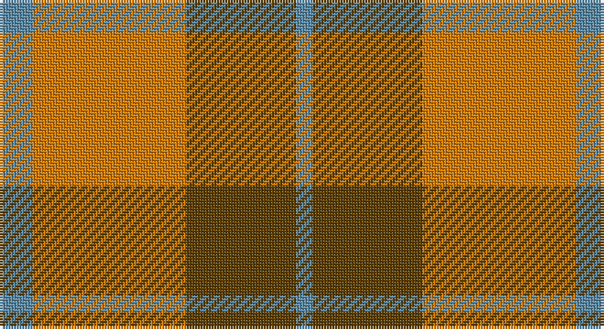

This page is one **sett** — a single exact thread-count. It belongs to the [tartan](/setts/t6lo28dy20t3/)
(the same proportion at any scale), whose colour order is pattern [BGYB](/stripes/bgyb/).

Sourced from house-of-tartan.  It is a [4 stripe tartan](/stripes/stripes4/).

Original link http://www.house-of-tartan.scotland.net/house/TartanViewjs.asp?colr=Def&tnam=389

## Provenance

Earliest known date: pre 2003 Sales help Princess Diana Memorial Trust

## Thread count
B/12 O56 T40 B/6

One full sett is **210 threads**.

## Palette

Palette: <strong>Tartan Register</strong>
<table><thead><tr><th>Colour</th><th>Threads</th><th>Shade</th><th>Base</th><th>OKLCh</th></tr></thead><tbody><tr><td>B/</td><td style="text-align:right;font-variant-numeric:tabular-nums">12</td><td><code style="background-color:#5C8CA8;">#5C8CA8</code> <small style="color:#888">#5C8CA8</small></td><td>B <code style="background-color:#2A418A;">#2A418A</code></td><td><small style="color:#888">oklch(61.7% 0.067 235.0)</small></td></tr><tr><td>O</td><td style="text-align:right;font-variant-numeric:tabular-nums">56</td><td><code style="background-color:#D87C00;">#D87C00</code> <small style="color:#888">#D87C00</small></td><td>Y <code style="background-color:#F2BF00;">#F2BF00</code></td><td><small style="color:#888">oklch(67.3% 0.155 61.8)</small></td></tr><tr><td>T</td><td style="text-align:right;font-variant-numeric:tabular-nums">40</td><td><code style="background-color:#604000;">#604000</code> <small style="color:#888">#604000</small></td><td>G <code style="background-color:#006100;">#006100</code></td><td><small style="color:#888">oklch(39.8% 0.083 76.8)</small></td></tr><tr><td>B/</td><td style="text-align:right;font-variant-numeric:tabular-nums">6</td><td><code style="background-color:#5C8CA8;">#5C8CA8</code> <small style="color:#888">#5C8CA8</small></td><td>B <code style="background-color:#2A418A;">#2A418A</code></td><td><small style="color:#888">oklch(61.7% 0.067 235.0)</small></td></tr></tbody></table>

# Sample pattern

## Nearest tartans

The nearest existing variants by ΔTartan distance, with this tartan at the top so the swatches line up against it.

ΔTartan

Tartan

Sett

—

<a href="/ttd/edit/#slug=t6lo28dy20t3~x2">Prince of Orange Tartan</a> <a class="nn-out" href="/variants/s4/t6lo28dy20t3~x2/" title="open its dictionary page">↗</a>

0.86

<a href="/ttd/edit/#slug=t6lo28o20t3~x2&amp;base=t6lo28dy20t3~x2">Prince of Orange</a> <a class="nn-out" href="/variants/s4/t6lo28o20t3~x2/" title="open its dictionary page">↗</a>

1.26

<a href="/ttd/edit/#slug=g30lo3t8o25~x2&amp;base=t6lo28dy20t3~x2">Dohmen Family (Zuid-Nederland)</a> <a class="nn-out" href="/variants/s4/g30lo3t8o25~x2/" title="open its dictionary page">↗</a>

1.41

<a href="/ttd/edit/#slug=r1g7r9ly1~x4&amp;base=t6lo28dy20t3~x2">Bryce</a> <a class="nn-out" href="/variants/s4/r1g7r9ly1~x4/" title="open its dictionary page">↗</a>

1.49

<a href="/ttd/edit/#slug=r3g20r25w3~x4&amp;base=t6lo28dy20t3~x2">MacKinnon 11</a> <a class="nn-out" href="/variants/s4/r3g20r25w3~x4/" title="open its dictionary page">↗</a>

1.51

<a href="/ttd/edit/#slug=g16r5g2r18k2~x2&amp;base=t6lo28dy20t3~x2">MacDonald, Lord of The Isles (Artef)</a> <a class="nn-out" href="/variants/s5/g16r5g2r18k2~x2/" title="open its dictionary page">↗</a>

1.55

<a href="/variants/s4/r10dg4lo1~x8/">Lugo (2013)</a>

1.61

<a href="/ttd/edit/#slug=ri1r7ri4g7ri1g1~x4&amp;base=t6lo28dy20t3~x2">MacNab, Variant</a> <a class="nn-out" href="/variants/s6/ri1r7ri4g7ri1g1~x4/" title="open its dictionary page">↗</a>

1.61

<a href="/ttd/edit/#slug=dy2y10o15dy10y2~x4&amp;base=t6lo28dy20t3~x2">Harmony 8</a> <a class="nn-out" href="/variants/s5/dy2y10o15dy10y2~x4/" title="open its dictionary page">↗</a>

1.63

<a href="/ttd/edit/#slug=r1r14g7db7r1~x4&amp;base=t6lo28dy20t3~x2">Hugh Fraser of Boblainy</a> <a class="nn-out" href="/variants/s5/r1r14g7db7r1~x4/" title="open its dictionary page">↗</a>

1.63

<a href="/ttd/edit/#slug=ri8r1g4r1g1t2~x2&amp;base=t6lo28dy20t3~x2">Moray of Abercairney</a> <a class="nn-out" href="/variants/s6/ri8r1g4r1g1t2~x2/" title="open its dictionary page">↗</a>

## Neighbour map

Every grey dot is one of 14360 variants placed by the first two principal components of the ΔTartan feature space (44% of its variance). Red is this tartan; blue dots are its nearest — click one to open its page.

<svg viewBox="0 0 640 380" role="img" style="max-width:100%;height:auto;border:1px solid #e0e0e0;border-radius:4px;display:block" xmlns="http://www.w3.org/2000/svg"><image href="/nn/cloud.v1.png" width="640" height="380"/><a href="/variants/s4/t6lo28o20t3~x2/"><circle cx="328.9" cy="260.1" r="4" fill="#3465a4"><title>Prince of Orange</title></circle></a><a href="/variants/s4/g30lo3t8o25~x2/"><circle cx="294.3" cy="259.0" r="4" fill="#3465a4"><title>Dohmen Family (Zuid-Nederland)</title></circle></a><a href="/variants/s4/r1g7r9ly1~x4/"><circle cx="354.9" cy="246.5" r="4" fill="#3465a4"><title>Bryce</title></circle></a><a href="/variants/s4/r3g20r25w3~x4/"><circle cx="338.6" cy="247.0" r="4" fill="#3465a4"><title>MacKinnon 11</title></circle></a><a href="/variants/s5/g16r5g2r18k2~x2/"><circle cx="351.5" cy="241.0" r="4" fill="#3465a4"><title>MacDonald, Lord of The Isles (Artef)</title></circle></a><a href="/variants/s4/r10dg4lo1~x8/"><circle cx="348.8" cy="264.4" r="4" fill="#3465a4"><title>Lugo (2013)</title></circle></a><a href="/variants/s6/ri1r7ri4g7ri1g1~x4/"><circle cx="251.3" cy="249.2" r="4" fill="#3465a4"><title>MacNab, Variant</title></circle></a><a href="/variants/s5/dy2y10o15dy10y2~x4/"><circle cx="228.6" cy="263.1" r="4" fill="#3465a4"><title>Harmony 8</title></circle></a><a href="/variants/s5/r1r14g7db7r1~x4/"><circle cx="340.7" cy="223.6" r="4" fill="#3465a4"><title>Hugh Fraser of Boblainy</title></circle></a><a href="/variants/s6/ri8r1g4r1g1t2~x2/"><circle cx="277.4" cy="215.2" r="4" fill="#3465a4"><title>Moray of Abercairney</title></circle></a><circle cx="321.9" cy="262.6" r="5" fill="#c00000"/></svg>

ID: /variants/s4/t6lo28dy20t3~x2/
