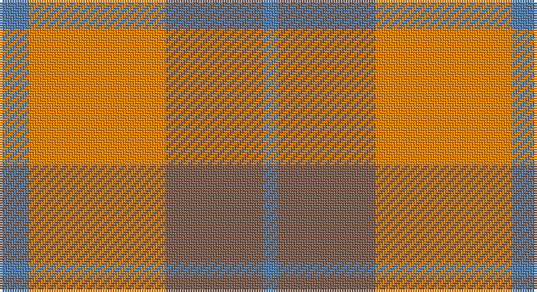

This page is one **sett** — a single exact thread-count. It belongs to the [tartan](/setts/t6lo28o20t3/)
(the same proportion at any scale), whose colour order is pattern [BRYB](/stripes/bryb/).

Sourced from weddslist.  It is a [4 stripe tartan](/stripes/stripes4/).

Original link http://www.weddslist.com/cgi-bin/tartans/pg.pl?source=sts

## Thread count
B/12 O56 LT40 B/6

One full sett is **210 threads**.

## Palette

Palette: <strong>custom</strong>
<table><thead><tr><th>Colour</th><th>Threads</th><th>Shade</th><th>Base</th><th>OKLCh</th></tr></thead><tbody><tr><td>B/</td><td style="text-align:right;font-variant-numeric:tabular-nums">12</td><td><code style="background-color:#5480B0;">#5480B0</code> <small style="color:#888">#5480B0</small></td><td>B <code style="background-color:#2A418A;">#2A418A</code></td><td><small style="color:#888">oklch(58.8% 0.089 251.5)</small></td></tr><tr><td>O</td><td style="text-align:right;font-variant-numeric:tabular-nums">56</td><td><code style="background-color:#FF8500;">#FF8500</code> <small style="color:#888">#FF8500</small></td><td>Y <code style="background-color:#F2BF00;">#F2BF00</code></td><td><small style="color:#888">oklch(74.0% 0.183 55.1)</small></td></tr><tr><td>LT</td><td style="text-align:right;font-variant-numeric:tabular-nums">40</td><td><code style="background-color:#806050;">#806050</code> <small style="color:#888">#806050</small></td><td>R <code style="background-color:#CC0000;">#CC0000</code></td><td><small style="color:#888">oklch(51.7% 0.049 47.8)</small></td></tr><tr><td>B/</td><td style="text-align:right;font-variant-numeric:tabular-nums">6</td><td><code style="background-color:#5480B0;">#5480B0</code> <small style="color:#888">#5480B0</small></td><td>B <code style="background-color:#2A418A;">#2A418A</code></td><td><small style="color:#888">oklch(58.8% 0.089 251.5)</small></td></tr></tbody></table>

# Sample pattern

## Nearest tartans

The nearest existing variants by ΔTartan distance, with this tartan at the top so the swatches line up against it.

ΔTartan

Tartan

Sett

—

<a href="/ttd/edit/#slug=t6lo28o20t3~x2">Prince of Orange</a> <a class="nn-out" href="/variants/s4/t6lo28o20t3~x2/" title="open its dictionary page">↗</a>

0.86

<a href="/ttd/edit/#slug=t6lo28dy20t3~x2&amp;base=t6lo28o20t3~x2">Prince of Orange Tartan</a> <a class="nn-out" href="/variants/s4/t6lo28dy20t3~x2/" title="open its dictionary page">↗</a>

1.54

<a href="/ttd/edit/#slug=g30lo3t8o25~x2&amp;base=t6lo28o20t3~x2">Dohmen Family (Zuid-Nederland)</a> <a class="nn-out" href="/variants/s4/g30lo3t8o25~x2/" title="open its dictionary page">↗</a>

1.70

<a href="/ttd/edit/#slug=o2ly10r15o10ly2~x4&amp;base=t6lo28o20t3~x2">Harmony, 9</a> <a class="nn-out" href="/variants/s5/o2ly10r15o10ly2~x4/" title="open its dictionary page">↗</a>

1.74

<a href="/ttd/edit/#slug=loi36do15loi9r31lo5do4r16~x2&amp;base=t6lo28o20t3~x2">Manhattan Ethnic</a> <a class="nn-out" href="/variants/s7/loi36do15loi9r31lo5do4r16~x2/" title="open its dictionary page">↗</a>

1.75

<a href="/ttd/edit/#slug=w1r5o5ly1~x4&amp;base=t6lo28o20t3~x2">Manx, Mannin Plaid</a> <a class="nn-out" href="/variants/s4/w1r5o5ly1~x4/" title="open its dictionary page">↗</a>

1.81

<a href="/ttd/edit/#slug=o16r2o10r15t5~x2&amp;base=t6lo28o20t3~x2">Mowbray (Moubray) Family Tartan</a> <a class="nn-out" href="/variants/s5/o16r2o10r15t5~x2/" title="open its dictionary page">↗</a>

1.81

<a href="/ttd/edit/#slug=ri8r1g4r1g1t2~x2&amp;base=t6lo28o20t3~x2">Moray of Abercairney</a> <a class="nn-out" href="/variants/s6/ri8r1g4r1g1t2~x2/" title="open its dictionary page">↗</a>

1.92

<a href="/ttd/edit/#slug=r1g7r9ly1~x4&amp;base=t6lo28o20t3~x2">Bryce</a> <a class="nn-out" href="/variants/s4/r1g7r9ly1~x4/" title="open its dictionary page">↗</a>

1.93

<a href="/ttd/edit/#slug=r1r14g7db7r1~x4&amp;base=t6lo28o20t3~x2">Hugh Fraser of Boblainy</a> <a class="nn-out" href="/variants/s5/r1r14g7db7r1~x4/" title="open its dictionary page">↗</a>

1.97

<a href="/ttd/edit/#slug=ri1r7ri4g7ri1g1~x4&amp;base=t6lo28o20t3~x2">MacNab, Variant</a> <a class="nn-out" href="/variants/s6/ri1r7ri4g7ri1g1~x4/" title="open its dictionary page">↗</a>

## Neighbour map

Every grey dot is one of 14360 variants placed by the first two principal components of the ΔTartan feature space (44% of its variance). Red is this tartan; blue dots are its nearest — click one to open its page.

<svg viewBox="0 0 640 380" role="img" style="max-width:100%;height:auto;border:1px solid #e0e0e0;border-radius:4px;display:block" xmlns="http://www.w3.org/2000/svg"><image href="/nn/cloud.v1.png" width="640" height="380"/><a href="/variants/s4/t6lo28dy20t3~x2/"><circle cx="321.9" cy="262.6" r="4" fill="#3465a4"><title>Prince of Orange Tartan</title></circle></a><a href="/variants/s4/g30lo3t8o25~x2/"><circle cx="294.3" cy="259.0" r="4" fill="#3465a4"><title>Dohmen Family (Zuid-Nederland)</title></circle></a><a href="/variants/s5/o2ly10r15o10ly2~x4/"><circle cx="232.7" cy="246.9" r="4" fill="#3465a4"><title>Harmony, 9</title></circle></a><a href="/variants/s7/loi36do15loi9r31lo5do4r16~x2/"><circle cx="244.3" cy="220.8" r="4" fill="#3465a4"><title>Manhattan Ethnic</title></circle></a><a href="/variants/s4/w1r5o5ly1~x4/"><circle cx="241.6" cy="264.2" r="4" fill="#3465a4"><title>Manx, Mannin Plaid</title></circle></a><a href="/variants/s5/o16r2o10r15t5~x2/"><circle cx="368.8" cy="295.2" r="4" fill="#3465a4"><title>Mowbray (Moubray) Family Tartan</title></circle></a><a href="/variants/s6/ri8r1g4r1g1t2~x2/"><circle cx="277.4" cy="215.2" r="4" fill="#3465a4"><title>Moray of Abercairney</title></circle></a><a href="/variants/s4/r1g7r9ly1~x4/"><circle cx="354.9" cy="246.5" r="4" fill="#3465a4"><title>Bryce</title></circle></a><a href="/variants/s5/r1r14g7db7r1~x4/"><circle cx="340.7" cy="223.6" r="4" fill="#3465a4"><title>Hugh Fraser of Boblainy</title></circle></a><a href="/variants/s6/ri1r7ri4g7ri1g1~x4/"><circle cx="251.3" cy="249.2" r="4" fill="#3465a4"><title>MacNab, Variant</title></circle></a><circle cx="328.9" cy="260.1" r="5" fill="#c00000"/></svg>

ID: /variants/s4/t6lo28o20t3~x2/
