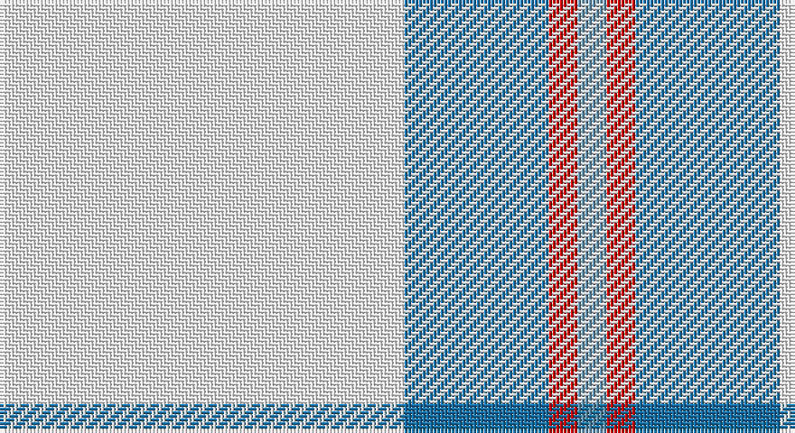

This page is one **sett** — a single exact thread-count. It belongs to the [tartan](/setts/w14b5r1t1/)
(the same proportion at any scale), whose colour order is pattern [BRBW](/stripes/brbw/).

Part of the [Triplett, Jack Arnold](/tartans/triplett-jack-arnold/) tartan — the named design grouping this sett with its other cloths.

Sourced from tartans-authority.  It is a [4 stripe tartan](/stripes/stripes4/).

Original link http://www.tartansauthority.com/tartan-ferret/display/10565/

## Register references

External register numbers recorded for this tartan.

- Scottish Register of Tartans: [10565](https://www.tartanregister.gov.uk/tartanDetails?ref=10565)
- Scottish Tartans Authority (ITI): 10565

## Thread count
W/112 Ba40 R8 B/8

One full sett is **216 threads**.

## Palette

Palette: <strong>Tartan Register</strong>
<table><thead><tr><th>Colour</th><th>Threads</th><th>Shade</th><th>Base</th><th>OKLCh</th></tr></thead><tbody><tr><td>W/</td><td style="text-align:right;font-variant-numeric:tabular-nums">112</td><td><code style="background-color:#FCFCFC;">#FCFCFC</code> <small style="color:#888">#FCFCFC</small></td><td>W <code style="background-color:#F7F7F7;">#F7F7F7</code></td><td><small style="color:#888">oklch(99.1% 0.000 89.9)</small></td></tr><tr><td>Ba</td><td style="text-align:right;font-variant-numeric:tabular-nums">40</td><td><code style="background-color:#1870A4;">#1870A4</code> <small style="color:#888">#1870A4</small></td><td>B <code style="background-color:#2A418A;">#2A418A</code></td><td><small style="color:#888">oklch(52.2% 0.113 241.2)</small></td></tr><tr><td>R</td><td style="text-align:right;font-variant-numeric:tabular-nums">8</td><td><code style="background-color:#C80000;">#C80000</code> <small style="color:#888">#C80000</small></td><td>R <code style="background-color:#CC0000;">#CC0000</code></td><td><small style="color:#888">oklch(52.3% 0.215 29.2)</small></td></tr><tr><td>B/</td><td style="text-align:right;font-variant-numeric:tabular-nums">8</td><td><code style="background-color:#5C8CA8;">#5C8CA8</code> <small style="color:#888">#5C8CA8</small></td><td>B <code style="background-color:#2A418A;">#2A418A</code></td><td><small style="color:#888">oklch(61.7% 0.067 235.0)</small></td></tr></tbody></table>

# Sample pattern

## Compared to the master

This cloth is one sett of its design; the master sett (the exemplar the design is anchored on) is below for comparison.

<figure style="margin:0"><figcaption style="color:#888;font-size:smaller">this sett</figcaption></figure>
<figure style="margin:0"><figcaption style="color:#888;font-size:smaller"><a href="/setts/w35ni12r2n2/">master sett →</a></figcaption></figure>

## Nearest tartans

The nearest existing variants by ΔTartan distance, with this tartan at the top so the swatches line up against it.

ΔTartan

Tartan

Sett

—

<a href="/ttd/edit/#slug=w14b5r1t1~x8">Triplett, Jack Arnold</a> <a class="nn-out" href="/variants/s4/w14b5r1t1~x8/" title="open its dictionary page">↗</a>

1.17

<a href="/ttd/edit/#slug=w80db30lo5ly4~x2&amp;base=w14b5r1t1~x8">Tarbh Deargh (Red Bull)</a> <a class="nn-out" href="/variants/s4/w80db30lo5ly4~x2/" title="open its dictionary page">↗</a>

1.28

<a href="/variants/s4/w35ni12r2n2~x2/">Triplett, Jack Arnold</a>

1.47

<a href="/ttd/edit/#slug=w93lr6w13b35w12lr6&amp;base=w14b5r1t1~x8">Butties</a> <a class="nn-out" href="/variants/s6/w93lr6w13b35w12lr6/" title="open its dictionary page">↗</a>

1.55

<a href="/ttd/edit/#slug=w93o6w13db35w12o6&amp;base=w14b5r1t1~x8">Butties</a> <a class="nn-out" href="/variants/s6/w93o6w13db35w12o6/" title="open its dictionary page">↗</a>

1.60

<a href="/ttd/edit/#slug=w24g2w8db5ly4db5ly4~x2&amp;base=w14b5r1t1~x8">Clackson Arisaid (Name?)</a> <a class="nn-out" href="/variants/s7/w24g2w8db5ly4db5ly4~x2/" title="open its dictionary page">↗</a>

2.04

<a href="/ttd/edit/#slug=db23w8lb2k5w44db4~x2&amp;base=w14b5r1t1~x8">WaterAid</a> <a class="nn-out" href="/variants/s6/db23w8lb2k5w44db4~x2/" title="open its dictionary page">↗</a>

2.05

<a href="/ttd/edit/#slug=db9lb27db2ly4db2lb10db2w3~x2&amp;base=w14b5r1t1~x8">Alaska Highlanders P &amp; D (Corporate)</a> <a class="nn-out" href="/variants/s8/db9lb27db2ly4db2lb10db2w3~x2/" title="open its dictionary page">↗</a>

2.08

<a href="/ttd/edit/#slug=w12r2w12g17w12r2w5p2~x4&amp;base=w14b5r1t1~x8">Milne, Green (Dance)</a> <a class="nn-out" href="/variants/s8/w12r2w12g17w12r2w5p2~x4/" title="open its dictionary page">↗</a>

2.10

<a href="/ttd/edit/#slug=ly5db15lb5db5lb40ly3~x2&amp;base=w14b5r1t1~x8">Legary</a> <a class="nn-out" href="/variants/s6/ly5db15lb5db5lb40ly3~x2/" title="open its dictionary page">↗</a>

2.12

<a href="/ttd/edit/#slug=w20k2w20lo5k3w3lo4k2&amp;base=w14b5r1t1~x8">Guzzo Dress (Personal)</a> <a class="nn-out" href="/variants/s8/w20k2w20lo5k3w3lo4k2/" title="open its dictionary page">↗</a>

## Neighbour map

Every grey dot is one of 14360 variants placed by the first two principal components of the ΔTartan feature space (44% of its variance). Red is this tartan; blue dots are its nearest — click one to open its page.

<svg viewBox="0 0 640 380" role="img" style="max-width:100%;height:auto;border:1px solid #e0e0e0;border-radius:4px;display:block" xmlns="http://www.w3.org/2000/svg"><image href="/nn/cloud.v1.png" width="640" height="380"/><a href="/variants/s4/w80db30lo5ly4~x2/"><circle cx="379.0" cy="159.6" r="4" fill="#3465a4"><title>Tarbh Deargh (Red Bull)</title></circle></a><a href="/variants/s4/w35ni12r2n2~x2/"><circle cx="391.9" cy="163.4" r="4" fill="#3465a4"><title>Triplett, Jack Arnold</title></circle></a><a href="/variants/s6/w93lr6w13b35w12lr6/"><circle cx="421.8" cy="162.7" r="4" fill="#3465a4"><title>Butties</title></circle></a><a href="/variants/s6/w93o6w13db35w12o6/"><circle cx="405.8" cy="156.5" r="4" fill="#3465a4"><title>Butties</title></circle></a><a href="/variants/s7/w24g2w8db5ly4db5ly4~x2/"><circle cx="303.2" cy="162.2" r="4" fill="#3465a4"><title>Clackson Arisaid (Name?)</title></circle></a><a href="/variants/s6/db23w8lb2k5w44db4~x2/"><circle cx="318.6" cy="135.4" r="4" fill="#3465a4"><title>WaterAid</title></circle></a><a href="/variants/s8/db9lb27db2ly4db2lb10db2w3~x2/"><circle cx="332.5" cy="153.9" r="4" fill="#3465a4"><title>Alaska Highlanders P &amp; D (Corporate)</title></circle></a><a href="/variants/s8/w12r2w12g17w12r2w5p2~x4/"><circle cx="297.8" cy="193.0" r="4" fill="#3465a4"><title>Milne, Green (Dance)</title></circle></a><a href="/variants/s6/ly5db15lb5db5lb40ly3~x2/"><circle cx="332.9" cy="176.2" r="4" fill="#3465a4"><title>Legary</title></circle></a><a href="/variants/s8/w20k2w20lo5k3w3lo4k2/"><circle cx="399.2" cy="174.6" r="4" fill="#3465a4"><title>Guzzo Dress (Personal)</title></circle></a><circle cx="365.9" cy="175.1" r="5" fill="#c00000"/></svg>

ID: /variants/s4/w14b5r1t1~x8/
