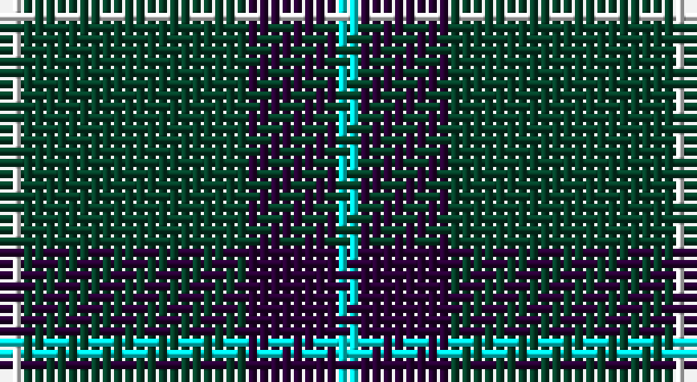

This page is one **sett** — a single exact thread-count. It belongs to the [tartan](/setts/w1dg10dp4lt1/)
(the same proportion at any scale), whose colour order is pattern [WBGW](/stripes/wbgw/).

Sourced from register-of-tartans.  It is a [4 stripe tartan](/stripes/stripes4/).

Original link https://www.tartanregister.gov.uk/tartanDetails.aspx?ref=4737

## Register references

External register numbers recorded for this tartan.

- Scottish Register of Tartans: [4737](https://www.tartanregister.gov.uk/tartanDetails.aspx?ref=4737)
- Scottish Tartans Authority (ITI): 1898
- Scottish Tartans World Register: 1898

## Thread count
W/2 DG20 DP8 LB/2

One full sett is **60 threads**.

## Palette

Palette: <strong>Tartan Register</strong> <small style="color:#888">(2 of 4 colours)</small>
<table><thead><tr><th>Colour</th><th>Threads</th><th>Shade</th><th>Base</th><th>OKLCh</th></tr></thead><tbody><tr><td>W/</td><td style="text-align:right;font-variant-numeric:tabular-nums">2</td><td><code style="background-color:#FCFCFC;">#FCFCFC</code> <small style="color:#888">#FCFCFC</small></td><td>W <code style="background-color:#F7F7F7;">#F7F7F7</code></td><td><small style="color:#888">oklch(99.1% 0.000 89.9)</small></td></tr><tr><td>DG</td><td style="text-align:right;font-variant-numeric:tabular-nums">20</td><td><code style="background-color:#044028;">#044028</code> <small style="color:#888">#044028</small></td><td>G <code style="background-color:#006100;">#006100</code></td><td><small style="color:#888">oklch(32.9% 0.072 160.0)</small></td></tr><tr><td>DP</td><td style="text-align:right;font-variant-numeric:tabular-nums">8</td><td><code style="background-color:#280034;">#280034</code> <small style="color:#888">#280034</small></td><td>B <code style="background-color:#2A418A;">#2A418A</code></td><td><small style="color:#888">oklch(20.5% 0.100 316.9)</small></td></tr><tr><td>LB/</td><td style="text-align:right;font-variant-numeric:tabular-nums">2</td><td><code style="background-color:#00FCFC;">#00FCFC</code> <small style="color:#888">#00FCFC</small></td><td>W <code style="background-color:#F7F7F7;">#F7F7F7</code></td><td><small style="color:#888">oklch(89.7% 0.153 194.8)</small></td></tr></tbody></table>

# Sample pattern

## Nearest tartans

The nearest existing variants by ΔTartan distance, with this tartan at the top so the swatches line up against it.

ΔTartan

Tartan

Sett

—

<a href="/ttd/edit/#slug=w1dg10dp4lt1~x2">Wilson's No.205</a> <a class="nn-out" href="/variants/s4/w1dg10dp4lt1~x2/" title="open its dictionary page">↗</a>

0.92

<a href="/ttd/edit/#slug=k62n24lo5w8~x2&amp;base=w1dg10dp4lt1~x2">Perry, Alex (Personal)</a> <a class="nn-out" href="/variants/s4/k62n24lo5w8~x2/" title="open its dictionary page">↗</a>

1.13

<a href="/ttd/edit/#slug=k61gi10g20w4~x2&amp;base=w1dg10dp4lt1~x2">Wesley Owen 2010 (Personal)</a> <a class="nn-out" href="/variants/s4/k61gi10g20w4~x2/" title="open its dictionary page">↗</a>

1.16

<a href="/ttd/edit/#slug=dp4g10r1w1~x2&amp;base=w1dg10dp4lt1~x2">Wilson's No.189</a> <a class="nn-out" href="/variants/s4/dp4g10r1w1~x2/" title="open its dictionary page">↗</a>

1.33

<a href="/ttd/edit/#slug=dt62w11k4t17~x2&amp;base=w1dg10dp4lt1~x2">Thunderlord (Celtic Group, USA)</a> <a class="nn-out" href="/variants/s4/dt62w11k4t17~x2/" title="open its dictionary page">↗</a>

1.36

<a href="/ttd/edit/#slug=dg4db12r3db12dg32lb4&amp;base=w1dg10dp4lt1~x2">MacIntyre L</a> <a class="nn-out" href="/variants/s6/dg4db12r3db12dg32lb4/" title="open its dictionary page">↗</a>

1.38

<a href="/ttd/edit/#slug=g4db12r3db12g32w4~x2&amp;base=w1dg10dp4lt1~x2">MacIntyre Hunting (VS)</a> <a class="nn-out" href="/variants/s6/g4db12r3db12g32w4~x2/" title="open its dictionary page">↗</a>

1.39

<a href="/ttd/edit/#slug=g10k2dp5g1~x8&amp;base=w1dg10dp4lt1~x2">Bumbee #1 (Fashion)</a> <a class="nn-out" href="/variants/s4/g10k2dp5g1~x8/" title="open its dictionary page">↗</a>

1.40

<a href="/ttd/edit/#slug=k37w9k3dg9w3~x2&amp;base=w1dg10dp4lt1~x2">Glen Coe Trade Tartan</a> <a class="nn-out" href="/variants/s5/k37w9k3dg9w3~x2/" title="open its dictionary page">↗</a>

1.42

<a href="/ttd/edit/#slug=r1k10n2lb5k5r1~x4&amp;base=w1dg10dp4lt1~x2">Callaway (Corporate)</a> <a class="nn-out" href="/variants/s6/r1k10n2lb5k5r1~x4/" title="open its dictionary page">↗</a>

1.45

<a href="/ttd/edit/#slug=g47r3g6db35lo3~x2&amp;base=w1dg10dp4lt1~x2">Gracie (Name)</a> <a class="nn-out" href="/variants/s5/g47r3g6db35lo3~x2/" title="open its dictionary page">↗</a>

## Neighbour map

Every grey dot is one of 14360 variants placed by the first two principal components of the ΔTartan feature space (44% of its variance). Red is this tartan; blue dots are its nearest — click one to open its page.

<svg viewBox="0 0 640 380" role="img" style="max-width:100%;height:auto;border:1px solid #e0e0e0;border-radius:4px;display:block" xmlns="http://www.w3.org/2000/svg"><image href="/nn/cloud.v1.png" width="640" height="380"/><a href="/variants/s4/k62n24lo5w8~x2/"><circle cx="342.0" cy="212.9" r="4" fill="#3465a4"><title>Perry, Alex (Personal)</title></circle></a><a href="/variants/s4/k61gi10g20w4~x2/"><circle cx="360.4" cy="212.1" r="4" fill="#3465a4"><title>Wesley Owen 2010 (Personal)</title></circle></a><a href="/variants/s4/dp4g10r1w1~x2/"><circle cx="342.5" cy="224.4" r="4" fill="#3465a4"><title>Wilson's No.189</title></circle></a><a href="/variants/s4/dt62w11k4t17~x2/"><circle cx="387.2" cy="206.4" r="4" fill="#3465a4"><title>Thunderlord (Celtic Group, USA)</title></circle></a><a href="/variants/s6/dg4db12r3db12dg32lb4/"><circle cx="301.0" cy="219.4" r="4" fill="#3465a4"><title>MacIntyre L</title></circle></a><a href="/variants/s6/g4db12r3db12g32w4~x2/"><circle cx="294.7" cy="211.8" r="4" fill="#3465a4"><title>MacIntyre Hunting (VS)</title></circle></a><a href="/variants/s4/g10k2dp5g1~x8/"><circle cx="355.3" cy="264.8" r="4" fill="#3465a4"><title>Bumbee #1 (Fashion)</title></circle></a><a href="/variants/s5/k37w9k3dg9w3~x2/"><circle cx="372.6" cy="208.0" r="4" fill="#3465a4"><title>Glen Coe Trade Tartan</title></circle></a><a href="/variants/s6/r1k10n2lb5k5r1~x4/"><circle cx="308.7" cy="209.9" r="4" fill="#3465a4"><title>Callaway (Corporate)</title></circle></a><a href="/variants/s5/g47r3g6db35lo3~x2/"><circle cx="356.4" cy="211.1" r="4" fill="#3465a4"><title>Gracie (Name)</title></circle></a><circle cx="334.0" cy="225.8" r="5" fill="#c00000"/></svg>

ID: /variants/s4/w1dg10dp4lt1~x2/
