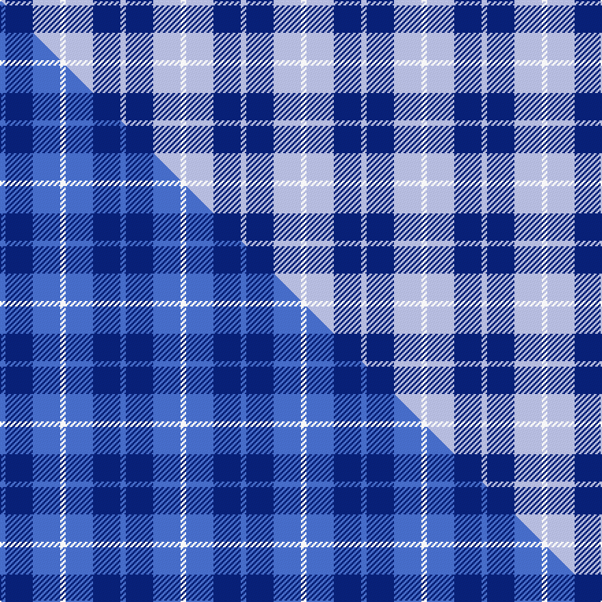

This is one **variant** — a specific cloth: this exact thread count and colourway, with its own
provenance below. It is one weaving of the [sett](/tartans/m/ma/manx-cornaa-2/) (the scale-free proportion — the
same cloth at any scale or shade), whose colour order is pattern [WBWW](/stripes/wbww/).

Part of the [Manx, Cornaa](/tartans/m/ma/manx-cornaa-2/) tartan — the named design grouping this sett with its other cloths.

Sourced from tartans-authority.  It is a [4 stripe tartan](/stripes/stripes4/).

Original link <code>http://www.tartansauthority.com/tartan-ferret/display/44/</code> — retired · [Internet Archive copy](https://web.archive.org/web/*/http://www.tartansauthority.com/tartan-ferret/display/44/*)

Dataset <small>— provenance for this record, inherited from the source manifest</small>

<dl class="dataset-prov">
<dt>source</dt><dd><a href="/sources/tartans-authority/">Scottish Tartans Authority</a></dd>
<dt>data captured from</dt><dd><a href="https://github.com/thetartan/tartan-database/blob/master/data/tartans-authority/data.csv">https://github.com/thetartan/tartan-database/blob/master/data/tartans-authority/data.csv</a></dd>
<dt>data date</dt><dd>1981 <small>(this record)</small></dd>
<dt>licence</dt><dd><a href="https://creativecommons.org/licenses/by-nc-nd/4.0/">CC BY-NC-ND 4.0</a></dd>
</dl>

Capture chain <small>— the hands this data passed through, oldest first; each capture carries its own licence</small>

<ol class="capture-chain">
<li><a href="https://www.tartansauthority.com/">Scottish Tartans Authority</a> <small>the heritage body’s archive — its tartan-ferret record browser is retired; dead record links are shown unlinked, with an Internet Archive copy (ITI numbers are not SRT references)</small></li>
<li><a href="https://github.com/thetartan/tartan-database">thetartan/tartan-database</a> <small>2016-2017</small> · <a href="https://creativecommons.org/licenses/by-nc-nd/4.0/">CC BY-NC-ND 4.0</a> <small>Levko Kravets's frozen compilation — the capture we vendored, and where its CC licence text came from</small></li>
<li>this dictionary <small>captured 2026-06-10 · commit 5bf86c7566</small> <small>each re-capture is a git commit to data/sources</small></li>
</ol>

## Register references

External register numbers recorded for this tartan.

- Scottish Tartans Authority (ITI): 44

## Thread count
LB/4 DB20 LB20 W/4

One full sett is **88 threads**.

## Palette
<table><thead><tr><th>Colour</th><th>Shade</th><th>OKLCh</th></tr></thead><tbody><tr><td>LB</td><td><code style="background-color:#B5BBDE;">#B5BBDE</code> <small style="color:#888">#B5BBDE</small></td><td><small style="color:#888">oklch(79.9% 0.050 277.6)</small></td></tr><tr><td>DB</td><td><code style="background-color:#082077;">#082077</code> <small style="color:#888">#082077</small></td><td><small style="color:#888">oklch(30.0% 0.149 265.1)</small></td></tr><tr><td>W</td><td><code style="background-color:#F7F7F7;">#F7F7F7</code> <small style="color:#888">#F7F7F7</small></td><td><small style="color:#888">oklch(97.6% 0.000 89.9)</small></td></tr></tbody></table>

# Sample pattern

## Compared to the master

This cloth is one sett of its design; the master sett (the exemplar the design is anchored on) is below for comparison.

Its **ΔTartan distance** from the master is **0.18** — the same measure the nearest-tartans table ranks by (0 is identical; a re-scale of the same cloth is near 0, a recolour or a different proportion further).

<figure class="master-compare" style="margin:0">

this sett
master sett ★

<figcaption style="color:#888;font-size:smaller">One weave of this sett against the <a href="/setts/b1db5b5w1/">master sett ★</a>, split on the diagonal: a shared proportion runs seamlessly across it with only the shades shifting; a different proportion breaks on it.</figcaption>
</figure>

## Nearest tartan variants

The nearest existing variants by ΔTartan distance, with this cloth at the top so the swatches line up against it.

ΔTartan

Threads

Variant

Sett

—

88

<a href="/variants/s4/w1lb5db5lb1~x4/">Manx Cornaa (Personal)</a>

<a href="/ttd/edit/#slug=b1db5b5w1~x4&amp;base=w1lb5db5lb1~x4" title="compare in the TTD">0.18</a>

88

<a href="/variants/s4/b1db5b5w1~x4/">Manx, Cornaa</a>

<a href="/ttd/edit/#slug=g2w29lb12db29lb2~x2&amp;base=w1lb5db5lb1~x4" title="compare in the TTD">1.29</a>

288

<a href="/variants/s5/g2w29lb12db29lb2~x2/">Wallace Blue Dress (Dance)</a>

<a href="/ttd/edit/#slug=dg4lb10db10lb1~x4&amp;base=w1lb5db5lb1~x4" title="compare in the TTD">1.62</a>

180

<a href="/variants/s4/dg4lb10db10lb1~x4/">Baker City (District)</a>

<a href="/ttd/edit/#slug=lb37w9lb3db9w3~x2&amp;base=w1lb5db5lb1~x4" title="compare in the TTD">1.85</a>

164

<a href="/variants/s5/lb37w9lb3db9w3~x2/">Loch Lomond</a>

<a href="/ttd/edit/#slug=db24lb13db4lb4w2~x2&amp;base=w1lb5db5lb1~x4" title="compare in the TTD">1.90</a>

136

<a href="/variants/s5/db24lb13db4lb4w2~x2/">Gallaecia (Unofficial) (District)</a>

<a href="/ttd/edit/#slug=db24t13db4t4w2~x2&amp;base=w1lb5db5lb1~x4" title="compare in the TTD">1.90</a>

136

<a href="/variants/s5/db24t13db4t4w2~x2/">Gallaecia - Galicia National</a>

<a href="/ttd/edit/#slug=w4db25lb25db2lb5w2~x2&amp;base=w1lb5db5lb1~x4" title="compare in the TTD">1.92</a>

240

<a href="/variants/s6/w4db25lb25db2lb5w2~x2/">Douglas Variation</a>

<a href="/ttd/edit/#slug=w4db25b25db2b5w2~x2&amp;base=w1lb5db5lb1~x4" title="compare in the TTD">1.92</a>

240

<a href="/variants/s6/w4db25b25db2b5w2~x2/">Douglas, Variation</a>

<a href="/ttd/edit/#slug=lb40w25db16lb8db4~x2&amp;base=w1lb5db5lb1~x4" title="compare in the TTD">1.94</a>

284

<a href="/variants/s5/lb40w25db16lb8db4~x2/">Louise Beveridge (Personal)</a>

<a href="/ttd/edit/#slug=w4lb28db49y3~x2&amp;base=w1lb5db5lb1~x4" title="compare in the TTD">1.95</a>

322

<a href="/variants/s4/w4lb28db49y3~x2/">McKerrell of Hillhouse Htg (Clan)</a>

## Neighbour map

Every grey dot is one of 13662 variants placed by the first two principal components of the ΔTartan feature space (42% of its variance). Red is this tartan; blue dots are its nearest — click one to open its page. The map is a flat projection of a many-dimensional space — [how to read it](/posts/neighbourhood-maps/).

<svg viewBox="0 0 640 380" role="img" style="max-width:100%;height:auto;border:1px solid #e0e0e0;border-radius:4px;display:block" xmlns="http://www.w3.org/2000/svg"><image href="/nn/cloud.v1.png" width="640" height="380"/><a href="/variants/s4/b1db5b5w1~x4/"><circle cx="346.6" cy="322.0" r="4" fill="#3465a4"><title>Manx, Cornaa</title></circle></a><a href="/variants/s5/g2w29lb12db29lb2~x2/"><circle cx="237.4" cy="222.1" r="4" fill="#3465a4"><title>Wallace Blue Dress (Dance)</title></circle></a><a href="/variants/s4/dg4lb10db10lb1~x4/"><circle cx="275.4" cy="280.2" r="4" fill="#3465a4"><title>Baker City (District)</title></circle></a><a href="/variants/s5/lb37w9lb3db9w3~x2/"><circle cx="457.6" cy="246.4" r="4" fill="#3465a4"><title>Loch Lomond</title></circle></a><a href="/variants/s5/db24lb13db4lb4w2~x2/"><circle cx="396.3" cy="248.9" r="4" fill="#3465a4"><title>Gallaecia (Unofficial) (District)</title></circle></a><a href="/variants/s5/db24t13db4t4w2~x2/"><circle cx="435.0" cy="262.6" r="4" fill="#3465a4"><title>Gallaecia - Galicia National</title></circle></a><a href="/variants/s6/w4db25lb25db2lb5w2~x2/"><circle cx="338.4" cy="234.9" r="4" fill="#3465a4"><title>Douglas Variation</title></circle></a><a href="/variants/s6/w4db25b25db2b5w2~x2/"><circle cx="369.6" cy="243.6" r="4" fill="#3465a4"><title>Douglas, Variation</title></circle></a><a href="/variants/s5/lb40w25db16lb8db4~x2/"><circle cx="328.3" cy="279.2" r="4" fill="#3465a4"><title>Louise Beveridge (Personal)</title></circle></a><a href="/variants/s4/w4lb28db49y3~x2/"><circle cx="355.9" cy="213.6" r="4" fill="#3465a4"><title>McKerrell of Hillhouse Htg (Clan)</title></circle></a><circle cx="310.9" cy="312.0" r="5" fill="#c00000"/><text x="320" y="376" text-anchor="middle" font-size="11" fill="#999">ground</text><text x="11" y="190" text-anchor="middle" font-size="11" fill="#999" transform="rotate(-90 11 190)">complexity</text></svg>

ID: /variants/s4/w1lb5db5lb1~x4/
