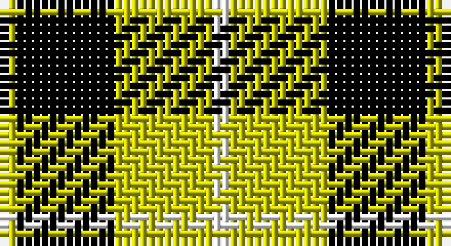

This page is one **sett** — a single exact thread-count. It belongs to the [tartan](/setts/w1ly6k6ly1/)
(the same proportion at any scale), whose colour order is pattern [WYKY](/stripes/wyky/).

Part of the [Barclay Dress](/tartans/barclay-dress/) tartan — the named design grouping this sett with its other cloths.

Sourced from weddslist.  It is a [4 stripe tartan](/stripes/stripes4/).

Original link http://www.weddslist.com/cgi-bin/tartans/pg.pl?source=rb

## Also known as

This cloth is also recorded under:

- Barclay, dress

2 attestations — the source records this cloth was collapsed from (oldest owns this page)

<ul>
<li>undated — Barclay Dress (weddslist, <a href="http://www.weddslist.com/cgi-bin/tartans/pg.pl?source=rb">record</a>)</li>
<li>undated — Barclay, dress (weddslist, <a href="http://www.weddslist.com/cgi-bin/tartans/pg.pl?source=sts">record</a>)</li>
</ul>

## Thread count
Y/2 K12 Y12 W/2

One full sett is **52 threads**.

## Palette

Palette: <strong>Tartan Register</strong> <small style="color:#888">(2 of 3 colours)</small>
<table><thead><tr><th>Colour</th><th>Threads</th><th>Shade</th><th>Base</th><th>OKLCh</th></tr></thead><tbody><tr><td>Y/</td><td style="text-align:right;font-variant-numeric:tabular-nums">2</td><td><code style="background-color:#C8C800;">#C8C800</code> <small style="color:#888">#C8C800</small></td><td>Y <code style="background-color:#F2BF00;">#F2BF00</code></td><td><small style="color:#888">oklch(80.6% 0.176 109.8)</small></td></tr><tr><td>K</td><td style="text-align:right;font-variant-numeric:tabular-nums">12</td><td><code style="background-color:#000000;">#000000</code> <small style="color:#888">#000000</small></td><td>K <code style="background-color:#000000;">#000000</code></td><td><small style="color:#888">oklch(0.0% 0.000 0.0)</small></td></tr><tr><td>Y</td><td style="text-align:right;font-variant-numeric:tabular-nums">12</td><td><code style="background-color:#C8C800;">#C8C800</code> <small style="color:#888">#C8C800</small></td><td>Y <code style="background-color:#F2BF00;">#F2BF00</code></td><td><small style="color:#888">oklch(80.6% 0.176 109.8)</small></td></tr><tr><td>W/</td><td style="text-align:right;font-variant-numeric:tabular-nums">2</td><td><code style="background-color:#FFFFFF;">#FFFFFF</code> <small style="color:#888">#FFFFFF</small></td><td>W <code style="background-color:#F7F7F7;">#F7F7F7</code></td><td><small style="color:#888">oklch(100.0% 0.000 89.9)</small></td></tr></tbody></table>

# Sample pattern

## Compared to the master

This cloth is one sett of its design; the master sett (the exemplar the design is anchored on) is below for comparison.

<figure style="margin:0"><figcaption style="color:#888;font-size:smaller">this sett</figcaption></figure>
<figure style="margin:0"><figcaption style="color:#888;font-size:smaller"><a href="/setts/w5ly32dt32ly5/">master sett →</a></figcaption></figure>

## Nearest tartans

The nearest existing variants by ΔTartan distance, with this tartan at the top so the swatches line up against it.

ΔTartan

Tartan

Sett

—

<a href="/ttd/edit/#slug=w1ly6k6ly1~x2">Barclay Dress</a> <a class="nn-out" href="/variants/s4/w1ly6k6ly1~x2/" title="open its dictionary page">↗</a>

0.60

<a href="/ttd/edit/#slug=lr1ly6k6ly1~x2&amp;base=w1ly6k6ly1~x2">Barclay Dress</a> <a class="nn-out" href="/variants/s4/lr1ly6k6ly1~x2/" title="open its dictionary page">↗</a>

0.60

<a href="/ttd/edit/#slug=lr1ly6k6ly1&amp;base=w1ly6k6ly1~x2">Barclay Dress</a> <a class="nn-out" href="/variants/s4/lr1ly6k6ly1/" title="open its dictionary page">↗</a>

0.85

<a href="/ttd/edit/#slug=w1ly6k6ly1~x8&amp;base=w1ly6k6ly1~x2">Barclay Dress Clan Tartan</a> <a class="nn-out" href="/variants/s4/w1ly6k6ly1~x8/" title="open its dictionary page">↗</a>

1.03

<a href="/ttd/edit/#slug=w5ly32dt32ly5~x2&amp;base=w1ly6k6ly1~x2">Barclay Dress</a> <a class="nn-out" href="/variants/s4/w5ly32dt32ly5~x2/" title="open its dictionary page">↗</a>

1.07

<a href="/ttd/edit/#slug=k4ly1k4ly6r1~x4&amp;base=w1ly6k6ly1~x2">MacLeod Dress Clan Tartan</a> <a class="nn-out" href="/variants/s5/k4ly1k4ly6r1~x4/" title="open its dictionary page">↗</a>

1.30

<a href="/ttd/edit/#slug=k6ly1k6ly9r1ly2~x2&amp;base=w1ly6k6ly1~x2">MacLeod #3</a> <a class="nn-out" href="/variants/s6/k6ly1k6ly9r1ly2~x2/" title="open its dictionary page">↗</a>

1.36

<a href="/ttd/edit/#slug=k15ly20w3~x2&amp;base=w1ly6k6ly1~x2">Silvicola (Corporate)</a> <a class="nn-out" href="/variants/s3/k15ly20w3~x2/" title="open its dictionary page">↗</a>

1.40

<a href="/ttd/edit/#slug=g40k10r7k10r7&amp;base=w1ly6k6ly1~x2">Romsdal</a> <a class="nn-out" href="/variants/s5/g40k10r7k10r7/" title="open its dictionary page">↗</a>

1.41

<a href="/ttd/edit/#slug=k10ly2k10w2k2ly13w3~x2&amp;base=w1ly6k6ly1~x2">Nooten-Boom (Personal)</a> <a class="nn-out" href="/variants/s7/k10ly2k10w2k2ly13w3~x2/" title="open its dictionary page">↗</a>

1.50

<a href="/ttd/edit/#slug=k8ly1k8ly12r1~x4&amp;base=w1ly6k6ly1~x2">MacLeod of Lewis (Vestiarium Scoticum)</a> <a class="nn-out" href="/variants/s5/k8ly1k8ly12r1~x4/" title="open its dictionary page">↗</a>

## Neighbour map

Every grey dot is one of 14360 variants placed by the first two principal components of the ΔTartan feature space (44% of its variance). Red is this tartan; blue dots are its nearest — click one to open its page.

<svg viewBox="0 0 640 380" role="img" style="max-width:100%;height:auto;border:1px solid #e0e0e0;border-radius:4px;display:block" xmlns="http://www.w3.org/2000/svg"><image href="/nn/cloud.v1.png" width="640" height="380"/><a href="/variants/s4/lr1ly6k6ly1~x2/"><circle cx="240.9" cy="256.5" r="4" fill="#3465a4"><title>Barclay Dress</title></circle></a><a href="/variants/s4/lr1ly6k6ly1/"><circle cx="240.9" cy="256.5" r="4" fill="#3465a4"><title>Barclay Dress</title></circle></a><a href="/variants/s4/w1ly6k6ly1~x8/"><circle cx="240.6" cy="245.8" r="4" fill="#3465a4"><title>Barclay Dress Clan Tartan</title></circle></a><a href="/variants/s4/w5ly32dt32ly5~x2/"><circle cx="248.2" cy="242.4" r="4" fill="#3465a4"><title>Barclay Dress</title></circle></a><a href="/variants/s5/k4ly1k4ly6r1~x4/"><circle cx="233.8" cy="251.7" r="4" fill="#3465a4"><title>MacLeod Dress Clan Tartan</title></circle></a><a href="/variants/s6/k6ly1k6ly9r1ly2~x2/"><circle cx="255.3" cy="217.7" r="4" fill="#3465a4"><title>MacLeod #3</title></circle></a><a href="/variants/s3/k15ly20w3~x2/"><circle cx="242.7" cy="268.6" r="4" fill="#3465a4"><title>Silvicola (Corporate)</title></circle></a><a href="/variants/s5/g40k10r7k10r7/"><circle cx="261.3" cy="246.1" r="4" fill="#3465a4"><title>Romsdal</title></circle></a><a href="/variants/s7/k10ly2k10w2k2ly13w3~x2/"><circle cx="234.8" cy="220.3" r="4" fill="#3465a4"><title>Nooten-Boom (Personal)</title></circle></a><a href="/variants/s5/k8ly1k8ly12r1~x4/"><circle cx="296.0" cy="220.8" r="4" fill="#3465a4"><title>MacLeod of Lewis (Vestiarium Scoticum)</title></circle></a><circle cx="233.8" cy="250.5" r="5" fill="#c00000"/></svg>

ID: /variants/s4/w1ly6k6ly1~x2/
