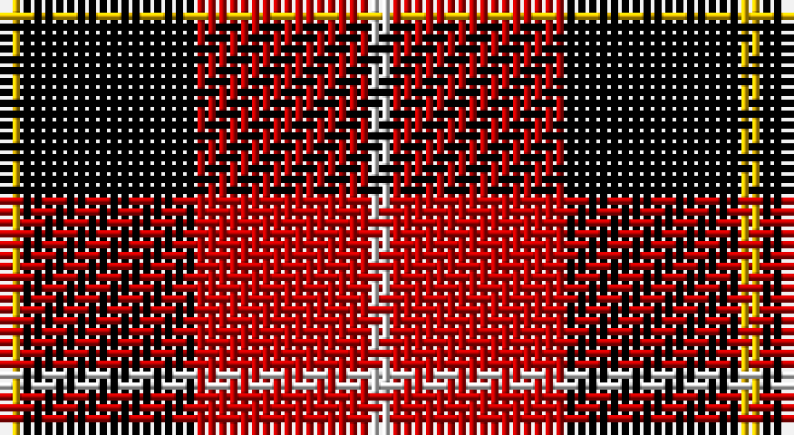

This page is one **sett** — a single exact thread-count. It belongs to the [tartan](/setts/w1r8k8ly1/)
(the same proportion at any scale), whose colour order is pattern [WRKY](/stripes/wrky/).

Part of the [Connel](/tartans/connel/) tartan — the named design grouping this sett with its other cloths.

Sourced from weddslist.  It is a [4 stripe tartan](/stripes/stripes4/).

Original link http://www.weddslist.com/cgi-bin/tartans/pg.pl?source=sts

## Provenance

Earliest known date: c. 1890 Whether the Wallace, which is known to date from at least 1842, and the Connel tartan are related is uncertain, although the close similarity leads one to suspect that the later 'Connel' is based on the Wallace. The Connels and MacConnels are both claimed as septs of Clan Donald. (P.E. MacDonald)

2 attestations — the source records this cloth was collapsed from (oldest owns this page)

<ul>
<li>undated — Connel (weddslist, <a href="http://www.weddslist.com/cgi-bin/tartans/pg.pl?source=sts">record</a>)</li>
<li>undated — Connel Clan Tartan (house-of-tartan, <a href="http://www.house-of-tartan.scotland.net/house/TartanViewjs.asp?colr=Def&tnam=1854">record</a>)</li>
</ul>

## Thread count
Y/2 K16 R16 LN/2

One full sett is **68 threads**.

## Palette

Palette: <strong>Tartan Register</strong> <small style="color:#888">(2 of 4 colours)</small>
<table><thead><tr><th>Colour</th><th>Threads</th><th>Shade</th><th>Base</th><th>OKLCh</th></tr></thead><tbody><tr><td>Y/</td><td style="text-align:right;font-variant-numeric:tabular-nums">2</td><td><code style="background-color:#F0C000;">#F0C000</code> <small style="color:#888">#F0C000</small></td><td>Y <code style="background-color:#F2BF00;">#F2BF00</code></td><td><small style="color:#888">oklch(82.7% 0.169 90.5)</small></td></tr><tr><td>K</td><td style="text-align:right;font-variant-numeric:tabular-nums">16</td><td><code style="background-color:#000000;">#000000</code> <small style="color:#888">#000000</small></td><td>K <code style="background-color:#000000;">#000000</code></td><td><small style="color:#888">oklch(0.0% 0.000 0.0)</small></td></tr><tr><td>R</td><td style="text-align:right;font-variant-numeric:tabular-nums">16</td><td><code style="background-color:#C00000;">#C00000</code> <small style="color:#888">#C00000</small></td><td>R <code style="background-color:#CC0000;">#CC0000</code></td><td><small style="color:#888">oklch(50.7% 0.208 29.2)</small></td></tr><tr><td>LN/</td><td style="text-align:right;font-variant-numeric:tabular-nums">2</td><td><code style="background-color:#E0E0E0;">#E0E0E0</code> <small style="color:#888">#E0E0E0</small></td><td>W <code style="background-color:#F7F7F7;">#F7F7F7</code></td><td><small style="color:#888">oklch(90.7% 0.000 89.9)</small></td></tr></tbody></table>

# Sample pattern

## Compared to the master

This cloth is one sett of its design; the master sett (the exemplar the design is anchored on) is below for comparison.

<figure style="margin:0"><figcaption style="color:#888;font-size:smaller">this sett</figcaption></figure>
<figure style="margin:0"><figcaption style="color:#888;font-size:smaller"><a href="/setts/r8k8ly1k8r8w1/">master sett →</a></figcaption></figure>

## Nearest tartans

The nearest existing variants by ΔTartan distance, with this tartan at the top so the swatches line up against it.

ΔTartan

Tartan

Sett

—

<a href="/ttd/edit/#slug=w1r8k8ly1~x2">Connel</a> <a class="nn-out" href="/variants/s4/w1r8k8ly1~x2/" title="open its dictionary page">↗</a>

0.85

<a href="/ttd/edit/#slug=w1r8k8ly1~x4&amp;base=w1r8k8ly1~x2">Connel (Clan)</a> <a class="nn-out" href="/variants/s4/w1r8k8ly1~x4/" title="open its dictionary page">↗</a>

1.08

<a href="/ttd/edit/#slug=db1r8k8lo1~x4&amp;base=w1r8k8ly1~x2">Skinner (Name)</a> <a class="nn-out" href="/variants/s4/db1r8k8lo1~x4/" title="open its dictionary page">↗</a>

1.12

<a href="/ttd/edit/#slug=k1r8k8ly1&amp;base=w1r8k8ly1~x2">Wallace</a> <a class="nn-out" href="/variants/s4/k1r8k8ly1/" title="open its dictionary page">↗</a>

1.17

<a href="/ttd/edit/#slug=r4k25o25w4~x2&amp;base=w1r8k8ly1~x2">Bonhill Primary School</a> <a class="nn-out" href="/variants/s4/r4k25o25w4~x2/" title="open its dictionary page">↗</a>

1.24

<a href="/variants/s5/ki3r29ki11k29t3~x2/">Wallace Red Dress Tartan</a>

1.25

<a href="/ttd/edit/#slug=w1k10r10w1~x4&amp;base=w1r8k8ly1~x2">Masai Shuka 01 (Artefact)</a> <a class="nn-out" href="/variants/s4/w1k10r10w1~x4/" title="open its dictionary page">↗</a>

1.28

<a href="/ttd/edit/#slug=db1r16k16ly1~x4&amp;base=w1r8k8ly1~x2">Skinner</a> <a class="nn-out" href="/variants/s4/db1r16k16ly1~x4/" title="open its dictionary page">↗</a>

1.30

<a href="/ttd/edit/#slug=k1r8k8ly1~x2&amp;base=w1r8k8ly1~x2">Wallace</a> <a class="nn-out" href="/variants/s4/k1r8k8ly1~x2/" title="open its dictionary page">↗</a>

1.31

<a href="/ttd/edit/#slug=k18r4k18r32lb3&amp;base=w1r8k8ly1~x2">Munro VS</a> <a class="nn-out" href="/variants/s5/k18r4k18r32lb3/" title="open its dictionary page">↗</a>

1.36

<a href="/ttd/edit/#slug=k1r8k8ly1~x6&amp;base=w1r8k8ly1~x2">Wallace</a> <a class="nn-out" href="/variants/s4/k1r8k8ly1~x6/" title="open its dictionary page">↗</a>

## Neighbour map

Every grey dot is one of 14360 variants placed by the first two principal components of the ΔTartan feature space (44% of its variance). Red is this tartan; blue dots are its nearest — click one to open its page.

<svg viewBox="0 0 640 380" role="img" style="max-width:100%;height:auto;border:1px solid #e0e0e0;border-radius:4px;display:block" xmlns="http://www.w3.org/2000/svg"><image href="/nn/cloud.v1.png" width="640" height="380"/><a href="/variants/s4/w1r8k8ly1~x4/"><circle cx="238.7" cy="218.8" r="4" fill="#3465a4"><title>Connel (Clan)</title></circle></a><a href="/variants/s4/db1r8k8lo1~x4/"><circle cx="257.9" cy="229.8" r="4" fill="#3465a4"><title>Skinner (Name)</title></circle></a><a href="/variants/s4/k1r8k8ly1/"><circle cx="288.5" cy="240.5" r="4" fill="#3465a4"><title>Wallace</title></circle></a><a href="/variants/s4/r4k25o25w4~x2/"><circle cx="213.9" cy="236.2" r="4" fill="#3465a4"><title>Bonhill Primary School</title></circle></a><a href="/variants/s5/ki3r29ki11k29t3~x2/"><circle cx="204.0" cy="212.4" r="4" fill="#3465a4"><title>Wallace Red Dress Tartan</title></circle></a><a href="/variants/s4/w1k10r10w1~x4/"><circle cx="277.6" cy="223.3" r="4" fill="#3465a4"><title>Masai Shuka 01 (Artefact)</title></circle></a><a href="/variants/s4/db1r16k16ly1~x4/"><circle cx="298.4" cy="193.3" r="4" fill="#3465a4"><title>Skinner</title></circle></a><a href="/variants/s4/k1r8k8ly1~x2/"><circle cx="295.7" cy="247.2" r="4" fill="#3465a4"><title>Wallace</title></circle></a><a href="/variants/s5/k18r4k18r32lb3/"><circle cx="288.4" cy="226.4" r="4" fill="#3465a4"><title>Munro VS</title></circle></a><a href="/variants/s4/k1r8k8ly1~x6/"><circle cx="304.9" cy="243.9" r="4" fill="#3465a4"><title>Wallace</title></circle></a><circle cx="230.5" cy="219.3" r="5" fill="#c00000"/></svg>

ID: /variants/s4/w1r8k8ly1~x2/
