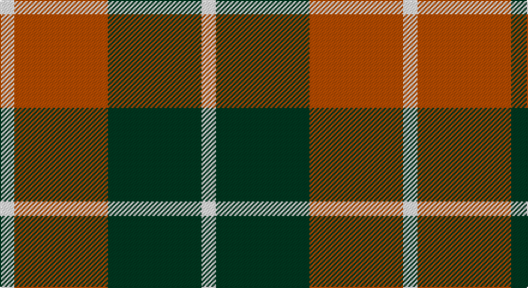

This page is one **sett** — a single exact thread-count. It belongs to the [tartan](/setts/w2dg13o13w2/)
(the same proportion at any scale), whose colour order is pattern [WGRW](/stripes/wgrw/).

Sourced from register-of-tartans.  It is a [4 stripe tartan](/stripes/stripes4/).

Original link https://www.tartanregister.gov.uk/tartanDetails.aspx?ref=1049

## Register references

External register numbers recorded for this tartan.

- Scottish Register of Tartans: [1049](https://www.tartanregister.gov.uk/tartanDetails.aspx?ref=1049)
- Scottish Tartans Authority (ITI): 1802
- Scottish Tartans World Register: 1802

## Thread count
W/12 DO78 DG78 W/12

One full sett is **336 threads**.

## Palette

Palette: <strong>Tartan Register</strong> <small style="color:#888">(2 of 3 colours)</small>
<table><thead><tr><th>Colour</th><th>Threads</th><th>Shade</th><th>Base</th><th>OKLCh</th></tr></thead><tbody><tr><td>W/</td><td style="text-align:right;font-variant-numeric:tabular-nums">12</td><td><code style="background-color:#FCFCFC;">#FCFCFC</code> <small style="color:#888">#FCFCFC</small></td><td>W <code style="background-color:#F7F7F7;">#F7F7F7</code></td><td><small style="color:#888">oklch(99.1% 0.000 89.9)</small></td></tr><tr><td>DO</td><td style="text-align:right;font-variant-numeric:tabular-nums">78</td><td><code style="background-color:#B84C00;">#B84C00</code> <small style="color:#888">#B84C00</small></td><td>R <code style="background-color:#CC0000;">#CC0000</code></td><td><small style="color:#888">oklch(55.1% 0.156 45.5)</small></td></tr><tr><td>DG</td><td style="text-align:right;font-variant-numeric:tabular-nums">78</td><td><code style="background-color:#003820;">#003820</code> <small style="color:#888">#003820</small></td><td>G <code style="background-color:#006100;">#006100</code></td><td><small style="color:#888">oklch(30.0% 0.070 158.3)</small></td></tr><tr><td>W/</td><td style="text-align:right;font-variant-numeric:tabular-nums">12</td><td><code style="background-color:#FCFCFC;">#FCFCFC</code> <small style="color:#888">#FCFCFC</small></td><td>W <code style="background-color:#F7F7F7;">#F7F7F7</code></td><td><small style="color:#888">oklch(99.1% 0.000 89.9)</small></td></tr></tbody></table>

# Sample pattern

## Nearest tartans

The nearest existing variants by ΔTartan distance, with this tartan at the top so the swatches line up against it.

ΔTartan

Tartan

Sett

—

<a href="/ttd/edit/#slug=w2dg13o13w2~x6">Dunoon Irish</a> <a class="nn-out" href="/variants/s4/w2dg13o13w2~x6/" title="open its dictionary page">↗</a>

1.03

<a href="/ttd/edit/#slug=w2o13g13w2~x6&amp;base=w2dg13o13w2~x6">Dunoon Irish (Corporate)</a> <a class="nn-out" href="/variants/s4/w2o13g13w2~x6/" title="open its dictionary page">↗</a>

1.11

<a href="/ttd/edit/#slug=t6do28lo20t3~x2&amp;base=w2dg13o13w2~x6">Prince of Orange</a> <a class="nn-out" href="/variants/s4/t6do28lo20t3~x2/" title="open its dictionary page">↗</a>

1.24

<a href="/ttd/edit/#slug=r4k25ly25w4~x2&amp;base=w2dg13o13w2~x6">Bonhill Primary School</a> <a class="nn-out" href="/variants/s4/r4k25ly25w4~x2/" title="open its dictionary page">↗</a>

1.29

<a href="/ttd/edit/#slug=w1ly6k6ly1~x8&amp;base=w2dg13o13w2~x6">Barclay Dress Clan Tartan</a> <a class="nn-out" href="/variants/s4/w1ly6k6ly1~x8/" title="open its dictionary page">↗</a>

1.30

<a href="/ttd/edit/#slug=w5ly32dt32ly5~x2&amp;base=w2dg13o13w2~x6">Barclay Dress</a> <a class="nn-out" href="/variants/s4/w5ly32dt32ly5~x2/" title="open its dictionary page">↗</a>

1.30

<a href="/ttd/edit/#slug=w5r5w5k15r2~x2&amp;base=w2dg13o13w2~x6">Braes High School Falkirk (School)</a> <a class="nn-out" href="/variants/s5/w5r5w5k15r2~x2/" title="open its dictionary page">↗</a>

1.32

<a href="/ttd/edit/#slug=k4ly1k4ly6r1~x4&amp;base=w2dg13o13w2~x6">MacLeod Dress Clan Tartan</a> <a class="nn-out" href="/variants/s5/k4ly1k4ly6r1~x4/" title="open its dictionary page">↗</a>

1.41

<a href="/ttd/edit/#slug=r2dg17r8db8ly2~x4&amp;base=w2dg13o13w2~x6">British Hills</a> <a class="nn-out" href="/variants/s5/r2dg17r8db8ly2~x4/" title="open its dictionary page">↗</a>

1.42

<a href="/ttd/edit/#slug=r4k25o25w4~x2&amp;base=w2dg13o13w2~x6">Bonhill Primary School</a> <a class="nn-out" href="/variants/s4/r4k25o25w4~x2/" title="open its dictionary page">↗</a>

1.43

<a href="/ttd/edit/#slug=y26k10r10ly10y3~x2&amp;base=w2dg13o13w2~x6">Ikelman No 2</a> <a class="nn-out" href="/variants/s5/y26k10r10ly10y3~x2/" title="open its dictionary page">↗</a>

## Neighbour map

Every grey dot is one of 14360 variants placed by the first two principal components of the ΔTartan feature space (44% of its variance). Red is this tartan; blue dots are its nearest — click one to open its page.

<svg viewBox="0 0 640 380" role="img" style="max-width:100%;height:auto;border:1px solid #e0e0e0;border-radius:4px;display:block" xmlns="http://www.w3.org/2000/svg"><image href="/nn/cloud.v1.png" width="640" height="380"/><a href="/variants/s4/w2o13g13w2~x6/"><circle cx="248.3" cy="258.2" r="4" fill="#3465a4"><title>Dunoon Irish (Corporate)</title></circle></a><a href="/variants/s4/t6do28lo20t3~x2/"><circle cx="282.1" cy="245.5" r="4" fill="#3465a4"><title>Prince of Orange</title></circle></a><a href="/variants/s4/r4k25ly25w4~x2/"><circle cx="184.8" cy="225.6" r="4" fill="#3465a4"><title>Bonhill Primary School</title></circle></a><a href="/variants/s4/w1ly6k6ly1~x8/"><circle cx="240.6" cy="245.8" r="4" fill="#3465a4"><title>Barclay Dress Clan Tartan</title></circle></a><a href="/variants/s4/w5ly32dt32ly5~x2/"><circle cx="248.2" cy="242.4" r="4" fill="#3465a4"><title>Barclay Dress</title></circle></a><a href="/variants/s5/w5r5w5k15r2~x2/"><circle cx="213.3" cy="229.2" r="4" fill="#3465a4"><title>Braes High School Falkirk (School)</title></circle></a><a href="/variants/s5/k4ly1k4ly6r1~x4/"><circle cx="233.8" cy="251.7" r="4" fill="#3465a4"><title>MacLeod Dress Clan Tartan</title></circle></a><a href="/variants/s5/r2dg17r8db8ly2~x4/"><circle cx="220.0" cy="222.2" r="4" fill="#3465a4"><title>British Hills</title></circle></a><a href="/variants/s4/r4k25o25w4~x2/"><circle cx="213.9" cy="236.2" r="4" fill="#3465a4"><title>Bonhill Primary School</title></circle></a><a href="/variants/s5/y26k10r10ly10y3~x2/"><circle cx="199.2" cy="216.5" r="4" fill="#3465a4"><title>Ikelman No 2</title></circle></a><circle cx="232.6" cy="250.5" r="5" fill="#c00000"/></svg>

ID: /variants/s4/w2dg13o13w2~x6/
