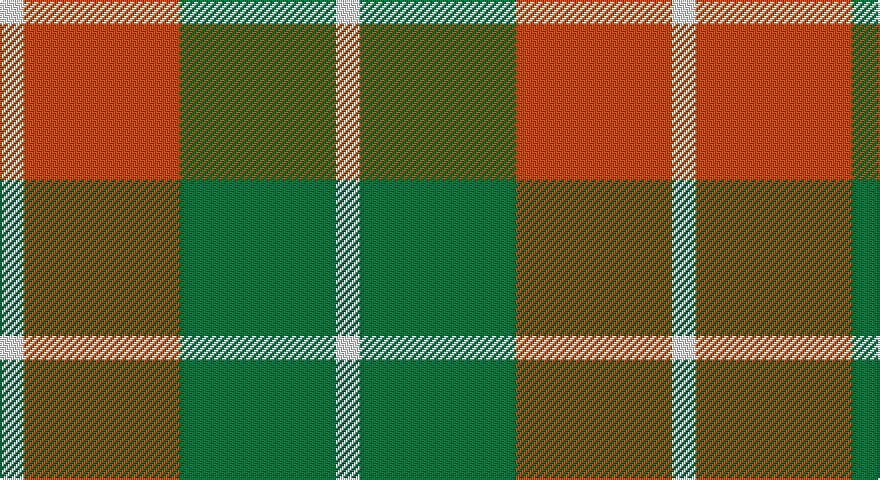

This page is one **sett** — a single exact thread-count. It belongs to the [tartan](/setts/w2o13g13w2/)
(the same proportion at any scale), whose colour order is pattern [WGRW](/stripes/wgrw/).

Sourced from tartans-authority.  It is a [4 stripe tartan](/stripes/stripes4/).

Original link http://www.tartansauthority.com/tartan-ferret/display/1802/

## Register references

External register numbers recorded for this tartan.

- Scottish Tartans Authority (ITI): 1802

## Thread count
W/12 DO78 G78 W/12

One full sett is **336 threads**.

## Palette

Palette: <strong>Logan (The Scottish Gael, 1831)</strong> <small style="color:#888">(1 of 3 colours)</small>
<table><thead><tr><th>Colour</th><th>Threads</th><th>Shade</th><th>Base</th><th>OKLCh</th></tr></thead><tbody><tr><td>W/</td><td style="text-align:right;font-variant-numeric:tabular-nums">12</td><td><code style="background-color:#FCFCFC;">#FCFCFC</code> <small style="color:#888">#FCFCFC</small></td><td>W <code style="background-color:#F7F7F7;">#F7F7F7</code></td><td><small style="color:#888">oklch(99.1% 0.000 89.9)</small></td></tr><tr><td>DO</td><td style="text-align:right;font-variant-numeric:tabular-nums">78</td><td><code style="background-color:#B84C00;">#B84C00</code> <small style="color:#888">#B84C00</small></td><td>R <code style="background-color:#CC0000;">#CC0000</code></td><td><small style="color:#888">oklch(55.1% 0.156 45.5)</small></td></tr><tr><td>G</td><td style="text-align:right;font-variant-numeric:tabular-nums">78</td><td><code style="background-color:#006C3C;">#006C3C</code> <small style="color:#888">#006C3C</small></td><td>G <code style="background-color:#006100;">#006100</code></td><td><small style="color:#888">oklch(46.7% 0.115 155.1)</small></td></tr><tr><td>W/</td><td style="text-align:right;font-variant-numeric:tabular-nums">12</td><td><code style="background-color:#FCFCFC;">#FCFCFC</code> <small style="color:#888">#FCFCFC</small></td><td>W <code style="background-color:#F7F7F7;">#F7F7F7</code></td><td><small style="color:#888">oklch(99.1% 0.000 89.9)</small></td></tr></tbody></table>

# Sample pattern

## Nearest tartans

The nearest existing variants by ΔTartan distance, with this tartan at the top so the swatches line up against it.

ΔTartan

Tartan

Sett

—

<a href="/ttd/edit/#slug=w2o13g13w2~x6">Dunoon Irish (Corporate)</a> <a class="nn-out" href="/variants/s4/w2o13g13w2~x6/" title="open its dictionary page">↗</a>

1.03

<a href="/ttd/edit/#slug=w2dg13o13w2~x6&amp;base=w2o13g13w2~x6">Dunoon Irish</a> <a class="nn-out" href="/variants/s4/w2dg13o13w2~x6/" title="open its dictionary page">↗</a>

1.26

<a href="/ttd/edit/#slug=w2g13lo13w2~x6&amp;base=w2o13g13w2~x6">Dunoon</a> <a class="nn-out" href="/variants/s4/w2g13lo13w2~x6/" title="open its dictionary page">↗</a>

1.34

<a href="/ttd/edit/#slug=g4lb31g7r14g11r3~x2&amp;base=w2o13g13w2~x6">Gleneagles USA (Dalgleish)</a> <a class="nn-out" href="/variants/s6/g4lb31g7r14g11r3~x2/" title="open its dictionary page">↗</a>

1.35

<a href="/ttd/edit/#slug=dy2y10o15dy10y2~x4&amp;base=w2o13g13w2~x6">Harmony 8</a> <a class="nn-out" href="/variants/s5/dy2y10o15dy10y2~x4/" title="open its dictionary page">↗</a>

1.49

<a href="/ttd/edit/#slug=t6do28lo20t3~x2&amp;base=w2o13g13w2~x6">Prince of Orange</a> <a class="nn-out" href="/variants/s4/t6do28lo20t3~x2/" title="open its dictionary page">↗</a>

1.50

<a href="/ttd/edit/#slug=do4g25lo10g3lo18r4~x2&amp;base=w2o13g13w2~x6">Unidentfied (Ligioner Highland Games</a> <a class="nn-out" href="/variants/s6/do4g25lo10g3lo18r4~x2/" title="open its dictionary page">↗</a>

1.51

<a href="/ttd/edit/#slug=g6ly1r1t2r2~x4&amp;base=w2o13g13w2~x6">Wilson's, No 179</a> <a class="nn-out" href="/variants/s5/g6ly1r1t2r2~x4/" title="open its dictionary page">↗</a>

1.52

<a href="/ttd/edit/#slug=r5g7k2t1~x4&amp;base=w2o13g13w2~x6">Wilson's No.195</a> <a class="nn-out" href="/variants/s4/r5g7k2t1~x4/" title="open its dictionary page">↗</a>

1.52

<a href="/ttd/edit/#slug=w5ly32dt32ly5~x2&amp;base=w2o13g13w2~x6">Barclay Dress</a> <a class="nn-out" href="/variants/s4/w5ly32dt32ly5~x2/" title="open its dictionary page">↗</a>

1.52

<a href="/ttd/edit/#slug=lo5g7k1t1~x4&amp;base=w2o13g13w2~x6">Wilson's, No 195</a> <a class="nn-out" href="/variants/s4/lo5g7k1t1~x4/" title="open its dictionary page">↗</a>

## Neighbour map

Every grey dot is one of 14360 variants placed by the first two principal components of the ΔTartan feature space (44% of its variance). Red is this tartan; blue dots are its nearest — click one to open its page.

<svg viewBox="0 0 640 380" role="img" style="max-width:100%;height:auto;border:1px solid #e0e0e0;border-radius:4px;display:block" xmlns="http://www.w3.org/2000/svg"><image href="/nn/cloud.v1.png" width="640" height="380"/><a href="/variants/s4/w2dg13o13w2~x6/"><circle cx="232.6" cy="250.5" r="4" fill="#3465a4"><title>Dunoon Irish</title></circle></a><a href="/variants/s4/w2g13lo13w2~x6/"><circle cx="249.7" cy="255.6" r="4" fill="#3465a4"><title>Dunoon</title></circle></a><a href="/variants/s6/g4lb31g7r14g11r3~x2/"><circle cx="239.4" cy="211.1" r="4" fill="#3465a4"><title>Gleneagles USA (Dalgleish)</title></circle></a><a href="/variants/s5/dy2y10o15dy10y2~x4/"><circle cx="228.6" cy="263.1" r="4" fill="#3465a4"><title>Harmony 8</title></circle></a><a href="/variants/s4/t6do28lo20t3~x2/"><circle cx="282.1" cy="245.5" r="4" fill="#3465a4"><title>Prince of Orange</title></circle></a><a href="/variants/s6/do4g25lo10g3lo18r4~x2/"><circle cx="221.4" cy="206.0" r="4" fill="#3465a4"><title>Unidentfied (Ligioner Highland Games</title></circle></a><a href="/variants/s5/g6ly1r1t2r2~x4/"><circle cx="244.6" cy="244.0" r="4" fill="#3465a4"><title>Wilson's, No 179</title></circle></a><a href="/variants/s4/r5g7k2t1~x4/"><circle cx="232.3" cy="260.0" r="4" fill="#3465a4"><title>Wilson's No.195</title></circle></a><a href="/variants/s4/w5ly32dt32ly5~x2/"><circle cx="248.2" cy="242.4" r="4" fill="#3465a4"><title>Barclay Dress</title></circle></a><a href="/variants/s4/lo5g7k1t1~x4/"><circle cx="236.1" cy="235.8" r="4" fill="#3465a4"><title>Wilson's, No 195</title></circle></a><circle cx="248.3" cy="258.2" r="5" fill="#c00000"/></svg>

ID: /variants/s4/w2o13g13w2~x6/
