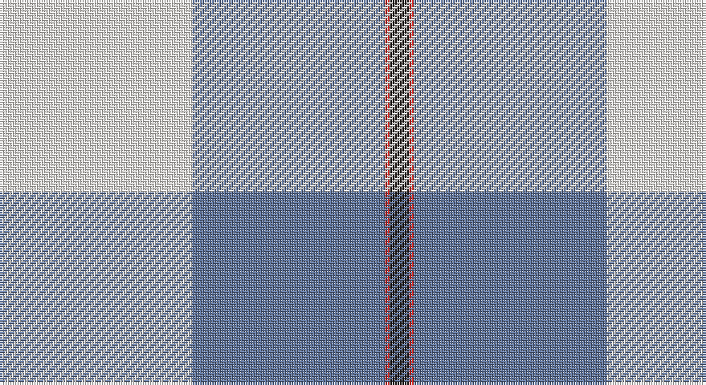

This page is one **sett** — a single exact thread-count. It belongs to the [tartan](/setts/w40t40r1k4/)
(the same proportion at any scale), whose colour order is pattern [KRBW](/stripes/krbw/).

Sourced from register-of-tartans.  It is a [4 stripe tartan](/stripes/stripes4/).

Original link https://www.tartanregister.gov.uk/tartanDetails.aspx?ref=10539

## Register references

External register numbers recorded for this tartan.

- Scottish Register of Tartans: [10539](https://www.tartanregister.gov.uk/tartanDetails.aspx?ref=10539)

## Thread count
W/80 B80 R2 K/8

One full sett is **252 threads**.

## Palette

Palette: <strong>Tartan Register</strong> <small style="color:#888">(2 of 4 colours)</small>
<table><thead><tr><th>Colour</th><th>Threads</th><th>Shade</th><th>Base</th><th>OKLCh</th></tr></thead><tbody><tr><td>W/</td><td style="text-align:right;font-variant-numeric:tabular-nums">80</td><td><code style="background-color:#F9F5EF;">#F9F5EF</code> <small style="color:#888">#F9F5EF</small></td><td>W <code style="background-color:#F7F7F7;">#F7F7F7</code></td><td><small style="color:#888">oklch(97.2% 0.009 78.3)</small></td></tr><tr><td>B</td><td style="text-align:right;font-variant-numeric:tabular-nums">80</td><td><code style="background-color:#5F749C;">#5F749C</code> <small style="color:#888">#5F749C</small></td><td>B <code style="background-color:#2A418A;">#2A418A</code></td><td><small style="color:#888">oklch(55.8% 0.067 262.9)</small></td></tr><tr><td>R</td><td style="text-align:right;font-variant-numeric:tabular-nums">2</td><td><code style="background-color:#CA2625;">#CA2625</code> <small style="color:#888">#CA2625</small></td><td>R <code style="background-color:#CC0000;">#CC0000</code></td><td><small style="color:#888">oklch(54.4% 0.199 27.2)</small></td></tr><tr><td>K/</td><td style="text-align:right;font-variant-numeric:tabular-nums">8</td><td><code style="background-color:#1C1714;">#1C1714</code> <small style="color:#888">#1C1714</small></td><td>K <code style="background-color:#000000;">#000000</code></td><td><small style="color:#888">oklch(20.9% 0.010 52.9)</small></td></tr></tbody></table>

# Sample pattern

## Nearest tartans

The nearest existing variants by ΔTartan distance, with this tartan at the top so the swatches line up against it.

ΔTartan

Tartan

Sett

—

<a href="/ttd/edit/#slug=w40t40r1k4~x2">Kimon Andreou Family (Personal)</a> <a class="nn-out" href="/variants/s4/w40t40r1k4~x2/" title="open its dictionary page">↗</a>

0.81

<a href="/ttd/edit/#slug=w40b40r1k4~x2&amp;base=w40t40r1k4~x2">Kimon Andreou Family (Personal)</a> <a class="nn-out" href="/variants/s4/w40b40r1k4~x2/" title="open its dictionary page">↗</a>

1.50

<a href="/ttd/edit/#slug=w18o29t2dp3k1~x2&amp;base=w40t40r1k4~x2">Kinloch of Loch Awe (Personal)</a> <a class="nn-out" href="/variants/s5/w18o29t2dp3k1~x2/" title="open its dictionary page">↗</a>

1.68

<a href="/ttd/edit/#slug=t53k2w53k2r4ly7~x2&amp;base=w40t40r1k4~x2">Galicia</a> <a class="nn-out" href="/variants/s6/t53k2w53k2r4ly7~x2/" title="open its dictionary page">↗</a>

1.70

<a href="/ttd/edit/#slug=k5w2ly36b47r3~x2&amp;base=w40t40r1k4~x2">Cornish, National Day</a> <a class="nn-out" href="/variants/s5/k5w2ly36b47r3~x2/" title="open its dictionary page">↗</a>

1.79

<a href="/ttd/edit/#slug=r3b2w35b35r2g3~x2&amp;base=w40t40r1k4~x2">Galloway (Dance)</a> <a class="nn-out" href="/variants/s6/r3b2w35b35r2g3~x2/" title="open its dictionary page">↗</a>

1.83

<a href="/ttd/edit/#slug=k5w2ly36t47r3~x2&amp;base=w40t40r1k4~x2">Oliver Dress Pink</a> <a class="nn-out" href="/variants/s5/k5w2ly36t47r3~x2/" title="open its dictionary page">↗</a>

1.85

<a href="/ttd/edit/#slug=lb25db11r5w1k1~x4&amp;base=w40t40r1k4~x2">Mount Vernon Primary School (Corp)</a> <a class="nn-out" href="/variants/s5/lb25db11r5w1k1~x4/" title="open its dictionary page">↗</a>

1.90

<a href="/ttd/edit/#slug=db26w28db14ly3k1ly2k1~x2&amp;base=w40t40r1k4~x2">Gothenburg/Goteborg</a> <a class="nn-out" href="/variants/s7/db26w28db14ly3k1ly2k1~x2/" title="open its dictionary page">↗</a>

1.93

<a href="/ttd/edit/#slug=w44dg18w6dg11dt1o4~x2&amp;base=w40t40r1k4~x2">Westfalia Dress (Corporate)</a> <a class="nn-out" href="/variants/s6/w44dg18w6dg11dt1o4~x2/" title="open its dictionary page">↗</a>

2.00

<a href="/ttd/edit/#slug=lt25db11r5w1k1~x4&amp;base=w40t40r1k4~x2">Mount Vernon Primary School</a> <a class="nn-out" href="/variants/s5/lt25db11r5w1k1~x4/" title="open its dictionary page">↗</a>

## Neighbour map

Every grey dot is one of 14360 variants placed by the first two principal components of the ΔTartan feature space (44% of its variance). Red is this tartan; blue dots are its nearest — click one to open its page.

<svg viewBox="0 0 640 380" role="img" style="max-width:100%;height:auto;border:1px solid #e0e0e0;border-radius:4px;display:block" xmlns="http://www.w3.org/2000/svg"><image href="/nn/cloud.v1.png" width="640" height="380"/><a href="/variants/s4/w40b40r1k4~x2/"><circle cx="300.7" cy="151.0" r="4" fill="#3465a4"><title>Kimon Andreou Family (Personal)</title></circle></a><a href="/variants/s5/w18o29t2dp3k1~x2/"><circle cx="323.1" cy="131.8" r="4" fill="#3465a4"><title>Kinloch of Loch Awe (Personal)</title></circle></a><a href="/variants/s6/t53k2w53k2r4ly7~x2/"><circle cx="260.0" cy="110.7" r="4" fill="#3465a4"><title>Galicia</title></circle></a><a href="/variants/s5/k5w2ly36b47r3~x2/"><circle cx="287.1" cy="134.7" r="4" fill="#3465a4"><title>Cornish, National Day</title></circle></a><a href="/variants/s6/r3b2w35b35r2g3~x2/"><circle cx="270.5" cy="144.6" r="4" fill="#3465a4"><title>Galloway (Dance)</title></circle></a><a href="/variants/s5/k5w2ly36t47r3~x2/"><circle cx="289.0" cy="144.4" r="4" fill="#3465a4"><title>Oliver Dress Pink</title></circle></a><a href="/variants/s5/lb25db11r5w1k1~x4/"><circle cx="314.1" cy="136.4" r="4" fill="#3465a4"><title>Mount Vernon Primary School (Corp)</title></circle></a><a href="/variants/s7/db26w28db14ly3k1ly2k1~x2/"><circle cx="308.0" cy="132.9" r="4" fill="#3465a4"><title>Gothenburg/Goteborg</title></circle></a><a href="/variants/s6/w44dg18w6dg11dt1o4~x2/"><circle cx="357.9" cy="115.8" r="4" fill="#3465a4"><title>Westfalia Dress (Corporate)</title></circle></a><a href="/variants/s5/lt25db11r5w1k1~x4/"><circle cx="299.8" cy="133.4" r="4" fill="#3465a4"><title>Mount Vernon Primary School</title></circle></a><circle cx="312.4" cy="150.9" r="5" fill="#c00000"/></svg>

ID: /variants/s4/w40t40r1k4~x2/
