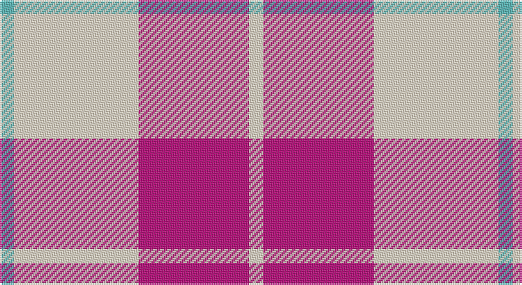

This page is one **sett** — a single exact thread-count. It belongs to the [tartan](/setts/w4m31w35lg4/)
(the same proportion at any scale), whose colour order is pattern [WRWY](/stripes/wrwy/).

Sourced from tartans-authority.  It is a [4 stripe tartan](/stripes/stripes4/).

Original link http://www.tartansauthority.com/tartan-ferret/display/7579/

## Also known as

This cloth is also recorded under:

- Lewis, Magenta

2 attestations — the source records this cloth was collapsed from (oldest owns this page)

<ul>
<li>March 2008 — Lewis, Magenta (Dance) (tartans-authority, <a href="http://www.tartansauthority.com/tartan-ferret/display/7579/">record</a>)</li>
<li>undated — Lewis Magenta (register-of-tartans, <a href="https://www.tartanregister.gov.uk/tartanDetails.aspx?ref=5603">record</a>)</li>
</ul>

## Register references

External register numbers recorded for this tartan.

- Scottish Register of Tartans: [5603](https://www.tartanregister.gov.uk/tartanDetails.aspx?ref=5603)
- Scottish Tartans Authority (ITI): 7579

## Thread count
B/8 W70 R62 W/8

One full sett is **280 threads**.

## Palette

Palette: <strong>Tartan Register</strong> <small style="color:#888">(1 of 3 colours)</small>
<table><thead><tr><th>Colour</th><th>Threads</th><th>Shade</th><th>Base</th><th>OKLCh</th></tr></thead><tbody><tr><td>B/</td><td style="text-align:right;font-variant-numeric:tabular-nums">8</td><td><code style="background-color:#54B8B8;">#54B8B8</code> <small style="color:#888">#54B8B8</small></td><td>Y <code style="background-color:#F2BF00;">#F2BF00</code></td><td><small style="color:#888">oklch(72.4% 0.093 195.3)</small></td></tr><tr><td>W</td><td style="text-align:right;font-variant-numeric:tabular-nums">70</td><td><code style="background-color:#F0E0C8;">#F0E0C8</code> <small style="color:#888">#F0E0C8</small></td><td>W <code style="background-color:#F7F7F7;">#F7F7F7</code></td><td><small style="color:#888">oklch(91.3% 0.036 78.1)</small></td></tr><tr><td>R</td><td style="text-align:right;font-variant-numeric:tabular-nums">62</td><td><code style="background-color:#B80478;">#B80478</code> <small style="color:#888">#B80478</small></td><td>R <code style="background-color:#CC0000;">#CC0000</code></td><td><small style="color:#888">oklch(51.7% 0.214 350.4)</small></td></tr><tr><td>W/</td><td style="text-align:right;font-variant-numeric:tabular-nums">8</td><td><code style="background-color:#F0E0C8;">#F0E0C8</code> <small style="color:#888">#F0E0C8</small></td><td>W <code style="background-color:#F7F7F7;">#F7F7F7</code></td><td><small style="color:#888">oklch(91.3% 0.036 78.1)</small></td></tr></tbody></table>

# Sample pattern

## Nearest tartans

The nearest existing variants by ΔTartan distance, with this tartan at the top so the swatches line up against it.

ΔTartan

Tartan

Sett

—

<a href="/ttd/edit/#slug=w4m31w35lg4~x2">Lewis, Magenta (Dance)</a> <a class="nn-out" href="/variants/s4/w4m31w35lg4~x2/" title="open its dictionary page">↗</a>

1.09

<a href="/ttd/edit/#slug=k5w37r37w5~x2&amp;base=w4m31w35lg4~x2">MacRae of Conchra #2</a> <a class="nn-out" href="/variants/s4/k5w37r37w5~x2/" title="open its dictionary page">↗</a>

1.37

<a href="/ttd/edit/#slug=lb2r4lb2r4lb9k1~x2&amp;base=w4m31w35lg4~x2">Buchanan VS</a> <a class="nn-out" href="/variants/s6/lb2r4lb2r4lb9k1~x2/" title="open its dictionary page">↗</a>

1.43

<a href="/ttd/edit/#slug=t15w2r20w3~x4&amp;base=w4m31w35lg4~x2">Masai Shuka 24 (Artefact)</a> <a class="nn-out" href="/variants/s4/t15w2r20w3~x4/" title="open its dictionary page">↗</a>

1.53

<a href="/ttd/edit/#slug=k2w28r13w2r13w2~x2&amp;base=w4m31w35lg4~x2">Buchanan #5</a> <a class="nn-out" href="/variants/s6/k2w28r13w2r13w2~x2/" title="open its dictionary page">↗</a>

1.64

<a href="/ttd/edit/#slug=r13k1lb13~x4&amp;base=w4m31w35lg4~x2">Hose (Dunmore)</a> <a class="nn-out" href="/variants/s3/r13k1lb13~x4/" title="open its dictionary page">↗</a>

1.68

<a href="/ttd/edit/#slug=r5w2r25w25r2w5~x2&amp;base=w4m31w35lg4~x2">Erskine Dress Burgandy Clan Tartan</a> <a class="nn-out" href="/variants/s6/r5w2r25w25r2w5~x2/" title="open its dictionary page">↗</a>

1.71

<a href="/ttd/edit/#slug=r4w35r31w4~x2&amp;base=w4m31w35lg4~x2">Lewis, Red (Dance)</a> <a class="nn-out" href="/variants/s4/r4w35r31w4~x2/" title="open its dictionary page">↗</a>

1.72

<a href="/ttd/edit/#slug=r8ri3r28w32ri3w4~x2&amp;base=w4m31w35lg4~x2">Ailsa, Red V2 (Dance)</a> <a class="nn-out" href="/variants/s6/r8ri3r28w32ri3w4~x2/" title="open its dictionary page">↗</a>

1.74

<a href="/ttd/edit/#slug=r2w1r9w9r1w2~x6&amp;base=w4m31w35lg4~x2">Erskine Red &amp; White (Dance)</a> <a class="nn-out" href="/variants/s6/r2w1r9w9r1w2~x6/" title="open its dictionary page">↗</a>

1.76

<a href="/ttd/edit/#slug=w5p3w26r20w3r8ly3~x2&amp;base=w4m31w35lg4~x2">MacPherson, Red</a> <a class="nn-out" href="/variants/s7/w5p3w26r20w3r8ly3~x2/" title="open its dictionary page">↗</a>

## Neighbour map

Every grey dot is one of 14360 variants placed by the first two principal components of the ΔTartan feature space (44% of its variance). Red is this tartan; blue dots are its nearest — click one to open its page.

<svg viewBox="0 0 640 380" role="img" style="max-width:100%;height:auto;border:1px solid #e0e0e0;border-radius:4px;display:block" xmlns="http://www.w3.org/2000/svg"><image href="/nn/cloud.v1.png" width="640" height="380"/><a href="/variants/s4/k5w37r37w5~x2/"><circle cx="279.9" cy="222.5" r="4" fill="#3465a4"><title>MacRae of Conchra #2</title></circle></a><a href="/variants/s6/lb2r4lb2r4lb9k1~x2/"><circle cx="320.3" cy="206.4" r="4" fill="#3465a4"><title>Buchanan VS</title></circle></a><a href="/variants/s4/t15w2r20w3~x4/"><circle cx="299.9" cy="231.3" r="4" fill="#3465a4"><title>Masai Shuka 24 (Artefact)</title></circle></a><a href="/variants/s6/k2w28r13w2r13w2~x2/"><circle cx="321.5" cy="171.3" r="4" fill="#3465a4"><title>Buchanan #5</title></circle></a><a href="/variants/s3/r13k1lb13~x4/"><circle cx="304.0" cy="235.5" r="4" fill="#3465a4"><title>Hose (Dunmore)</title></circle></a><a href="/variants/s6/r5w2r25w25r2w5~x2/"><circle cx="340.0" cy="192.9" r="4" fill="#3465a4"><title>Erskine Dress Burgandy Clan Tartan</title></circle></a><a href="/variants/s4/r4w35r31w4~x2/"><circle cx="347.5" cy="233.9" r="4" fill="#3465a4"><title>Lewis, Red (Dance)</title></circle></a><a href="/variants/s6/r8ri3r28w32ri3w4~x2/"><circle cx="291.5" cy="179.9" r="4" fill="#3465a4"><title>Ailsa, Red V2 (Dance)</title></circle></a><a href="/variants/s6/r2w1r9w9r1w2~x6/"><circle cx="320.0" cy="198.8" r="4" fill="#3465a4"><title>Erskine Red &amp; White (Dance)</title></circle></a><a href="/variants/s7/w5p3w26r20w3r8ly3~x2/"><circle cx="263.8" cy="169.4" r="4" fill="#3465a4"><title>MacPherson, Red</title></circle></a><circle cx="305.5" cy="218.6" r="5" fill="#c00000"/></svg>

ID: /variants/s4/w4m31w35lg4~x2/
