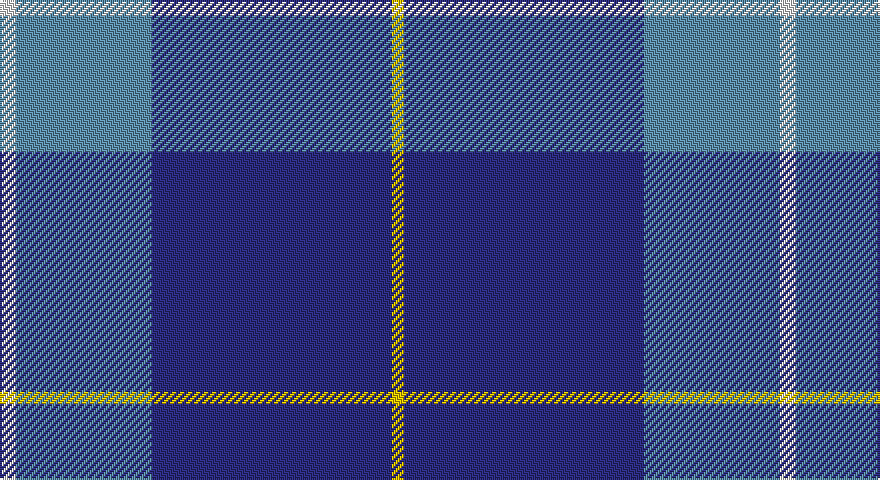

This page is one **sett** — a single exact thread-count. It belongs to the [tartan](/setts/w4t34db60ly3/)
(the same proportion at any scale), whose colour order is pattern [WBBY](/stripes/wbby/).

Sourced from house-of-tartan.  It is a [4 stripe tartan](/stripes/stripes4/).

Original link http://www.house-of-tartan.scotland.net/house/TartanViewjs.asp?colr=Def&tnam=1757

## Provenance

Earliest known date: 1975 A sample was presented to the Scottish Tartans Society by John Drummond Bowman. This version of the tartan has the unusual feature of exchanging red for yellow in the weft. It is larger than the sett recorded in the Lyon Court Books in 1982. The name, MacKerral or MacKerrell, is recorded in Ayrshire in the 12th century.

## Thread count
LN/8 B68 DB120 Y/6

One full sett is **390 threads**.

## Palette

Palette: <strong>Tartan Register</strong>
<table><thead><tr><th>Colour</th><th>Threads</th><th>Shade</th><th>Base</th><th>OKLCh</th></tr></thead><tbody><tr><td>LN/</td><td style="text-align:right;font-variant-numeric:tabular-nums">8</td><td><code style="background-color:#E0E0E0;">#E0E0E0</code> <small style="color:#888">#E0E0E0</small></td><td>W <code style="background-color:#F7F7F7;">#F7F7F7</code></td><td><small style="color:#888">oklch(90.7% 0.000 89.9)</small></td></tr><tr><td>B</td><td style="text-align:right;font-variant-numeric:tabular-nums">68</td><td><code style="background-color:#5C8CA8;">#5C8CA8</code> <small style="color:#888">#5C8CA8</small></td><td>B <code style="background-color:#2A418A;">#2A418A</code></td><td><small style="color:#888">oklch(61.7% 0.067 235.0)</small></td></tr><tr><td>DB</td><td style="text-align:right;font-variant-numeric:tabular-nums">120</td><td><code style="background-color:#2C2C80;">#2C2C80</code> <small style="color:#888">#2C2C80</small></td><td>B <code style="background-color:#2A418A;">#2A418A</code></td><td><small style="color:#888">oklch(35.0% 0.138 276.6)</small></td></tr><tr><td>Y/</td><td style="text-align:right;font-variant-numeric:tabular-nums">6</td><td><code style="background-color:#E8C000;">#E8C000</code> <small style="color:#888">#E8C000</small></td><td>Y <code style="background-color:#F2BF00;">#F2BF00</code></td><td><small style="color:#888">oklch(81.9% 0.168 93.7)</small></td></tr></tbody></table>

# Sample pattern

## Nearest tartans

The nearest existing variants by ΔTartan distance, with this tartan at the top so the swatches line up against it.

ΔTartan

Tartan

Sett

—

<a href="/ttd/edit/#slug=w4t34db60ly3~x2">MacKerral Family Tartan</a> <a class="nn-out" href="/variants/s4/w4t34db60ly3~x2/" title="open its dictionary page">↗</a>

0.76

<a href="/ttd/edit/#slug=w4t28db49ly3~x2&amp;base=w4t34db60ly3~x2">McKerrell of Hillhouse</a> <a class="nn-out" href="/variants/s4/w4t28db49ly3~x2/" title="open its dictionary page">↗</a>

1.01

<a href="/ttd/edit/#slug=db3dbi2t31db34w2~x2&amp;base=w4t34db60ly3~x2">Gilt Edge (Corporate)</a> <a class="nn-out" href="/variants/s5/db3dbi2t31db34w2~x2/" title="open its dictionary page">↗</a>

1.14

<a href="/ttd/edit/#slug=r2db19n6b44lb2~x2&amp;base=w4t34db60ly3~x2">World Fed. of Bldg Contractors (Corp</a> <a class="nn-out" href="/variants/s5/r2db19n6b44lb2~x2/" title="open its dictionary page">↗</a>

1.16

<a href="/ttd/edit/#slug=t20dp3db7ly1~x4&amp;base=w4t34db60ly3~x2">Peacock (Samantha)</a> <a class="nn-out" href="/variants/s4/t20dp3db7ly1~x4/" title="open its dictionary page">↗</a>

1.34

<a href="/ttd/edit/#slug=dg20r7db40w2~x2&amp;base=w4t34db60ly3~x2">McNiff, Kevin (Personal)</a> <a class="nn-out" href="/variants/s4/dg20r7db40w2~x2/" title="open its dictionary page">↗</a>

1.41

<a href="/ttd/edit/#slug=g20r7db40w2~x2&amp;base=w4t34db60ly3~x2">McNiff, Kevin (Personal)</a> <a class="nn-out" href="/variants/s4/g20r7db40w2~x2/" title="open its dictionary page">↗</a>

1.43

<a href="/ttd/edit/#slug=db60g16w8ly3~x2&amp;base=w4t34db60ly3~x2">Hsu (Personal)</a> <a class="nn-out" href="/variants/s4/db60g16w8ly3~x2/" title="open its dictionary page">↗</a>

1.45

<a href="/ttd/edit/#slug=db4r1db18b18w1b4~x4&amp;base=w4t34db60ly3~x2">Ewell Castle School</a> <a class="nn-out" href="/variants/s6/db4r1db18b18w1b4~x4/" title="open its dictionary page">↗</a>

1.46

<a href="/ttd/edit/#slug=db24t13db4t4w2~x2&amp;base=w4t34db60ly3~x2">Gallaecia (Unofficial) (District)</a> <a class="nn-out" href="/variants/s5/db24t13db4t4w2~x2/" title="open its dictionary page">↗</a>

1.52

<a href="/ttd/edit/#slug=t20p3db7ly1~x4&amp;base=w4t34db60ly3~x2">Peacock</a> <a class="nn-out" href="/variants/s4/t20p3db7ly1~x4/" title="open its dictionary page">↗</a>

## Neighbour map

Every grey dot is one of 14360 variants placed by the first two principal components of the ΔTartan feature space (44% of its variance). Red is this tartan; blue dots are its nearest — click one to open its page.

<svg viewBox="0 0 640 380" role="img" style="max-width:100%;height:auto;border:1px solid #e0e0e0;border-radius:4px;display:block" xmlns="http://www.w3.org/2000/svg"><image href="/nn/cloud.v1.png" width="640" height="380"/><a href="/variants/s4/w4t28db49ly3~x2/"><circle cx="345.4" cy="211.7" r="4" fill="#3465a4"><title>McKerrell of Hillhouse</title></circle></a><a href="/variants/s5/db3dbi2t31db34w2~x2/"><circle cx="345.4" cy="202.6" r="4" fill="#3465a4"><title>Gilt Edge (Corporate)</title></circle></a><a href="/variants/s5/r2db19n6b44lb2~x2/"><circle cx="370.3" cy="170.8" r="4" fill="#3465a4"><title>World Fed. of Bldg Contractors (Corp</title></circle></a><a href="/variants/s4/t20dp3db7ly1~x4/"><circle cx="420.9" cy="213.1" r="4" fill="#3465a4"><title>Peacock (Samantha)</title></circle></a><a href="/variants/s4/dg20r7db40w2~x2/"><circle cx="370.3" cy="222.1" r="4" fill="#3465a4"><title>McNiff, Kevin (Personal)</title></circle></a><a href="/variants/s4/g20r7db40w2~x2/"><circle cx="345.8" cy="212.4" r="4" fill="#3465a4"><title>McNiff, Kevin (Personal)</title></circle></a><a href="/variants/s4/db60g16w8ly3~x2/"><circle cx="410.3" cy="190.7" r="4" fill="#3465a4"><title>Hsu (Personal)</title></circle></a><a href="/variants/s6/db4r1db18b18w1b4~x4/"><circle cx="345.4" cy="205.1" r="4" fill="#3465a4"><title>Ewell Castle School</title></circle></a><a href="/variants/s5/db24t13db4t4w2~x2/"><circle cx="365.3" cy="235.6" r="4" fill="#3465a4"><title>Gallaecia (Unofficial) (District)</title></circle></a><a href="/variants/s4/t20p3db7ly1~x4/"><circle cx="429.4" cy="221.8" r="4" fill="#3465a4"><title>Peacock</title></circle></a><circle cx="380.2" cy="207.9" r="5" fill="#c00000"/></svg>

ID: /variants/s4/w4t34db60ly3~x2/
