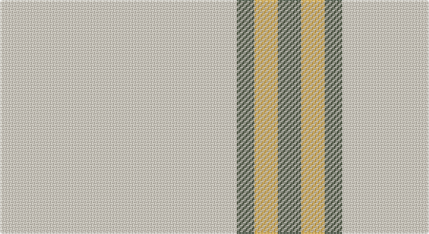

This page is one **sett** — a single exact thread-count. It belongs to the [tartan](/setts/w81dg6lo8dg8/)
(the same proportion at any scale), whose colour order is pattern [GYGW](/stripes/gygw/).

Part of the [Young in Australia](/tartans/young-in-australia/) tartan — the named design grouping this sett with its other cloths.

Sourced from register-of-tartans.  It is a [4 stripe tartan](/stripes/stripes4/).

Original link https://www.tartanregister.gov.uk/tartanDetails.aspx?ref=10241

## Register references

External register numbers recorded for this tartan.

- Scottish Register of Tartans: [10241](https://www.tartanregister.gov.uk/tartanDetails.aspx?ref=10241)

## Thread count
W/162 K12 Y16 K/16

One full sett is **234 threads**.

## Palette

Palette: <strong>Tartan Register</strong> <small style="color:#888">(1 of 3 colours)</small>
<table><thead><tr><th>Colour</th><th>Threads</th><th>Shade</th><th>Base</th><th>OKLCh</th></tr></thead><tbody><tr><td>W/</td><td style="text-align:right;font-variant-numeric:tabular-nums">162</td><td><code style="background-color:#E8DDCB;">#E8DDCB</code> <small style="color:#888">#E8DDCB</small></td><td>W <code style="background-color:#F7F7F7;">#F7F7F7</code></td><td><small style="color:#888">oklch(90.1% 0.027 80.2)</small></td></tr><tr><td>K</td><td style="text-align:right;font-variant-numeric:tabular-nums">12</td><td><code style="background-color:#23321B;">#23321B</code> <small style="color:#888">#23321B</small></td><td>G <code style="background-color:#006100;">#006100</code></td><td><small style="color:#888">oklch(29.7% 0.045 135.3)</small></td></tr><tr><td>Y</td><td style="text-align:right;font-variant-numeric:tabular-nums">16</td><td><code style="background-color:#E0A126;">#E0A126</code> <small style="color:#888">#E0A126</small></td><td>Y <code style="background-color:#F2BF00;">#F2BF00</code></td><td><small style="color:#888">oklch(75.1% 0.146 78.3)</small></td></tr><tr><td>K/</td><td style="text-align:right;font-variant-numeric:tabular-nums">16</td><td><code style="background-color:#23321B;">#23321B</code> <small style="color:#888">#23321B</small></td><td>G <code style="background-color:#006100;">#006100</code></td><td><small style="color:#888">oklch(29.7% 0.045 135.3)</small></td></tr></tbody></table>

# Sample pattern

## Nearest tartans

The nearest existing variants by ΔTartan distance, with this tartan at the top so the swatches line up against it.

ΔTartan

Tartan

Sett

—

<a href="/ttd/edit/#slug=w81dg6lo8dg8~x2">Young in Australia</a> <a class="nn-out" href="/variants/s4/w81dg6lo8dg8~x2/" title="open its dictionary page">↗</a>

1.72

<a href="/variants/s4/w35ni12r2n2~x2/">Triplett, Jack Arnold</a>

1.89

<a href="/ttd/edit/#slug=k7w3k7w45r3w3r3~x2&amp;base=w81dg6lo8dg8~x2">White Stripes (Corporate)</a> <a class="nn-out" href="/variants/s7/k7w3k7w45r3w3r3~x2/" title="open its dictionary page">↗</a>

1.89

<a href="/ttd/edit/#slug=w20k2w20lo5k3w3lo4k2&amp;base=w81dg6lo8dg8~x2">Guzzo Dress (Personal)</a> <a class="nn-out" href="/variants/s8/w20k2w20lo5k3w3lo4k2/" title="open its dictionary page">↗</a>

1.99

<a href="/ttd/edit/#slug=w93o6w13db35w12o6&amp;base=w81dg6lo8dg8~x2">Butties</a> <a class="nn-out" href="/variants/s6/w93o6w13db35w12o6/" title="open its dictionary page">↗</a>

2.02

<a href="/ttd/edit/#slug=lr10k2w5k4lr50b2~x2&amp;base=w81dg6lo8dg8~x2">London Fog Safari (Fashion)</a> <a class="nn-out" href="/variants/s6/lr10k2w5k4lr50b2~x2/" title="open its dictionary page">↗</a>

2.07

<a href="/ttd/edit/#slug=w45b2w4b15w7~x2&amp;base=w81dg6lo8dg8~x2">Asahi (Estimated threadcount)</a> <a class="nn-out" href="/variants/s5/w45b2w4b15w7~x2/" title="open its dictionary page">↗</a>

2.07

<a href="/ttd/edit/#slug=w20k2w20ly5k3w3ly4k2&amp;base=w81dg6lo8dg8~x2">Guzzo Dress (Montreal, Canada) (Personal)</a> <a class="nn-out" href="/variants/s8/w20k2w20ly5k3w3ly4k2/" title="open its dictionary page">↗</a>

2.09

<a href="/ttd/edit/#slug=w50db7w7t7w18~x2&amp;base=w81dg6lo8dg8~x2">Sephardim (Corporate)</a> <a class="nn-out" href="/variants/s5/w50db7w7t7w18~x2/" title="open its dictionary page">↗</a>

2.12

<a href="/ttd/edit/#slug=w93lr6w13b35w12lr6&amp;base=w81dg6lo8dg8~x2">Butties</a> <a class="nn-out" href="/variants/s6/w93lr6w13b35w12lr6/" title="open its dictionary page">↗</a>

2.20

<a href="/ttd/edit/#slug=w24w1y9w1w9w2y2k2~x2&amp;base=w81dg6lo8dg8~x2">Gairloch (Fashion)</a> <a class="nn-out" href="/variants/s8/w24w1y9w1w9w2y2k2~x2/" title="open its dictionary page">↗</a>

## Neighbour map

Every grey dot is one of 14360 variants placed by the first two principal components of the ΔTartan feature space (44% of its variance). Red is this tartan; blue dots are its nearest — click one to open its page.

<svg viewBox="0 0 640 380" role="img" style="max-width:100%;height:auto;border:1px solid #e0e0e0;border-radius:4px;display:block" xmlns="http://www.w3.org/2000/svg"><image href="/nn/cloud.v1.png" width="640" height="380"/><a href="/variants/s4/w35ni12r2n2~x2/"><circle cx="391.9" cy="163.4" r="4" fill="#3465a4"><title>Triplett, Jack Arnold</title></circle></a><a href="/variants/s7/k7w3k7w45r3w3r3~x2/"><circle cx="418.5" cy="134.0" r="4" fill="#3465a4"><title>White Stripes (Corporate)</title></circle></a><a href="/variants/s8/w20k2w20lo5k3w3lo4k2/"><circle cx="399.2" cy="174.6" r="4" fill="#3465a4"><title>Guzzo Dress (Personal)</title></circle></a><a href="/variants/s6/w93o6w13db35w12o6/"><circle cx="405.8" cy="156.5" r="4" fill="#3465a4"><title>Butties</title></circle></a><a href="/variants/s6/lr10k2w5k4lr50b2~x2/"><circle cx="550.4" cy="138.7" r="4" fill="#3465a4"><title>London Fog Safari (Fashion)</title></circle></a><a href="/variants/s5/w45b2w4b15w7~x2/"><circle cx="532.9" cy="196.5" r="4" fill="#3465a4"><title>Asahi (Estimated threadcount)</title></circle></a><a href="/variants/s8/w20k2w20ly5k3w3ly4k2/"><circle cx="384.3" cy="165.3" r="4" fill="#3465a4"><title>Guzzo Dress (Montreal, Canada) (Personal)</title></circle></a><a href="/variants/s5/w50db7w7t7w18~x2/"><circle cx="511.8" cy="228.8" r="4" fill="#3465a4"><title>Sephardim (Corporate)</title></circle></a><a href="/variants/s6/w93lr6w13b35w12lr6/"><circle cx="421.8" cy="162.7" r="4" fill="#3465a4"><title>Butties</title></circle></a><a href="/variants/s8/w24w1y9w1w9w2y2k2~x2/"><circle cx="461.8" cy="131.0" r="4" fill="#3465a4"><title>Gairloch (Fashion)</title></circle></a><circle cx="495.6" cy="184.1" r="5" fill="#c00000"/></svg>

ID: /variants/s4/w81dg6lo8dg8~x2/
