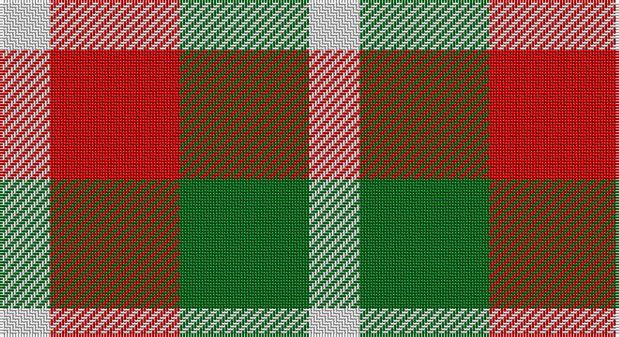

This page is one **sett** — a single exact thread-count. It belongs to the [tartan](/setts/w9r23g23w9/)
(the same proportion at any scale), whose colour order is pattern [WGRW](/stripes/wgrw/).

Sourced from register-of-tartans.  It is a [4 stripe tartan](/stripes/stripes4/).

Original link https://www.tartanregister.gov.uk/tartanDetails.aspx?ref=3420

## Provenance

Earliest known date: 1983 The Sultan of Oman is the ruler of Quaboos.

## Also known as

This cloth is also recorded under:

- Omani Regiment 2nd Pipe Sqn.
- Quaboos Pipers Plaid
- Quaboos Pipers Plaid Regimental
- Quaboos, Pipers Plaid

5 attestations — the source records this cloth was collapsed from (oldest owns this page)

<ul>
<li>01/01/2002 — Quaboos Pipers Plaid (register-of-tartans, <a href="https://www.tartanregister.gov.uk/tartanDetails.aspx?ref=3420">record</a>)</li>
<li>pre 2002 — Qaboos (Corporate) (tartans-authority, <a href="http://www.tartansauthority.com/tartan-ferret/display/1806/">record</a>)</li>
<li>pre 2006 — Omani Regiment 2nd Pipe Sqn. (Mil.) (tartans-authority, <a href="http://www.tartansauthority.com/tartan-ferret/display/6852/">record</a>)</li>
<li>undated — Quaboos, Pipers Plaid (weddslist, <a href="http://www.weddslist.com/cgi-bin/tartans/pg.pl?source=sts">record</a>)</li>
<li>undated — Quaboos Pipers Plaid Regimental Tartan (house-of-tartan, <a href="http://www.house-of-tartan.scotland.net/house/TartanViewjs.asp?colr=Def&tnam=1806">record</a>)</li>
</ul>

## Register references

External register numbers recorded for this tartan.

- Scottish Register of Tartans: [3420](https://www.tartanregister.gov.uk/tartanDetails.aspx?ref=3420)
- Scottish Tartans Authority (ITI): 6852
- Scottish Tartans World Register: 1806

## Thread count
LN/18 R46 G46 LN/18

One full sett is **220 threads**.

## Palette

Palette: <strong>Tartan Register</strong>
<table><thead><tr><th>Colour</th><th>Threads</th><th>Shade</th><th>Base</th><th>OKLCh</th></tr></thead><tbody><tr><td>LN/</td><td style="text-align:right;font-variant-numeric:tabular-nums">18</td><td><code style="background-color:#E0E0E0;">#E0E0E0</code> <small style="color:#888">#E0E0E0</small></td><td>W <code style="background-color:#F7F7F7;">#F7F7F7</code></td><td><small style="color:#888">oklch(90.7% 0.000 89.9)</small></td></tr><tr><td>R</td><td style="text-align:right;font-variant-numeric:tabular-nums">46</td><td><code style="background-color:#C80000;">#C80000</code> <small style="color:#888">#C80000</small></td><td>R <code style="background-color:#CC0000;">#CC0000</code></td><td><small style="color:#888">oklch(52.3% 0.215 29.2)</small></td></tr><tr><td>G</td><td style="text-align:right;font-variant-numeric:tabular-nums">46</td><td><code style="background-color:#006818;">#006818</code> <small style="color:#888">#006818</small></td><td>G <code style="background-color:#006100;">#006100</code></td><td><small style="color:#888">oklch(45.0% 0.142 145.0)</small></td></tr><tr><td>LN/</td><td style="text-align:right;font-variant-numeric:tabular-nums">18</td><td><code style="background-color:#E0E0E0;">#E0E0E0</code> <small style="color:#888">#E0E0E0</small></td><td>W <code style="background-color:#F7F7F7;">#F7F7F7</code></td><td><small style="color:#888">oklch(90.7% 0.000 89.9)</small></td></tr></tbody></table>

# Sample pattern

## Nearest tartans

The nearest existing variants by ΔTartan distance, with this tartan at the top so the swatches line up against it.

ΔTartan

Tartan

Sett

—

<a href="/ttd/edit/#slug=w9r23g23w9~x2">Quaboos Pipers Plaid</a> <a class="nn-out" href="/variants/s4/w9r23g23w9~x2/" title="open its dictionary page">↗</a>

1.28

<a href="/ttd/edit/#slug=g23r23w9r23g23w9~x2&amp;base=w9r23g23w9~x2">Omani Regiment 2nd Pipe Sqn.</a> <a class="nn-out" href="/variants/s6/g23r23w9r23g23w9~x2/" title="open its dictionary page">↗</a>

1.59

<a href="/ttd/edit/#slug=r1g3p3w1~x4&amp;base=w9r23g23w9~x2">Wilson's, No 113</a> <a class="nn-out" href="/variants/s4/r1g3p3w1~x4/" title="open its dictionary page">↗</a>

1.63

<a href="/ttd/edit/#slug=r21k21w10k10w21~x2&amp;base=w9r23g23w9~x2">Havel</a> <a class="nn-out" href="/variants/s5/r21k21w10k10w21~x2/" title="open its dictionary page">↗</a>

1.75

<a href="/ttd/edit/#slug=r3g1k3w1~x20&amp;base=w9r23g23w9~x2">SAL Glindrande Stiernan</a> <a class="nn-out" href="/variants/s4/r3g1k3w1~x20/" title="open its dictionary page">↗</a>

1.86

<a href="/ttd/edit/#slug=w3r2w1dt2r2~x4&amp;base=w9r23g23w9~x2">Oakland Centre</a> <a class="nn-out" href="/variants/s5/w3r2w1dt2r2~x4/" title="open its dictionary page">↗</a>

1.88

<a href="/ttd/edit/#slug=r3k1dg1k1lb3~x4&amp;base=w9r23g23w9~x2">Clark</a> <a class="nn-out" href="/variants/s5/r3k1dg1k1lb3~x4/" title="open its dictionary page">↗</a>

1.90

<a href="/ttd/edit/#slug=t2r4g5ly1~x4&amp;base=w9r23g23w9~x2">Wilson's No.203</a> <a class="nn-out" href="/variants/s4/t2r4g5ly1~x4/" title="open its dictionary page">↗</a>

1.91

<a href="/ttd/edit/#slug=r33g9k5g24w33~x2&amp;base=w9r23g23w9~x2">Inverness Basque (District)</a> <a class="nn-out" href="/variants/s5/r33g9k5g24w33~x2/" title="open its dictionary page">↗</a>

1.92

<a href="/ttd/edit/#slug=k5g8lo5g3lo5~x4&amp;base=w9r23g23w9~x2">Angle Dress (Fashion)</a> <a class="nn-out" href="/variants/s5/k5g8lo5g3lo5~x4/" title="open its dictionary page">↗</a>

1.96

<a href="/ttd/edit/#slug=g4r3t1k1t3~x4&amp;base=w9r23g23w9~x2">Wilson's, No 214</a> <a class="nn-out" href="/variants/s5/g4r3t1k1t3~x4/" title="open its dictionary page">↗</a>

## Neighbour map

Every grey dot is one of 14360 variants placed by the first two principal components of the ΔTartan feature space (44% of its variance). Red is this tartan; blue dots are its nearest — click one to open its page.

<svg viewBox="0 0 640 380" role="img" style="max-width:100%;height:auto;border:1px solid #e0e0e0;border-radius:4px;display:block" xmlns="http://www.w3.org/2000/svg"><image href="/nn/cloud.v1.png" width="640" height="380"/><a href="/variants/s6/g23r23w9r23g23w9~x2/"><circle cx="136.7" cy="304.3" r="4" fill="#3465a4"><title>Omani Regiment 2nd Pipe Sqn.</title></circle></a><a href="/variants/s4/r1g3p3w1~x4/"><circle cx="119.1" cy="286.4" r="4" fill="#3465a4"><title>Wilson's, No 113</title></circle></a><a href="/variants/s5/r21k21w10k10w21~x2/"><circle cx="74.9" cy="307.9" r="4" fill="#3465a4"><title>Havel</title></circle></a><a href="/variants/s4/r3g1k3w1~x20/"><circle cx="102.5" cy="271.1" r="4" fill="#3465a4"><title>SAL Glindrande Stiernan</title></circle></a><a href="/variants/s5/w3r2w1dt2r2~x4/"><circle cx="108.9" cy="294.3" r="4" fill="#3465a4"><title>Oakland Centre</title></circle></a><a href="/variants/s5/r3k1dg1k1lb3~x4/"><circle cx="73.7" cy="256.0" r="4" fill="#3465a4"><title>Clark</title></circle></a><a href="/variants/s4/t2r4g5ly1~x4/"><circle cx="176.9" cy="278.3" r="4" fill="#3465a4"><title>Wilson's No.203</title></circle></a><a href="/variants/s5/r33g9k5g24w33~x2/"><circle cx="117.2" cy="230.9" r="4" fill="#3465a4"><title>Inverness Basque (District)</title></circle></a><a href="/variants/s5/k5g8lo5g3lo5~x4/"><circle cx="149.2" cy="342.9" r="4" fill="#3465a4"><title>Angle Dress (Fashion)</title></circle></a><a href="/variants/s5/g4r3t1k1t3~x4/"><circle cx="108.6" cy="277.5" r="4" fill="#3465a4"><title>Wilson's, No 214</title></circle></a><circle cx="120.5" cy="308.5" r="5" fill="#c00000"/></svg>

ID: /variants/s4/w9r23g23w9~x2/
