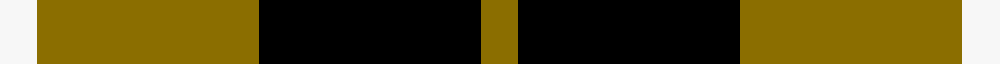

This is one **variant** — a specific cloth: this exact thread count and colourway, with its own
provenance below. It is one weaving of the [sett](/tartans/b/ba/barclay-dress/) (the scale-free proportion — the
same cloth at any scale or shade), whose colour order is pattern [GKGW](/stripes/gkgw/).

Part of the [Barclay Dress](/tartans/b/ba/barclay-dress/) tartan — the named design grouping this sett with its other cloths.

Sourced from weddslist.  It is a [4 stripe tartan](/stripes/stripes4/).

Original link [http://www.weddslist.com/cgi-bin/tartans/pg.pl?source=x](http://www.weddslist.com/cgi-bin/tartans/pg.pl?source=x)

Dataset <small>— provenance for this record, inherited from the source manifest</small>

<dl class="dataset-prov">
<dt>source</dt><dd><a href="/sources/weddslist/">Weddslist</a></dd>
<dt>data captured from</dt><dd><a href="https://github.com/thetartan/tartan-database/blob/master/data/weddslist/data.csv">https://github.com/thetartan/tartan-database/blob/master/data/weddslist/data.csv</a></dd>
<dt>data date</dt><dd>2016-11-17 <small>(dataset default)</small></dd>
<dt>licence</dt><dd><a href="https://creativecommons.org/licenses/by-nc-nd/4.0/">CC BY-NC-ND 4.0</a></dd>
</dl>

Capture chain <small>— the hands this data passed through, oldest first; each capture carries its own licence</small>

<ol class="capture-chain">
<li><a href="https://www.weddslist.com/tartans/">Weddslist</a> <small>the living privately compiled reference</small></li>
<li><a href="https://github.com/thetartan/tartan-database">thetartan/tartan-database</a> <small>2016-2017</small> · <a href="https://creativecommons.org/licenses/by-nc-nd/4.0/">CC BY-NC-ND 4.0</a> <small>Levko Kravets's frozen compilation — the capture we vendored, and where its CC licence text came from</small></li>
<li>this dictionary <small>captured 2026-06-10 · commit 5bf86c7566</small> <small>each re-capture is a git commit to data/sources</small></li>
</ol>

## Thread count
W/1 Y6 K6 Y/1

One full sett is **26 threads**.

## Palette
<table><thead><tr><th>Colour</th><th>Shade</th><th>OKLCh</th></tr></thead><tbody><tr><td>K</td><td><code style="background-color:#000000;">#000000</code> <small style="color:#888">#000000</small></td><td><small style="color:#888">oklch(0.0% 0.000 0.0)</small></td></tr><tr><td>Y</td><td><code style="background-color:#8B6E00;">#8B6E00</code> <small style="color:#888">#8B6E00</small></td><td><small style="color:#888">oklch(55.1% 0.113 90.4)</small></td></tr><tr><td>W</td><td><code style="background-color:#F7F7F7;">#F7F7F7</code> <small style="color:#888">#F7F7F7</small></td><td><small style="color:#888">oklch(97.6% 0.000 89.9)</small></td></tr></tbody></table>

# Sample pattern

[Sample sheet (PDF)](swatch.pdf) — the woven sample, thread count and palette on one printable A4, rendered on demand (the same sheet the TTD print page downloads).

## Nearest tartan variants

The nearest existing variants by ΔTartan distance, with this cloth at the top so the swatches line up against it.

ΔTartan

Threads

Variant

Sett

—

26

<a href="/variants/s4/y1k6y6w1/">Barclay Dress</a>

<a href="/ttd/edit/#slug=y1k6y6w1~x2&amp;base=y1k6y6w1" title="compare in the TTD">0.54</a>

52

<a href="/variants/s4/y1k6y6w1~x2/">Barclay Dress</a>

<a href="/ttd/edit/#slug=y1k6y6w1~x8&amp;base=y1k6y6w1" title="compare in the TTD">0.54</a>

208

<a href="/variants/s4/y1k6y6w1~x8/">Barclay Dress Clan Tartan</a>

<a href="/ttd/edit/#slug=r4k25y25w4~x2&amp;base=y1k6y6w1" title="compare in the TTD">1.49</a>

216

<a href="/variants/s4/r4k25y25w4~x2/">Bonhill Primary School</a>

<a href="/ttd/edit/#slug=k15y20w3~x2&amp;base=y1k6y6w1" title="compare in the TTD">1.53</a>

116

<a href="/variants/s3/k15y20w3~x2/">Silvicola (Corporate)</a>

<a href="/ttd/edit/#slug=k6y1g6~x4&amp;base=y1k6y6w1" title="compare in the TTD">1.70</a>

56

<a href="/variants/s3/k6y1g6~x4/">Wilson's No.197</a>

<a href="/ttd/edit/#slug=k5ly5w1ly5k5r1~x10~ly6307084&amp;base=y1k6y6w1" title="compare in the TTD">1.76</a>

380

<a href="/variants/s6/k5ly5w1ly5k5r1~x10~ly6307084/">Canyon County Idaho Sheriff</a>

<a href="/ttd/edit/#slug=k5ly5w1ly5k5r1~x10&amp;base=y1k6y6w1" title="compare in the TTD">1.76</a>

380

<a href="/variants/s6/k5ly5w1ly5k5r1~x10/">Canyon County Idaho Sheriff (Corp)</a>

<a href="/ttd/edit/#slug=n5dp3n18k16y3~x4&amp;base=y1k6y6w1" title="compare in the TTD">1.91</a>

328

<a href="/variants/s5/n5dp3n18k16y3~x4/">New York State Police Pipe Band</a>

<a href="/ttd/edit/#slug=r1y13k8g1~x6&amp;base=y1k6y6w1" title="compare in the TTD">1.92</a>

264

<a href="/variants/s4/r1y13k8g1~x6/">Billy Apple® Yellow</a>

<a href="/ttd/edit/#slug=k4y1k4y6r1~x4&amp;base=y1k6y6w1" title="compare in the TTD">2.02</a>

108

<a href="/variants/s5/k4y1k4y6r1~x4/">MacLeod Dress Clan Tartan</a>

## Neighbour map

Every grey dot is one of 13662 variants placed by the first two principal components of the ΔTartan feature space (42% of its variance). Red is this tartan; blue dots are its nearest — click one to open its page. The map is a flat projection of a many-dimensional space — [how to read it](/posts/neighbourhood-maps/).

<svg viewBox="0 0 640 380" role="img" style="max-width:100%;height:auto;border:1px solid #e0e0e0;border-radius:4px;display:block" xmlns="http://www.w3.org/2000/svg"><image href="/nn/cloud.v1.png" width="640" height="380"/><a href="/variants/s4/y1k6y6w1~x2/"><circle cx="237.5" cy="244.6" r="4" fill="#3465a4"><title>Barclay Dress</title></circle></a><a href="/variants/s4/y1k6y6w1~x8/"><circle cx="237.5" cy="244.6" r="4" fill="#3465a4"><title>Barclay Dress Clan Tartan</title></circle></a><a href="/variants/s4/r4k25y25w4~x2/"><circle cx="180.4" cy="226.8" r="4" fill="#3465a4"><title>Bonhill Primary School</title></circle></a><a href="/variants/s3/k15y20w3~x2/"><circle cx="242.3" cy="267.5" r="4" fill="#3465a4"><title>Silvicola (Corporate)</title></circle></a><a href="/variants/s3/k6y1g6~x4/"><circle cx="200.6" cy="253.4" r="4" fill="#3465a4"><title>Wilson's No.197</title></circle></a><a href="/variants/s6/k5ly5w1ly5k5r1~x10~ly6307084/"><circle cx="159.7" cy="240.0" r="4" fill="#3465a4"><title>Canyon County Idaho Sheriff</title></circle></a><a href="/variants/s6/k5ly5w1ly5k5r1~x10/"><circle cx="150.9" cy="239.0" r="4" fill="#3465a4"><title>Canyon County Idaho Sheriff (Corp)</title></circle></a><a href="/variants/s5/n5dp3n18k16y3~x4/"><circle cx="232.3" cy="227.8" r="4" fill="#3465a4"><title>New York State Police Pipe Band</title></circle></a><a href="/variants/s4/r1y13k8g1~x6/"><circle cx="288.3" cy="188.5" r="4" fill="#3465a4"><title>Billy Apple® Yellow</title></circle></a><a href="/variants/s5/k4y1k4y6r1~x4/"><circle cx="230.0" cy="244.7" r="4" fill="#3465a4"><title>MacLeod Dress Clan Tartan</title></circle></a><circle cx="237.5" cy="244.6" r="5" fill="#c00000"/><text x="320" y="376" text-anchor="middle" font-size="11" fill="#999">ground</text><text x="11" y="190" text-anchor="middle" font-size="11" fill="#999" transform="rotate(-90 11 190)">complexity</text></svg>

ID: /variants/s4/y1k6y6w1/
