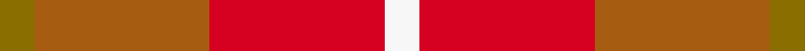

This is one **variant** — a specific cloth: this exact thread count and colourway, with its own
provenance below. It is one weaving of the [sett](/tartans/m/ma/manx-mannin-2/) (the scale-free proportion — the
same cloth at any scale or shade), whose colour order is pattern [GRRW](/stripes/grrw/).

Part of the [Manx, Mannin](/tartans/m/ma/manx-mannin-2/) tartan — the named design grouping this sett with its other cloths.

Sourced from weddslist.  It is a [4 stripe tartan](/stripes/stripes4/).

Original link [http://www.weddslist.com/cgi-bin/tartans/pg.pl?source=sts](http://www.weddslist.com/cgi-bin/tartans/pg.pl?source=sts)

Dataset <small>— provenance for this record, inherited from the source manifest</small>

<dl class="dataset-prov">
<dt>source</dt><dd><a href="/sources/weddslist/">Weddslist</a></dd>
<dt>data captured from</dt><dd><a href="https://github.com/thetartan/tartan-database/blob/master/data/weddslist/data.csv">https://github.com/thetartan/tartan-database/blob/master/data/weddslist/data.csv</a></dd>
<dt>data date</dt><dd>2016-11-17 <small>(dataset default)</small></dd>
<dt>licence</dt><dd><a href="https://creativecommons.org/licenses/by-nc-nd/4.0/">CC BY-NC-ND 4.0</a></dd>
</dl>

Capture chain <small>— the hands this data passed through, oldest first; each capture carries its own licence</small>

<ol class="capture-chain">
<li><a href="https://www.weddslist.com/tartans/">Weddslist</a> <small>the living privately compiled reference</small></li>
<li><a href="https://github.com/thetartan/tartan-database">thetartan/tartan-database</a> <small>2016-2017</small> · <a href="https://creativecommons.org/licenses/by-nc-nd/4.0/">CC BY-NC-ND 4.0</a> <small>Levko Kravets's frozen compilation — the capture we vendored, and where its CC licence text came from</small></li>
<li>this dictionary <small>captured 2026-06-10 · commit 5bf86c7566</small> <small>each re-capture is a git commit to data/sources</small></li>
</ol>

## Thread count
Y/4 O20 R20 W/4

One full sett is **88 threads**.

## Palette
<table><thead><tr><th>Colour</th><th>Shade</th><th>OKLCh</th></tr></thead><tbody><tr><td>W</td><td><code style="background-color:#F7F7F7;">#F7F7F7</code> <small style="color:#888">#F7F7F7</small></td><td><small style="color:#888">oklch(97.6% 0.000 89.9)</small></td></tr><tr><td>O</td><td><code style="background-color:#A65C11;">#A65C11</code> <small style="color:#888">#A65C11</small></td><td><small style="color:#888">oklch(55.0% 0.125 58.3)</small></td></tr><tr><td>R</td><td><code style="background-color:#D60020;">#D60020</code> <small style="color:#888">#D60020</small></td><td><small style="color:#888">oklch(55.2% 0.224 25.5)</small></td></tr><tr><td>Y</td><td><code style="background-color:#8B6E00;">#8B6E00</code> <small style="color:#888">#8B6E00</small></td><td><small style="color:#888">oklch(55.1% 0.113 90.4)</small></td></tr></tbody></table>

# Sample pattern

## Nearest tartan variants

The nearest existing variants by ΔTartan distance, with this cloth at the top so the swatches line up against it.

ΔTartan

Threads

Variant

Sett

—

88

<a href="/variants/s4/y1o5r5w1~x4/">Manx, Mannin Plaid</a>

<a href="/ttd/edit/#slug=y1dy5r5w1~x4&amp;base=y1o5r5w1~x4" title="compare in the TTD">1.70</a>

88

<a href="/variants/s4/y1dy5r5w1~x4/">Manx Mannin Plaid</a>

<a href="/ttd/edit/#slug=dr5o35dr46ly5~x2&amp;base=y1o5r5w1~x4" title="compare in the TTD">1.91</a>

344

<a href="/variants/s4/dr5o35dr46ly5~x2/">Bryce</a>

<a href="/ttd/edit/#slug=db2r22dy11ly2dy11db2~x2~dy1603076-ly3307090&amp;base=y1o5r5w1~x4" title="compare in the TTD">2.01</a>

192

<a href="/variants/s6/db2r22dy11ly2dy11db2~x2~dy1603076-ly3307090/">Cetoloni Family Tartan</a>

<a href="/ttd/edit/#slug=o1dr4r10y2w1~x4&amp;base=y1o5r5w1~x4" title="compare in the TTD">2.01</a>

136

<a href="/variants/s5/o1dr4r10y2w1~x4/">Love</a>

<a href="/ttd/edit/#slug=oi23r22o52r8w6ly18~oi2503076-ly2705081&amp;base=y1o5r5w1~x4" title="compare in the TTD">2.12</a>

217

<a href="/variants/s6/ly23r22o52r8w6lyi18~ly2503076-lyi2705081/">Lady Boys of Bangkok (Corporate)</a>

<a href="/ttd/edit/#slug=lr6o5k2y18r28w2~x2&amp;base=y1o5r5w1~x4" title="compare in the TTD">2.26</a>

228

<a href="/variants/s6/lr6o5k2y18r28w2~x2/">Dundhuin</a>

<a href="/ttd/edit/#slug=r1g8o8w1~x2&amp;base=y1o5r5w1~x4" title="compare in the TTD">2.31</a>

68

<a href="/variants/s4/r1g8o8w1~x2/">MacKinnon, hunting</a>

<a href="/ttd/edit/#slug=k1dr9n8y8w1~x2&amp;base=y1o5r5w1~x4" title="compare in the TTD">2.42</a>

104

<a href="/variants/s5/k1dr9n8y8w1~x2/">Pople (Name)</a>

<a href="/ttd/edit/#slug=o62n17ly12y8dg8~x2&amp;base=y1o5r5w1~x4" title="compare in the TTD">2.42</a>

288

<a href="/variants/s5/o62n17ly12y8dg8~x2/">Dundhuin Dress (Personal)</a>

<a href="/ttd/edit/#slug=r4g2lb1~x4&amp;base=y1o5r5w1~x4" title="compare in the TTD">2.47</a>

36

<a href="/variants/s3/r4g2lb1~x4/">Wilson's, No 188</a>

## Neighbour map

Every grey dot is one of 13656 variants placed by the first two principal components of the ΔTartan feature space (42% of its variance). Red is this tartan; blue dots are its nearest — click one to open its page. The map is a flat projection of a many-dimensional space — [how to read it](/posts/neighbourhood-maps/).

<svg viewBox="0 0 640 380" role="img" style="max-width:100%;height:auto;border:1px solid #e0e0e0;border-radius:4px;display:block" xmlns="http://www.w3.org/2000/svg"><image href="/nn/cloud.v1.png" width="640" height="380"/><a href="/variants/s4/y1dy5r5w1~x4/"><circle cx="228.8" cy="264.3" r="4" fill="#3465a4"><title>Manx Mannin Plaid</title></circle></a><a href="/variants/s4/dr5o35dr46ly5~x2/"><circle cx="410.6" cy="261.0" r="4" fill="#3465a4"><title>Bryce</title></circle></a><a href="/variants/s6/db2r22dy11ly2dy11db2~x2~dy1603076-ly3307090/"><circle cx="331.2" cy="217.1" r="4" fill="#3465a4"><title>Cetoloni Family Tartan</title></circle></a><a href="/variants/s5/o1dr4r10y2w1~x4/"><circle cx="340.0" cy="199.8" r="4" fill="#3465a4"><title>Love</title></circle></a><a href="/variants/s6/ly23r22o52r8w6lyi18~ly2503076-lyi2705081/"><circle cx="325.6" cy="264.7" r="4" fill="#3465a4"><title>Lady Boys of Bangkok (Corporate)</title></circle></a><a href="/variants/s6/lr6o5k2y18r28w2~x2/"><circle cx="261.6" cy="159.5" r="4" fill="#3465a4"><title>Dundhuin</title></circle></a><a href="/variants/s4/r1g8o8w1~x2/"><circle cx="333.8" cy="270.9" r="4" fill="#3465a4"><title>MacKinnon, hunting</title></circle></a><a href="/variants/s5/k1dr9n8y8w1~x2/"><circle cx="194.8" cy="232.2" r="4" fill="#3465a4"><title>Pople (Name)</title></circle></a><a href="/variants/s5/o62n17ly12y8dg8~x2/"><circle cx="411.8" cy="244.9" r="4" fill="#3465a4"><title>Dundhuin Dress (Personal)</title></circle></a><a href="/variants/s3/r4g2lb1~x4/"><circle cx="325.0" cy="317.8" r="4" fill="#3465a4"><title>Wilson's, No 188</title></circle></a><circle cx="322.8" cy="296.0" r="5" fill="#c00000"/><text x="320" y="376" text-anchor="middle" font-size="11" fill="#999">ground</text><text x="11" y="190" text-anchor="middle" font-size="11" fill="#999" transform="rotate(-90 11 190)">complexity</text></svg>

ID: /variants/s4/y1o5r5w1~x4/
