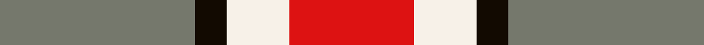
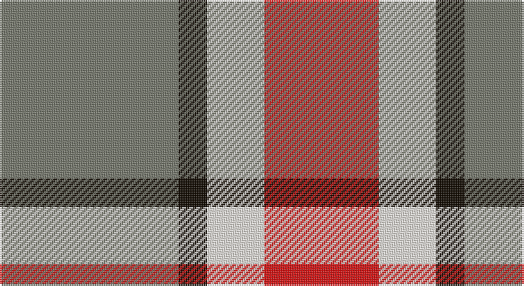

This page is one **sett** — a single exact thread-count. It belongs to the [tartan](/setts/y25k4w8r16/)
(the same proportion at any scale), whose colour order is pattern [GKWR](/stripes/gkwr/).

Sourced from register-of-tartans.  It is a [4 stripe tartan](/stripes/stripes4/).

Original link https://www.tartanregister.gov.uk/tartanDetails.aspx?ref=10702

## Provenance

Earliest known date: 20 September 2012 The official tartan for The Ohio State University. The Ohio State Buckeyes is a collegiate football team that competes as part of the National Collegiate Athletic Association (NCAA) Division I Football Bowl Subdivision, representing the Ohio State University in the Leaders Division of the Big Ten Conference. The tartan is a lattice work of the Ohio State football uniform strip pattern featuring the Ohio State University’s official school colours since 1878, scarlet and grey.

2 attestations — the source records this cloth was collapsed from (oldest owns this page)

<ul>
<li>12/09/2012 — Buckeye (register-of-tartans, <a href="https://www.tartanregister.gov.uk/tartanDetails.aspx?ref=10702">record</a>)</li>
<li>undated — Buckeye Corporate Tartan (house-of-tartan, <a href="http://www.house-of-tartan.scotland.net/house/TartanViewjs.asp?colr=Def&tnam=10702">record</a>)</li>
</ul>

## Register references

External register numbers recorded for this tartan.

- Scottish Register of Tartans: [10702](https://www.tartanregister.gov.uk/tartanDetails.aspx?ref=10702)

## Thread count
N/100 K16 W32 R/64

One full sett is **260 threads**.

## Palette

Palette: <strong>custom</strong>
<table><thead><tr><th>Colour</th><th>Threads</th><th>Shade</th><th>Base</th><th>OKLCh</th></tr></thead><tbody><tr><td>N/</td><td style="text-align:right;font-variant-numeric:tabular-nums">100</td><td><code style="background-color:#75786C;">#75786C</code> <small style="color:#888">#75786C</small></td><td>G <code style="background-color:#006100;">#006100</code></td><td><small style="color:#888">oklch(56.6% 0.018 118.4)</small></td></tr><tr><td>K</td><td style="text-align:right;font-variant-numeric:tabular-nums">16</td><td><code style="background-color:#120A01;">#120A01</code> <small style="color:#888">#120A01</small></td><td>K <code style="background-color:#000000;">#000000</code></td><td><small style="color:#888">oklch(15.2% 0.028 78.6)</small></td></tr><tr><td>W</td><td style="text-align:right;font-variant-numeric:tabular-nums">32</td><td><code style="background-color:#F7F1E8;">#F7F1E8</code> <small style="color:#888">#F7F1E8</small></td><td>W <code style="background-color:#F7F7F7;">#F7F7F7</code></td><td><small style="color:#888">oklch(96.0% 0.014 78.3)</small></td></tr><tr><td>R/</td><td style="text-align:right;font-variant-numeric:tabular-nums">64</td><td><code style="background-color:#DD1212;">#DD1212</code> <small style="color:#888">#DD1212</small></td><td>R <code style="background-color:#CC0000;">#CC0000</code></td><td><small style="color:#888">oklch(56.8% 0.226 28.6)</small></td></tr></tbody></table>

# Sample pattern

## Nearest tartans

The nearest existing variants by ΔTartan distance, with this tartan at the top so the swatches line up against it.

ΔTartan

Tartan

Sett

—

<a href="/ttd/edit/#slug=y25k4w8r16~x4">Buckeye</a> <a class="nn-out" href="/variants/s4/y25k4w8r16~x4/" title="open its dictionary page">↗</a>

0.33

<a href="/ttd/edit/#slug=o25k4w8r16~x4&amp;base=y25k4w8r16~x4">Buckeye</a> <a class="nn-out" href="/variants/s4/o25k4w8r16~x4/" title="open its dictionary page">↗</a>

1.19

<a href="/ttd/edit/#slug=r8lg15b12r29w4~x2&amp;base=y25k4w8r16~x4">Snowbird (Corporate)</a> <a class="nn-out" href="/variants/s5/r8lg15b12r29w4~x2/" title="open its dictionary page">↗</a>

1.32

<a href="/ttd/edit/#slug=y26k10r10ly10y3~x2&amp;base=y25k4w8r16~x4">Ikelman No 2</a> <a class="nn-out" href="/variants/s5/y26k10r10ly10y3~x2/" title="open its dictionary page">↗</a>

1.37

<a href="/ttd/edit/#slug=w1r5dy5ly1~x4&amp;base=y25k4w8r16~x4">Manx Mannin Plaid</a> <a class="nn-out" href="/variants/s4/w1r5dy5ly1~x4/" title="open its dictionary page">↗</a>

1.41

<a href="/ttd/edit/#slug=t2lo1r4t4w2~x10&amp;base=y25k4w8r16~x4">Doohan (New South Wales), Andrew</a> <a class="nn-out" href="/variants/s5/t2lo1r4t4w2~x10/" title="open its dictionary page">↗</a>

1.44

<a href="/ttd/edit/#slug=r12dt2ly2lb2dt4lb3~x2&amp;base=y25k4w8r16~x4">Winnipeg Embroiders' Guild (Corp.)</a> <a class="nn-out" href="/variants/s6/r12dt2ly2lb2dt4lb3~x2/" title="open its dictionary page">↗</a>

1.46

<a href="/ttd/edit/#slug=r39t22k11ly22g5~x2&amp;base=y25k4w8r16~x4">Abbink, Ingmar (Personal)</a> <a class="nn-out" href="/variants/s5/r39t22k11ly22g5~x2/" title="open its dictionary page">↗</a>

1.46

<a href="/ttd/edit/#slug=w4r7lo5b13r18g3~x2&amp;base=y25k4w8r16~x4">Ryan/Fehder (Personal)</a> <a class="nn-out" href="/variants/s6/w4r7lo5b13r18g3~x2/" title="open its dictionary page">↗</a>

1.53

<a href="/ttd/edit/#slug=o22ly10w3db8~x2&amp;base=y25k4w8r16~x4">Louisburg</a> <a class="nn-out" href="/variants/s4/o22ly10w3db8~x2/" title="open its dictionary page">↗</a>

1.54

<a href="/ttd/edit/#slug=b6o6w1o6b6ly1~x8&amp;base=y25k4w8r16~x4">Unidentified Lindley</a> <a class="nn-out" href="/variants/s6/b6o6w1o6b6ly1~x8/" title="open its dictionary page">↗</a>

## Neighbour map

Every grey dot is one of 14360 variants placed by the first two principal components of the ΔTartan feature space (44% of its variance). Red is this tartan; blue dots are its nearest — click one to open its page.

<svg viewBox="0 0 640 380" role="img" style="max-width:100%;height:auto;border:1px solid #e0e0e0;border-radius:4px;display:block" xmlns="http://www.w3.org/2000/svg"><image href="/nn/cloud.v1.png" width="640" height="380"/><a href="/variants/s4/o25k4w8r16~x4/"><circle cx="204.4" cy="242.1" r="4" fill="#3465a4"><title>Buckeye</title></circle></a><a href="/variants/s5/r8lg15b12r29w4~x2/"><circle cx="267.6" cy="236.1" r="4" fill="#3465a4"><title>Snowbird (Corporate)</title></circle></a><a href="/variants/s5/y26k10r10ly10y3~x2/"><circle cx="199.2" cy="216.5" r="4" fill="#3465a4"><title>Ikelman No 2</title></circle></a><a href="/variants/s4/w1r5dy5ly1~x4/"><circle cx="209.4" cy="248.1" r="4" fill="#3465a4"><title>Manx Mannin Plaid</title></circle></a><a href="/variants/s5/t2lo1r4t4w2~x10/"><circle cx="175.3" cy="273.9" r="4" fill="#3465a4"><title>Doohan (New South Wales), Andrew</title></circle></a><a href="/variants/s6/r12dt2ly2lb2dt4lb3~x2/"><circle cx="220.6" cy="202.6" r="4" fill="#3465a4"><title>Winnipeg Embroiders' Guild (Corp.)</title></circle></a><a href="/variants/s5/r39t22k11ly22g5~x2/"><circle cx="129.9" cy="204.6" r="4" fill="#3465a4"><title>Abbink, Ingmar (Personal)</title></circle></a><a href="/variants/s6/w4r7lo5b13r18g3~x2/"><circle cx="196.4" cy="216.0" r="4" fill="#3465a4"><title>Ryan/Fehder (Personal)</title></circle></a><a href="/variants/s4/o22ly10w3db8~x2/"><circle cx="218.7" cy="236.7" r="4" fill="#3465a4"><title>Louisburg</title></circle></a><a href="/variants/s6/b6o6w1o6b6ly1~x8/"><circle cx="231.8" cy="248.3" r="4" fill="#3465a4"><title>Unidentified Lindley</title></circle></a><circle cx="208.4" cy="244.4" r="5" fill="#c00000"/></svg>

ID: /variants/s4/y25k4w8r16~x4/
