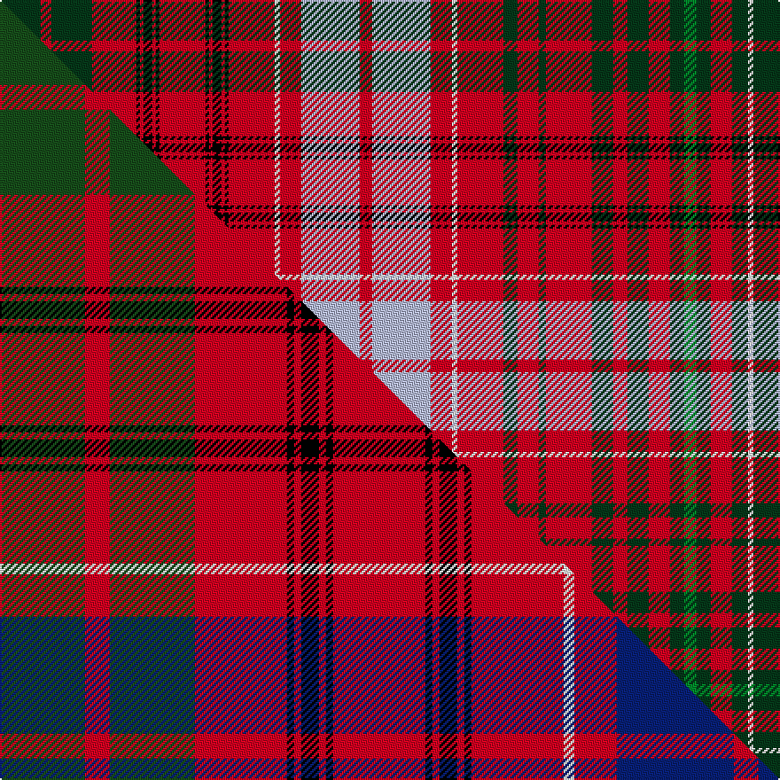

This page is one **sett** — a single exact thread-count. It belongs to the [tartan](/setts/dg23r6dg23r25k2r2k5r2k2r26k2r2k5r2k2r26w3r12lb33r7lb33r12w3r26dg8r12dg4r26dg12r8dg12r12dg8g7dg8r12dg9w3dg16w2/)
(the same proportion at any scale), whose colour order is pattern [GRGRKRKRKRKRKRKRWRWRWRWRGRGRGRGRGGGRGWGW](/stripes/grgrkrkrkrkrkrkrwrwrwrwrgrgrgrgrgggrgwgw/).

Part of the [Kinnoull](/tartans/kinnoull/) tartan — the named design grouping this sett with its other cloths.

Sourced from tartans-authority.  It is a [40 stripe tartan](/stripes/stripes40/).

Original link http://www.tartansauthority.com/tartan-ferret/display/854/

## Register references

External register numbers recorded for this tartan.

- Scottish Tartans Authority (ITI): 854

## Thread count
DG/23 R6 DG23 R25 K2 R2 K5 R2 K2 R26 K2 R2 K5 R2 K2 R26 W3 R12 LB33 R7 LB33 R12 W3 R26 DG8 R12 DG4 R26 DG12 R8 DG12 R12 DG8 G7 DG8 R12 DG9 W3 DG16 W/2

One full sett is **861 threads**.

## Palette
<table><thead><tr><th>Colour</th><th>Shade</th><th>OKLCh</th></tr></thead><tbody><tr><td>G</td><td><code style="background-color:#008B2A;">#008B2A</code> <small style="color:#888">#008B2A</small></td><td><small style="color:#888">oklch(55.4% 0.170 145.9)</small></td></tr><tr><td>DG</td><td><code style="background-color:#053819;">#053819</code> <small style="color:#888">#053819</small></td><td><small style="color:#888">oklch(30.0% 0.075 151.3)</small></td></tr><tr><td>K</td><td><code style="background-color:#000000;">#000000</code> <small style="color:#888">#000000</small></td><td><small style="color:#888">oklch(0.0% 0.000 0.0)</small></td></tr><tr><td>LB</td><td><code style="background-color:#B5BBDE;">#B5BBDE</code> <small style="color:#888">#B5BBDE</small></td><td><small style="color:#888">oklch(79.9% 0.050 277.6)</small></td></tr><tr><td>R</td><td><code style="background-color:#D60020;">#D60020</code> <small style="color:#888">#D60020</small></td><td><small style="color:#888">oklch(55.2% 0.224 25.5)</small></td></tr><tr><td>W</td><td><code style="background-color:#F7F7F7;">#F7F7F7</code> <small style="color:#888">#F7F7F7</small></td><td><small style="color:#888">oklch(97.6% 0.000 89.9)</small></td></tr></tbody></table>

# Sample pattern

## Compared to the master

This cloth is one sett of its design; the master sett (the exemplar the design is anchored on) is below for comparison.

Its **ΔTartan distance** from the master is **0.55** — the same measure the nearest-tartans table ranks by (0 is identical; a re-scale of the same cloth is near 0, a recolour or a different proportion further).

<figure class="master-compare" style="margin:0">

this sett
master sett ★

<figcaption style="color:#888;font-size:smaller">One weave of this sett against the <a href="/setts/dg24r7dg24r26k2r2k5r2k2r26k2r2k5r2k2r26w3r12db33r7db33r12w3r26dg4r12dg4r26dg12r8dg12r12dg8g7dg8r12dg9w3dg16w2/">master sett ★</a>, split on the diagonal: a shared proportion runs seamlessly across it with only the shades shifting; a different proportion breaks on it.</figcaption>
</figure>

## Nearest tartan variants

The nearest existing variants by ΔTartan distance, with this cloth at the top so the swatches line up against it.

ΔTartan

Threads

Variant

Sett

—

861

<a href="/variants/s40/dg23r6dg23r25k2r2k5r2k2r26k2r2k5r2k2r26w3r12lb33r7lb33r12w3r26dg8r12dg4r26dg12r8dg12r12dg8g7dg8r12dg9w3dg16w2/">Kinnoull (Clan)</a>

<a href="/ttd/edit/#slug=dg24r7dg24r26k2r2k5r2k2r26k2r2k5r2k2r26w3r12db33r7db33r12w3r26dg4r12dg4r26dg12r8dg12r12dg8g7dg8r12dg9w3dg16w2~x2~dg1504144-g2408144&amp;base=dg23r6dg23r25k2r2k5r2k2r26k2r2k5r2k2r26w3r12lb33r7lb33r12w3r26dg8r12dg4r26dg12r8dg12r12dg8g7dg8r12dg9w3dg16w2" title="compare in the TTD">0.04</a>

1720

<a href="/variants/s40/dg24r7dg24r26k2r2k5r2k2r26k2r2k5r2k2r26w3r12db33r7db33r12w3r26dg4r12dg4r26dg12r8dg12r12dg8g7dg8r12dg9w3dg16w2~x2~dg1504144-g2408144/">Kinnoull (MacRae)</a>

<a href="/ttd/edit/#slug=dg24r7dg24r26k2r2k5r2k2r24k2r2k5r2k2r26w3r12db33r12w3r26dg4r12dg4r26dg12r8dg12r12dg8g7dg8r12dg9w3dg16w2~dg1806142-g1904115&amp;base=dg23r6dg23r25k2r2k5r2k2r26k2r2k5r2k2r26w3r12lb33r7lb33r12w3r26dg8r12dg4r26dg12r8dg12r12dg8g7dg8r12dg9w3dg16w2" title="compare in the TTD">1.66</a>

776

<a href="/variants/s38/dg24r7dg24r26k2r2k5r2k2r24k2r2k5r2k2r26w3r12db33r12w3r26dg4r12dg4r26dg12r8dg12r12dg8g7dg8r12dg9w3dg16w2~dg1806142-g1904115/">Kinnoull (MacRae) - Error?</a>

<a href="/ttd/edit/#slug=g29r5g28r22k2r2k4r2k2r22k2r2k4r2k2r20w2r9db26r5db28r9w2r22g3r8g3r22g8r6g8r6g5y3g5r7g12w2~x2&amp;base=dg23r6dg23r25k2r2k5r2k2r26k2r2k5r2k2r26w3r12lb33r7lb33r12w3r26dg8r12dg4r26dg12r8dg12r12dg8g7dg8r12dg9w3dg16w2" title="compare in the TTD">1.92</a>

1342

<a href="/variants/s38/g29r5g28r22k2r2k4r2k2r22k2r2k4r2k2r20w2r9db26r5db28r9w2r22g3r8g3r22g8r6g8r6g5y3g5r7g12w2~x2/">MacRae The Princes Own</a>

<a href="/ttd/edit/#slug=g10r2g10r9k1r1k2r1k1r9k1r1k2r1k1r9w1r4db11r2db11r4w1r9g2r4g2r9g5r3g4r3g3y1g3r3g6w1~x2&amp;base=dg23r6dg23r25k2r2k5r2k2r26k2r2k5r2k2r26w3r12lb33r7lb33r12w3r26dg8r12dg4r26dg12r8dg12r12dg8g7dg8r12dg9w3dg16w2" title="compare in the TTD">1.98</a>

590

<a href="/variants/s38/g10r2g10r9k1r1k2r1k1r9k1r1k2r1k1r9w1r4db11r2db11r4w1r9g2r4g2r9g5r3g4r3g3y1g3r3g6w1~x2/">MacRae Prince's Own</a>

<a href="/ttd/edit/#slug=dg24r33k2r2k5r2k2r26k2r2k5r2k2r26w3r12db33r7db33r12w3r26dg4r12dg4r26dg12r8dg12r12dg8g7dg8r12dg9w3dg16w2~x2~dg1806142-g2408144&amp;base=dg23r6dg23r25k2r2k5r2k2r26k2r2k5r2k2r26w3r12lb33r7lb33r12w3r26dg8r12dg4r26dg12r8dg12r12dg8g7dg8r12dg9w3dg16w2" title="compare in the TTD">2.17</a>

1624

<a href="/variants/s38/dg24r33k2r2k5r2k2r26k2r2k5r2k2r26w3r12db33r7db33r12w3r26dg4r12dg4r26dg12r8dg12r12dg8g7dg8r12dg9w3dg16w2~x2~dg1806142-g2408144/">Kinnoull (MacRae) Family Tartan</a>

## Neighbour map

Every grey dot is one of 13620 variants placed by the first two principal components of the ΔTartan feature space (42% of its variance). Red is this tartan; blue dots are its nearest — click one to open its page.

<svg viewBox="0 0 640 380" role="img" style="max-width:100%;height:auto;border:1px solid #e0e0e0;border-radius:4px;display:block" xmlns="http://www.w3.org/2000/svg"><image href="/nn/cloud.v1.png" width="640" height="380"/><a href="/variants/s40/dg24r7dg24r26k2r2k5r2k2r26k2r2k5r2k2r26w3r12db33r7db33r12w3r26dg4r12dg4r26dg12r8dg12r12dg8g7dg8r12dg9w3dg16w2~x2~dg1504144-g2408144/"><circle cx="178.5" cy="68.0" r="4" fill="#3465a4"><title>Kinnoull (MacRae)</title></circle></a><a href="/variants/s38/dg24r7dg24r26k2r2k5r2k2r24k2r2k5r2k2r26w3r12db33r12w3r26dg4r12dg4r26dg12r8dg12r12dg8g7dg8r12dg9w3dg16w2~dg1806142-g1904115/"><circle cx="200.8" cy="71.1" r="4" fill="#3465a4"><title>Kinnoull (MacRae) - Error?</title></circle></a><a href="/variants/s38/g29r5g28r22k2r2k4r2k2r22k2r2k4r2k2r20w2r9db26r5db28r9w2r22g3r8g3r22g8r6g8r6g5y3g5r7g12w2~x2/"><circle cx="172.7" cy="66.9" r="4" fill="#3465a4"><title>MacRae The Princes Own</title></circle></a><a href="/variants/s38/g10r2g10r9k1r1k2r1k1r9k1r1k2r1k1r9w1r4db11r2db11r4w1r9g2r4g2r9g5r3g4r3g3y1g3r3g6w1~x2/"><circle cx="152.9" cy="86.2" r="4" fill="#3465a4"><title>MacRae Prince's Own</title></circle></a><a href="/variants/s38/dg24r33k2r2k5r2k2r26k2r2k5r2k2r26w3r12db33r7db33r12w3r26dg4r12dg4r26dg12r8dg12r12dg8g7dg8r12dg9w3dg16w2~x2~dg1806142-g2408144/"><circle cx="191.8" cy="65.3" r="4" fill="#3465a4"><title>Kinnoull (MacRae) Family Tartan</title></circle></a><circle cx="165.1" cy="65.2" r="5" fill="#c00000"/><text x="320" y="376" text-anchor="middle" font-size="11" fill="#999">ground</text><text x="11" y="190" text-anchor="middle" font-size="11" fill="#999" transform="rotate(-90 11 190)">complexity</text></svg>

ID: /variants/s40/dg23r6dg23r25k2r2k5r2k2r26k2r2k5r2k2r26w3r12lb33r7lb33r12w3r26dg8r12dg4r26dg12r8dg12r12dg8g7dg8r12dg9w3dg16w2/
