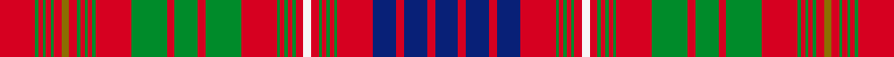

This is one **variant** — a specific cloth: this exact thread count and colourway, with its own
provenance below. It is one weaving of the [sett](/setts/r23g2r3g2r3g2r5y5r5g2r3g2r3g2r23g23r5g15r5g23r23g2r3g2r3g2r5w5r5g2r3g2r3g2r23db15r5db15r5db15/) (the scale-free proportion — the
same cloth at any scale or shade), whose colour order is pattern [BRBRBRGRGRGRWRGRGRGRGRGRGRGRGRGRGRGRGRGR](/stripes/brbrbrgrgrgrwrgrgrgrgrgrgrgrgrgrgrgrgrgr/).

Part of the [MacRae of Inverinate](/tartans/m/ma/macrae-of-inverinate-3/) tartan — the named design grouping this sett with its other cloths.

Sourced from house-of-tartan.  It is a [40 stripe tartan](/stripes/stripes40/).

Original link [http://www.house-of-tartan.scotland.net/house/TartanViewjs.asp?colr=Def&tnam=2000](http://www.house-of-tartan.scotland.net/house/TartanViewjs.asp?colr=Def&tnam=2000)

## Provenance

Earliest known date: pre 2003 Presented by Mrs Macrae of Inverinate 1977, and approved for the use of the MacRaes of the Inverinate branch of the Clan.

2 attestations — the source records this cloth was collapsed from (oldest owns this page)

<ul>
<li>pre 2003 — MacRae of Inverinate Clan Tartan (house-of-tartan, <a href="http://www.house-of-tartan.scotland.net/house/TartanViewjs.asp?colr=Def&tnam=2000">record</a>) </li>
<li>undated — MacRae of Inverinate (weddslist, <a href="http://www.weddslist.com/cgi-bin/tartans/pg.pl?source=sts">record</a>) </li>
</ul>

Dataset <small>— provenance for this record, inherited from the source manifest</small>

<dl class="dataset-prov">
<dt>source</dt><dd><a href="/sources/house-of-tartan/">House of Tartan</a></dd>
<dt>data captured from</dt><dd><a href="https://github.com/thetartan/tartan-database/blob/master/data/house-of-tartan/data.csv">https://github.com/thetartan/tartan-database/blob/master/data/house-of-tartan/data.csv</a></dd>
<dt>data date</dt><dd>pre 2003 <small>(this record)</small></dd>
<dt>licence</dt><dd><a href="https://creativecommons.org/licenses/by-nc-nd/4.0/">CC BY-NC-ND 4.0</a></dd>
</dl>

Capture chain <small>— the hands this data passed through, oldest first; each capture carries its own licence</small>

<ol class="capture-chain">
<li><a href="http://www.house-of-tartan.scotland.net/">House of Tartan</a> <small>the weaver/retailer's database — the site is now offline; the URL is kept as the ultimate source's identity</small></li>
<li><a href="https://github.com/thetartan/tartan-database">thetartan/tartan-database</a> <small>2016-2017</small> · <a href="https://creativecommons.org/licenses/by-nc-nd/4.0/">CC BY-NC-ND 4.0</a> <small>Levko Kravets's frozen compilation — the capture we vendored, and where its CC licence text came from</small></li>
<li>this dictionary <small>captured 2026-06-10 · commit 5bf86c7566</small> <small>each re-capture is a git commit to data/sources</small></li>
</ol>

## Thread count
R/46 G4 R6 G4 R6 G4 R10 Y10 R10 G4 R6 G4 R6 G4 R46 G46 R10 G30 R10 G46 R46 G4 R6 G4 R6 G4 R10 W10 R10 G4 R6 G4 R6 G4 R46 DB30 R10 DB30 R10 DB/30

One full sett is **1108 threads**.

## Palette
<table><thead><tr><th>Colour</th><th>Shade</th><th>OKLCh</th></tr></thead><tbody><tr><td>DB</td><td><code style="background-color:#082077;">#082077</code> <small style="color:#888">#082077</small></td><td><small style="color:#888">oklch(30.0% 0.149 265.1)</small></td></tr><tr><td>G</td><td><code style="background-color:#008B2A;">#008B2A</code> <small style="color:#888">#008B2A</small></td><td><small style="color:#888">oklch(55.4% 0.170 145.9)</small></td></tr><tr><td>W</td><td><code style="background-color:#F7F7F7;">#F7F7F7</code> <small style="color:#888">#F7F7F7</small></td><td><small style="color:#888">oklch(97.6% 0.000 89.9)</small></td></tr><tr><td>R</td><td><code style="background-color:#D60020;">#D60020</code> <small style="color:#888">#D60020</small></td><td><small style="color:#888">oklch(55.2% 0.224 25.5)</small></td></tr><tr><td>Y</td><td><code style="background-color:#8B6E00;">#8B6E00</code> <small style="color:#888">#8B6E00</small></td><td><small style="color:#888">oklch(55.1% 0.113 90.4)</small></td></tr></tbody></table>

# Sample pattern

## Nearest tartan variants

The nearest existing variants by ΔTartan distance, with this cloth at the top so the swatches line up against it.

ΔTartan

Threads

Variant

Sett

—

1108

<a href="/variants/s40/r23g2r3g2r3g2r5y5r5g2r3g2r3g2r23g23r5g15r5g23r23g2r3g2r3g2r5w5r5g2r3g2r3g2r23db15r5db15r5db15~x2/">MacRae of Inverinate Clan Tartan</a>

<a href="/ttd/edit/#slug=g8r2g8r12g2r3g2r12w1r3y1db12r3db12y1r3w1r12db1r1db2r1db1r12db1r1db2r1db1r12g8r2g8~x2&amp;base=r23g2r3g2r3g2r5y5r5g2r3g2r3g2r23g23r5g15r5g23r23g2r3g2r3g2r5w5r5g2r3g2r3g2r23db15r5db15r5db15~x2" title="compare in the TTD">1.19</a>

576

<a href="/variants/s33/g8r2g8r12g2r3g2r12w1r3y1db12r3db12y1r3w1r12db1r1db2r1db1r12db1r1db2r1db1r12g8r2g8~x2/">Huntly District Tartan</a>

<a href="/ttd/edit/#slug=g21w2g20r8g6y3g6r8g10r9g11r22g3r9g3r21w2r10db26r6db26r10w2r19g2r2g3r2g2r20g2r2g3r2g2r19g20r6g20&amp;base=r23g2r3g2r3g2r5y5r5g2r3g2r3g2r23g23r5g15r5g23r23g2r3g2r3g2r5w5r5g2r3g2r3g2r23db15r5db15r5db15~x2" title="compare in the TTD">1.78</a>

699

<a href="/variants/s39/g21w2g20r8g6y3g6r8g10r9g11r22g3r9g3r21w2r10db26r6db26r10w2r19g2r2g3r2g2r20g2r2g3r2g2r19g20r6g20/">Lumsden (Waistcoat)</a>

<a href="/ttd/edit/#slug=g21w2g20r8g6y3g6r8g10r9g11r22g3r9g3r21w2r10db26r6db26r10w2r19g2r2g3r2g2r20g2r2g3r2g2r19g20r6g20~x2&amp;base=r23g2r3g2r3g2r5y5r5g2r3g2r3g2r23g23r5g15r5g23r23g2r3g2r3g2r5w5r5g2r3g2r3g2r23db15r5db15r5db15~x2" title="compare in the TTD">1.78</a>

1398

<a href="/variants/s39/g21w2g20r8g6y3g6r8g10r9g11r22g3r9g3r21w2r10db26r6db26r10w2r19g2r2g3r2g2r20g2r2g3r2g2r19g20r6g20~x2/">Lumsden Waistcoat</a>

<a href="/ttd/edit/#slug=g32r7g32r33g4r12g4r33lb3r12ly3dp33r7dp33ly3r12lb3r33dp2r2dp5r2dp2r33dp2r2dp5r2dp2r33g32r7g32~x2&amp;base=r23g2r3g2r3g2r5y5r5g2r3g2r3g2r23g23r5g15r5g23r23g2r3g2r3g2r5w5r5g2r3g2r3g2r23db15r5db15r5db15~x2" title="compare in the TTD">1.81</a>

1720

<a href="/variants/s33/g32r7g32r33g4r12g4r33lb3r12ly3dp33r7dp33ly3r12lb3r33dp2r2dp5r2dp2r33dp2r2dp5r2dp2r33g32r7g32~x2/">Marchioness of Huntly's</a>

<a href="/ttd/edit/#slug=r9db1r1db2r1db1r9w1r4db11r2db11r4w1r9g2r4g2r9g5r3g4r3g3y1g3r3g6w1g6~x2&amp;base=r23g2r3g2r3g2r5y5r5g2r3g2r3g2r23g23r5g15r5g23r23g2r3g2r3g2r5w5r5g2r3g2r3g2r23db15r5db15r5db15~x2" title="compare in the TTD">2.30</a>

458

<a href="/variants/s30/r9db1r1db2r1db1r9w1r4db11r2db11r4w1r9g2r4g2r9g5r3g4r3g3y1g3r3g6w1g6~x2/">Lumsden (Short)</a>

<a href="/ttd/edit/#slug=r3g5r1db1r15dg2r1w1r1dg2r15db1r1g5r5g5dg2r1dg2db5r2g1r2g15r1db2w1~x2&amp;base=r23g2r3g2r3g2r5y5r5g2r3g2r3g2r23g23r5g15r5g23r23g2r3g2r3g2r5w5r5g2r3g2r3g2r23db15r5db15r5db15~x2" title="compare in the TTD">2.41</a>

384

<a href="/variants/s27/r3g5r1db1r15dg2r1w1r1dg2r15db1r1g5r5g5dg2r1dg2db5r2g1r2g15r1db2w1~x2/">MacDougall D</a>

<a href="/ttd/edit/#slug=r12g3y1r2y1g3r3db3r6lb1r1g8r1lb1r12lb1r1g8r1lb1r6g2r1lb1r2lb1r1g3y1r4~x4&amp;base=r23g2r3g2r3g2r5y5r5g2r3g2r3g2r23g23r5g15r5g23r23g2r3g2r3g2r5w5r5g2r3g2r3g2r23db15r5db15r5db15~x2" title="compare in the TTD">2.45</a>

672

<a href="/variants/s30/r12g3y1r2y1g3r3db3r6lb1r1g8r1lb1r12lb1r1g8r1lb1r6g2r1lb1r2lb1r1g3y1r4~x4/">MacAlister (Gourlay Steele Collection)</a>

<a href="/ttd/edit/#slug=r23dg2r3dg2r3dg2r5ly5r5dg2r3dg2r3dg2r23dg23r5dg15r5dg23r23dg2r3dg2r3dg2r5w5r5dg2r3dg2r3dg2r23dp15r5dp15r5dp15~x2&amp;base=r23g2r3g2r3g2r5y5r5g2r3g2r3g2r23g23r5g15r5g23r23g2r3g2r3g2r5w5r5g2r3g2r3g2r23db15r5db15r5db15~x2" title="compare in the TTD">2.53</a>

1108

<a href="/variants/s40/r23dg2r3dg2r3dg2r5ly5r5dg2r3dg2r3dg2r23dg23r5dg15r5dg23r23dg2r3dg2r3dg2r5w5r5dg2r3dg2r3dg2r23dp15r5dp15r5dp15~x2/">MacRae of Inverinate</a>

<a href="/ttd/edit/#slug=r8g1dg2r2lb1r1w1r1lb1r2dg3r1w1r6lb1r1dg12r1lb1r16lb1r1dg12r1lb1r6w1r1db4r1w1r2dg3g1r2g1dg3r3w1r1db2r1w1r8~x2~g2408144-dg1806142&amp;base=r23g2r3g2r3g2r5y5r5g2r3g2r3g2r23g23r5g15r5g23r23g2r3g2r3g2r5w5r5g2r3g2r3g2r23db15r5db15r5db15~x2" title="compare in the TTD">2.54</a>

456

<a href="/variants/s44/r8g1dg2r2lb1r1w1r1lb1r2dg3r1w1r6lb1r1dg12r1lb1r16lb1r1dg12r1lb1r6w1r1db4r1w1r2dg3g1r2g1dg3r3w1r1db2r1w1r8~x2~g2408144-dg1806142/">MacAlister (Clan)</a>

<a href="/ttd/edit/#slug=r8b1g2r2lb1r1w1r1lb1r2g3r1w1r6lb1r1g12r1lb1r16lb1r1g12r1lb1r6w1r1db4r1w1r2g3b1r2b1g3r3w1r1db2r1w1r8~x2&amp;base=r23g2r3g2r3g2r5y5r5g2r3g2r3g2r23g23r5g15r5g23r23g2r3g2r3g2r5w5r5g2r3g2r3g2r23db15r5db15r5db15~x2" title="compare in the TTD">2.60</a>

456

<a href="/variants/s44/r8b1g2r2lb1r1w1r1lb1r2g3r1w1r6lb1r1g12r1lb1r16lb1r1g12r1lb1r6w1r1db4r1w1r2g3b1r2b1g3r3w1r1db2r1w1r8~x2/">MacAlister</a>

## Neighbour map

Every grey dot is one of 13621 variants placed by the first two principal components of the ΔTartan feature space (42% of its variance). Red is this tartan; blue dots are its nearest — click one to open its page. The map is a flat projection of a many-dimensional space — [how to read it](/posts/neighbourhood-maps/).

<svg viewBox="0 0 640 380" role="img" style="max-width:100%;height:auto;border:1px solid #e0e0e0;border-radius:4px;display:block" xmlns="http://www.w3.org/2000/svg"><image href="/nn/cloud.v1.png" width="640" height="380"/><a href="/variants/s33/g8r2g8r12g2r3g2r12w1r3y1db12r3db12y1r3w1r12db1r1db2r1db1r12db1r1db2r1db1r12g8r2g8~x2/"><circle cx="245.9" cy="111.1" r="4" fill="#3465a4"><title>Huntly District Tartan</title></circle></a><a href="/variants/s39/g21w2g20r8g6y3g6r8g10r9g11r22g3r9g3r21w2r10db26r6db26r10w2r19g2r2g3r2g2r20g2r2g3r2g2r19g20r6g20/"><circle cx="220.9" cy="115.9" r="4" fill="#3465a4"><title>Lumsden (Waistcoat)</title></circle></a><a href="/variants/s39/g21w2g20r8g6y3g6r8g10r9g11r22g3r9g3r21w2r10db26r6db26r10w2r19g2r2g3r2g2r20g2r2g3r2g2r19g20r6g20~x2/"><circle cx="220.9" cy="115.9" r="4" fill="#3465a4"><title>Lumsden Waistcoat</title></circle></a><a href="/variants/s33/g32r7g32r33g4r12g4r33lb3r12ly3dp33r7dp33ly3r12lb3r33dp2r2dp5r2dp2r33dp2r2dp5r2dp2r33g32r7g32~x2/"><circle cx="257.9" cy="103.1" r="4" fill="#3465a4"><title>Marchioness of Huntly's</title></circle></a><a href="/variants/s30/r9db1r1db2r1db1r9w1r4db11r2db11r4w1r9g2r4g2r9g5r3g4r3g3y1g3r3g6w1g6~x2/"><circle cx="215.4" cy="132.8" r="4" fill="#3465a4"><title>Lumsden (Short)</title></circle></a><a href="/variants/s27/r3g5r1db1r15dg2r1w1r1dg2r15db1r1g5r5g5dg2r1dg2db5r2g1r2g15r1db2w1~x2/"><circle cx="252.8" cy="99.7" r="4" fill="#3465a4"><title>MacDougall D</title></circle></a><a href="/variants/s30/r12g3y1r2y1g3r3db3r6lb1r1g8r1lb1r12lb1r1g8r1lb1r6g2r1lb1r2lb1r1g3y1r4~x4/"><circle cx="304.4" cy="114.6" r="4" fill="#3465a4"><title>MacAlister (Gourlay Steele Collection)</title></circle></a><a href="/variants/s40/r23dg2r3dg2r3dg2r5ly5r5dg2r3dg2r3dg2r23dg23r5dg15r5dg23r23dg2r3dg2r3dg2r5w5r5dg2r3dg2r3dg2r23dp15r5dp15r5dp15~x2/"><circle cx="259.7" cy="100.8" r="4" fill="#3465a4"><title>MacRae of Inverinate</title></circle></a><a href="/variants/s44/r8g1dg2r2lb1r1w1r1lb1r2dg3r1w1r6lb1r1dg12r1lb1r16lb1r1dg12r1lb1r6w1r1db4r1w1r2dg3g1r2g1dg3r3w1r1db2r1w1r8~x2~g2408144-dg1806142/"><circle cx="252.1" cy="56.6" r="4" fill="#3465a4"><title>MacAlister (Clan)</title></circle></a><a href="/variants/s44/r8b1g2r2lb1r1w1r1lb1r2g3r1w1r6lb1r1g12r1lb1r16lb1r1g12r1lb1r6w1r1db4r1w1r2g3b1r2b1g3r3w1r1db2r1w1r8~x2/"><circle cx="252.6" cy="57.7" r="4" fill="#3465a4"><title>MacAlister</title></circle></a><circle cx="248.8" cy="102.5" r="5" fill="#c00000"/><text x="320" y="376" text-anchor="middle" font-size="11" fill="#999">ground</text><text x="11" y="190" text-anchor="middle" font-size="11" fill="#999" transform="rotate(-90 11 190)">complexity</text></svg>

ID: /variants/s40/r23g2r3g2r3g2r5y5r5g2r3g2r3g2r23g23r5g15r5g23r23g2r3g2r3g2r5w5r5g2r3g2r3g2r23db15r5db15r5db15~x2/
