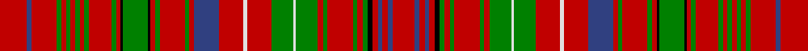

This page is one **sett** — a single exact thread-count. It belongs to the [tartan](/setts/r24db4r22g4r4g4r4g4r4g4r20g4r4k2g22k2r4g4r22g4r4db22r21w4r21g19w2g19r5g4r22g4r5g4k4r5db4r5db4r19/)
(the same proportion at any scale), whose colour order is pattern [RBRBRKGRGRGRGWGRWRBRGRGRKGKRGRGRGRGRGRBR](/stripes/rbrbrkgrgrgrgwgrwrbrgrgrkgkrgrgrgrgrgrbr/).

Sourced from register-of-tartans.  It is a [40 stripe tartan](/stripes/stripes40/).

Original link https://www.tartanregister.gov.uk/tartanDetails.aspx?ref=2368

## Provenance

Earliest known date: 1819 Reduced by 60% for display. Until recently the various branches of the Clan Donald were regarded as independant clans in their own right. In 1947 the Mac Dhomnuill was re-instated by Lord Lyon.

3 attestations — the source records this cloth was collapsed from (oldest owns this page)

<ul>
<li>undated — MacDonald of Staffa (register-of-tartans, <a href="https://www.tartanregister.gov.uk/tartanDetails.aspx?ref=2368">record</a>)  <em>Reduced by 60% for display. Until recently the various branches of the Clan Donald were regarded as independent clans in their own right. In 1947 the Mac Dhomnuill was re-instated by Lord Lyon. Wilsons of Bannockburn a weaving firm founded c1770 near Stirling. The Pattern books are in the National Museum of Antiquities, Edinburgh. Copys of the Pattern books and letters in the Scottish Tartans Society archive.</em></li>
<li>undated — MacDonald of Staffa 6 (weddslist, <a href="http://www.weddslist.com/cgi-bin/tartans/pg.pl?source=sts">record</a>) </li>
<li>undated — MacDonald of Staffa Clan Tartan (house-of-tartan, <a href="http://www.house-of-tartan.scotland.net/house/TartanViewjs.asp?colr=Def&tnam=1387">record</a>) </li>
</ul>

Dataset <small>— provenance for this record, inherited from the source manifest</small>

<dl class="dataset-prov">
<dt>source</dt><dd><a href="/sources/register-of-tartans/">Scottish Register of Tartans</a></dd>
<dt>data captured from</dt><dd><a href="https://github.com/thetartan/tartan-database/blob/master/data/register-of-tartans/data.csv">https://github.com/thetartan/tartan-database/blob/master/data/register-of-tartans/data.csv</a></dd>
<dt>data date</dt><dd>2017-01-06 <small>(dataset default)</small></dd>
<dt>licence</dt><dd><a href="https://www.tartanregister.gov.uk/copyright">Crown copyright</a></dd>
</dl>

Capture chain <small>— the hands this data passed through, oldest first; each capture carries its own licence</small>

<ol class="capture-chain">
<li><a href="https://www.tartanregister.gov.uk/">Scottish Register of Tartans</a> · <a href="https://www.tartanregister.gov.uk/copyright">Crown copyright</a> <small>the living register — still published by National Records of Scotland</small></li>
<li><a href="https://github.com/thetartan/tartan-database">thetartan/tartan-database</a> <small>2016-2017</small> · <a href="https://creativecommons.org/licenses/by-nc-nd/4.0/">CC BY-NC-ND 4.0</a> <small>Levko Kravets's frozen compilation — the capture we vendored, and where its CC licence text came from</small></li>
<li>this dictionary <small>captured 2026-06-10 · commit 5bf86c7566</small> <small>each re-capture is a git commit to data/sources</small></li>
</ol>

## Register references

External register numbers recorded for this tartan.

- Scottish Register of Tartans: [2368](https://www.tartanregister.gov.uk/tartanDetails.aspx?ref=2368)
- Scottish Tartans World Register: 1387

## Thread count
R/24 DB4 R22 G4 R4 G4 R4 G4 R4 G4 R20 G4 R4 K2 G22 K2 R4 G4 R22 G4 R4 DB22 R21 W4 R21 G19 W2 G19 R5 G4 R22 G4 R5 G4 K4 R5 DB4 R5 DB4 R/19

One full sett is **683 threads**.

## Palette
<table><thead><tr><th>Colour</th><th>Shade</th><th>OKLCh</th></tr></thead><tbody><tr><td>DB</td><td><code style="background-color:#082077;">#082077</code> <small style="color:#888">#082077</small></td><td><small style="color:#888">oklch(30.0% 0.149 265.1)</small></td></tr><tr><td>G</td><td><code style="background-color:#008B2A;">#008B2A</code> <small style="color:#888">#008B2A</small></td><td><small style="color:#888">oklch(55.4% 0.170 145.9)</small></td></tr><tr><td>K</td><td><code style="background-color:#000000;">#000000</code> <small style="color:#888">#000000</small></td><td><small style="color:#888">oklch(0.0% 0.000 0.0)</small></td></tr><tr><td>W</td><td><code style="background-color:#F7F7F7;">#F7F7F7</code> <small style="color:#888">#F7F7F7</small></td><td><small style="color:#888">oklch(97.6% 0.000 89.9)</small></td></tr><tr><td>R</td><td><code style="background-color:#D60020;">#D60020</code> <small style="color:#888">#D60020</small></td><td><small style="color:#888">oklch(55.2% 0.224 25.5)</small></td></tr></tbody></table>

# Sample pattern

## Nearest tartan variants

The nearest existing variants by ΔTartan distance, with this cloth at the top so the swatches line up against it.

ΔTartan

Threads

Variant

Sett

—

683

<a href="/variants/s40/r24db4r22g4r4g4r4g4r4g4r20g4r4k2g22k2r4g4r22g4r4db22r21w4r21g19w2g19r5g4r22g4r5g4k4r5db4r5db4r19/">MacDonald of Staffa</a>

<a href="/ttd/edit/#slug=r30y5r27dg5r5dg5r5dg5r5dg5r25dg5r5k2dg28k2r5dg5r28dg5r5y28r26w5r26dg24w2dg24r7dg5r28dg5r7dg5k5r7y5r7y5r24~x2&amp;base=r24db4r22g4r4g4r4g4r4g4r20g4r4k2g22k2r4g4r22g4r4db22r21w4r21g19w2g19r5g4r22g4r5g4k4r5db4r5db4r19" title="compare in the TTD">1.46</a>

1720

<a href="/variants/s40/r30y5r27dg5r5dg5r5dg5r5dg5r25dg5r5k2dg28k2r5dg5r28dg5r5y28r26w5r26dg24w2dg24r7dg5r28dg5r7dg5k5r7y5r7y5r24~x2/">Donald of Staffa's Sett</a>

<a href="/ttd/edit/#slug=r16g1r1g1r1g1r1g1r6g1db1g6k1r1g1r4g1r1db4r4w1r4g4w1g4r1g1r6g1r8w1~x2&amp;base=r24db4r22g4r4g4r4g4r4g4r20g4r4k2g22k2r4g4r22g4r4db22r21w4r21g19w2g19r5g4r22g4r5g4k4r5db4r5db4r19" title="compare in the TTD">2.41</a>

310

<a href="/variants/s31/r16g1r1g1r1g1r1g1r6g1db1g6k1r1g1r4g1r1db4r4w1r4g4w1g4r1g1r6g1r8w1~x2/">MacDonald of Staffa (Smith's)</a>

<a href="/ttd/edit/#slug=db48r40k4r4g48r54db46r54dg14r4k4r4k4r48k4r4k4r4dg14r52db46r54dg60r4dg4r48db4r12db4r4db4r48k4r4dg60r48db4r4db4r4k7&amp;base=r24db4r22g4r4g4r4g4r4g4r20g4r4k2g22k2r4g4r22g4r4db22r21w4r21g19w2g19r5g4r22g4r5g4k4r5db4r5db4r19" title="compare in the TTD">2.57</a>

1723

<a href="/variants/s41/db48r40k4r4g48r54db46r54dg14r4k4r4k4r48k4r4k4r4dg14r52db46r54dg60r4dg4r48db4r12db4r4db4r48k4r4dg60r48db4r4db4r4k7/">MacKintosh #6</a>

<a href="/ttd/edit/#slug=dg24r7dg24r26k2r2k5r2k2r24k2r2k5r2k2r26w3r12db33r12w3r26dg4r12dg4r26dg12r8dg12r12dg8g7dg8r12dg9w3dg16w2~dg1806142-g1904115&amp;base=r24db4r22g4r4g4r4g4r4g4r20g4r4k2g22k2r4g4r22g4r4db22r21w4r21g19w2g19r5g4r22g4r5g4k4r5db4r5db4r19" title="compare in the TTD">2.76</a>

776

<a href="/variants/s38/dg24r7dg24r26k2r2k5r2k2r24k2r2k5r2k2r26w3r12db33r12w3r26dg4r12dg4r26dg12r8dg12r12dg8g7dg8r12dg9w3dg16w2~dg1806142-g1904115/">Kinnoull (MacRae) - Error?</a>

<a href="/ttd/edit/#slug=r37g6r11g32w4g18r27w3r27k16g21r5g5r27g5r5k3g25k3g4r27g5r5g5r5g5r5g5r8&amp;base=r24db4r22g4r4g4r4g4r4g4r20g4r4k2g22k2r4g4r22g4r4db22r21w4r21g19w2g19r5g4r22g4r5g4k4r5db4r5db4r19" title="compare in the TTD">2.88</a>

663

<a href="/variants/s29/r37g6r11g32w4g18r27w3r27k16g21r5g5r27g5r5k3g25k3g4r27g5r5g5r5g5r5g5r8/">MacDonald of Staffa #2</a>

<a href="/ttd/edit/#slug=g23r6g23r25g4r10g4r25w3r10b31r6b31r10w3r25k2r2k4r2k2r25k2r2k4r2k2r25g23r6g23~x2&amp;base=r24db4r22g4r4g4r4g4r4g4r20g4r4k2g22k2r4g4r22g4r4db22r21w4r21g19w2g19r5g4r22g4r5g4k4r5db4r5db4r19" title="compare in the TTD">3.00</a>

1368

<a href="/variants/s31/g23r6g23r25g4r10g4r25w3r10b31r6b31r10w3r25k2r2k4r2k2r25k2r2k4r2k2r25g23r6g23~x2/">Kinnoull</a>

<a href="/ttd/edit/#slug=r29g5r9g24w3g24r27w3r27k16g21r5g5r27g5r5k3g25k3g4r27g5r5g5r5g5r5g5r8~x2&amp;base=r24db4r22g4r4g4r4g4r4g4r20g4r4k2g22k2r4g4r22g4r4db22r21w4r21g19w2g19r5g4r22g4r5g4k4r5db4r5db4r19" title="compare in the TTD">3.06</a>

1286

<a href="/variants/s29/r29g5r9g24w3g24r27w3r27k16g21r5g5r27g5r5k3g25k3g4r27g5r5g5r5g5r5g5r8~x2/">MacDonald of Staffa 5</a>

<a href="/ttd/edit/#slug=r37g2r2g2r2g2r2g2r11k2g11r3g2r11g2r3db9r11w2r9g11w2g11r3g2r9g2r19w2&amp;base=r24db4r22g4r4g4r4g4r4g4r20g4r4k2g22k2r4g4r22g4r4db22r21w4r21g19w2g19r5g4r22g4r5g4k4r5db4r5db4r19" title="compare in the TTD">3.08</a>

337

<a href="/variants/s29/r37g2r2g2r2g2r2g2r11k2g11r3g2r11g2r3db9r11w2r9g11w2g11r3g2r9g2r19w2/">MacDonald of Staffa #4</a>

<a href="/ttd/edit/#slug=dg24r33k2r2k5r2k2r26k2r2k5r2k2r26w3r12db33r7db33r12w3r26dg4r12dg4r26dg12r8dg12r12dg8g7dg8r12dg9w3dg16w2~x2~dg1806142-g2408144&amp;base=r24db4r22g4r4g4r4g4r4g4r20g4r4k2g22k2r4g4r22g4r4db22r21w4r21g19w2g19r5g4r22g4r5g4k4r5db4r5db4r19" title="compare in the TTD">3.15</a>

1624

<a href="/variants/s38/dg24r33k2r2k5r2k2r26k2r2k5r2k2r26w3r12db33r7db33r12w3r26dg4r12dg4r26dg12r8dg12r12dg8g7dg8r12dg9w3dg16w2~x2~dg1806142-g2408144/">Kinnoull (MacRae) Family Tartan</a>

<a href="/ttd/edit/#slug=r12g3y1r2y1g3r3db3r6lb1r1g8r1lb1r12lb1r1g8r1lb1r6g2r1lb1r2lb1r1g3y1r4~x4&amp;base=r24db4r22g4r4g4r4g4r4g4r20g4r4k2g22k2r4g4r22g4r4db22r21w4r21g19w2g19r5g4r22g4r5g4k4r5db4r5db4r19" title="compare in the TTD">3.38</a>

672

<a href="/variants/s30/r12g3y1r2y1g3r3db3r6lb1r1g8r1lb1r12lb1r1g8r1lb1r6g2r1lb1r2lb1r1g3y1r4~x4/">MacAlister (Gourlay Steele Collection)</a>

## Neighbour map

Every grey dot is one of 13620 variants placed by the first two principal components of the ΔTartan feature space (42% of its variance). Red is this tartan; blue dots are its nearest — click one to open its page.

<svg viewBox="0 0 640 380" role="img" style="max-width:100%;height:auto;border:1px solid #e0e0e0;border-radius:4px;display:block" xmlns="http://www.w3.org/2000/svg"><image href="/nn/cloud.v1.png" width="640" height="380"/><a href="/variants/s40/r30y5r27dg5r5dg5r5dg5r5dg5r25dg5r5k2dg28k2r5dg5r28dg5r5y28r26w5r26dg24w2dg24r7dg5r28dg5r7dg5k5r7y5r7y5r24~x2/"><circle cx="279.2" cy="86.3" r="4" fill="#3465a4"><title>Donald of Staffa's Sett</title></circle></a><a href="/variants/s31/r16g1r1g1r1g1r1g1r6g1db1g6k1r1g1r4g1r1db4r4w1r4g4w1g4r1g1r6g1r8w1~x2/"><circle cx="311.9" cy="72.8" r="4" fill="#3465a4"><title>MacDonald of Staffa (Smith's)</title></circle></a><a href="/variants/s41/db48r40k4r4g48r54db46r54dg14r4k4r4k4r48k4r4k4r4dg14r52db46r54dg60r4dg4r48db4r12db4r4db4r48k4r4dg60r48db4r4db4r4k7/"><circle cx="238.4" cy="69.8" r="4" fill="#3465a4"><title>MacKintosh #6</title></circle></a><a href="/variants/s38/dg24r7dg24r26k2r2k5r2k2r24k2r2k5r2k2r26w3r12db33r12w3r26dg4r12dg4r26dg12r8dg12r12dg8g7dg8r12dg9w3dg16w2~dg1806142-g1904115/"><circle cx="200.8" cy="71.1" r="4" fill="#3465a4"><title>Kinnoull (MacRae) - Error?</title></circle></a><a href="/variants/s29/r37g6r11g32w4g18r27w3r27k16g21r5g5r27g5r5k3g25k3g4r27g5r5g5r5g5r5g5r8/"><circle cx="250.9" cy="119.6" r="4" fill="#3465a4"><title>MacDonald of Staffa #2</title></circle></a><a href="/variants/s31/g23r6g23r25g4r10g4r25w3r10b31r6b31r10w3r25k2r2k4r2k2r25k2r2k4r2k2r25g23r6g23~x2/"><circle cx="206.5" cy="94.9" r="4" fill="#3465a4"><title>Kinnoull</title></circle></a><a href="/variants/s29/r29g5r9g24w3g24r27w3r27k16g21r5g5r27g5r5k3g25k3g4r27g5r5g5r5g5r5g5r8~x2/"><circle cx="237.8" cy="131.3" r="4" fill="#3465a4"><title>MacDonald of Staffa 5</title></circle></a><a href="/variants/s29/r37g2r2g2r2g2r2g2r11k2g11r3g2r11g2r3db9r11w2r9g11w2g11r3g2r9g2r19w2/"><circle cx="336.0" cy="70.1" r="4" fill="#3465a4"><title>MacDonald of Staffa #4</title></circle></a><a href="/variants/s38/dg24r33k2r2k5r2k2r26k2r2k5r2k2r26w3r12db33r7db33r12w3r26dg4r12dg4r26dg12r8dg12r12dg8g7dg8r12dg9w3dg16w2~x2~dg1806142-g2408144/"><circle cx="191.8" cy="65.3" r="4" fill="#3465a4"><title>Kinnoull (MacRae) Family Tartan</title></circle></a><a href="/variants/s30/r12g3y1r2y1g3r3db3r6lb1r1g8r1lb1r12lb1r1g8r1lb1r6g2r1lb1r2lb1r1g3y1r4~x4/"><circle cx="304.4" cy="114.6" r="4" fill="#3465a4"><title>MacAlister (Gourlay Steele Collection)</title></circle></a><circle cx="254.4" cy="92.3" r="5" fill="#c00000"/><text x="320" y="376" text-anchor="middle" font-size="11" fill="#999">ground</text><text x="11" y="190" text-anchor="middle" font-size="11" fill="#999" transform="rotate(-90 11 190)">complexity</text></svg>

ID: /variants/s40/r24db4r22g4r4g4r4g4r4g4r20g4r4k2g22k2r4g4r22g4r4db22r21w4r21g19w2g19r5g4r22g4r5g4k4r5db4r5db4r19/
