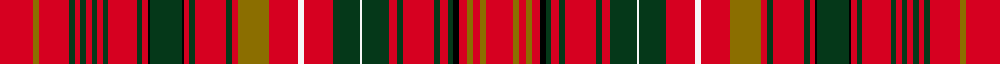

This is one **variant** — a specific cloth: this exact thread count and colourway, with its own
provenance below. It is one weaving of the [sett](/tartans/d/do/donald-of-staffa-s-sett/) (the scale-free proportion — the
same cloth at any scale or shade), whose colour order is pattern [RGRGRGRGRGRGRKGKRGRGRGRWRGWGRGRGRGKRGRGR](/stripes/rgrgrgrgrgrgrkgkrgrgrgrwrgwgrgrgrgkrgrgr/).

Part of the [Donald of Staffa's Sett](/tartans/d/do/donald-of-staffa-s-sett/) tartan — the named design grouping this sett with its other cloths.

Sourced from register-of-tartans.  It is a [40 stripe tartan](/stripes/stripes40/).

Original link [https://www.tartanregister.gov.uk/tartanDetails.aspx?ref=949](https://www.tartanregister.gov.uk/tartanDetails.aspx?ref=949)

Dataset <small>— provenance for this record, inherited from the source manifest</small>

<dl class="dataset-prov">
<dt>source</dt><dd><a href="/sources/register-of-tartans/">Scottish Register of Tartans</a></dd>
<dt>data captured from</dt><dd><a href="https://github.com/thetartan/tartan-database/blob/master/data/register-of-tartans/data.csv">https://github.com/thetartan/tartan-database/blob/master/data/register-of-tartans/data.csv</a></dd>
<dt>data date</dt><dd>1819 <small>(this record)</small></dd>
<dt>licence</dt><dd><a href="https://www.tartanregister.gov.uk/copyright">Crown copyright</a></dd>
</dl>

Capture chain <small>— the hands this data passed through, oldest first; each capture carries its own licence</small>

<ol class="capture-chain">
<li><a href="https://www.tartanregister.gov.uk/">Scottish Register of Tartans</a> · <a href="https://www.tartanregister.gov.uk/copyright">Crown copyright</a> <small>the living register — still published by National Records of Scotland</small></li>
<li><a href="https://github.com/thetartan/tartan-database">thetartan/tartan-database</a> <small>2016-2017</small> · <a href="https://creativecommons.org/licenses/by-nc-nd/4.0/">CC BY-NC-ND 4.0</a> <small>Levko Kravets's frozen compilation — the capture we vendored, and where its CC licence text came from</small></li>
<li>this dictionary <small>captured 2026-06-10 · commit 5bf86c7566</small> <small>each re-capture is a git commit to data/sources</small></li>
</ol>

## Register references

External register numbers recorded for this tartan.

- Scottish Register of Tartans: [949](https://www.tartanregister.gov.uk/tartanDetails.aspx?ref=949)
- Scottish Tartans Authority (ITI): 4689

## Thread count
R/60 Y10 R54 DG10 R10 DG10 R10 DG10 R10 DG10 R50 DG10 R10 K4 DG56 K4 R10 DG10 R56 DG10 R10 Y56 R52 W10 R52 DG48 W4 DG48 R14 DG10 R56 DG10 R14 DG10 K10 R14 Y10 R14 Y10 R/48

One full sett is **1720 threads**.

## Palette
<table><thead><tr><th>Colour</th><th>Shade</th><th>OKLCh</th></tr></thead><tbody><tr><td>DG</td><td><code style="background-color:#053819;">#053819</code> <small style="color:#888">#053819</small></td><td><small style="color:#888">oklch(30.0% 0.075 151.3)</small></td></tr><tr><td>K</td><td><code style="background-color:#000000;">#000000</code> <small style="color:#888">#000000</small></td><td><small style="color:#888">oklch(0.0% 0.000 0.0)</small></td></tr><tr><td>Y</td><td><code style="background-color:#8B6E00;">#8B6E00</code> <small style="color:#888">#8B6E00</small></td><td><small style="color:#888">oklch(55.1% 0.113 90.4)</small></td></tr><tr><td>W</td><td><code style="background-color:#F7F7F7;">#F7F7F7</code> <small style="color:#888">#F7F7F7</small></td><td><small style="color:#888">oklch(97.6% 0.000 89.9)</small></td></tr><tr><td>R</td><td><code style="background-color:#D60020;">#D60020</code> <small style="color:#888">#D60020</small></td><td><small style="color:#888">oklch(55.2% 0.224 25.5)</small></td></tr></tbody></table>

# Sample pattern

## Nearest tartan variants

The nearest existing variants by ΔTartan distance, with this cloth at the top so the swatches line up against it.

ΔTartan

Threads

Variant

Sett

—

1720

<a href="/variants/s40/r30y5r27dg5r5dg5r5dg5r5dg5r25dg5r5k2dg28k2r5dg5r28dg5r5y28r26w5r26dg24w2dg24r7dg5r28dg5r7dg5k5r7y5r7y5r24~x2/">Donald of Staffa's Sett</a>

<a href="/ttd/edit/#slug=r24db4r22g4r4g4r4g4r4g4r20g4r4k2g22k2r4g4r22g4r4db22r21w4r21g19w2g19r5g4r22g4r5g4k4r5db4r5db4r19&amp;base=r30y5r27dg5r5dg5r5dg5r5dg5r25dg5r5k2dg28k2r5dg5r28dg5r5y28r26w5r26dg24w2dg24r7dg5r28dg5r7dg5k5r7y5r7y5r24~x2" title="compare in the TTD">1.46</a>

683

<a href="/variants/s40/r24db4r22g4r4g4r4g4r4g4r20g4r4k2g22k2r4g4r22g4r4db22r21w4r21g19w2g19r5g4r22g4r5g4k4r5db4r5db4r19/">MacDonald of Staffa Clan Tartan</a>

<a href="/ttd/edit/#slug=r16g1r1g1r1g1r1g1r6g1db1g6k1r1g1r4g1r1db4r4w1r4g4w1g4r1g1r6g1r8w1~x2&amp;base=r30y5r27dg5r5dg5r5dg5r5dg5r25dg5r5k2dg28k2r5dg5r28dg5r5y28r26w5r26dg24w2dg24r7dg5r28dg5r7dg5k5r7y5r7y5r24~x2" title="compare in the TTD">2.50</a>

310

<a href="/variants/s31/r16g1r1g1r1g1r1g1r6g1db1g6k1r1g1r4g1r1db4r4w1r4g4w1g4r1g1r6g1r8w1~x2/">MacDonald of Staffa (Smith's)</a>

<a href="/ttd/edit/#slug=db48r40k4r4g48r54db46r54dg14r4k4r4k4r48k4r4k4r4dg14r52db46r54dg60r4dg4r48db4r12db4r4db4r48k4r4dg60r48db4r4db4r4k7&amp;base=r30y5r27dg5r5dg5r5dg5r5dg5r25dg5r5k2dg28k2r5dg5r28dg5r5y28r26w5r26dg24w2dg24r7dg5r28dg5r7dg5k5r7y5r7y5r24~x2" title="compare in the TTD">2.64</a>

1723

<a href="/variants/s41/db48r40k4r4g48r54db46r54dg14r4k4r4k4r48k4r4k4r4dg14r52db46r54dg60r4dg4r48db4r12db4r4db4r48k4r4dg60r48db4r4db4r4k7/">MacKintosh #6</a>

<a href="/ttd/edit/#slug=r37g2r2g2r2g2r2g2r11k2g11r3g2r11g2r3db9r11w2r9g11w2g11r3g2r9g2r19w2&amp;base=r30y5r27dg5r5dg5r5dg5r5dg5r25dg5r5k2dg28k2r5dg5r28dg5r5y28r26w5r26dg24w2dg24r7dg5r28dg5r7dg5k5r7y5r7y5r24~x2" title="compare in the TTD">2.89</a>

337

<a href="/variants/s29/r37g2r2g2r2g2r2g2r11k2g11r3g2r11g2r3db9r11w2r9g11w2g11r3g2r9g2r19w2/">MacDonald of Staffa #4</a>

<a href="/ttd/edit/#slug=dg24r7dg24r26k2r2k5r2k2r24k2r2k5r2k2r26w3r12db33r12w3r26dg4r12dg4r26dg12r8dg12r12dg8g7dg8r12dg9w3dg16w2~dg1806142-g1904115&amp;base=r30y5r27dg5r5dg5r5dg5r5dg5r25dg5r5k2dg28k2r5dg5r28dg5r5y28r26w5r26dg24w2dg24r7dg5r28dg5r7dg5k5r7y5r7y5r24~x2" title="compare in the TTD">3.13</a>

776

<a href="/variants/s38/dg24r7dg24r26k2r2k5r2k2r24k2r2k5r2k2r26w3r12db33r12w3r26dg4r12dg4r26dg12r8dg12r12dg8g7dg8r12dg9w3dg16w2~dg1806142-g1904115/">Kinnoull (MacRae) - Error?</a>

<a href="/ttd/edit/#slug=r34y3r6y4r4y6r4y8r26y8r4y6r4y4r6y3r34k8n3k6n4k10n10&amp;base=r30y5r27dg5r5dg5r5dg5r5dg5r25dg5r5k2dg28k2r5dg5r28dg5r5y28r26w5r26dg24w2dg24r7dg5r28dg5r7dg5k5r7y5r7y5r24~x2" title="compare in the TTD">3.43</a>

366

<a href="/variants/s23/r34y3r6y4r4y6r4y8r26y8r4y6r4y4r6y3r34k8n3k6n4k10n10/">Starrett Company, L.S. (Corporate)</a>

<a href="/ttd/edit/#slug=dg24r33k2r2k5r2k2r26k2r2k5r2k2r26w3r12db33r7db33r12w3r26dg4r12dg4r26dg12r8dg12r12dg8g7dg8r12dg9w3dg16w2~x2~dg1806142-g2408144&amp;base=r30y5r27dg5r5dg5r5dg5r5dg5r25dg5r5k2dg28k2r5dg5r28dg5r5y28r26w5r26dg24w2dg24r7dg5r28dg5r7dg5k5r7y5r7y5r24~x2" title="compare in the TTD">3.54</a>

1624

<a href="/variants/s38/dg24r33k2r2k5r2k2r26k2r2k5r2k2r26w3r12db33r7db33r12w3r26dg4r12dg4r26dg12r8dg12r12dg8g7dg8r12dg9w3dg16w2~x2~dg1806142-g2408144/">Kinnoull (MacRae) Family Tartan</a>

<a href="/ttd/edit/#slug=r12g3y1r2y1g3r3db3r6lb1r1g8r1lb1r12lb1r1g8r1lb1r6g2r1lb1r2lb1r1g3y1r4~x4&amp;base=r30y5r27dg5r5dg5r5dg5r5dg5r25dg5r5k2dg28k2r5dg5r28dg5r5y28r26w5r26dg24w2dg24r7dg5r28dg5r7dg5k5r7y5r7y5r24~x2" title="compare in the TTD">3.57</a>

672

<a href="/variants/s30/r12g3y1r2y1g3r3db3r6lb1r1g8r1lb1r12lb1r1g8r1lb1r6g2r1lb1r2lb1r1g3y1r4~x4/">MacAlister (Gourlay Steele Collection)</a>

<a href="/ttd/edit/#slug=r15db1r1db1r1db1r1db1r3g4r1db1r3db1r1k2r3y1r3g2w1g2r1db1r3db1r6y1~x2&amp;base=r30y5r27dg5r5dg5r5dg5r5dg5r25dg5r5k2dg28k2r5dg5r28dg5r5y28r26w5r26dg24w2dg24r7dg5r28dg5r7dg5k5r7y5r7y5r24~x2" title="compare in the TTD">3.66</a>

220

<a href="/variants/s28/r15db1r1db1r1db1r1db1r3g4r1db1r3db1r1k2r3y1r3g2w1g2r1db1r3db1r6y1~x2/">MacDonald of Staffa</a>

<a href="/ttd/edit/#slug=r37g6r11g32w4g18r27w3r27k16g21r5g5r27g5r5k3g25k3g4r27g5r5g5r5g5r5g5r8&amp;base=r30y5r27dg5r5dg5r5dg5r5dg5r25dg5r5k2dg28k2r5dg5r28dg5r5y28r26w5r26dg24w2dg24r7dg5r28dg5r7dg5k5r7y5r7y5r24~x2" title="compare in the TTD">3.68</a>

663

<a href="/variants/s29/r37g6r11g32w4g18r27w3r27k16g21r5g5r27g5r5k3g25k3g4r27g5r5g5r5g5r5g5r8/">MacDonald of Staffa #2</a>

## Neighbour map

Every grey dot is one of 13657 variants placed by the first two principal components of the ΔTartan feature space (42% of its variance). Red is this tartan; blue dots are its nearest — click one to open its page. The map is a flat projection of a many-dimensional space — [how to read it](/posts/neighbourhood-maps/).

<svg viewBox="0 0 640 380" role="img" style="max-width:100%;height:auto;border:1px solid #e0e0e0;border-radius:4px;display:block" xmlns="http://www.w3.org/2000/svg"><image href="/nn/cloud.v1.png" width="640" height="380"/><a href="/variants/s40/r24db4r22g4r4g4r4g4r4g4r20g4r4k2g22k2r4g4r22g4r4db22r21w4r21g19w2g19r5g4r22g4r5g4k4r5db4r5db4r19/"><circle cx="254.7" cy="91.9" r="4" fill="#3465a4"><title>MacDonald of Staffa Clan Tartan</title></circle></a><a href="/variants/s31/r16g1r1g1r1g1r1g1r6g1db1g6k1r1g1r4g1r1db4r4w1r4g4w1g4r1g1r6g1r8w1~x2/"><circle cx="312.3" cy="72.4" r="4" fill="#3465a4"><title>MacDonald of Staffa (Smith's)</title></circle></a><a href="/variants/s41/db48r40k4r4g48r54db46r54dg14r4k4r4k4r48k4r4k4r4dg14r52db46r54dg60r4dg4r48db4r12db4r4db4r48k4r4dg60r48db4r4db4r4k7/"><circle cx="238.6" cy="69.5" r="4" fill="#3465a4"><title>MacKintosh #6</title></circle></a><a href="/variants/s29/r37g2r2g2r2g2r2g2r11k2g11r3g2r11g2r3db9r11w2r9g11w2g11r3g2r9g2r19w2/"><circle cx="336.5" cy="69.7" r="4" fill="#3465a4"><title>MacDonald of Staffa #4</title></circle></a><a href="/variants/s38/dg24r7dg24r26k2r2k5r2k2r24k2r2k5r2k2r26w3r12db33r12w3r26dg4r12dg4r26dg12r8dg12r12dg8g7dg8r12dg9w3dg16w2~dg1806142-g1904115/"><circle cx="201.1" cy="70.8" r="4" fill="#3465a4"><title>Kinnoull (MacRae) - Error?</title></circle></a><a href="/variants/s23/r34y3r6y4r4y6r4y8r26y8r4y6r4y4r6y3r34k8n3k6n4k10n10/"><circle cx="296.3" cy="117.0" r="4" fill="#3465a4"><title>Starrett Company, L.S. (Corporate)</title></circle></a><a href="/variants/s38/dg24r33k2r2k5r2k2r26k2r2k5r2k2r26w3r12db33r7db33r12w3r26dg4r12dg4r26dg12r8dg12r12dg8g7dg8r12dg9w3dg16w2~x2~dg1806142-g2408144/"><circle cx="192.0" cy="65.1" r="4" fill="#3465a4"><title>Kinnoull (MacRae) Family Tartan</title></circle></a><a href="/variants/s30/r12g3y1r2y1g3r3db3r6lb1r1g8r1lb1r12lb1r1g8r1lb1r6g2r1lb1r2lb1r1g3y1r4~x4/"><circle cx="304.8" cy="114.3" r="4" fill="#3465a4"><title>MacAlister (Gourlay Steele Collection)</title></circle></a><a href="/variants/s28/r15db1r1db1r1db1r1db1r3g4r1db1r3db1r1k2r3y1r3g2w1g2r1db1r3db1r6y1~x2/"><circle cx="314.2" cy="55.6" r="4" fill="#3465a4"><title>MacDonald of Staffa</title></circle></a><a href="/variants/s29/r37g6r11g32w4g18r27w3r27k16g21r5g5r27g5r5k3g25k3g4r27g5r5g5r5g5r5g5r8/"><circle cx="251.2" cy="119.1" r="4" fill="#3465a4"><title>MacDonald of Staffa #2</title></circle></a><circle cx="279.6" cy="86.0" r="5" fill="#c00000"/><text x="320" y="376" text-anchor="middle" font-size="11" fill="#999">ground</text><text x="11" y="190" text-anchor="middle" font-size="11" fill="#999" transform="rotate(-90 11 190)">complexity</text></svg>

ID: /variants/s40/r30y5r27dg5r5dg5r5dg5r5dg5r25dg5r5k2dg28k2r5dg5r28dg5r5y28r26w5r26dg24w2dg24r7dg5r28dg5r7dg5k5r7y5r7y5r24~x2/
