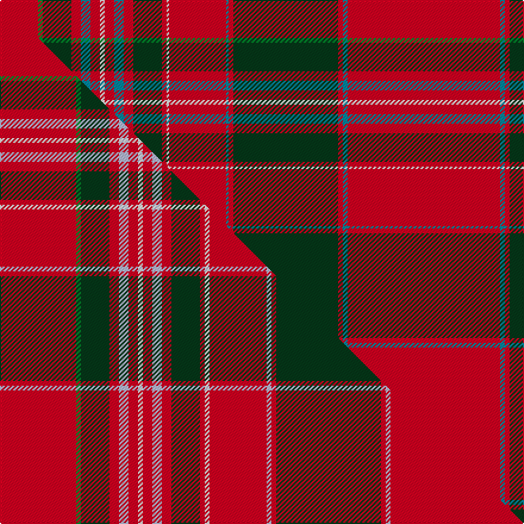

This page is one **sett** — a single exact thread-count. It belongs to the [tartan](/setts/r16g2dg12r4t4r4w2r4t4r4dg12r2w1r24t1r2dg44r2t2r64t2r2dg44r2t2r22w2r2db16r2w2r10dg12g2r8g2dg12r3w2r2db10/)
(the same proportion at any scale), whose colour order is pattern [BRWRGGRGGRWRBRWRBRGRBRBRGRBRWRGRBRWRBRGGR](/stripes/brwrggrggrwrbrwrbrgrbrbrgrbrwrgrbrwrbrggr/).

Part of the [MacAlister](/tartans/macalister/) tartan — the named design grouping this sett with its other cloths.

Sourced from logan-1831.  It is a [41 stripe tartan](/stripes/stripes41/).

Original link [/posts/logans-scottish-gael/](/posts/logans-scottish-gael/)

## Provenance

<figure class="logan-scan">

<figcaption>Logan, The Scottish Gaël (1831), vol. II p. 404 — page-scan crop (899,1404)–(1154,2055), (1166,481)–(1422,1127)</figcaption>
</figure>

James Logan recorded the **MacAlister** sett in 1831, on page 404 of the *Table of Clan Tartans* in *The Scottish Gaël* — the earliest systematic published collection of clan setts. Logan gives the stripe widths in eighths of an inch, measured across the cloth and reflected about each end (a half-sett):

> 4 red · ½ light green · 3 dark green · 1 red · 1 azure · 1 red · ½ white · 1 red · 1 azure · 1 red · 3 dark green · ½ red · ¼ white · 6 red · ¼ azure · ½ red · 11 dark green · ½ red · ½ azure · 16 red · ½ azure · ½ red · 11 dark green · ½ red · ½ azure · 5½ red · ½ white · ½ red · 4 blue · ½ red · ½ white · 2½ red · 3 dark green · ½ light green · 2 red · ½ light green · 3 dark green · ¾ red · ½ white · ½ red · 2½ blue

Rendered at 8 threads to the eighth-inch that is `R/32 LG4 DG24 R8 A8 R8 W4 R8 A8 R8 DG24 R4 W2 R48 A2 R4 DG88 R4 A4 R128 A4 R4 DG88 R4 A4 R44 W4 R4 B32 R4 W4 R20 DG24 LG4 R16 LG4 DG24 R6 W4 R4 B/20` — the eighths are the captured data, and the threadcount is derived from them at that stated factor. How many threads an eighth of cloth held depends on the weave's density, so the factor is a display calibration, not Logan's count; the sett's identity lives in the proportions, which the eighths record directly. Logan named his colours rather than dyeing to a standard, so the palette here is the Dictionary's modern reading of his names.

See [Logan's Scottish Gaël](/posts/logans-scottish-gael/) for the full table and method.

## Related setts

Later records of the **MacAlister** name adjusted Logan's counts: [MacAlister (Logan 1831)](/setts/s41/r32g2ga12r4b4r4w2r4b4r4ga12r2w2r24b2r2ga44r2b2r64b2r2ga44r2b2r22w2r2ba16r2w2r10ga12g2r8g2ga12r3w2r2ba10~b3c82af-ba2c4084-g309c18-ga002814-rdc0000-we0e0e0~x2/); [MacAlister (Cockburn Collection 1810-20)](/setts/s23/r32g8r4g8r8b8r12ba1r1g18r1ba1r32ba1r1g18r1ba1r12g6r1ba1r4~b2c4084-ba3c82af-g005020-rdc0000~x2/); [MacAlister (Smith 1850)](/setts/s44/r8g1ga2r2b1r1w1r1b1r2ga3r1w1r6b1r1ga12r1b1r16b1r1ga12r1b1r6w1r1ba4r1w1r2ga3g1r2g1ga3r3w1r1ba2r1w1r8~b5c8ca8-ba2c2c80-g289c18-ga006818-rc80000-we0e0e0~x2/); [MacAlister (Gourlay Steele Collection)](/setts/s30/r12g3y1r2y1g3r3b3r6ba1r1g8r1ba1r12ba1r1g8r1ba1r6g2r1ba1r2ba1r1g3y1r4~b2c4084-ba3c82af-g005020-rdc0000-ye8c000~x4/). Compare their thread counts with Logan's above.

Dataset <small>— provenance for this record, inherited from the source manifest</small>

<dl class="dataset-prov">
<dt>source</dt><dd><a href="/sources/logan-1831/">Logan, The Scottish Gaël (1831)</a></dd>
<dt>data captured from</dt><dd><a href="https://archive.org/details/scotishgalorcel02logagoog">https://archive.org/details/scotishgalorcel02logagoog</a></dd>
<dt>data date</dt><dd>1831 <small>(this record)</small></dd>
<dt>licence</dt><dd>Public domain</dd>
</dl>

Capture chain <small>— the hands this data passed through, oldest first; each capture carries its own licence</small>

<ol class="capture-chain">
<li>James Logan, The Scottish Gaël (first edition) <small>1831</small> · Public domain <small>the printed Table of Clan Tartans, vol. II pp. 401-408, plus the Duke of Sussex plate</small></li>
<li><a href="https://archive.org/details/scotishgalorcel02logagoog">Internet Archive scan</a> <small>the digitised first edition the transcription was made from, cross-checked against the OCR</small></li>
<li><a href="/posts/logans-scottish-gael/">Tartan Dictionary transcription — Logan's Scottish Gaël</a> <small>2026-06</small> · <a href="https://creativecommons.org/licenses/by-sa/4.0/">CC BY-SA 4.0</a> <small>by-eye transcription of the Table of Clan Tartans and the Duke of Sussex plate — depths in eighths of an inch, rendered at 8 threads per eighth (a display calibration anchored by the Register's Abercrombie ×8 stripe-for-stripe match); method and match report in the linked post</small></li>
<li>this dictionary <small>each re-capture is a git commit to data/sources</small></li>
</ol>

## Thread count
R/32 G4 DG24 R8 T8 R8 W4 R8 T8 R8 DG24 R4 W2 R48 T2 R4 DG88 R4 T4 R128 T4 R4 DG88 R4 T4 R44 W4 R4 DB32 R4 W4 R20 DG24 G4 R16 G4 DG24 R6 W4 R4 DB/20

One full sett is **1432 threads**.

## Palette
<table><thead><tr><th>Colour</th><th>Shade</th><th>OKLCh</th></tr></thead><tbody><tr><td>T</td><td><code style="background-color:#00879F;">#00879F</code> <small style="color:#888">#00879F</small></td><td><small style="color:#888">oklch(57.4% 0.102 216.1)</small></td></tr><tr><td>DB</td><td><code style="background-color:#082077;">#082077</code> <small style="color:#888">#082077</small></td><td><small style="color:#888">oklch(30.0% 0.149 265.1)</small></td></tr><tr><td>DG</td><td><code style="background-color:#053819;">#053819</code> <small style="color:#888">#053819</small></td><td><small style="color:#888">oklch(30.0% 0.075 151.3)</small></td></tr><tr><td>G</td><td><code style="background-color:#008B2A;">#008B2A</code> <small style="color:#888">#008B2A</small></td><td><small style="color:#888">oklch(55.4% 0.170 145.9)</small></td></tr><tr><td>W</td><td><code style="background-color:#F7F7F7;">#F7F7F7</code> <small style="color:#888">#F7F7F7</small></td><td><small style="color:#888">oklch(97.6% 0.000 89.9)</small></td></tr><tr><td>R</td><td><code style="background-color:#D60020;">#D60020</code> <small style="color:#888">#D60020</small></td><td><small style="color:#888">oklch(55.2% 0.224 25.5)</small></td></tr></tbody></table>

# Sample pattern

## Compared to the master

This cloth is one sett of its design; the master sett (the exemplar the design is anchored on) is below for comparison.

Its **ΔTartan distance** from the master is **0.53** — the same measure the nearest-tartans table ranks by (0 is identical; a re-scale of the same cloth is near 0, a recolour or a different proportion further).

<figure class="master-compare" style="margin:0">

this sett
master sett ★

<figcaption style="color:#888;font-size:smaller">One weave of this sett against the <a href="/setts/r32g2dg12r4lb4r4w2r4lb4r4dg12r2w2r24lb2r2dg44r2lb2r64lb2r2dg44r2lb2r22w2r2db16r2w2r10dg12g2r8g2dg12r3w2r2db10/">master sett ★</a>, split on the diagonal: a shared proportion runs seamlessly across it with only the shades shifting; a different proportion breaks on it.</figcaption>
</figure>

## Nearest tartan variants

The nearest existing variants by ΔTartan distance, with this cloth at the top so the swatches line up against it.

ΔTartan

Threads

Variant

Sett

—

1432

<a href="/variants/s41/r16g2dg12r4t4r4w2r4t4r4dg12r2w1r24t1r2dg44r2t2r64t2r2dg44r2t2r22w2r2db16r2w2r10dg12g2r8g2dg12r3w2r2db10~x2/">MacAlister</a>

<a href="/ttd/edit/#slug=r32g2dg12r4lb4r4w2r4lb4r4dg12r2w2r24lb2r2dg44r2lb2r64lb2r2dg44r2lb2r22w2r2db16r2w2r10dg12g2r8g2dg12r3w2r2db10~x2&amp;base=r16g2dg12r4t4r4w2r4t4r4dg12r2w1r24t1r2dg44r2t2r64t2r2dg44r2t2r22w2r2db16r2w2r10dg12g2r8g2dg12r3w2r2db10~x2" title="compare in the TTD">0.53</a>

1472

<a href="/variants/s41/r32g2dg12r4lb4r4w2r4lb4r4dg12r2w2r24lb2r2dg44r2lb2r64lb2r2dg44r2lb2r22w2r2db16r2w2r10dg12g2r8g2dg12r3w2r2db10~x2/">MacAlister (Logan 1831)</a>

<a href="/ttd/edit/#slug=r32b2dg12r4lb4r4w2r4lb4r4dg12r2w2r24lb2r2dg44r2lb2r64lb2r2dg44r2lb2r22w2r2db16r2w2r10dg12b2r8b2dg12r3w2r2db10~x2&amp;base=r16g2dg12r4t4r4w2r4t4r4dg12r2w1r24t1r2dg44r2t2r64t2r2dg44r2t2r22w2r2db16r2w2r10dg12g2r8g2dg12r3w2r2db10~x2" title="compare in the TTD">2.14</a>

1472

<a href="/variants/s41/r32b2dg12r4lb4r4w2r4lb4r4dg12r2w2r24lb2r2dg44r2lb2r64lb2r2dg44r2lb2r22w2r2db16r2w2r10dg12b2r8b2dg12r3w2r2db10~x2/">MacAlister</a>

<a href="/ttd/edit/#slug=r5dy1r8w1db20w1lb20w1g20dy1r5dy1r5dy1g20dy2r52w1dy5w1~x2&amp;base=r16g2dg12r4t4r4w2r4t4r4dg12r2w1r24t1r2dg44r2t2r64t2r2dg44r2t2r22w2r2db16r2w2r10dg12g2r8g2dg12r3w2r2db10~x2" title="compare in the TTD">2.72</a>

672

<a href="/variants/s20/r5dy1r8w1db20w1lb20w1g20dy1r5dy1r5dy1g20dy2r52w1dy5w1~x2/">Whitworth</a>

<a href="/ttd/edit/#slug=o99g6o8g4o10dy34r2dy6r4dy4r6dy2r7w3r7dy2r6dy4r4dy6r2dy34lb36dy6lb18~g2408144&amp;base=r16g2dg12r4t4r4w2r4t4r4dg12r2w1r24t1r2dg44r2t2r64t2r2dg44r2t2r22w2r2db16r2w2r10dg12g2r8g2dg12r3w2r2db10~x2" title="compare in the TTD">3.36</a>

523

<a href="/variants/s25/o99g6o8g4o10dy34r2dy6r4dy4r6dy2r7w3r7dy2r6dy4r4dy6r2dy34lb36dy6lb18~g2408144/">Unidentified Cant #11</a>

<a href="/ttd/edit/#slug=r5g10r2db2r30dp3r2w1r2dp3r30db2r2g10r10g10dp4r2dp4db10r4g2r4g30r2dp3w1~x2&amp;base=r16g2dg12r4t4r4w2r4t4r4dg12r2w1r24t1r2dg44r2t2r64t2r2dg44r2t2r22w2r2db16r2w2r10dg12g2r8g2dg12r3w2r2db10~x2" title="compare in the TTD">3.44</a>

748

<a href="/variants/s27/r5g10r2db2r30dp3r2w1r2dp3r30db2r2g10r10g10dp4r2dp4db10r4g2r4g30r2dp3w1~x2/">MacDougall - 1970 (H of E)</a>

<a href="/ttd/edit/#slug=r24w1dp1r3dg24r3dp1w1r3dp6r3w1dp1r24dg3lr3dg3~x4~r2109032-lr3204029&amp;base=r16g2dg12r4t4r4w2r4t4r4dg12r2w1r24t1r2dg44r2t2r64t2r2dg44r2t2r22w2r2db16r2w2r10dg12g2r8g2dg12r3w2r2db10~x2" title="compare in the TTD">3.47</a>

1440

<a href="/variants/s32/dg3lr3dg3r24dp1w1r3dp6r3w1dp1r3dg24r3dp1w1r24w1dp1r3dg24r3dp1w1r3dp6r3w1dp1r24dg3lr3~x4~lr3204029-r2109032/">King George IV</a>

<a href="/ttd/edit/#slug=g10r2db2r30dp3r2w1r2dp3r30db2r2g10r10g10dp4r2dp4db10r4g2r4g30r2dp3w1~x2&amp;base=r16g2dg12r4t4r4w2r4t4r4dg12r2w1r24t1r2dg44r2t2r64t2r2dg44r2t2r22w2r2db16r2w2r10dg12g2r8g2dg12r3w2r2db10~x2" title="compare in the TTD">3.50</a>

718

<a href="/variants/s26/g10r2db2r30dp3r2w1r2dp3r30db2r2g10r10g10dp4r2dp4db10r4g2r4g30r2dp3w1~x2/">MacDougal</a>

<a href="/ttd/edit/#slug=db5r3w2db1w2r3g9dy2w1dy2g9r1g1r27db1r1db1r27db1r1db9w1db1w4~x2&amp;base=r16g2dg12r4t4r4w2r4t4r4dg12r2w1r24t1r2dg44r2t2r64t2r2dg44r2t2r22w2r2db16r2w2r10dg12g2r8g2dg12r3w2r2db10~x2" title="compare in the TTD">3.55</a>

442

<a href="/variants/s24/db5r3w2db1w2r3g9dy2w1dy2g9r1g1r27db1r1db1r27db1r1db9w1db1w4~x2/">Hebrides North Uist</a>

<a href="/ttd/edit/#slug=r5g10r2db2r30dr3r2w1r2dr3r30db2r2g10r10g10dr4r2dr4db10r4g2r4g30r2dr3w1~x2&amp;base=r16g2dg12r4t4r4w2r4t4r4dg12r2w1r24t1r2dg44r2t2r64t2r2dg44r2t2r22w2r2db16r2w2r10dg12g2r8g2dg12r3w2r2db10~x2" title="compare in the TTD">3.58</a>

748

<a href="/variants/s27/r5g10r2db2r30dr3r2w1r2dr3r30db2r2g10r10g10dr4r2dr4db10r4g2r4g30r2dr3w1~x2/">MacDougall D</a>

<a href="/ttd/edit/#slug=lb2dp10b3r4g72r7g4r10db24dp6b5r4b5dp7g24r24g24r3db3r74dp7b5r6lb2~x2&amp;base=r16g2dg12r4t4r4w2r4t4r4dg12r2w1r24t1r2dg44r2t2r64t2r2dg44r2t2r22w2r2db16r2w2r10dg12g2r8g2dg12r3w2r2db10~x2" title="compare in the TTD">3.64</a>

1332

<a href="/variants/s24/lb2dp10b3r4g72r7g4r10db24dp6b5r4b5dp7g24r24g24r3db3r74dp7b5r6lb2~x2/">MacDougall, of MacDougall</a>

## Neighbour map

Every grey dot is one of 13621 variants placed by the first two principal components of the ΔTartan feature space (42% of its variance). Red is this tartan; blue dots are its nearest — click one to open its page.

<svg viewBox="0 0 640 380" role="img" style="max-width:100%;height:auto;border:1px solid #e0e0e0;border-radius:4px;display:block" xmlns="http://www.w3.org/2000/svg"><image href="/nn/cloud.v1.png" width="640" height="380"/><a href="/variants/s41/r32g2dg12r4lb4r4w2r4lb4r4dg12r2w2r24lb2r2dg44r2lb2r64lb2r2dg44r2lb2r22w2r2db16r2w2r10dg12g2r8g2dg12r3w2r2db10~x2/"><circle cx="268.5" cy="22.5" r="4" fill="#3465a4"><title>MacAlister (Logan 1831)</title></circle></a><a href="/variants/s41/r32b2dg12r4lb4r4w2r4lb4r4dg12r2w2r24lb2r2dg44r2lb2r64lb2r2dg44r2lb2r22w2r2db16r2w2r10dg12b2r8b2dg12r3w2r2db10~x2/"><circle cx="268.8" cy="22.4" r="4" fill="#3465a4"><title>MacAlister</title></circle></a><a href="/variants/s20/r5dy1r8w1db20w1lb20w1g20dy1r5dy1r5dy1g20dy2r52w1dy5w1~x2/"><circle cx="221.6" cy="14.0" r="4" fill="#3465a4"><title>Whitworth</title></circle></a><a href="/variants/s25/o99g6o8g4o10dy34r2dy6r4dy4r6dy2r7w3r7dy2r6dy4r4dy6r2dy34lb36dy6lb18~g2408144/"><circle cx="210.3" cy="14.0" r="4" fill="#3465a4"><title>Unidentified Cant #11</title></circle></a><a href="/variants/s27/r5g10r2db2r30dp3r2w1r2dp3r30db2r2g10r10g10dp4r2dp4db10r4g2r4g30r2dp3w1~x2/"><circle cx="289.9" cy="70.9" r="4" fill="#3465a4"><title>MacDougall - 1970 (H of E)</title></circle></a><a href="/variants/s32/dg3lr3dg3r24dp1w1r3dp6r3w1dp1r3dg24r3dp1w1r24w1dp1r3dg24r3dp1w1r3dp6r3w1dp1r24dg3lr3~x4~lr3204029-r2109032/"><circle cx="301.6" cy="60.2" r="4" fill="#3465a4"><title>King George IV</title></circle></a><a href="/variants/s26/g10r2db2r30dp3r2w1r2dp3r30db2r2g10r10g10dp4r2dp4db10r4g2r4g30r2dp3w1~x2/"><circle cx="283.8" cy="72.4" r="4" fill="#3465a4"><title>MacDougal</title></circle></a><a href="/variants/s24/db5r3w2db1w2r3g9dy2w1dy2g9r1g1r27db1r1db1r27db1r1db9w1db1w4~x2/"><circle cx="297.0" cy="29.3" r="4" fill="#3465a4"><title>Hebrides North Uist</title></circle></a><a href="/variants/s27/r5g10r2db2r30dr3r2w1r2dr3r30db2r2g10r10g10dr4r2dr4db10r4g2r4g30r2dr3w1~x2/"><circle cx="293.2" cy="72.2" r="4" fill="#3465a4"><title>MacDougall D</title></circle></a><a href="/variants/s24/lb2dp10b3r4g72r7g4r10db24dp6b5r4b5dp7g24r24g24r3db3r74dp7b5r6lb2~x2/"><circle cx="234.9" cy="51.7" r="4" fill="#3465a4"><title>MacDougall, of MacDougall</title></circle></a><circle cx="280.0" cy="14.0" r="5" fill="#c00000"/><text x="320" y="376" text-anchor="middle" font-size="11" fill="#999">ground</text><text x="11" y="190" text-anchor="middle" font-size="11" fill="#999" transform="rotate(-90 11 190)">complexity</text></svg>

ID: /variants/s41/r16g2dg12r4t4r4w2r4t4r4dg12r2w1r24t1r2dg44r2t2r64t2r2dg44r2t2r22w2r2db16r2w2r10dg12g2r8g2dg12r3w2r2db10~x2/
