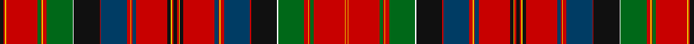

This page is one **sett** — a single exact thread-count. It belongs to the [tartan](/setts/k7r3ly2r60g7r2ly2r7g50w2k50r2dt50r7ly2r2dt7r60k7ly2r3k7/)
(the same proportion at any scale), whose colour order is pattern [KRYRGRYRGWKRBRYRBRKYRKRYKRBRYRBRKWGRYRGRYR](/stripes/kryrgryrgwkrbryrbrkyrkrykrbryrbrkwgryrgryr/).

Part of the [Hay & Leith](/tartans/hay-leith/) tartan — the named design grouping this sett with its other cloths.

Sourced from register-of-tartans.  It is a [42 stripe tartan](/stripes/stripes42/).

Original link https://www.tartanregister.gov.uk/tartanDetails.aspx?ref=1632

## Also known as

This cloth is also recorded under:

- Hay & Leith #2

## Register references

External register numbers recorded for this tartan.

- Scottish Register of Tartans: [1632](https://www.tartanregister.gov.uk/tartanDetails.aspx?ref=1632)
- Scottish Tartans Authority (ITI): 1215
- Scottish Tartans World Register: 1215

## Thread count
K/7 R3 Y2 R60 G7 R2 Y2 R7 G50 W2 K50 R2 DBa50 R7 Y2 R2 DBa7 R60 K7 Y2 R3 K7 R3 Y2 K7 R60 DBa7 R2 Y2 R7 DBa50 R2 K50 W2 G50 R7 Y2 R2 G7 R60 Y2 R/3

One full sett is **1326 threads**.

## Palette

Palette: <strong>Tartan Register</strong>
<table><thead><tr><th>Colour</th><th>Threads</th><th>Shade</th><th>Base</th><th>OKLCh</th></tr></thead><tbody><tr><td>K/</td><td style="text-align:right;font-variant-numeric:tabular-nums">7</td><td><code style="background-color:#101010;">#101010</code> <small style="color:#888">#101010</small></td><td>K <code style="background-color:#000000;">#000000</code></td><td><small style="color:#888">oklch(17.3% 0.000 89.9)</small></td></tr><tr><td>R</td><td style="text-align:right;font-variant-numeric:tabular-nums">3</td><td><code style="background-color:#C80000;">#C80000</code> <small style="color:#888">#C80000</small></td><td>R <code style="background-color:#CC0000;">#CC0000</code></td><td><small style="color:#888">oklch(52.3% 0.215 29.2)</small></td></tr><tr><td>Y</td><td style="text-align:right;font-variant-numeric:tabular-nums">2</td><td><code style="background-color:#E8C000;">#E8C000</code> <small style="color:#888">#E8C000</small></td><td>Y <code style="background-color:#F2BF00;">#F2BF00</code></td><td><small style="color:#888">oklch(81.9% 0.168 93.7)</small></td></tr><tr><td>R</td><td style="text-align:right;font-variant-numeric:tabular-nums">60</td><td><code style="background-color:#C80000;">#C80000</code> <small style="color:#888">#C80000</small></td><td>R <code style="background-color:#CC0000;">#CC0000</code></td><td><small style="color:#888">oklch(52.3% 0.215 29.2)</small></td></tr><tr><td>G</td><td style="text-align:right;font-variant-numeric:tabular-nums">7</td><td><code style="background-color:#006818;">#006818</code> <small style="color:#888">#006818</small></td><td>G <code style="background-color:#006100;">#006100</code></td><td><small style="color:#888">oklch(45.0% 0.142 145.0)</small></td></tr><tr><td>R</td><td style="text-align:right;font-variant-numeric:tabular-nums">2</td><td><code style="background-color:#C80000;">#C80000</code> <small style="color:#888">#C80000</small></td><td>R <code style="background-color:#CC0000;">#CC0000</code></td><td><small style="color:#888">oklch(52.3% 0.215 29.2)</small></td></tr><tr><td>Y</td><td style="text-align:right;font-variant-numeric:tabular-nums">2</td><td><code style="background-color:#E8C000;">#E8C000</code> <small style="color:#888">#E8C000</small></td><td>Y <code style="background-color:#F2BF00;">#F2BF00</code></td><td><small style="color:#888">oklch(81.9% 0.168 93.7)</small></td></tr><tr><td>R</td><td style="text-align:right;font-variant-numeric:tabular-nums">7</td><td><code style="background-color:#C80000;">#C80000</code> <small style="color:#888">#C80000</small></td><td>R <code style="background-color:#CC0000;">#CC0000</code></td><td><small style="color:#888">oklch(52.3% 0.215 29.2)</small></td></tr><tr><td>G</td><td style="text-align:right;font-variant-numeric:tabular-nums">50</td><td><code style="background-color:#006818;">#006818</code> <small style="color:#888">#006818</small></td><td>G <code style="background-color:#006100;">#006100</code></td><td><small style="color:#888">oklch(45.0% 0.142 145.0)</small></td></tr><tr><td>W</td><td style="text-align:right;font-variant-numeric:tabular-nums">2</td><td><code style="background-color:#FCFCFC;">#FCFCFC</code> <small style="color:#888">#FCFCFC</small></td><td>W <code style="background-color:#F7F7F7;">#F7F7F7</code></td><td><small style="color:#888">oklch(99.1% 0.000 89.9)</small></td></tr><tr><td>K</td><td style="text-align:right;font-variant-numeric:tabular-nums">50</td><td><code style="background-color:#101010;">#101010</code> <small style="color:#888">#101010</small></td><td>K <code style="background-color:#000000;">#000000</code></td><td><small style="color:#888">oklch(17.3% 0.000 89.9)</small></td></tr><tr><td>R</td><td style="text-align:right;font-variant-numeric:tabular-nums">2</td><td><code style="background-color:#C80000;">#C80000</code> <small style="color:#888">#C80000</small></td><td>R <code style="background-color:#CC0000;">#CC0000</code></td><td><small style="color:#888">oklch(52.3% 0.215 29.2)</small></td></tr><tr><td>DBa</td><td style="text-align:right;font-variant-numeric:tabular-nums">50</td><td><code style="background-color:#003C64;">#003C64</code> <small style="color:#888">#003C64</small></td><td>B <code style="background-color:#2A418A;">#2A418A</code></td><td><small style="color:#888">oklch(34.5% 0.089 246.0)</small></td></tr><tr><td>R</td><td style="text-align:right;font-variant-numeric:tabular-nums">7</td><td><code style="background-color:#C80000;">#C80000</code> <small style="color:#888">#C80000</small></td><td>R <code style="background-color:#CC0000;">#CC0000</code></td><td><small style="color:#888">oklch(52.3% 0.215 29.2)</small></td></tr><tr><td>Y</td><td style="text-align:right;font-variant-numeric:tabular-nums">2</td><td><code style="background-color:#E8C000;">#E8C000</code> <small style="color:#888">#E8C000</small></td><td>Y <code style="background-color:#F2BF00;">#F2BF00</code></td><td><small style="color:#888">oklch(81.9% 0.168 93.7)</small></td></tr><tr><td>R</td><td style="text-align:right;font-variant-numeric:tabular-nums">2</td><td><code style="background-color:#C80000;">#C80000</code> <small style="color:#888">#C80000</small></td><td>R <code style="background-color:#CC0000;">#CC0000</code></td><td><small style="color:#888">oklch(52.3% 0.215 29.2)</small></td></tr><tr><td>DBa</td><td style="text-align:right;font-variant-numeric:tabular-nums">7</td><td><code style="background-color:#003C64;">#003C64</code> <small style="color:#888">#003C64</small></td><td>B <code style="background-color:#2A418A;">#2A418A</code></td><td><small style="color:#888">oklch(34.5% 0.089 246.0)</small></td></tr><tr><td>R</td><td style="text-align:right;font-variant-numeric:tabular-nums">60</td><td><code style="background-color:#C80000;">#C80000</code> <small style="color:#888">#C80000</small></td><td>R <code style="background-color:#CC0000;">#CC0000</code></td><td><small style="color:#888">oklch(52.3% 0.215 29.2)</small></td></tr><tr><td>K</td><td style="text-align:right;font-variant-numeric:tabular-nums">7</td><td><code style="background-color:#101010;">#101010</code> <small style="color:#888">#101010</small></td><td>K <code style="background-color:#000000;">#000000</code></td><td><small style="color:#888">oklch(17.3% 0.000 89.9)</small></td></tr><tr><td>Y</td><td style="text-align:right;font-variant-numeric:tabular-nums">2</td><td><code style="background-color:#E8C000;">#E8C000</code> <small style="color:#888">#E8C000</small></td><td>Y <code style="background-color:#F2BF00;">#F2BF00</code></td><td><small style="color:#888">oklch(81.9% 0.168 93.7)</small></td></tr><tr><td>R</td><td style="text-align:right;font-variant-numeric:tabular-nums">3</td><td><code style="background-color:#C80000;">#C80000</code> <small style="color:#888">#C80000</small></td><td>R <code style="background-color:#CC0000;">#CC0000</code></td><td><small style="color:#888">oklch(52.3% 0.215 29.2)</small></td></tr><tr><td>K</td><td style="text-align:right;font-variant-numeric:tabular-nums">7</td><td><code style="background-color:#101010;">#101010</code> <small style="color:#888">#101010</small></td><td>K <code style="background-color:#000000;">#000000</code></td><td><small style="color:#888">oklch(17.3% 0.000 89.9)</small></td></tr><tr><td>R</td><td style="text-align:right;font-variant-numeric:tabular-nums">3</td><td><code style="background-color:#C80000;">#C80000</code> <small style="color:#888">#C80000</small></td><td>R <code style="background-color:#CC0000;">#CC0000</code></td><td><small style="color:#888">oklch(52.3% 0.215 29.2)</small></td></tr><tr><td>Y</td><td style="text-align:right;font-variant-numeric:tabular-nums">2</td><td><code style="background-color:#E8C000;">#E8C000</code> <small style="color:#888">#E8C000</small></td><td>Y <code style="background-color:#F2BF00;">#F2BF00</code></td><td><small style="color:#888">oklch(81.9% 0.168 93.7)</small></td></tr><tr><td>K</td><td style="text-align:right;font-variant-numeric:tabular-nums">7</td><td><code style="background-color:#101010;">#101010</code> <small style="color:#888">#101010</small></td><td>K <code style="background-color:#000000;">#000000</code></td><td><small style="color:#888">oklch(17.3% 0.000 89.9)</small></td></tr><tr><td>R</td><td style="text-align:right;font-variant-numeric:tabular-nums">60</td><td><code style="background-color:#C80000;">#C80000</code> <small style="color:#888">#C80000</small></td><td>R <code style="background-color:#CC0000;">#CC0000</code></td><td><small style="color:#888">oklch(52.3% 0.215 29.2)</small></td></tr><tr><td>DBa</td><td style="text-align:right;font-variant-numeric:tabular-nums">7</td><td><code style="background-color:#003C64;">#003C64</code> <small style="color:#888">#003C64</small></td><td>B <code style="background-color:#2A418A;">#2A418A</code></td><td><small style="color:#888">oklch(34.5% 0.089 246.0)</small></td></tr><tr><td>R</td><td style="text-align:right;font-variant-numeric:tabular-nums">2</td><td><code style="background-color:#C80000;">#C80000</code> <small style="color:#888">#C80000</small></td><td>R <code style="background-color:#CC0000;">#CC0000</code></td><td><small style="color:#888">oklch(52.3% 0.215 29.2)</small></td></tr><tr><td>Y</td><td style="text-align:right;font-variant-numeric:tabular-nums">2</td><td><code style="background-color:#E8C000;">#E8C000</code> <small style="color:#888">#E8C000</small></td><td>Y <code style="background-color:#F2BF00;">#F2BF00</code></td><td><small style="color:#888">oklch(81.9% 0.168 93.7)</small></td></tr><tr><td>R</td><td style="text-align:right;font-variant-numeric:tabular-nums">7</td><td><code style="background-color:#C80000;">#C80000</code> <small style="color:#888">#C80000</small></td><td>R <code style="background-color:#CC0000;">#CC0000</code></td><td><small style="color:#888">oklch(52.3% 0.215 29.2)</small></td></tr><tr><td>DBa</td><td style="text-align:right;font-variant-numeric:tabular-nums">50</td><td><code style="background-color:#003C64;">#003C64</code> <small style="color:#888">#003C64</small></td><td>B <code style="background-color:#2A418A;">#2A418A</code></td><td><small style="color:#888">oklch(34.5% 0.089 246.0)</small></td></tr><tr><td>R</td><td style="text-align:right;font-variant-numeric:tabular-nums">2</td><td><code style="background-color:#C80000;">#C80000</code> <small style="color:#888">#C80000</small></td><td>R <code style="background-color:#CC0000;">#CC0000</code></td><td><small style="color:#888">oklch(52.3% 0.215 29.2)</small></td></tr><tr><td>K</td><td style="text-align:right;font-variant-numeric:tabular-nums">50</td><td><code style="background-color:#101010;">#101010</code> <small style="color:#888">#101010</small></td><td>K <code style="background-color:#000000;">#000000</code></td><td><small style="color:#888">oklch(17.3% 0.000 89.9)</small></td></tr><tr><td>W</td><td style="text-align:right;font-variant-numeric:tabular-nums">2</td><td><code style="background-color:#FCFCFC;">#FCFCFC</code> <small style="color:#888">#FCFCFC</small></td><td>W <code style="background-color:#F7F7F7;">#F7F7F7</code></td><td><small style="color:#888">oklch(99.1% 0.000 89.9)</small></td></tr><tr><td>G</td><td style="text-align:right;font-variant-numeric:tabular-nums">50</td><td><code style="background-color:#006818;">#006818</code> <small style="color:#888">#006818</small></td><td>G <code style="background-color:#006100;">#006100</code></td><td><small style="color:#888">oklch(45.0% 0.142 145.0)</small></td></tr><tr><td>R</td><td style="text-align:right;font-variant-numeric:tabular-nums">7</td><td><code style="background-color:#C80000;">#C80000</code> <small style="color:#888">#C80000</small></td><td>R <code style="background-color:#CC0000;">#CC0000</code></td><td><small style="color:#888">oklch(52.3% 0.215 29.2)</small></td></tr><tr><td>Y</td><td style="text-align:right;font-variant-numeric:tabular-nums">2</td><td><code style="background-color:#E8C000;">#E8C000</code> <small style="color:#888">#E8C000</small></td><td>Y <code style="background-color:#F2BF00;">#F2BF00</code></td><td><small style="color:#888">oklch(81.9% 0.168 93.7)</small></td></tr><tr><td>R</td><td style="text-align:right;font-variant-numeric:tabular-nums">2</td><td><code style="background-color:#C80000;">#C80000</code> <small style="color:#888">#C80000</small></td><td>R <code style="background-color:#CC0000;">#CC0000</code></td><td><small style="color:#888">oklch(52.3% 0.215 29.2)</small></td></tr><tr><td>G</td><td style="text-align:right;font-variant-numeric:tabular-nums">7</td><td><code style="background-color:#006818;">#006818</code> <small style="color:#888">#006818</small></td><td>G <code style="background-color:#006100;">#006100</code></td><td><small style="color:#888">oklch(45.0% 0.142 145.0)</small></td></tr><tr><td>R</td><td style="text-align:right;font-variant-numeric:tabular-nums">60</td><td><code style="background-color:#C80000;">#C80000</code> <small style="color:#888">#C80000</small></td><td>R <code style="background-color:#CC0000;">#CC0000</code></td><td><small style="color:#888">oklch(52.3% 0.215 29.2)</small></td></tr><tr><td>Y</td><td style="text-align:right;font-variant-numeric:tabular-nums">2</td><td><code style="background-color:#E8C000;">#E8C000</code> <small style="color:#888">#E8C000</small></td><td>Y <code style="background-color:#F2BF00;">#F2BF00</code></td><td><small style="color:#888">oklch(81.9% 0.168 93.7)</small></td></tr><tr><td>R/</td><td style="text-align:right;font-variant-numeric:tabular-nums">3</td><td><code style="background-color:#C80000;">#C80000</code> <small style="color:#888">#C80000</small></td><td>R <code style="background-color:#CC0000;">#CC0000</code></td><td><small style="color:#888">oklch(52.3% 0.215 29.2)</small></td></tr></tbody></table>

## Nearest tartans

The nearest existing variants by ΔTartan distance, with this tartan at the top so the swatches line up against it.

ΔTartan

Tartan

Sett

—

<a href="/ttd/edit/#slug=k7r3ly2r60g7r2ly2r7g50w2k50r2dt50r7ly2r2dt7r60k7ly2r3k7">Hay &amp; Leith #2</a> <a class="nn-out" href="/variants/s42/k7r3ly2r60g7r2ly2r7g50w2k50r2dt50r7ly2r2dt7r60k7ly2r3k7/" title="open its dictionary page">↗</a>

0.66

<a href="/variants/s44/k14r4ly4k8r70dp8r3ly3r8dp64r3k63w3g64r8ly3r3g8r70k8ly4r4k14/">Leith (Hay)</a>

1.14

<a href="/variants/s34/dg14r6ri2k3r65k2t2r6k34r6t2k2r4dg66r12ri2k2t4/">Stuart/Stewart of Ardshiel</a>

1.17

<a href="/variants/s38/r5ly1r8w1db20w1t20w1g20ly1r5ly1r5ly1g20ly2r52w1ly5w1~x2/">Whitworth</a>

1.19

<a href="/ttd/edit/#slug=w2db1r3m7dg7r2db1r2dg7r41db40w2r4m4r1m1r1m4r4dg15r4m4r1m1r1m4r4w2k40r3dg36r5m5r1m5r5db38r40dg16w2r8m8r3m2r1&amp;base=k7r3ly2r60g7r2ly2r7g50w2k50r2dt50r7ly2r2dt7r60k7ly2r3k7">Unnamed C18th - Hynde Cotton Plaid</a> <a class="nn-out" href="/variants/s45/w2db1r3m7dg7r2db1r2dg7r41db40w2r4m4r1m1r1m4r4dg15r4m4r1m1r1m4r4w2k40r3dg36r5m5r1m5r5db38r40dg16w2r8m8r3m2r1/" title="open its dictionary page">↗</a>

1.22

<a href="/ttd/edit/#slug=r32g2dg12r4t4r4w2r4t4r4dg12r2w2r24t2r2dg44r2t2r64t2r2dg44r2t2r22w2r2db16r2w2r10dg12g2r8g2dg12r3w2r2db10~x2&amp;base=k7r3ly2r60g7r2ly2r7g50w2k50r2dt50r7ly2r2dt7r60k7ly2r3k7">MacAlister (Logan 1831)</a> <a class="nn-out" href="/variants/s41/r32g2dg12r4t4r4w2r4t4r4dg12r2w2r24t2r2dg44r2t2r64t2r2dg44r2t2r22w2r2db16r2w2r10dg12g2r8g2dg12r3w2r2db10~x2/" title="open its dictionary page">↗</a>

1.25

<a href="/ttd/edit/#slug=r16g2dg12r4t4r4w2r4t4r4dg12r2w1r24t1r2dg44r2t2r64t2r2dg44r2t2r22w2r2db16r2w2r10dg12g2r8g2dg12r3w2r2db10~x2&amp;base=k7r3ly2r60g7r2ly2r7g50w2k50r2dt50r7ly2r2dt7r60k7ly2r3k7">MacAlister</a> <a class="nn-out" href="/variants/s41/r16g2dg12r4t4r4w2r4t4r4dg12r2w1r24t1r2dg44r2t2r64t2r2dg44r2t2r22w2r2db16r2w2r10dg12g2r8g2dg12r3w2r2db10~x2/" title="open its dictionary page">↗</a>

1.33

<a href="/ttd/edit/#slug=t1ly1t1dg1g2dg2g2dg2g2dg1t1ly1t1ly1t1dg28r24ly1o2ly3t4r10oi16r4ly2r15oi5r9dg28t1ly1t1ly1t1dg1g2dg2g2dg2g2dg1t1ly1t1~x2&amp;base=k7r3ly2r60g7r2ly2r7g50w2k50r2dt50r7ly2r2dt7r60k7ly2r3k7">New Brunswick (Lyon Court Books)</a> <a class="nn-out" href="/variants/s44/t1ly1t1dg1g2dg2g2dg2g2dg1t1ly1t1ly1t1dg28r24ly1o2ly3t4r10oi16r4ly2r15oi5r9dg28t1ly1t1ly1t1dg1g2dg2g2dg2g2dg1t1ly1t1~x2/" title="open its dictionary page">↗</a>

1.41

<a href="/ttd/edit/#slug=k10r3ly3k6r48dg6r2ly2r6dg40w2k38r2dp40r6ly2r2dp6r48k6ly2r3k10&amp;base=k7r3ly2r60g7r2ly2r7g50w2k50r2dt50r7ly2r2dt7r60k7ly2r3k7">Hay &amp; Leith - 1800 (Clan)</a> <a class="nn-out" href="/variants/s23/k10r3ly3k6r48dg6r2ly2r6dg40w2k38r2dp40r6ly2r2dp6r48k6ly2r3k10/" title="open its dictionary page">↗</a>

1.41

<a href="/ttd/edit/#slug=t2dp10ri3r4dg72r7dg4r10db24dp6ri5r4ri5dp7dg24r24dg24r3db3r74dp7ri5r6t2~x2&amp;base=k7r3ly2r60g7r2ly2r7g50w2k50r2dt50r7ly2r2dt7r60k7ly2r3k7">MacDougall of MacDougall</a> <a class="nn-out" href="/variants/s24/t2dp10ri3r4dg72r7dg4r10db24dp6ri5r4ri5dp7dg24r24dg24r3db3r74dp7ri5r6t2~x2/" title="open its dictionary page">↗</a>

1.44

<a href="/variants/s66/db4k1db2k1db1k2db1k6g1k2g2k2g2k1g3k1g28r2g6r6w2r33k1r3k1r2k2r2k2r1k6g8k1ly2~x2/">Unidentified (Paisley)</a>

## Neighbour map

Every grey dot is one of 14360 variants placed by the first two principal components of the ΔTartan feature space (44% of its variance). Red is this tartan; blue dots are its nearest — click one to open its page.

<svg viewBox="0 0 640 380" role="img" style="max-width:100%;height:auto;border:1px solid #e0e0e0;border-radius:4px;display:block" xmlns="http://www.w3.org/2000/svg"><image href="/nn/cloud.v1.png" width="640" height="380"/><a href="/variants/s44/k14r4ly4k8r70dp8r3ly3r8dp64r3k63w3g64r8ly3r3g8r70k8ly4r4k14/"><circle cx="190.5" cy="21.8" r="4" fill="#3465a4"><title>Leith (Hay)</title></circle></a><a href="/variants/s34/dg14r6ri2k3r65k2t2r6k34r6t2k2r4dg66r12ri2k2t4/"><circle cx="269.8" cy="28.1" r="4" fill="#3465a4"><title>Stuart/Stewart of Ardshiel</title></circle></a><a href="/variants/s38/r5ly1r8w1db20w1t20w1g20ly1r5ly1r5ly1g20ly2r52w1ly5w1~x2/"><circle cx="228.4" cy="14.0" r="4" fill="#3465a4"><title>Whitworth</title></circle></a><a href="/variants/s45/w2db1r3m7dg7r2db1r2dg7r41db40w2r4m4r1m1r1m4r4dg15r4m4r1m1r1m4r4w2k40r3dg36r5m5r1m5r5db38r40dg16w2r8m8r3m2r1/"><circle cx="191.9" cy="14.0" r="4" fill="#3465a4"><title>Unnamed C18th - Hynde Cotton Plaid</title></circle></a><a href="/variants/s41/r32g2dg12r4t4r4w2r4t4r4dg12r2w2r24t2r2dg44r2t2r64t2r2dg44r2t2r22w2r2db16r2w2r10dg12g2r8g2dg12r3w2r2db10~x2/"><circle cx="274.8" cy="14.0" r="4" fill="#3465a4"><title>MacAlister (Logan 1831)</title></circle></a><a href="/variants/s41/r16g2dg12r4t4r4w2r4t4r4dg12r2w1r24t1r2dg44r2t2r64t2r2dg44r2t2r22w2r2db16r2w2r10dg12g2r8g2dg12r3w2r2db10~x2/"><circle cx="296.9" cy="14.0" r="4" fill="#3465a4"><title>MacAlister</title></circle></a><a href="/variants/s44/t1ly1t1dg1g2dg2g2dg2g2dg1t1ly1t1ly1t1dg28r24ly1o2ly3t4r10oi16r4ly2r15oi5r9dg28t1ly1t1ly1t1dg1g2dg2g2dg2g2dg1t1ly1t1~x2/"><circle cx="173.0" cy="14.0" r="4" fill="#3465a4"><title>New Brunswick (Lyon Court Books)</title></circle></a><a href="/variants/s23/k10r3ly3k6r48dg6r2ly2r6dg40w2k38r2dp40r6ly2r2dp6r48k6ly2r3k10/"><circle cx="204.6" cy="51.3" r="4" fill="#3465a4"><title>Hay &amp; Leith - 1800 (Clan)</title></circle></a><a href="/variants/s24/t2dp10ri3r4dg72r7dg4r10db24dp6ri5r4ri5dp7dg24r24dg24r3db3r74dp7ri5r6t2~x2/"><circle cx="249.0" cy="36.5" r="4" fill="#3465a4"><title>MacDougall of MacDougall</title></circle></a><a href="/variants/s66/db4k1db2k1db1k2db1k6g1k2g2k2g2k1g3k1g28r2g6r6w2r33k1r3k1r2k2r2k2r1k6g8k1ly2~x2/"><circle cx="207.7" cy="14.0" r="4" fill="#3465a4"><title>Unidentified (Paisley)</title></circle></a><circle cx="218.6" cy="16.0" r="5" fill="#c00000"/></svg>

ID: /variants/s42/k7r3ly2r60g7r2ly2r7g50w2k50r2dt50r7ly2r2dt7r60k7ly2r3k7/
